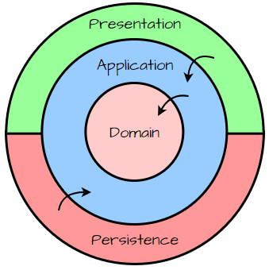

> AI 규칙(한국어 답변·빌드 미실행·체크리스트 질문), GIT 규칙(`NO_COMMIT_OR_ROLLBACK`·추천 커밋 메시지), 플랜 작성 규칙, 일반 네이밍 규칙 등 리포 전체 공통 규칙은 **리포지토리 루트의 `CLAUDE.md`** 를 참조합니다. 이 파일은 backend 고유 컨벤션만 다룹니다.


## 모듈 지도 (모듈 재편 완료 + application 모듈 통합 + external 분리 + 앱 모듈 재분리)

**모듈은 39개이고(앱 마커 제거로 32 → 36 — `{web,admin,ceo,batch}-application` 4모듈 신설, 이후 MyBatis 어댑터 모듈 `infrastructure:mybatis` 신설로 37, 다시 JPA 어댑터 모듈 `infrastructure:jpa` 신설로 38, MySQL 연결 모듈 `infrastructure:mysql` 신설로 **39**), 경계는 "계층 × 앱" 2차원이다.** 어느 파일을 어디에 둘지 헷갈리면 여기서 시작한다(배치 기준의 근거는 아래 [모듈 경계 규칙](#모듈-경계-규칙-계층--앱-2차원--기술별-infrastructure)).

> **(jpa 모듈 분리) 이 문서의 `infrastructure:persistence` 읽는 법.** JPA·QueryDSL 코드 전부(엔티티·쓰기 어댑터·조회 DAO·가드 테스트)가 신설 모듈 **`infrastructure:jpa`**(디렉터리 `infrastructure/jpa/`, 자바 패키지 `com.tastyhouse.infrastructure.jpa..`, 진입 설정 `JpaModuleConfig` — 구 `InfrastructurePersistenceConfig`)로 옮겨졌고, `infrastructure:persistence`는 **자바 코드 없는 조립 모듈**(`runtimeOnly ':infrastructure:jpa'` + `runtimeOnly 'com.mysql:mysql-connector-j'`, datasource·provider 키를 담은 `application-persistence.yml`)이 됐다. **(번복됨 — banner-write-primary)** provider 키는 이후 삭제됐다 — 지금 `application-persistence.yml`은 `application-mysql.yml`·`application-jpa.yml` import만 담는다. 4앱의 `runtimeOnly ':infrastructure:persistence'`와 yml import는 불변이다.
>
> | 항목 | before | after |
> |---|---|---|
> | JPA 코드 위치 | `infrastructure:persistence` / `com.tastyhouse.infrastructure.persistence..` | `infrastructure:jpa` / `com.tastyhouse.infrastructure.jpa..` (하위 `<ctx>/persistence`·`<ctx>/query`·`config`·`shared.*` 불변) |
> | `infrastructure:persistence` | driven 어댑터(JPA 코드 전부) | 조립 모듈 — jpa + MySQL 드라이버를 `runtimeOnly`로 묶음 |
> | 설정 yml | `application-persistence.yml` 한 벌 | `application-persistence.yml`(persistence: datasource·`spring.sql.init`·`persistence.banner.write.provider` **(번복됨 — banner-write-primary: 키 삭제, 지금은 import만)**, `application-jpa.yml` import) + `application-jpa.yml`(jpa: `spring.jpa.*`·hibernate 로그) |
> | 동작 | — | 변경 없음 |
>
> 아래 본문에서 **엔티티·어댑터·조회 DAO·`LayerRulesTest` 등 JPA 코드의 소재로 `infrastructure:persistence`(또는 경로 `infrastructure/persistence/`)를 가리키는 서술은 `infrastructure:jpa`로 읽는다.** 이번에 직접 고친 곳은 현행 규칙이 바뀐 지점(모듈 지도·패키지 규칙·인벤토리·가드 경로·링크)뿐이고, 과거 시점 서술(챕터 기록, `~~취소선~~`, 접근 제어자 854개 수행 기록 등)은 그대로 두었다. 상세는 `infrastructure/jpa/AGENTS.md`·`infrastructure/jpa/AGENTS.md`.

```
실행 앱 4 (bootJar)      web-api      admin-api      ceo-api      batch-module
   │  컨트롤러/@Scheduled 트리거 + request/ + config·security 정책 + 부트스트랩
   ↓
application 5            application (코어)  ← 2개 앱 이상이 쓰는 것 + 리스너·@Configuration + 모든 port.out 계약
                         web-application  admin-application  ceo-application  batch-application
                                             ← 앱 하나만 쓰는 것(UseCase·Command·오케스트레이터·앱 전용 도메인 서비스·앱 전용 SPI 포트)
                         자바 패키지는 전부 com.tastyhouse.application 하나다(5모듈이 split package로 나눠 쓴다).
                         앱 소속은 마커 애노테이션이 아니라 "어느 Gradle 모듈에 있는가"가 표현한다(앱 마커 제거)
                         ~~앱 소속은 패키지가 아니라 마커 애노테이션(@WebApp/@AdminApp/@CeoApp/@BatchApp)이 표현한다
                         (리스너 전용 @SharedApp = 앱 소속 없음 → 4앱 전부)~~ (번복됨 — 앱 마커 제거)
   │  앱 모듈: <ctx>/port/in/(UseCase + Command) + <ctx>/service/(CQRS·앱 전용 도메인 서비스) + 앱 전용 <ctx>/port/out/(SPI)
   │  코어:    <ctx>/port/out/(읽기 계약·write 포트·Command 반환 Result) + <ctx>/service/(공유 도메인 서비스) + <ctx>/listener/ + shared/**
   │  ※ <ctx>/response/ 는 api 모듈로 이동 완료 — 3개 앱 전부(admin 챕터 06 · ceo 챕터 09 · web 챕터 10)
   │  ※ 앱 간 수평 의존은 컴파일러가 막는다 — 앱 모듈끼리는 서로를 의존하지 않고, 코어는 앱 모듈을 모른다
   ↓    ~~ArchUnit이 막는다 — AppIsolationTest · adaptersShouldOnlyUseOwnAppUseCases~~ (번복됨 — 앱 마커 제거, 둘 다 삭제)
                                        ※ infrastructure를 컴파일 클래스패스에 두지 않는다
                                        ※ api-common-module 의존도 없다 — 챕터 11로 절단 완료
도메인                   domain               모델·VO·이벤트 타입·포트 없는 순수 계산기/정책 (프레임워크-프리)
                         ※ write 포트·출력 포트·포트 주입 도메인 서비스는 덩어리 03a로 application으로 이동
   ※ 읽기 계약({Ctx}QueryPort · *Result · *SearchCondition)은 전부 위 application 모듈이 소유한다
     (패키지는 com.tastyhouse.application..port.out). 챕터 04로 공유 계약 55개가 domain에서
     돌아오면서 split package가 끝났다
   ↑ 구현
아웃바운드 어댑터 18      infrastructure:jpa          JPA 어댑터(XxxPersistenceAdapter가 XxxLoadPort·XxxSavePort 구현) + QueryPort 구현 DAO
                                                     ※ banner 쓰기는 JPA(@Primary) — admin에선 아래 :mybatis 구현도 함께 뜨지만 주입되지 않는다
                                                     ※ domain은 implementation으로만 의존(앱으로 새지 않음) — query DAO는 domain-free
(driven)                 infrastructure:mybatis      MyBatis 어댑터(파일럿 — banner 쓰기만, admin-api만 의존). 같은 포트를 JPA와 함께 구현하고 @Primary 쪽만 주입
                         infrastructure:mysql        MySQL 드라이버·HikariCP·datasource 설정(application-mysql.yml) — 자바 코드 없음, persistence가 조립
                         infrastructure:redis        Redis 연결·템플릿 + rate limiting
                         infrastructure:restclient   외부 연동 HTTP 코어 — RestClient customizer만 (예외·에러코드 없음, 파일 저장 무관)
                                                     ※ 포트를 구현하지 않지만 벤더가 쓰는 기술 코어라 이 칸에 둔다
                           ├ :firebase   Firebase Storage 파일 저장      (앱이 아니라 :file-storage가 의존)
                           ├ :aws-s3     S3(파일 저장)                    (의존하는 앱 없음 — 컴파일만 검증)
                           ├ :aws-ses    SES(메일)                        (의존하는 앱 없음 — 컴파일만 검증)
                           ├ :aws-sns    SNS(SMS)                         (의존하는 앱 없음 — 컴파일만 검증)
                           ├ :kakao-oauth    카카오 로그인 벤더 구현    (앱이 아니라 :oauth가 의존)
                           ├ :naver-oauth    네이버 로그인 벤더 구현    (앱이 아니라 :oauth가 의존)
                           ├ :apple-oauth    애플 로그인 벤더 구현      (앱이 아니라 :oauth가 의존)
                           ├ :facebook-oauth 페이스북 로그인 벤더 구현  (앱이 아니라 :oauth가 의존)
                           ├ :tosspayments Toss 결제 벤더 구현            (앱이 아니라 :pg가 의존)
                           ├ :javamail   JavaMail(SMTP) 메일 발송        (앱이 아니라 :mail이 의존)
                           ├ :solapi     Solapi SMS 발송                 (앱이 아니라 :sms가 의존)
                           ├ :bbq        BBQ 메뉴 수집·원격 이미지        (batch)
                           └ :admdongkor 행정동 경계 GeoJSON 수집          (batch)
조립 6                   도메인 포트를 구현하지 않는 컴포지션 루트 조각. 앱이 DB·외부 연동을 쓸 때 직접 의존하는 좌표
(스타터 3 + 채널 3)        스타터(코드 없음)
                           ├ :persistence  DB — jpa·mysql 조립                            (4개 앱 전부)
                           ├ :file-storage 파일 저장 — firebase 조립                      (4개 앱 전부)
                           └ :oauth        소셜 로그인 — 벤더 4종 조립                    (web)
                         채널(DomainConfig 또는 라우터 등록)
                           ├ :pg           결제 PG — PgGatewayConfig(라우터) + tosspayments 조립 (web)
                           ├ :mail         메일 — MailDomainConfig + javamail 조립        (web)
                           └ :sms          SMS — SmsDomainConfig + solapi 조립            (web)
공유                     security-core  security-module  api-common-module  logging-module
```

- **`infrastructure:jpa`(jpa 모듈 분리 전 `infrastructure:persistence`)는 `domain`을 `implementation`으로 의존한다 — 쓰기 어댑터는 도메인 모델을 직접 다루고, 조회 DAO는 domain-free다.** `infrastructure/jpa/build.gradle`의 프로젝트 의존은 `implementation project(':domain')` + `implementation project(':application')`이다. `api`가 아니라 `implementation`이므로 domain이 persistence를 거쳐 앱 컴파일 클래스패스로 새어 나가지 않는다(presentation이 domain을 모르게 한 덩어리 01의 절단 유지). 쓰기 경로는 `application/<ctx>/port/out/write/XxxLoadPort`·`XxxSavePort`(도메인 타입 시그니처)를 persistence `XxxPersistenceAdapter`이 직접 구현하고, JpaEntity ↔ Domain 변환은 persistence `XxxMapper`가 맡는다. 조회 DAO(`..query..`)와 봉인 조회 어댑터 3개의 domain 의존은 `backend/infrastructure/jpa/src/test/java/com/tastyhouse/infrastructure/jpa/architecture/LayerRulesTest.java`의 `queryShouldNotDependOnDomain`이 막는다. 규칙 전문은 아래 [도메인 모델 / JPA 엔티티 분리 규칙](#도메인-모델--jpa-엔티티-분리-규칙-선별-적용-persistence는-infrastructure-module로)의 "persistence domain 재허용" 항목.
- **(번복됨 — persistence domain 재허용) ~~(덩어리 03b) `infrastructure:persistence`는 `domain`을 모른다 — application만 의존한다.~~** 03b는 persistence의 프로젝트 의존을 `implementation project(':application')` 하나로 줄이고, 쓰기 경로에 상태 record `XxxState`·포트 `XxxStatePort`·도메인 ↔ State 변환 어댑터 `application/<ctx>/store/XxxStore`(+`XxxStateMapper`)를 끼웠었다. 애그리거트 하나를 저장하려고 파일 5개(State·StatePort·Store·StateMapper·StatePortImpl)를 거치는 비용(State 122 · Snapshot 7 · StatePort 105 · Store 105 · StateMapper 121)이 얻는 격리보다 크다고 판단해 쓰기 경로만 되돌렸다. 번복 근거와 유지한 것(엔티티 String 컬럼·조회 DAO domain-free)은 아래 분리 규칙 절의 번복 표기에 있다.
- **조립 6모듈(jpa 모듈 분리로 `persistence`가 합류해 5 → 6)은 `infrastructure/` 디렉터리에 있지만 아웃바운드 어댑터가 아니다.** 도메인 포트를 하나도 구현하지 않고, "이 앱에 어떤 벤더를 싣는가"만 결정한다. 스타터(`file-storage`·`oauth`)는 자바 코드가 없고, 채널(`pg`·`mail`·`sms`)은 도메인 서비스 빈이나 라우터를 등록하는 코드만 갖는다. 채널이 왜 그 빈을 등록하는지, 스타터와 무엇이 다른지는 [도메인 모델 / JPA 엔티티 분리 규칙](#도메인-모델--jpa-엔티티-분리-규칙-선별-적용-persistence는-infrastructure-module로)의 "예외 — 포트 구현이 일부 앱에만 있으면 벤더를 조립하는 채널 모듈이 등록한다" 항목이 정본이다. 물리적으로 `backend/starter/`로 옮기지 않은 것은 컴파일·런타임에서 새로 막아 주는 것이 없기 때문이다.
- **조립 모듈의 벤더 전환은 세 곳을 함께 바꾼다**: 채널/스타터 `build.gradle`의 `runtimeOnly` 대상, 그 모듈 yml의 `spring.config.import`, `provider` 값. 각 모듈은 벤더를 하나만 싣기 때문에 `provider` 값만 바꾸면 켤 수 있는 벤더가 없어 기동이 실패한다. 절차는 `infrastructure/{file-storage,mail,sms}/AGENTS.md`의 "벤더 전환 절차"에 있다.
- **실행 단위는 여전히 4개다.** 재편으로 늘어난 것도, 챕터 01의 통합으로 줄어든 것도 라이브러리 모듈뿐이라 **bootJar 산출물 이름·경로는 불변**이다(`{web-api,admin-api,ceo-api,batch-module}/build/libs/{모듈}-0.0.1-SNAPSHOT.jar`). 배포 스크립트는 영향받지 않는다.
- **infrastructure 모듈의 자바 패키지는 모듈명을 따른다**: 코드가 있는 17모듈 모두 루트가 `com.tastyhouse.infrastructure.{모듈명의 하이픈을 점으로}`다(`jpa`→`.jpa`, `kakao-oauth`→`.kakao.oauth`. jpa 모듈 분리로 `persistence`가 빠지고 `jpa`가 들어와 개수는 17 그대로). 규칙 전문은 아래 [infrastructure 패키지 규칙](#infrastructure-패키지-규칙-루트--모듈명). **(번복됨 — infrastructure 패키지 루트 통일)** ~~`infrastructure:persistence`·`infrastructure:redis` 둘 다 `com.tastyhouse.infrastructure..`를 쓴다(재편은 Gradle 좌표와 디렉터리만 바꿨다). `infrastructure:{firebase,aws-s3,…,bbq,admdongkor}` 16모듈은 한 걸음 더 나가 `com.tastyhouse.external..` 하나를 나눠 쓴다(코어 `infrastructure:restclient`는 `com.tastyhouse.restclient..`로 옮겨 빠졌다) — `PersistenceModuleAutoConfiguration`의 `@ComponentScan("com.tastyhouse.infrastructure")` 범위 밖에 남아 있어야 하기 때문이다.~~ persistence를 `com.tastyhouse.infrastructure.persistence`로 내려 그 스캔을 자기 루트로 좁히면서 이 제약이 사라졌다. **`application` 모듈은 자바 패키지가 `com.tastyhouse.application` 단일 루트다** — 챕터 01의 통합 시점에는 4개 앱 패키지(`com.tastyhouse.{web|admin|ceo|batch}application..`)와 읽기 계약 패키지(`com.tastyhouse.application..port.out`)가 나뉘어 있었으나, **챕터 03에서 4개 앱 패키지를 이 하나로 평탄화**했다. 그 결과 이 한 패키지를 **`application` 한 모듈이 단독 소유**하며(챕터 04로 공유 계약 55개가 `domain`에서 돌아와 split package가 끝났다), 패키지만 봐서는 앱 소속을 알 수 없어졌다 — 소속은 이제 마커 애노테이션(`@WebApp`/`@AdminApp`/`@CeoApp`/`@BatchApp`, 아래 [앱 마커 규칙](#앱-마커-규칙-챕터-03--스캔이-패키지에서-애노테이션으로))이 표현한다. **`security-core`와 `security-module`도 같은 선례를 따라 둘 다 `com.tastyhouse.security..`를 쓴다**(챕터 03 — split package. 이동 대상만 패키지를 유지한 채 모듈을 옮겼다).
- **application 5모듈 — 어느 모듈에 둘지는 "몇 개 앱이 쓰는가"로 정한다 (앱 마커 제거)**: 앱 하나만 쓰는 UseCase·Command·서비스·SPI 포트는 `{web,admin,ceo,batch}-application`, 2개 앱 이상이 쓰는 도메인 서비스와 리스너·`@Configuration`·`port.out` 계약은 코어 `application`에 둔다. 앱 모듈은 `api project(':application')`로 코어를 노출하고, 실행 앱은 `implementation project(':application')` + `implementation project(':{앱}-application')` 두 줄을 갖는다. 상세는 아래 [앱 모듈 경계 규칙](#앱-모듈-경계-규칙-앱-마커-제거--앱-소속은-gradle-모듈이-표현한다).
- **어느 모듈의 AGENTS.md를 읽어야 하나**: 컨트롤러·인증 필터를 고치면 `{앱}-api/AGENTS.md`, 유스케이스·서비스를 고치면 `application/AGENTS.md`(5모듈 공통 규칙 정본)와 `{앱}-application/AGENTS.md`(앱 모듈 요약), 쿼리·엔티티는 `infrastructure/jpa/AGENTS.md`(DB 접속·드라이버·커넥션 풀은 `infrastructure/mysql/AGENTS.md`, jpa·mysql 조립은 `infrastructure/persistence/AGENTS.md`, banner 쓰기의 JPA·MyBatis 공존과 `@Primary` 전환은 `infrastructure/mybatis/AGENTS.md`), 불변식은 `domain/AGENTS.md`, JWT 토큰 발급/검증·토큰 저장소 **포트**는 `security-core/AGENTS.md`(Redis 구현은 `infrastructure/redis/AGENTS.md`), 서블릿 인증 필터·EntryPoint는 `security-module/AGENTS.md`.
- **챕터 03 — `security-core` 분리 (application의 서블릿 스택 오염 절단)**: `security-module`이 서블릿 결합 타입(JWT 인증 필터 `OncePerRequestFilter` 상속·`JwtAuthenticationEntryPoint`·`JwtAccessDeniedHandler`, `starter-web` 의존)과 서블릿-프리 타입(`JwtTokenProvider`·토큰 저장소 6종)을 함께 갖고 있어, `{web,admin,ceo,batch}-application`이 `security-module`을 의존하면 application 계층의 컴파일 클래스패스가 서블릿 스택으로 오염됐다(ArchUnit `applicationMustBeServletFree`는 소스 import만 검사해 이 클래스패스 오염을 막지 못한다). 서블릿-프리 타입(`JwtTokenProvider`·`JwtPrincipal`·`JwtPrincipalFactory`·`JwtProperties`·`TokenType`, 토큰 저장소 6종 — RefreshToken/Blacklist/소셜 임시토큰 4종)을 신설 모듈 `security-core`로 이동하고, `security-module`은 서블릿 결합 타입(`SecurityModuleConfig`(챕터 02에 `SecurityModuleAutoConfiguration`으로 리네임됐다가 imports 제거로 원래 이름으로 돌아왔다)·`JwtAuthenticationFilter`·`JwtAuthenticationEntryPoint`·`JwtAccessDeniedHandler`)만 남긴 채 `api project(':security-core')`로 재노출한다. `{web,admin,ceo}-application`은 `security-module` 대신 `security-core`만 의존해 서블릿 스택을 컴파일 클래스패스에서 배제하고(batch-application은 원래 security 의존이 없어 대상 아님), `{admin,ceo}-application`은 `spring-boot-starter-security`를 `spring-security-core`로 축소했다. `{web,admin,ceo}-api`는 기존대로 `security-module`을 의존하며 `security-core`를 전이로 받는다. 자바 패키지(`com.tastyhouse.security..`)·Redis key prefix(`rt:`/`bl:`/`admin:rt:`/`admin:bl:` 등)는 전부 불변이다. **단 토큰 저장소 6종은 챕터 01에서 다시 포트/어댑터로 갈렸다** — 계약만 이 모듈에 남고 구현은 `infrastructure:redis`의 `token` 패키지로 내려갔으므로, 위 "`@Repository` 빈을 `security-module`이 스캔한다"는 배선은 더 이상 이 저장소들에 해당하지 않는다(어댑터는 앱 `ModuleScanConfig`의 `com.tastyhouse.infrastructure` 스캔이 등록한다 — ~~`RedisModuleAutoConfiguration`이 등록한다~~ **(번복됨 — imports 제거)**). API 계약(JWT 토큰 포맷·인증 플로우)도 변경 없음. 상세는 [모듈 경계 규칙](#모듈-경계-규칙-계층--앱-2차원--기술별-infrastructure) 아래 의존 그래프와 `security-core/AGENTS.md`·`security-module/AGENTS.md` 참고.

## 모듈 등록 컨벤션 (auto-configuration — 챕터 02)

> **(번복됨 — imports 제거)** 이 절 제목의 "auto-configuration"은 과거 기록이다. **지금은 어떤 라이브러리 모듈도 스스로를 등록하지 않는다** — `META-INF/spring/org.springframework.boot.autoconfigure.AutoConfiguration.imports` 19개를 전부 지웠고, 각 앱 부트스트랩의 static 중첩 `ModuleScanConfig`가 라이브러리 모듈 패키지를 **문자열로** 스캔한다. 제목은 다른 문서가 이 앵커를 링크하므로 그대로 둔다. 아래 하위 절의 서술 중 auto-config 고유 기능(`before`/`after`, `@ConditionalOnBean`, `spring.autoconfigure.exclude`)에 기대는 것은 전부 과거 기록이며, 현재 사실은 이 표와 바로 아래 "현재 규칙"이 정본이다. 상세 스펙은 `docs/tasks/03-autoconfig-imports-removal/backend.md`.

| 항목 | before (auto-configuration) | after (imports 제거) |
|---|---|---|
| 라이브러리 모듈을 활성화하는 주체 | 각 모듈의 imports 파일 | 각 앱 부트스트랩의 static 중첩 `ModuleScanConfig` |
| imports 파일 | 19개 | **0개** |
| 설정 클래스 | `{Xxx}ModuleAutoConfiguration` (`@AutoConfiguration`, 자기 패키지 `@ComponentScan`) 20개 | `{Xxx}ModuleConfig` (`@Configuration(proxyBeanMethods = false)`, 스캔 없음) 13개(이후 `MyBatisModuleConfig` 신설로 14개) — 등록할 것이 없어진 7개는 삭제 |
| 특정 모듈 끄기 | `spring.autoconfigure.exclude` | 소멸 — 그 앱 `ModuleScanConfig`의 목록에서 패키지를 뺀다 |
| 빈 존재 조건(`@ConditionalOnBean`/`@ConditionalOnMissingBean`) | 사용(예외 핸들러·rate limit aspect·JWT 필터) | **사용 금지** — 일반 `@Configuration`에서는 처리 순서에 좌우돼 조용히 틀린다 |
| 환경 조건(`@ConditionalOnWebApplication`/`@ConditionalOnProperty`) | 사용 | 유지(환경으로 판정하므로 일반 설정에서도 정확하다) |
| 동작(HTTP·DB) | — | 변경 없음. 빈 이름만 `sharedGlobalExceptionHandler` → `globalExceptionHandler`(admin·ceo, 주입처 없음)와 설정 클래스 빈 이름이 바뀌었다 |

**앱별 스캔 목록** (`com.tastyhouse.` 생략) — 부트스트랩 안의 `ApplicationLayerScanConfig` 옆에 두 번째 중첩 클래스로 둔다.

```java
@Configuration(proxyBeanMethods = false)
@ComponentScan(basePackages = {
    "com.tastyhouse.infrastructure",
    "com.tastyhouse.security",
    "com.tastyhouse.logging",
    "com.tastyhouse.apicommon.ratelimit",
    "com.tastyhouse.apicommon.exception"
})
static class ModuleScanConfig {
}
```

| 앱 | basePackages |
|---|---|
| web-api | `infrastructure` · `security` · `logging` · `apicommon.ratelimit` |
| admin-api · ceo-api | `infrastructure` · `security` · `logging` · `apicommon.ratelimit` · `apicommon.exception` |
| batch-module | `infrastructure` · `logging` |

- **왜 `@Import(XxxModuleConfig.class)`가 아니라 문자열 스캔인가**: 앱은 infra 모듈을 `runtimeOnly`로 의존해 그 클래스를 컴파일 시점에 볼 수 없다. `@Import`하려면 `implementation`으로 올려야 하고, 그 순간 헥사고날 컴파일 게이트(컨트롤러가 `com.tastyhouse.infrastructure..`를 import하면 컴파일 에러)가 사라진다. 패키지 이름 문자열은 컴파일 클래스패스가 필요 없다.
- **`com.tastyhouse.infrastructure` 한 줄이 persistence·redis·벤더 모듈 전부를 덮는다** — 모든 infra 모듈 패키지가 `com.tastyhouse.infrastructure.{모듈}`로 통일돼 있기 때문이다(아래 [infrastructure 패키지 규칙](#infrastructure-패키지-규칙-루트--모듈명)).
- **web은 `apicommon.exception`을 스캔하지 않는다** — web-api는 자체 `GlobalExceptionHandler`를 가지므로, 공용 핸들러(`@RestControllerAdvice`라 스캔으로 바로 등록된다)가 web에 뜨지 않는 것은 조건이 아니라 **스캔 범위**가 보장한다.
- **auto-config만의 기능을 잃은 자리**: Redis `before = RedisAutoConfiguration`·persistence `before = JpaRepositoriesAutoConfiguration`은 필요 없어졌다(사용자 설정은 언제나 auto-config보다 먼저 처리되므로 우리 `stringRedisTemplate`이 먼저 등록되고 Boot가 물러난다). rate limit aspect의 `@ConditionalOnBean(RateLimitCounterPort)` + `afterName`은 삭제했다(`apicommon.ratelimit`을 스캔하는 web·admin·ceo는 전부 Redis 카운터를 갖는다). JWT 필터의 `@ConditionalOnMissingBean`도 삭제했다(앱이 자체 필터 빈을 정의하지 않는다).

### 현재 규칙 — 새 라이브러리 모듈·패키지를 추가할 때 (imports 제거)

1. **빈은 이미 스캔되는 루트 아래에 둔다** — infra 모듈이면 `com.tastyhouse.infrastructure.{모듈}`(위 패키지 규칙), 그 밖에는 기존 스캔 루트(`security`·`logging`·`apicommon.ratelimit`·`apicommon.exception`) 아래. 클래스패스에 올라오기만 하면 앱 `ModuleScanConfig`가 잡는다.
2. **`@EnableConfigurationProperties`가 필요하면 그 모듈 루트에 평범한 `{Xxx}ModuleConfig`를 둔다** — `@Configuration(proxyBeanMethods = false)`, 자기 패키지 `@ComponentScan` 없음(앱이 스캔한다). 등록할 것이 없으면 만들지 않는다.
3. **`AutoConfiguration.imports` 파일을 다시 만들지 않는다.** 가드: 4앱 `ApplicationLayerScanConfigTest`의 `ApplicationLayerScanAssertions#assertNoTastyhouseAutoConfiguration`(Boot `ImportCandidates`에 `com.tastyhouse.` 항목이 하나라도 있으면 실패).
4. **이 설정 클래스들에 `@ConditionalOnBean`/`@ConditionalOnMissingBean`을 쓰지 않는다** — auto-config가 아닌 일반 설정에서는 빈 정의 처리 순서에 결과가 좌우돼 조용히 빈이 빠지거나 남는다. 앱별 차이는 스캔 범위로, 환경별 차이는 `@ConditionalOnWebApplication`/`@ConditionalOnProperty`로 표현한다.
5. **새 최상위 패키지(`com.tastyhouse.{새 이름}`)를 스캔에 추가하려면** 그것을 써야 하는 각 앱의 `ModuleScanConfig` `basePackages`와 그 앱 `ApplicationLayerScanConfigTest`의 기대 목록(`assertScansModulesWithoutFilters`가 정확 일치를 검사한다)을 함께 고친다. 위 [import 순서 순위 표](#자사-그룹-내부-계층-정렬-클린-아키텍처-원-안--밖)도 함께 갱신한다.

**챕터 02로 라이브러리 모듈 13개 전부가 `@Import` 수동 조합에서 Spring Boot auto-configuration으로 전환됐다.** 과거에는 앱의 `*Application.java`가 `@Import({InfrastructureModuleConfig.class, RedisModuleConfig.class, SecurityModuleConfig.class, ...})`처럼 라이브러리 모듈 설정 클래스를 나열해 "앱은 자기 패키지만 스캔하고 라이브러리 모듈은 명시적으로 조합한다"는 것이 표준 구성이었다. 지금은 그 반대다 — **라이브러리 모듈이 자기 자신을 등록**하고, 앱은 `@Import`를 하나도 갖지 않는다. `application` 계층의 컴포넌트 스캔은 각 앱 부트스트랩의 static 중첩 `ApplicationLayerScanConfig`가 소유한다(아래 [앱 모듈 경계 규칙](#앱-모듈-경계-규칙-앱-마커-제거--앱-소속은-gradle-모듈이-표현한다) 참고 — 앱 마커 제거로 마커 필터 없는 스캔이 됐다). **(번복됨 — application `*ApplicationConfig` 삭제)** 과거에는 앱이 `{App}ApplicationConfig` 하나만 `@Import`했고 그 클래스가 `application` 모듈 안에 있었다.

| 항목 | before | after |
|---|---|---|
| 앱의 `@Import` | `@Import({App}ApplicationConfig.class)` 1줄 | 없음(0줄) |
| 마커 스캔 `@ComponentScan`의 위치 | `application` 모듈의 `{Web,Admin,Ceo,Batch}ApplicationConfig` 4개 | 각 앱 부트스트랩 안의 `static class ApplicationLayerScanConfig` 4개 |
| `application` 모듈이 아는 것 | "어느 앱이 어떤 마커를 싣는가"(앱 조립 지식) | 없음 — 마커 애노테이션만 제공 |
| 동작 | — | 변경 없음(스캔 대상·필터·빈 집합 동일) |

> **(번복됨 — 앱 마커 제거)** 위 표의 "마커 스캔"·"마커 애노테이션만 제공"은 그 시점 기준이다. 지금 `ApplicationLayerScanConfig`는 `@ComponentScan(basePackages = "com.tastyhouse.application")`(기본 필터, include 필터 없음)이고, `application` 코어는 마커도 제공하지 않는다 — 무엇이 뜰지는 앱의 클래스패스(코어 + 자기 앱 모듈)가 정한다.

### 컨벤션 본문

> **(번복됨 — imports 제거)** 아래는 auto-configuration 시절의 컨벤션이다. 지금 클래스 명명은 `{Xxx}ModuleConfig`(`@Configuration(proxyBeanMethods = false)`)이고, imports 파일은 없으며, 모듈 설정 클래스는 `@ComponentScan`을 갖지 않는다(앱 `ModuleScanConfig`가 스캔). escape hatch `spring.autoconfigure.exclude`도 소멸했다. 유지되는 것은 "`@EnableConfigurationProperties` 명시 등록"과 "모듈 yml은 앱 `spring.config.import`로 로딩" 두 항목뿐이다. 현재 규칙은 위 "현재 규칙" 절.

- **클래스 명명 — `{Xxx}ModuleAutoConfiguration`**: 각 라이브러리 모듈은 모듈 루트 패키지에 이 이름의 설정 클래스 1개를 둔다(`@Configuration(proxyBeanMethods = false)` → `@AutoConfiguration(proxyBeanMethods = false)`, 필요시 `before`/`after`/`afterName`으로 순서 지정). `Module` 중간어를 붙이는 이유는 Boot 자신의 `RedisAutoConfiguration`·`SecurityAutoConfiguration`·`JpaRepositoriesAutoConfiguration`과 **단순명이 충돌**하기 때문이다 — 접미어 없이 `RedisAutoConfiguration`이라고만 지으면 우리 클래스가 Boot의 동명 클래스를 가리는 혼란이 생긴다. `persistence` 모듈만 클래스명이 `InfrastructureModuleConfig` → `PersistenceModuleAutoConfiguration`으로, 다른 12개는 `{Xxx}ModuleConfig` → `{Xxx}ModuleAutoConfiguration`으로 기계적으로 리네임됐다.
- **imports 파일**: 각 모듈 `src/main/resources/META-INF/spring/org.springframework.boot.autoconfigure.AutoConfiguration.imports`에 그 모듈의 auto-configuration 클래스 FQCN을 한 줄로 선언한다. Boot가 클래스패스에서 이 파일을 찾아 자동으로 로딩하므로, 앱 쪽에서 `@Import`할 필요가 없어진다.
- **빈 발견은 여전히 `@ComponentScan`**: auto-configuration 클래스가 스스로를 `@ComponentScan`으로 등록하는 형태는 유지한다(예: `PersistenceModuleAutoConfiguration`이 `@ComponentScan("com.tastyhouse.infrastructure.persistence")`). **스캔 범위는 언제나 그 모듈의 루트 패키지 하나다** — 다른 모듈의 패키지를 덮는 스캔과 그것을 되돌리는 `excludeFilters`를 두지 않는다(아래 [infrastructure 패키지 규칙](#infrastructure-패키지-규칙-루트--모듈명)). Spring Boot 공식 레퍼런스는 auto-configuration 안에서의 컴포넌트 스캔을 권장하지 않는다 — 스캔된 컴포넌트의 `@Conditional*`은 실제로는 동작하지만 `java -jar ... --debug`의 `CONDITIONS EVALUATION REPORT`에 나타나지 않고, 스캔 범위를 사용자가 오버라이드하기도 어렵다. 이 저장소는 그 권고를 알고도 채택했다 — 내부 전용 모듈이고, `infrastructure:persistence`의 `@Repository` 수백 개를 auto-configuration 클래스 하나에 일일이 열거하는 것이 현실적이지 않기 때문이다.
  - **앱별로 켜고 끄는 빈만 조건부 `@Bean`으로 등록한다**: 스캔이 아니라 `@Bean` 메서드로 개별 등록해야 하는 대상은 "이 빈이 등록되는지 여부가 앱마다 갈린다"는 신호다. 이 전환에서 실제로 그런 대상은 api-common의 2개뿐이다(아래 참고). 그 밖의 빈은 스캔으로 충분하다.
- **`@ConfigurationProperties`는 `@EnableConfigurationProperties` 명시 등록 유지**: auto-configuration 클래스에 `@EnableConfigurationProperties(XxxProperties.class)`를 그대로 붙인다. 이 부분은 전환 전후로 바뀌지 않았다.
- **모듈 yml은 여전히 앱 `spring.config.import`로 로딩한다**: 자동 로딩은 `EnvironmentPostProcessor`가 있어야 가능한데 이번 전환 범위가 아니며, `@PropertySource`로는 `logging.*`이나 `optional:configtree:` 같은 특수 프로퍼티 소스가 동작하지 않는다. 그래서 모듈을 앱에 붙이는 비용은 여전히 "gradle 1줄 + (설정이 있으면) yml import 1줄"이다.
- **escape hatch — `spring.autoconfigure.exclude`**: 특정 환경에서 특정 auto-configuration을 끄고 싶으면 이 표준 Boot 프로퍼티를 쓴다. 이 저장소가 별도 온오프 스위치를 만들지 않는 이유이기도 하다(§"클래스패스 존재 = 활성화" 참고 — 프로퍼티 스위치를 새로 만들면 보안 회귀를 반복하기 쉽다).
- **(번복됨 — imports 제거: 이제 어느 모듈도 auto-config를 갖지 않으므로 "예외"라는 구분이 소멸했다. 지금 기준으로는 "`{Xxx}ModuleConfig`가 없는 모듈"이며, 아래 5건 + persistence·logging·restclient·aws-ses·aws-sns·javamail·api-common(공용 핸들러) 7곳이 삭제로 합류했다. 아래 본문의 `RedisModuleAutoConfiguration`은 `RedisModuleConfig`, 벤더 `{Kakao,Naver,Apple,Facebook}OAuthModuleAutoConfiguration`은 `…OAuthModuleConfig`로 읽고, 빈 등록은 그 설정이 아니라 앱 `ModuleScanConfig`의 스캔이 수행한다)** ~~auto-config를 갖지 않는 예외 5건~~(앱 마커 제거로 신설된 `{web,admin,ceo,batch}-application` 4모듈도 같은 이유로 auto-config가 없다 — 스캔은 앱 부트스트랩이 한다): `application`(앱별 스캔 범위는 각 앱 부트스트랩의 중첩 `ApplicationLayerScanConfig`가 소유하고, application에는 등록 클래스가 없다 — 자기 등록할 대상 자체가 없다. **(번복됨 — application `*ApplicationConfig` 삭제)** 과거 사유는 "`{App}ApplicationConfig`가 `@Import`되는 대상이라 자기 등록 대상이 아니다"였다) · `security-core`(설정 클래스가 없다. 이 모듈의 타입은 대부분 빈이 아니며 — `JwtTokenProvider`는 앱별 하위 클래스가 `@Component`로 등록하고, 토큰 저장소 6종은 챕터 01 이후 인터페이스라 구현 어댑터를 `RedisModuleAutoConfiguration`이 등록한다 — `JwtProperties`만 `security-module`의 `@EnableConfigurationProperties`가 등록한다) · `domain`(프레임워크-프리라 Spring 자체를 모른다) · `infrastructure:file-storage`(챕터 03 신설 — 자바 코드가 아예 없는 조립 전용 스타터라 등록할 빈이 없다. 빈 등록은 조립 대상인 firebase의 auto-configuration이 수행한다) · `infrastructure:oauth`(채널·벤더 분할로 같은 형태의 코드 없는 스타터가 됐다 — 옛 `OAuthModuleAutoConfiguration`은 삭제됐고, 빈 등록은 벤더 4종의 `{Kakao,Naver,Apple,Facebook}OAuthModuleAutoConfiguration`이 수행한다).

### "클래스패스 존재 = 활성화" 원칙

> **(번복됨 — imports 제거: 주체만)** 원칙 자체는 그대로다 — 앱 `ModuleScanConfig`가 `com.tastyhouse.infrastructure`를 통째로 스캔하므로 **클래스패스에 올라온 infra 모듈은 전부 활성화**된다(batch에서 redis·OAuth 벤더가 안 잡히는 것도 클래스패스에 없어서다). 바뀐 것은 활성화를 결정하는 주체가 각 모듈의 imports 파일에서 **앱의 스캔 목록**으로 옮겨진 것뿐이다. 그래서 아래 "oauth 모듈 사례"의 위험(의존을 실수로 추가하면 기동 실패)은 지금도 같다. 아래 본문의 `ApiCommonModuleAutoConfiguration`(삭제)·`ApiCommonRateLimitAutoConfiguration`(→ `ApiCommonRateLimitConfig`)·`OAuthModuleAutoConfiguration`(삭제)은 당시 이름이다. batch에서의 재유입 방어선은 이제 `@ConditionalOnWebApplication(SERVLET)` 조건보다 먼저 **batch `ModuleScanConfig`가 `apicommon`·`security`를 스캔하지 않는 것**이 담당한다(`ApiCommonRateLimitConfig`의 `@ConditionalOnWebApplication`은 환경 조건이라 유지).

**auto-configuration은 imports 파일이 클래스패스에 있으면 무조건 로딩을 시도한다.** `@Import` 시절에는 "누가 그 설정 클래스를 명시적으로 나열했는가"가 활성화 여부였지만, 지금은 **의존 선언(`implementation`/`runtimeOnly`) 자체가 활성화 신호**다. 그 라이브러리를 앱이 실제로 쓰든 안 쓰든, 클래스패스에 있으면 그 auto-configuration은 로딩을 시도하고 `@Conditional*`로 스스로 발화 여부를 결정한다.

- **함의 — oauth 모듈 사례**: `@Import` 시절에는 `infrastructure:oauth`를 어떤 앱의 `build.gradle`에 `implementation`으로 추가해도, 그 앱의 `*Application.java`가 `OAuthModuleConfig`를 `@Import`하지 않으면 아무 빈도 뜨지 않았다(의존 선언만으로는 발화하지 않음). 지금은 의존 선언 자체가 활성화이므로, 예컨대 이 모듈을 실수로 `admin-api`의 `build.gradle`에 추가하면 `OAuthModuleAutoConfiguration`이 즉시 로딩을 시도하고 `apple.team-id` 같은 web 전용 설정값을 요구해 **`Could not resolve placeholder 'apple.team-id'`로 admin-api 기동이 실패**했다. "의존을 추가했지만 아직 안 쓴다"는 상태가 더 이상 안전하지 않다는 뜻이다. **채널·벤더 분할 후에도 기동 시점에 실패한다** — 벤더 4종이 `@ConfigurationProperties`로 값을 받는데, 해석하지 못한 placeholder가 문자열 그대로 바인딩되는 것을 각 벤더 record의 compact constructor가 검사해 `IllegalStateException`으로 기동을 멈춘다(`infrastructure/oauth/AGENTS.md`).
- **각 auto-configuration은 전이로 끌려온 앱에서 발화해도 안전한지를 스스로 조건으로 답해야 한다.** 이 원칙이 실제로 강제하는 설계가 아래 §4 감사표다 — 과거 `application → security-core → infrastructure:redis → api-common-module` 전이 사슬이 batch를 포함한 4앱 전부의 runtimeClasspath에 있었고, `ApiCommonModuleAutoConfiguration`·`ApiCommonRateLimitAutoConfiguration`은 `@ConditionalOnWebApplication(SERVLET)`으로 non-servlet인 batch에서 스스로 발화를 걸렀다. **토큰 저장소 포트/어댑터 역전(챕터 01)으로 그 사슬은 끊겼고**, 지금 두 조건은 batch에서 잠재울 대상이 없는 **재유입 방어선**이다 — 조건을 지우지 않는 이유가 여기 있다.
- **새 라이브러리 모듈을 만들 때 스스로에게 물을 질문**: "이 모듈이 어느 앱에도 의도치 않게 전이로 끌려갈 수 있는가? 끌려간다면 그 앱에서 안전하게 비활성화되는 조건이 있는가?" 답이 "없다"면 조건을 추가하거나, 그 모듈이 전이 경로에 놓이지 않도록 의존 그래프를 재검토한다.

### 모듈별 auto-configuration 인벤토리

> **(번복됨 — imports 제거)** 제목은 앵커 보존을 위해 그대로 둔다. 현재 인벤토리는 아래 첫 표이고, 그 아래 표는 auto-configuration 시절 기록이다.

**현재 — 모듈 설정 클래스 인벤토리 (모두 `@Configuration(proxyBeanMethods = false)`, 자기 패키지 `@ComponentScan` 없음 — 스캔은 앱 `ModuleScanConfig`)**

| 모듈 | 설정 클래스 | 하는 일 | 조건 |
|---|---|---|---|
| `infrastructure:jpa` | `JpaModuleConfig`(구 `InfrastructurePersistenceConfig` — jpa 모듈 분리로 `infrastructure:persistence`에서 이동·리네임. `PersistenceModuleAutoConfiguration`은 imports 제거로 삭제) | 빈 발견은 앱의 `com.tastyhouse.infrastructure` 스캔. `JpaModuleConfig`는 `@EnableJpaRepositories`/`@EntityScan`(`basePackageClasses` 자기 자신)·`@EnableJpaAuditing`·`@EnableTransactionManagement`만 갖는다 | — |
| `infrastructure:mybatis` | `MyBatisModuleConfig` | `@MapperScan(basePackageClasses = MyBatisModuleConfig.class, annotationClass = Mapper.class)` — MyBatis 기본 매퍼 스캔은 앱 패키지만 보므로 필수 | 없음(어댑터는 조건 없이 스캔되고, 같은 포트의 주입 대상은 JPA 어댑터의 `@Primary`가 고른다 — [영속 포트 기술 중립 규칙](#영속-포트-기술-중립-규칙-포트는-jpamybatis-어느-쪽으로도-구현될-수-있어야-한다)) |
| `infrastructure:redis` | `RedisModuleConfig` | `@EnableConfigurationProperties(RedisTokenStoreProperties)` | 없음(`before = RedisAutoConfiguration` 삭제 — 사용자 설정이 언제나 먼저 처리된다) |
| `security-module` | `SecurityModuleConfig` | `@EnableConfigurationProperties(JwtProperties)` + `@Bean JwtAuthenticationFilter`(POJO라 스캔 대상이 아니다) | `@ConditionalOnWebApplication(SERVLET)`. `@ConditionalOnMissingBean(JwtAuthenticationFilter)`는 삭제 |
| `logging-module` | 없음(`LoggingModuleAutoConfiguration` 삭제) | — | — |
| `api-common-module`(예외) | 없음(`ApiCommonModuleAutoConfiguration` 삭제) | `GlobalExceptionHandler`(`@RestControllerAdvice`)를 admin·ceo가 `apicommon.exception` 스캔으로 직접 등록. 빈 이름 `globalExceptionHandler` | 조건 없음 — web은 그 패키지를 스캔하지 않는다 |
| `api-common-module`(rate limit) | `ApiCommonRateLimitConfig` | `@Bean RateLimitAspect` | `@ConditionalOnWebApplication(SERVLET)`. `@ConditionalOnBean(RateLimitCounterPort)`·`afterName` 삭제 |
| `infrastructure:restclient` · `aws-ses` · `aws-sns` · `javamail` | 없음(각 `…ModuleAutoConfiguration` 삭제) | — | — |
| `infrastructure:firebase` · `aws-s3` · `kakao-oauth` · `naver-oauth` · `apple-oauth` · `facebook-oauth` · `tosspayments` · `solapi` · `bbq` · `admdongkor` | `FirebaseModuleConfig` · `AwsS3ModuleConfig` · `KakaoOAuthModuleConfig` · `NaverOAuthModuleConfig` · `AppleOAuthModuleConfig` · `FacebookOAuthModuleConfig` · `TossPaymentsModuleConfig` · `SolapiModuleConfig` · `BbqModuleConfig` · `AdmdongkorModuleConfig` | 각자의 `@EnableConfigurationProperties`만 | 없음(벤더 클래스의 `@ConditionalOnProperty`는 스캔된 클래스에 잔류) |
| 조립 스타터 6개 (`persistence`·`file-storage`·`oauth`·`pg`·`mail`·`sms`) | 없음 | 자바 코드가 없다(`persistence`는 jpa 모듈 분리로 합류) | — |

**과거 — auto-configuration 인벤토리 (번복됨)**

| 모듈 | 클래스 | 스캔/등록 | 조건·순서 |
|---|---|---|---|
| `infrastructure:persistence` | `PersistenceModuleAutoConfiguration` (`com.tastyhouse.infrastructure.persistence`, `InfrastructureModuleConfig` 리네임) | `@ComponentScan("com.tastyhouse.infrastructure.persistence")` — ~~`basePackages = "com.tastyhouse.infrastructure", excludeFilters = REGEX "com\.tastyhouse\.infrastructure\.redis\..*"`~~ **(번복됨 — infrastructure 패키지 루트 통일, redis 제외 필터 삭제)** | `@AutoConfiguration(before = JpaRepositoriesAutoConfiguration.class)` |
| `infrastructure:redis` | `RedisModuleAutoConfiguration` (`com.tastyhouse.infrastructure.redis`, `RedisModuleConfig` 리네임) | 스캔 `com.tastyhouse.infrastructure.redis`(rate limit 카운터 + **챕터 01의 토큰 저장소 어댑터 6종**) + `@EnableConfigurationProperties(RedisTokenStoreProperties)` | `@AutoConfiguration(before = RedisAutoConfiguration.class)` — **스펙과 다른 실측 결론(아래 "함정 1" 참고)** |
| `security-module` | `SecurityModuleAutoConfiguration` (`com.tastyhouse.security`, `SecurityModuleConfig` 리네임) | 스캔 `com.tastyhouse.security` + `@EnableConfigurationProperties(JwtProperties)` + **`@Bean JwtAuthenticationFilter`**(챕터 02 — POJO라 스캔 대상이 아니다) | `@ConditionalOnWebApplication(SERVLET)` + 메서드 `@ConditionalOnMissingBean(JwtAuthenticationFilter.class)` |
| `logging-module` | `LoggingModuleAutoConfiguration` (`com.tastyhouse.logging`) | 스캔 `com.tastyhouse.logging` | 없음 |
| `api-common-module` | `ApiCommonModuleAutoConfiguration` (`com.tastyhouse.apicommon`) | `@Bean("sharedGlobalExceptionHandler")` — 스캔 없음, 조건부 `@Bean`으로 등록 | `@ConditionalOnWebApplication(SERVLET)` + 메서드 `@ConditionalOnMissingBean(annotation = RestControllerAdvice.class)`. 빈 이름을 구분하는 이유는 web의 자체 핸들러와 단순명이 같아 기본 이름(`globalExceptionHandler`)이 충돌하기 때문 |
| `api-common-module` | `ApiCommonRateLimitAutoConfiguration` (`com.tastyhouse.apicommon.ratelimit`) | `@Bean RateLimitAspect(...)` — `RateLimitAspect`의 `@Component` 제거, 조건부 `@Bean`으로 등록 | `@ConditionalOnWebApplication(SERVLET)` + 메서드 `@ConditionalOnBean(RateLimitCounterPort.class)` — 포트는 `security-core`(`com.tastyhouse.security.ratelimit`) 소유, 이 모듈은 `implementation project(':security-core')`로 본다 |
| external 계열 driven 14개 | `RestClientModuleAutoConfiguration`(구 `ExternalModuleAutoConfiguration` → `HttpClientModuleAutoConfiguration`을 거쳐 개명)·`FirebaseModuleAutoConfiguration`·`AwsS3ModuleAutoConfiguration`·`AwsSesModuleAutoConfiguration`·`AwsSnsModuleAutoConfiguration`·`KakaoOAuthModuleAutoConfiguration`·`NaverOAuthModuleAutoConfiguration`·`AppleOAuthModuleAutoConfiguration`·`FacebookOAuthModuleAutoConfiguration`·`TossPaymentsModuleAutoConfiguration`·`JavaMailModuleAutoConfiguration`·`SolapiModuleAutoConfiguration`·`BbqModuleAutoConfiguration`·`AdmdongkorModuleAutoConfiguration` | 챕터 01 진입 설정과 동일 스캔·Properties(`messaging`은 4분할로 `MessagingModuleAutoConfiguration`을 채널 2개(아래 행)와 벤더 `JavaMailModuleAutoConfiguration`·`SolapiModuleAutoConfiguration`으로 대체, `aws-s3`/`aws-ses`/`aws-sns`는 이후 3분할로 `AwsModuleAutoConfiguration`을, `bbq`/`admdongkor`는 이후 2분할로 `CrawlingModuleAutoConfiguration`을 대체, `payment`는 채널·벤더 분할로 `PaymentModuleAutoConfiguration`을 `PgModuleAutoConfiguration`+`TossPaymentsModuleAutoConfiguration`으로 대체, `oauth`는 채널·벤더 분할로 `OAuthModuleAutoConfiguration`을 벤더 4종의 auto-configuration으로 대체 — 채널 `oauth`는 코드가 없어 자기 auto-configuration이 없다. 벤더 4종은 `@ConfigurationProperties` record를 `@EnableConfigurationProperties`로 등록한다) | 없음(채널 `@ConditionalOnProperty`는 스캔된 클래스에 잔류) |
| 조립 — 채널 3개 (`pg`·`mail`·`sms`) | ~~`PgModuleAutoConfiguration`·`MailModuleAutoConfiguration`·`SmsModuleAutoConfiguration` | 자기 패키지(`com.tastyhouse.external.{pg,mail,sms}`) 스캔 — 포트 구현이 아니라 `PgGatewayConfig`(라우터)·`MailDomainConfig`·`SmsDomainConfig`(도메인 서비스 빈)를 등록한다~~ **(번복됨 — 02-vendor-ports로 세 채널 모듈의 코드가 전부 사라졌고, infrastructure 패키지 루트 통일 이후에도 패키지가 없다. 지금은 아래 스타터 행과 같은 형태다)** | — |
| 조립 — 스타터 2개 (`file-storage`·`oauth`) | 없음 | 자바 코드가 없어 등록할 빈이 없다 — 위 [예외 5건](#모듈-등록-컨벤션-auto-configuration--챕터-02)에 포함 | — |

~~`ApiCommonConfig`·`ApiCommonRateLimitConfig`는 삭제됐다 — 두 auto-configuration 클래스가 그 역할을 대체한다.~~ **(번복됨 — imports 제거)** 지금은 `ApiCommonRateLimitConfig`가 다시 있다(`ApiCommonRateLimitAutoConfiguration`에서 리네임). 예외 핸들러 쪽 설정 클래스는 없다 — `GlobalExceptionHandler`가 스캔으로 직접 뜬다.

### 앱별 runtimeClasspath 감사표 (§4 — 어떤 auto-config가 어느 앱에서 발화하는가)

> **(번복됨 — imports 제거)** "발화"는 지금 "앱 `ModuleScanConfig`의 스캔에 걸려 등록된다"로 읽는다. 판정은 두 단계다 — (1) 그 모듈이 앱 runtimeClasspath에 있는가, (2) 그 패키지를 앱 `ModuleScanConfig`가 스캔하는가. 아래 표의 클래스패스 사실(●/—)은 그대로 유효하고, 바뀐 열은 다음과 같다.
>
> | 행 | before | after |
> |---|---|---|
> | Persistence 조건 | `before = JpaRepositoriesAutoConfiguration` | 없음 — 설정 클래스 삭제, 앱 `com.tastyhouse.infrastructure` 스캔 |
> | ApiCommon(예외 핸들러) | web ●→조건부 Negative / admin·ceo Positive / batch 전이 Negative. `@ConditionalOnMissingBean(annotation = RestControllerAdvice)` | web **스캔 안 함** / admin·ceo 스캔(`apicommon.exception`) / batch 스캔 안 함. 조건 없음 |
> | ApiCommonRateLimit | `@ConditionalOnBean(RateLimitCounterPort)` + SERVLET | web·admin·ceo 스캔(`apicommon.ratelimit`), batch 스캔 안 함. `@ConditionalOnWebApplication(SERVLET)`만 유지 |
> | Security | SERVLET 조건 | web·admin·ceo 스캔(`security`), batch 스캔 안 함(클래스패스에도 없다). SERVLET 조건 유지 |
> | Logging·External·Firebase·벤더·Bbq·Admdongkor·Aws* | 각 imports 파일로 발화 | 클래스패스에 있으면 `infrastructure`/`logging` 스캔으로 등록 — 클래스패스 열은 불변 |
>
> 아래 2026-09-05 실측 문단의 `sharedGlobalExceptionHandler`·`JpaRepositoriesAutoConfiguration` Negative 판정은 당시 기록이다(지금 admin·ceo의 공용 핸들러 빈 이름은 `globalExceptionHandler`).

~~`application → security-core → infrastructure:redis → api-common-module` 전이 사슬이 4앱 전부의 runtimeClasspath에 있다~~ **(챕터 01에서 끊김)**. `security-core`의 토큰 저장소 6종이 포트가 되고 구현이 `infrastructure:redis`로 내려가면서 `security-core → infrastructure:redis` 간선이 사라졌다. 지금은 **web·admin·ceo만 `runtimeOnly project(':infrastructure:redis')`로 직접 선언**해 Redis를 받고, `application`과 `batch-module`의 runtimeClasspath에는 `infrastructure:redis`·`api-common-module`·springdoc이 **없다**.

```bash
./gradlew :application:dependencies  --configuration runtimeClasspath | grep -c 'infrastructure:redis\|project :api-common-module'   # 0
./gradlew :batch-module:dependencies --configuration runtimeClasspath | grep -c 'infrastructure:redis\|project :api-common-module\|springdoc'  # 0
```

> `grep -c 'api-common'`처럼 느슨하게 세면 Firebase가 끌고 오는 **`com.google.api:api-common`**(무관한 서드파티)이 batch에서 7건 잡힌다. 우리 모듈은 `project :api-common-module`로 표기되므로 그렇게 좁혀서 센다.

| auto-config | web | admin/ceo | batch | 조건 | batch 결과(실측) |
|---|---|---|---|---|---|
| Persistence | ● | ● | ● | `before = JpaRepositoriesAutoConfiguration` | 발화(의도) |
| Redis | ● | ● | **—** | 없음 | **챕터 01 개정** — batch는 클래스패스에 없어 발화 대상 자체가 없다(과거에는 전이로 발화했다). web·admin·ceo는 `runtimeOnly` 직접 선언으로 발화하며, 토큰 저장소 어댑터 6종도 이 설정이 등록한다 |
| ApiCommon(예외 핸들러) | ●→조건부 Negative | ● Positive | ●(전이)→Negative | `@ConditionalOnWebApplication(SERVLET)` + `@ConditionalOnMissingBean(annotation = RestControllerAdvice.class)` | 비발화(non-servlet) |
| ApiCommonRateLimit | ● Positive | ● Positive | ●(전이)→Negative | `@ConditionalOnWebApplication(SERVLET)` + `@ConditionalOnBean(RateLimitCounterPort.class)`(포트 소유 `security-core`, 구현 `infrastructure:redis`) | 비발화 |
| Security | ● | ● | — | `@ConditionalOnWebApplication(SERVLET)` | jar 없음 |
| Logging | ● | ● | ● | 없음(현행 batch도 import) | 발화(의도) |
| External | ● | **—** | ● | 없음 | 발화(의도) — 앱이 직접 선언하지 않고 web은 oauth(경유 kakao/naver/apple/facebook-oauth)·pg(경유 tosspayments)·solapi, batch는 bbq·admdongkor를 통해 전이로 실린다. **코어 SPI 삭제 후속으로 admin/ceo에서는 빠졌다**(아래 [후속 — 코어 SPI 삭제](#벤더-선택은-앱이-아니라-스타터-모듈이-한다-챕터-03)) |
| Firebase | ● | ● | ● | 없음 | 발화(의도) — 앱이 아니라 `:infrastructure:file-storage`를 통해 전이로 실린다 |
| KakaoOAuth·NaverOAuth·AppleOAuth·FacebookOAuth·Pg·TossPayments·Mail·JavaMail·Sms·Solapi | ● | — | — | 없음 | jar 없음 — 조립 채널 3개(Pg·Mail·Sms)는 web-api가 `runtimeOnly`로 직접 의존해 web에서만 발화하고, 벤더(OAuth 4종·TossPayments·JavaMail·Solapi)는 앱이 아니라 스타터 `:infrastructure:oauth`·채널 `:infrastructure:{pg,mail,sms}`를 통해 web에만 전이로 실린다 |
| Bbq·Admdongkor | — | — | ● | 없음 | 발화(의도) — 2026-09-26 batch 기동으로 두 설정 발화 확인 |
| AwsS3 | — | — | — | 없음 | jar 없음 |
| AwsSes | — | — | — | 없음 | jar 없음 |
| AwsSns | — | — | — | 없음 | jar 없음 |
| MyBatis | — | ● (admin) / — (ceo) | — | ~~어댑터만 `@ConditionalOnProperty`~~ **(번복됨 — banner-write-primary)** 없음 — 어댑터는 조건 없이 등록되고 주입은 JPA 쪽 `@Primary` | admin-api만 `runtimeOnly :infrastructure:mybatis` — MyBatis 자동 설정·`@MapperScan`·XML 파싱이 admin에서만 일어난다 |

**(번복됨 — imports 제거, 당시 기록)** **실측(2026-09-05, `java -jar ... --debug` 기동의 `CONDITIONS EVALUATION REPORT`)**: web은 `sharedGlobalExceptionHandler` **Negative**(자체 advice 존재)·`rateLimitAspect` **Positive**, admin/ceo는 둘 다 **Positive**(로그인 rate limit 유지 확인), batch는 `ApiCommon*` 2개 **Negative**(non-servlet). Boot `JpaRepositoriesAutoConfiguration`은 4앱 전부 **Negative**(persistence의 `before` 순서가 이긴 결과). admin(8090)·ceo(8100)·web(8080) 로그인 rate limit을 curl로 10회까지 401·11회째 429로 확인해 회귀 없음을 검증했다.

### 앱별 의존 (전환 후 — `runtimeOnly`로 하향)

> **(앱 마커 제거)** `implementation` 열의 `:{앱}-application`은 앱 마커 제거로 추가된 1줄이다(before: `:application`만). 마지막 열의 "마커 스캔"은 지금 마커 필터 없는 `com.tastyhouse.application` 스캔이다.
>
> **(imports 제거)** 마지막 열의 after에 중첩 클래스가 하나 더 붙었다 — 각 부트스트랩은 `ApplicationLayerScanConfig`와 함께 **`ModuleScanConfig`**(라이브러리 모듈 문자열 스캔, 위 앱별 목록)를 갖는다. 의존 열(`implementation`/`runtimeOnly`)은 불변이다 — `runtimeOnly`를 유지하려고 `@Import`가 아니라 문자열 스캔을 택했다.

| 앱 | `implementation` | `runtimeOnly` | 남는 `@Import` (before) → 마커 스캔 위치 (after) |
|---|---|---|---|
| web-api | `:application`, `:web-application`, `:security-module`, `:api-common-module` | `:infrastructure:persistence`, `:infrastructure:redis`, `:infrastructure:file-storage`, `:infrastructure:oauth`, `:infrastructure:pg`, `:infrastructure:mail`, `:infrastructure:sms`, `:logging-module` | before `WebApplicationConfig` → after 없음, 부트스트랩 중첩 `ApplicationLayerScanConfig` |
| admin-api / ceo-api | `:application`, `:admin-application` / `:ceo-application`, `:security-module`, `:api-common-module` | `:infrastructure:persistence`, `:infrastructure:redis`, `:infrastructure:file-storage`, `:logging-module` (+ admin만 `:infrastructure:mybatis`) | before `AdminApplicationConfig` / `CeoApplicationConfig` → after 없음, 각 부트스트랩 중첩 `ApplicationLayerScanConfig` |
| batch-module | `:application`, `:batch-application` | `:infrastructure:persistence`, `:infrastructure:file-storage`, `:infrastructure:bbq`, `:infrastructure:admdongkor`, `:logging-module` | before `BatchApplicationConfig` → after 없음, 부트스트랩 중첩 `ApplicationLayerScanConfig` |

**(jpa 모듈 분리)** `runtimeOnly` 열의 `:infrastructure:persistence`는 그대로다 — 그 모듈이 코드 없는 조립 모듈이 되어 `:infrastructure:jpa`와 MySQL 드라이버를 `runtimeOnly`로 묶으므로, 앱은 jpa를 직접 선언하지 않고 전이로 받는다(`runtimeClasspath`에만 실린다).

3앱의 `implementation` 열에 있던 `spring-boot-starter-data-redis`는 **챕터 01에서 삭제됐다** — 앱이 `StringRedisTemplate`을 직접 참조하던 `config/jwt/RedisRepositoryConfig`가 사라져 그 명시 선언의 근거가 소멸했기 때문이다(아래 [함정 2](#후속-작업자가-밟기-쉬운-함정-2가지)). `runtimeOnly` 열은 불변이다.

`:infrastructure:restclient`(구 `:infrastructure:external` → `:infrastructure:http-client`를 거쳐 개명)·`:infrastructure:firebase`는 챕터 03부터 앱이 **직접 선언하지 않는다** — `:infrastructure:firebase`는 `:infrastructure:file-storage` 스타터가 `runtimeOnly`로 묶어 노출하므로 전이로 `runtimeClasspath`에만 실린다. `:infrastructure:restclient`는 코어 SPI 삭제 후 스타터의 조립 대상에서 빠져, web(oauth 경유 — 스타터 `oauth`가 벤더 4종을 `runtimeOnly`로 조립하고 벤더가 코어를 의존한다 —·pg 경유 — `pg`가 `tosspayments`를 `runtimeOnly`로 조립하고 `tosspayments`가 코어를 의존한다 —·solapi 경유)과 batch(bbq·admdongkor 경유)에만 전이로 실리고 **admin·ceo의 `runtimeClasspath`에는 없다**(webflux도 리포 전체에서 제거됐다)(아래 [벤더 선택은 스타터 모듈이 한다](#벤더-선택은-앱이-아니라-스타터-모듈이-한다-챕터-03) 참고).

4앱의 `compileClasspath`에는 이제 `infrastructure:*`·`logging-module`이 **없고**(실측), `runtimeClasspath`에는 있다. api 모듈은 라이브러리 모듈의 어댑터 클래스를 컴파일 시점에 아예 볼 수 없다(헥사고날 경계가 의존 스코프로 강제된다) — 앱에 `@Import`는 남지 않는다. `application`의 마커 스캔은 각 앱 부트스트랩의 중첩 `ApplicationLayerScanConfig`가 맡는다(위 예외 5건의 `application` 케이스). **(번복됨 — application `*ApplicationConfig` 삭제)** 과거에는 `{App}ApplicationConfig` 하나가 `@Import`로 남아 있었다.

### 벤더 선택은 앱이 아니라 스타터 모듈이 한다 (챕터 03)

**한 기능을 이루는 모듈 여러 개를 앱이 나열하지 않는다 — 조립 전용 스타터 모듈이 묶어서 노출하고, 앱은 그 스타터 하나만 의존한다.** 챕터 03에서 파일 저장이 첫 사례로 `infrastructure:file-storage`가 신설됐다.

- **문제**: 파일 저장을 쓰려면 앱마다 코어 SPI(`:infrastructure:restclient`, 당시 명칭 `:infrastructure:external`)와 벤더 구현(`:infrastructure:firebase`)을 **둘 다** `build.gradle`에 선언하고, `application.yml`의 `spring.config.import`에도 `application-external.yml`·`application-firebase.yml`을 **둘 다** 나열해야 했다. 같은 벤더 결정이 4앱 × 2곳 = **8곳에 복제**돼 있었고, 앱이 "Firebase로 저장한다"는 구현 선택을 알고 있다는 점에서 헥사고날 경계와도 어긋났다.
- **해결**: `infrastructure:file-storage`가 벤더 구현(현재 firebase)을 `runtimeOnly`로 묶고(신설 당시에는 external + firebase 둘이었다 — 아래 후속 항목) `application-file-storage.yml`이 `file.provider`와 벤더 yml의 중첩 `spring.config.import`를 소유한다. 앱은 `runtimeOnly project(':infrastructure:file-storage')` 1줄 + `classpath:application-file-storage.yml` 1줄만 갖는다. 앱은 **"파일을 저장한다"까지만 알고 "Firebase로"는 모른다** — `spring-boot-starter-data-redis`가 Lettuce를 고르는 것과 같은 형태다.
- **스타터는 코드가 없다**: 자바 소스도, auto-configuration도 갖지 않는다(위 [예외 5건](#모듈-등록-컨벤션-auto-configuration--챕터-02)). 빈 등록은 조립 대상인 firebase의 auto-configuration이 수행하고, 스타터는 "무엇을 조립하는가"만 선언한다. `compileJava`는 NO-SOURCE로 넘어가고 jar에는 yml만 실린다. 이 모듈에 코드를 넣으면 조립 선언과 구현이 섞여 존재 이유가 사라지므로, 벤더 무관 계약은 `application`이 소유한 포트 `FileStoragePort`(`com.tastyhouse.application.file.port.out`, **번복됨 — 02-vendor-ports 이전엔 `com.tastyhouse.domain.file.port`**), 벤더 구현은 `infrastructure:{firebase,aws-s3}`로 보낸다.
- **전이 메커니즘**: `runtimeOnly`는 `runtimeElements` 변형에 포함되므로 스타터를 `runtimeOnly`로 의존하는 앱의 `runtimeClasspath`에 firebase가 전이로 실린다. **compileClasspath에는 둘 다 없다** — 헥사고날 강제는 그대로다.
- **적용 판단 기준**: 여러 앱이 같은 조합(교체 가능한 벤더 구현과 그 설정 — 신설 당시에는 코어 SPI도 포함됐다)을 반복 선언하고 있으면 스타터 후보다. 반대로 앱마다 조합이 다르거나(예: 메일·SMS는 web 전용) 벤더가 하나뿐이면 만들지 않는다 — 모듈만 늘고 얻는 것이 없다.
- **후속 — 코어 SPI 삭제**: 신설 당시 스타터는 코어(현 `infrastructure:restclient`, 당시 명칭 `infrastructure:external`)의 파일 저장 SPI(`com.tastyhouse.external.file`의 `FileStorageStrategy`·`FileStoragePortAdapter`·`FileStorageProperties`)와 벤더 구현을 함께 묶었으나, 이후 이 3개를 삭제했다. `FileStorageStrategy`의 메서드 3개는 도메인 포트 `FileStoragePort`와 시그니처가 완전히 같았고, `FileStoragePortAdapter`는 변환 없이 전략에 위임만 했으며, `FileStorageProperties`(`file.*` 바인딩)는 주입처가 0건인 죽은 코드였다. 그래서 다른 driven 어댑터(`MailSenderPort`·`SmsSenderPort`·`PgPaymentGatewayPort`)와 같은 형태로 **벤더 구현이 도메인 포트를 직접 구현**하도록 통일했다 — `FirebaseFileStorage`(`infrastructure:firebase`)·`S3FileStorage`(`infrastructure:aws-s3`)가 `implements FileStoragePort`이고, `@ConditionalOnProperty(file.provider)` 배타 선택이라 빈은 항상 하나다. 구현이 없으면 `infrastructure:persistence`에서 `FileStoragePort`를 주입받는 빈(`FileUrlResolver`·`FileDomainConfig`)이 그 빈을 찾지 못해 기동이 실패한다(반증 실측 2026-09-26: `--file.provider=s3`로 admin-api를 aws-s3 모듈 없이 띄우면 `FileUrlResolver`에서 `APPLICATION FAILED TO START`). 함께 `RestClientModuleAutoConfiguration`(구 `ExternalModuleAutoConfiguration` → `HttpClientModuleAutoConfiguration`을 거쳐 개명)의 스캔이 `com.tastyhouse.restclient.config` 하나로 줄고 `@EnableConfigurationProperties`가 빠졌으며, `infrastructure:firebase`는 코어 의존을 버렸다(domain + firebase-admin만. `infrastructure:aws-ses`·`infrastructure:aws-sns`는 각각 SES/SNS 실패를 `BusinessException`으로 던지느라 코어 의존 유지 — `aws-s3`는 domain + spring-cloud-aws-starter-s3뿐이라 코어 의존이 없다). 그 결과 코어는 `RestClient.Builder` customizer만 남은 HTTP 코어가 됐고(외부 연동 실패 코드는 이후 도메인 `ErrorCode`로 완전히 이관됐고, 다시 에러코드 모듈 분할로 `WebErrorCode`·`BatchErrorCode`로 옮겨졌다 — 이 모듈에는 예외·에러코드가 없다 — 아래 "예외·에러코드 소유 규칙" 절), 스타터의 조립 대상은 firebase 하나가 됐다(`runtimeOnly project(':infrastructure:firebase')` 한 줄). admin·ceo의 `runtimeClasspath`에서는 코어 모듈이 빠진다(webflux는 리포 전체에서 제거됐다). **이후 코어 모듈 자체가 `infrastructure:external` → `infrastructure:http-client`를 거쳐 `infrastructure:restclient`로 리네임되고 `WebClient`/webflux → Spring `RestClient` 전환이 완료됐다** — 상세는 `infrastructure/restclient/AGENTS.md`.
  - **조립 대상이 하나여도 스타터를 유지하는 이유**: 앱이 벤더 이름을 모른다는 목적은 조립 대상 개수와 무관하고, 벤더 전환이 여전히 스타터 두 파일(`build.gradle` 한 줄 + `application-file-storage.yml` 한 줄)로 끝난다. 위 적용 판단 기준의 "벤더가 하나뿐이면 만들지 않는다"는 **교체 가능한 벤더가 firebase·s3 둘**이므로 해당하지 않는다 — 조립 대상이 하나로 줄어든 것은 SPI 삭제의 결과이지 벤더 선택지가 줄어든 것이 아니다. 모듈 수(21)와 패키지명은 불변이다.

#### 공존형 채널 — PG 라우터 (`infrastructure:pg`)

파일 저장·메일·SMS는 벤더가 **배타적으로 하나만** 뜨는 `@ConditionalOnProperty` 스위치지만, 결제는 그렇지 않다. **여러 PG 벤더가 동시에 뜨고, 요청마다 `PgProvider` 키로 라우팅한다** — 한 채널에 벤더가 하나뿐이어도 나중에 벤더가 늘 때 배타 스위치가 아니라 **공존+라우팅**을 선택한 사례다.

- 벤더는 application SPI `PgProviderGatewayPort`를 구현한다(`infrastructure:tosspayments`의 `TossPaymentGatewayAdapter`, `provider()`가 application 전용 enum `PgProviderCode.TOSS` 반환). 소비 측(4개 앱·서비스)이 실제로 호출하는 계약 `PgPaymentGatewayPort`는 여전히 domain `PgProvider`를 쓰며, 벤더가 직접 구현하지 않고 **라우터 하나**(`application/payment/service/PgPaymentGatewayRouter`)만 구현한다 — 벤더가 늘어도 `PgPaymentGatewayPort` 구현 빈이 하나뿐이라 빈 모호성이 생기지 않는다.
- 라우터는 `List<PgProviderGatewayPort>`를 받아 벤더의 `PgProviderCode`를 domain `PgProvider`로 변환(`name()` 일치, `application/.../architecture/EnumCodeConstantsTest`가 상수 일치를 검증)한 뒤 `supports(PgProvider)`로 골라 위임한다. **(번복됨 — 02-vendor-ports)** 과거에는 라우터가 domain의 순수 POJO였고 빈 등록을 채널 모듈 `infrastructure:pg`의 `config/PgGatewayConfig`가 담당했으나, ~~지금은 라우터 자체가 마커 없는 POJO로 `application/payment/service/`로 옮겨졌고 등록은 `application/payment/config/PgRouterConfig`(`@WebApp`)가 한다 — 벤더 구현 목록을 주입받아 라우터를 조립하는 것은 이제 채널 모듈이 아니라 `application` 모듈의 마커 설정 클래스 일이다(등록 앱은 web 그대로).~~ **(번복됨 — application `*ServiceConfig` 삭제)** 지금은 `PgRouterConfig`가 삭제됐고, 라우터 클래스 `application/payment/service/PgPaymentGatewayRouter` 자체에 `@WebApp` 마커만 붙어(`@Service` 없음) 마커 기반 컴포넌트 스캔으로 web에만 등록된다. `List<PgProviderGatewayPort>`는 생성자 주입으로 그대로 들어오고, 빈 이름(`pgPaymentGatewayRouter`)과 등록 앱(web)은 바뀌지 않았다. 채널 모듈 `infrastructure:pg`는 코드가 전부 사라져 `runtimeOnly project(':infrastructure:tosspayments')` 한 줄만 남은 코드 없는 조립 스타터가 됐다(`file-storage`·`oauth`와 같은 형태).
- **벤더 추가 = 두 줄, 항상 쌍으로**: `infrastructure:pg/build.gradle`에 `runtimeOnly project(':infrastructure:{새벤더}')` 한 줄과 `application-pg.yml`에 `classpath:application-{새벤더}.yml` import 한 줄. 한쪽만 추가하면 빈 등록은 됐는데 설정이 없어 `ConfigDataResourceNotFoundException`으로 기동이 실패하거나, 설정은 있는데 벤더 빈이 없어 라우팅 시점에 `WebErrorCode.PG_PROVIDER_UNSUPPORTED`가 난다.

#### 공존형 채널 — 소셜 로그인 스타터 (`infrastructure:oauth`)

소셜 로그인도 제공자 4종(카카오·네이버·애플·페이스북)이 **동시에 떠야 하는 공존형**이다. ~~`pg`와 달리 라우터가 없다. 소비 측(web-api 소셜 로그인 서비스 4종)이 제공자를 이미 알고 `@Qualifier("kakaoOAuthClient")`처럼 빈 이름으로 주입하므로 단일 주입점이 필요 없기 때문이다.~~ **(번복됨 — social-login-router)** 지금은 `web-application`의 `auth/service/SocialOAuthClientRouter`(package-private `@Component`)가 `List<SocialOAuthClientPort>`를 `SocialProvider` 키 Map으로 묶고(중복 등록·`SocialProvider.values()` 누락은 생성 시 `IllegalStateException` — 기동 실패), 서비스 1개 `SocialLoginService`가 `resolve(provider)`로 벤더를 고른다. PG와 달리 라우터는 포트를 구현하지 않는다 — 소비처가 `auth.service` 하나뿐이라 라우팅 포트를 따로 두지 않는다. 상세 `docs/tasks/social-login-router/backend.md`. 그래서 채널 모듈 `infrastructure:oauth`는 `file-storage`처럼 **자바 코드가 없는 스타터**다(2026-09-27 채널·벤더 분할).

- 벤더 `infrastructure:{kakao,naver,apple,facebook}-oauth`가 각자 `{Vendor}OAuthModuleConfig`(`@EnableConfigurationProperties`만 — 빈 스캔은 web-api `ModuleScanConfig`의 `com.tastyhouse.infrastructure`. ~~`{Vendor}OAuthModuleAutoConfiguration`(`@ComponentScan(자기 패키지)` + …)~~ 번복됨 — imports 제거)과 `application-{vendor}-oauth.yml`(`oauth.{vendor}.*`)을 소유한다. 스타터의 `application-oauth.yml`은 벤더 yml 4개를 중첩 import할 뿐이고, web-api `application.yml`에는 `classpath:application-oauth.yml` 한 줄만 있다.
- **`oauth.provider` 같은 배타 선택 키가 없다** — ~~벤더에 `@ConditionalOnProperty`를 붙이면 `@Qualifier` 주입이 깨진다.~~ **(번복됨 — social-login-router)** 벤더에 `@ConditionalOnProperty`를 붙여 하나만 뜨게 하면 라우터 생성 시 완전성 검사가 `IllegalStateException`으로 기동을 실패시킨다. 4종은 항상 함께 조립한다.
- **벤더 추가 = 두 줄, 항상 쌍으로**: `infrastructure/oauth/build.gradle`의 `runtimeOnly` 한 줄과 `application-oauth.yml`의 import 한 줄. 한쪽만 추가하면 `ConfigDataResourceNotFoundException`으로 기동이 실패하거나 벤더가 빈 설정으로 뜬다. 여기에 더해 web-api ArchUnit `LayerRulesTest#shouldDependOnOauthSpiOnlyNotProviderPackages`의 패키지 목록에도 새 패키지를 추가한다.
- **환경변수 누락은 기동 시점에 실패한다** — `@ConfigurationProperties`는 해석하지 못한 placeholder를 문자열 그대로 바인딩하므로, 벤더 record 4개가 compact constructor에서 null·공백·`${`를 검사해 `IllegalStateException`을 던진다(분할 전 `@Value` 시절의 `Could not resolve placeholder 'apple.team-id'`와 같은 조기 실패). `@Validated` + `@NotBlank`로는 대체할 수 없다 — `${...}` 리터럴은 공백이 아니다. 상세는 `infrastructure/oauth/AGENTS.md`.

### 후속 작업자가 밟기 쉬운 함정 2가지

- **(번복됨 — imports 제거: 함정 1은 소멸했다)** `RedisModuleConfig`가 일반 사용자 설정이 되면서 다시 "`@Import` 시절" 조건(사용자 설정이 auto-config보다 항상 먼저 처리된다)으로 돌아왔다 — 우리 `stringRedisTemplate`이 먼저 등록되고 Boot `RedisAutoConfiguration`의 `@ConditionalOnMissingBean`이 물러나므로 `before` 선언 자체가 필요 없다. 아래 본문은 auto-configuration 시절 기록이다. 다만 교훈("Boot 표준 빈과 이름이 겹치면 실제 기동으로 검증한다")은 유효하다.
- ~~**함정 1 — Redis 빈 이름 충돌로 `before`가 필수다 (`after`가 아니다)**~~: 챕터 02 원 스펙은 `RedisModuleAutoConfiguration`을 `@AutoConfiguration(after = RedisAutoConfiguration.class)`로 설계했으나, 실측 결과 **`before = RedisAutoConfiguration.class`가 맞다.** 우리 `RedisConfig`가 만드는 `stringRedisTemplate` 빈이 Boot의 `RedisAutoConfiguration`이 만드는 동명 빈과 이름이 겹치는데, `after`로 두면 Boot 쪽이 먼저 등록되고 그 뒤에 우리 설정이 같은 이름으로 또 등록을 시도해 `allow-bean-definition-overriding=false`(기본값)에서 **4개 앱 전부 기동 실패**로 이어졌다(실측 확인). `before`로 두면 우리 템플릿이 먼저 등록되고, Boot의 `@ConditionalOnMissingBean`이 그것을 보고 물러난다. `@Import` 시절에는 사용자 설정 클래스가 auto-configuration보다 항상 먼저 처리돼 이 순서 문제가 아예 없었다 — auto-configuration으로 전환하며 처음 생긴 문제이므로, **비슷하게 Boot 표준 빈과 이름이 겹치는 새 auto-configuration을 만들 때는 기본값을 `after`로 가정하지 말고 반드시 실제 기동으로 검증한다.**
- **함정 2 — 앱이 직접 참조하는 라이브러리 타입은 명시 선언이 필요해진다 (~~사례~~ 챕터 01에서 소멸)**: 챕터 02 시점에는 web/admin/ceo 3개 앱의 `config/jwt/RedisRepositoryConfig`가 앱별 키 접두사(`admin:rt:` 등)를 넘기려고 `StringRedisTemplate`을 **직접 타입 참조**했다. `infrastructure:redis`를 `runtimeOnly`로 내리면서 그 전이가 끊겨 컴파일이 깨졌고, 3개 앱 `build.gradle`에 `implementation 'org.springframework.boot:spring-boot-starter-data-redis'`를 명시 선언해 막았다. **챕터 01에서 이 사례 자체가 사라졌다** — 토큰 저장소가 포트/어댑터로 역전되며 접두사가 `security.token-store.key-prefix` 프로퍼티가 됐고, `RedisRepositoryConfig`와 함께 그 명시 선언도 삭제됐다. 지금 3앱의 유일한 Redis 선언은 `runtimeOnly project(':infrastructure:redis')`다.
  - **일반화된 원칙은 [컴포지션 루트 규칙 §앱이 가질 수 있는 조립 코드의 상한](#앱이-가질-수-있는-조립-코드의-상한)으로 옮겼다.** 요지는 "앱이 라이브러리 타입을 직접 참조해야 하면 서드파티 의존을 앱에 추가하기 전에 라이브러리 쪽 auto-config 흡수를 먼저 검토한다"이며, 이 사례가 그 선례가 된 경위가 거기 적혀 있다.

## 패키지 최상위 지도

| 최상위 패키지 | 소유 모듈 | 계층 |
|---|---|---|
| `com.tastyhouse.domain..` | `domain` | 도메인 |
| `com.tastyhouse.application..` | **~~`application` 단독 소유~~ → `application`(코어) + `{web,admin,ceo,batch}-application` 5모듈 split package (앱 마커 제거)** — 유스케이스(`<ctx>/port/in`·`<ctx>/service`) + 읽기 계약(`<ctx>/port/out`) + 도메인 이벤트 리스너(`<ctx>/listener`) 전부 | 챕터 01(모듈 통합) 시점에는 앱별 패키지(`com.tastyhouse.{web\|admin\|ceo\|batch}application..`)와 읽기 계약 패키지가 나뉘어 있었으나, **챕터 03(패키지 평탄화)으로 이 한 패키지 `com.tastyhouse.application`으로 합쳐졌다.** 유스케이스(`<ctx>/port/in`·`<ctx>/service`)와 읽기 계약(`<ctx>/port/out`)이 같은 패키지 트리 안에 공존하고, 한 모듈이 그 트리를 통째로 소유한다(챕터 04로 공유 계약 55개가 `domain`에서 돌아오며 split package가 끝났다 — 패키지 경로가 같아 이동에도 소비 측 import는 바뀌지 않았다). 패키지만으로는 4개 앱 중 어디 소속인지 알 수 없으므로, ~~앱 소속은 마커 애노테이션(`@WebApp`/`@AdminApp`/`@CeoApp`/`@BatchApp`, 아래 [앱 마커 규칙](#앱-마커-규칙-챕터-03--스캔이-패키지에서-애노테이션으로))이 대신 표현한다~~ **(번복됨 — 앱 마커 제거)** 앱 소속은 그 클래스가 들어 있는 Gradle 모듈(코어 `application` / `{web,admin,ceo,batch}-application`)이 표현한다. 그래서 "단독 소유"도 끝났다 — 지금은 **5모듈이 같은 패키지 트리를 나눠 쓰는 split package**다(`security-core`/`security-module` 선례와 같다. 아래 [앱 모듈 경계 규칙](#앱-모듈-경계-규칙-앱-마커-제거--앱-소속은-gradle-모듈이-표현한다)). 읽기 계약 소유 판정은 [소유 규칙](#query-daoqueryportresult-dtosearchcondition-소유-규칙-개정--읽기-계약은-전부-application이-소유-구현은-infrastructurepersistence) 참고 |
| `com.tastyhouse.webapi..` | `web-api` | 인바운드 어댑터 |
| `com.tastyhouse.adminapi..` | `admin-api` | 인바운드 어댑터 |
| `com.tastyhouse.ceoapi..` | `ceo-api` | 인바운드 어댑터 |
| `com.tastyhouse.batch..` | `batch-module` | 인바운드 어댑터(트리거) |
| `com.tastyhouse.infrastructure.jpa..` | `infrastructure:jpa` | 아웃바운드 어댑터(DB — JPA·QueryDSL). ~~`com.tastyhouse.infrastructure..`(모듈명 세그먼트 없이 컨텍스트를 루트에 바로 펼침)~~ **(번복됨 — infrastructure 패키지 루트 통일)** ~~`com.tastyhouse.infrastructure.persistence..`(`infrastructure:persistence`)~~ **(번복됨 — jpa 모듈 분리)** — `infrastructure:persistence`는 코드 없는 조립 모듈이 되어 패키지가 없다 |
| `com.tastyhouse.infrastructure.redis..` | `infrastructure:redis` | 아웃바운드 어댑터(Redis) |
| `com.tastyhouse.infrastructure.restclient..` | `infrastructure:restclient`(코어) | 아웃바운드 어댑터(외부 연동 코어). ~~`com.tastyhouse.restclient.config..`~~ **(번복됨 — infrastructure 패키지 루트 통일)** — 모듈 리네임(`infrastructure:external`→`infrastructure:http-client`→`infrastructure:restclient`) 때 패키지가 `com.tastyhouse.external`→`com.tastyhouse.restclient`로 옮겨졌다가, 지금은 다른 모듈과 같은 규칙을 따르고 `.config` 하위 패키지도 없어졌다. `.exception`은 존재한 적이 없다 — 예외 계약은 도입 없이 곧바로 도메인 `ErrorCode`로 흡수됐다 |
| `com.tastyhouse.infrastructure.{벤더}..` | **벤더 13모듈이 모듈마다 루트 하나씩** — `:firebase`(`.firebase`) / `:aws-s3`(`.aws.s3`) / `:aws-ses`(`.aws.ses`) / `:aws-sns`(`.aws.sns`) / `:kakao-oauth`(`.kakao.oauth`) / `:naver-oauth`(`.naver.oauth`) / `:apple-oauth`(`.apple.oauth`) / `:facebook-oauth`(`.facebook.oauth`) / `:tosspayments`(`.tosspayments`) / `:javamail`(`.javamail`) / `:solapi`(`.solapi`) / `:bbq`(`.bbq`) / `:admdongkor`(`.admdongkor`). 코드 없는 스타터 `:file-storage`·`:oauth`·`:pg`·`:mail`·`:sms`는 패키지가 없다 | 아웃바운드 어댑터(외부) — 규칙은 아래 [infrastructure 패키지 규칙](#infrastructure-패키지-규칙-루트--모듈명). ~~`com.tastyhouse.external..`을 16개 벤더·채널 모듈이 하위 패키지별로 나눠 소유~~ **(번복됨 — infrastructure 패키지 루트 통일)** — 과거에는 `PersistenceModuleAutoConfiguration`의 통째 스캔 때문에 `com.tastyhouse.infrastructure` 밖에 있어야 했다. **과거 이력(`com.tastyhouse.external..` 시절)**: 모듈마다 하위 패키지 덩어리가 겹치지 않으므로 **split package가 아니다** — 그러려고 `external.file.firebase`→`external.firebase`, `external.file.s3`→`external.aws.s3`, `external.mail.ses`→`external.aws.ses`, `external.sms.sns`→`external.aws.sns`, `external.file.RemoteImageDownloader`→`external.crawling`으로 5건을 옮겼다(뒤의 2분할로 `external.crawling`은 `external.bbq`, `external.region`은 `external.admdongkor`가 됐다)(코어 `RestClientModuleAutoConfiguration`(구 `ExternalModuleAutoConfiguration` → `HttpClientModuleAutoConfiguration`을 거쳐 개명, 챕터 02로 `ExternalModuleConfig`에서 리네임)가 `external.file`을 스캔할 때 하위 패키지가 동반 스캔되는 것도 함께 막았다 — 그 스캔은 파일 저장 SPI 삭제로 사라졌다). **이후 `external.aws.{s3,ses,sns}` 3분할(2026-09-26)로 옛 `:aws` 한 모듈이 `:aws-s3`·`:aws-ses`·`:aws-sns` 3모듈로 나뉘었다** — 패키지 세그먼트(`.aws.s3`/`.aws.ses`/`.aws.sns`)는 그대로이고 모듈 좌표만 바뀌었다. **이어서 `:messaging` 4분할(2026-09-26)로 `:mail`·`:javamail`·`:sms`·`:solapi`가 생겼다** — 채널 모듈(`.mail`·`.sms`)의 스캔에 벤더가 동반 스캔되지 않도록 `external.mail.javamail`→`external.javamail`, `external.sms.solapi`→`external.solapi`로 옮겼고, `external.messaging.config`의 DomainConfig 2개는 `external.mail.config`·`external.sms.config`로 갔다. `.config`는 코어가 `com.tastyhouse.restclient`로 옮겨가며 이 패키지에서 사라졌다(`.exception`은 이 패키지에도 존재한 적이 없다 — 외부 연동 실패 코드는 그것을 번역하는 앱의 `WebErrorCode`·`BatchErrorCode`가 소유한다). **이후 `:payment`가 채널 모듈 `:pg`(`.pg`)로 리네임되고 벤더 구현 `:tosspayments`(`.tosspayments`)가 신설됐다** — `external.payment.toss`가 `external.tosspayments`로 옮겨갔다. **이어서 `:oauth`가 코드 없는 채널 스타터로 바뀌고 벤더 4모듈 `:kakao-oauth`·`:naver-oauth`·`:apple-oauth`·`:facebook-oauth`가 신설됐다(2026-09-27)** — 옛 `external.oauth.{kakao,naver,apple,facebook}`이 `external.{kakao,naver,apple,facebook}.oauth`로 옮겨갔고 `external.oauth`는 사라졌다 |
| `com.tastyhouse.security..` | **2개 모듈이 나눠 소유** — `security-core`(서블릿-프리: `JwtTokenProvider`·Redis 토큰 저장소) / `security-module`(서블릿 결합: 인증 필터·EntryPoint·AccessDeniedHandler) | 공유(보안) — 챕터 03으로 split package(모듈명과 패키지명이 어긋나는 사례 — infrastructure 모듈은 이 형태를 쓰지 않는다) |
| `com.tastyhouse.apicommon..` | `api-common-module` | 공유(HTTP 플럼빙) |
| `com.tastyhouse.logging..` | `logging-module` | 공유(횡단) |

## infrastructure 패키지 규칙 (루트 = 모듈명)

**`backend/infrastructure/` 아래 모듈의 자바 루트 패키지는 `com.tastyhouse.infrastructure.{Gradle 모듈명의 하이픈을 점으로}` 하나다.** 모듈 하나가 루트 하나를 갖고, 두 모듈의 루트가 겹치지 않는다.

과거에는 루트가 세 갈래였다 — persistence·redis는 `com.tastyhouse.infrastructure`(persistence는 모듈명 세그먼트 없이 컨텍스트를 바로 펼침), 코어 restclient는 `com.tastyhouse.restclient`(클래스 전부 `.config` 아래), 벤더 13개는 `com.tastyhouse.external`. persistence가 `com.tastyhouse.infrastructure`를 통째로 스캔해서(redis는 REGEX 제외 필터로 겨우 빼냈다) 다른 모듈을 그 아래 둘 수 없었기 때문이다. 이 분산 때문에 `DomainPurityTest`·application `LayerRulesTest`가 금지하는 `com.tastyhouse.infrastructure..`가 벤더·restclient를 덮지 못하는 구멍도 있었다. persistence를 `com.tastyhouse.infrastructure.persistence`로 내리고 스캔을 자기 루트로 좁혀 한 규칙으로 합쳤다.

| 모듈 | before | after |
|---|---|---|
| persistence | `com.tastyhouse.infrastructure.order.persistence` | `com.tastyhouse.infrastructure.persistence.order.persistence` |
| persistence 스캔 | `@ComponentScan(basePackages = "com.tastyhouse.infrastructure", excludeFilters = REGEX redis)` | `@ComponentScan("com.tastyhouse.infrastructure.persistence")` |
| redis | `com.tastyhouse.infrastructure.redis` | 불변 |
| restclient | `com.tastyhouse.restclient.config.RestClientConfig` | `com.tastyhouse.infrastructure.restclient.RestClientConfig` |
| kakao-oauth | `com.tastyhouse.external.kakao.oauth.KakaoTokenResponse` | ~~`com.tastyhouse.infrastructure.kakao.oauth.dto.KakaoTokenResponse`~~ **(번복됨 — package-private 적용)** `com.tastyhouse.infrastructure.kakao.oauth.KakaoTokenResponse`(package-private) |
| solapi | `com.tastyhouse.external.solapi.{request,response}.*` | ~~`com.tastyhouse.infrastructure.solapi.dto.*`~~ **(번복됨 — package-private 적용)** `com.tastyhouse.infrastructure.solapi.SolapiMessage{Request,Response}`(package-private) |
| 그 밖의 벤더 | `com.tastyhouse.external.{벤더}` | `com.tastyhouse.infrastructure.{벤더}` |
| **(jpa 모듈 분리)** JPA 코드 | `com.tastyhouse.infrastructure.persistence.order.persistence` (모듈 `infrastructure:persistence`) | `com.tastyhouse.infrastructure.jpa.order.persistence` (모듈 `infrastructure:jpa`). `infrastructure:persistence`는 패키지 없는 조립 모듈 |

**런타임 동작은 바뀌지 않았다** — JPQL·yml·logback·AOP pointcut·Redis 직렬화에 이 FQN 문자열이 없다. `@EnableConfigurationProperties`로 등록된 Properties 빈 이름(`{prefix}-{FQN}`)은 바뀌지만 문자열로 참조하는 곳이 없다.

- **모듈명 → 패키지**: 하이픈을 점으로 바꾼다. `jpa`→`.jpa`, `redis`→`.redis`, `restclient`→`.restclient`, `kakao-oauth`→`.kakao.oauth`, `aws-s3`→`.aws.s3`, `admdongkor`→`.admdongkor`. 새 모듈도 같은 규칙으로 정한다.
- **코드 없는 조립 스타터(`persistence`·`file-storage`·`oauth`·`pg`·`mail`·`sms`)는 패키지를 갖지 않는다.** 이름은 예약된 것으로 보지만, jpa의 인증 컨텍스트는 `com.tastyhouse.infrastructure.jpa.{emailverification,phoneverification}`라 애초에 충돌하지 않는다(과거 `jpa.{mail,sms}`였으나 verification-context-rename으로 개명). `persistence`는 jpa 모듈 분리로 합류했다 — `com.tastyhouse.infrastructure.persistence` 패키지는 이제 존재하지 않는다.
- **`{Xxx}ModuleConfig`(필요할 때만)는 루트 패키지에 두고, `@ComponentScan`을 갖지 않는다** — 스캔은 앱 `ModuleScanConfig`의 `com.tastyhouse.infrastructure` 한 줄이 맡는다(위 [모듈 등록 컨벤션](#모듈-등록-컨벤션-auto-configuration--챕터-02)). 다른 모듈을 덮는 스캔과 그것을 되돌리는 `excludeFilters`를 두지 않는다. **(번복됨 — imports 제거)** ~~`{Xxx}ModuleAutoConfiguration`은 루트 패키지에 두고, `@ComponentScan`은 자기 루트만 가리킨다.~~
- **하위 패키지는 허용 목록 안에서만 만든다.**
  - 벤더: ~~외부 API의 요청·응답 wire DTO는 `{루트}.dto`에 둔다.~~ **(번복됨 — package-private 적용)** 외부 API의 요청·응답 wire DTO도 `{루트}`에 평면으로 두고 package-private으로 선언한다. package-private 타입은 같은 패키지에서만 보이므로, 그 DTO를 쓰는 `*Client`와 같은 패키지에 있어야 하기 때문이다(16개 이동 — 상세는 아래 [접근 제어자 규칙](#접근-제어자-규칙-내부-구현은-package-private)). Client·Adapter·Properties·Config도 루트에 평면으로 둔다. 결과적으로 **벤더 모듈에는 하위 패키지가 없다.**
  - jpa: `{루트}.{컨텍스트}[.{하위 컨텍스트}].{persistence|query}` + `{루트}.config` + `{루트}.shared.{persistence|query|event}`(현 구조, jpa 모듈 분리 전 persistence 모듈과 같다). ~~`persistence.order.persistence`처럼 `persistence`가 두 번 나오는 이름은 감수한다 — 내부의 쓰기(`persistence`)·조회(`query`) 이원 구조가 더 중요하다.~~ **(번복됨 — jpa 모듈 분리)** 루트가 `jpa`가 되어 `jpa.order.persistence`가 됐고 `persistence`가 두 번 나오는 이름은 사라졌다. 쓰기(`persistence`)·조회(`query`) 이원 구조는 그대로다.
  - redis: 기능 하위 패키지(`ratelimit`·`token`)를 쓴다.
  - mybatis: `{루트}.{컨텍스트}`(지금은 `banner` 하나 — 쓰기만 있어 `persistence`/`query`로 나누지 않는다. 조회를 추가하면 jpa 모듈처럼 나눈다) + 루트의 `MyBatisModuleConfig`.
- **가드**: 각 모듈 아키텍처 테스트의 `shouldResideInModuleRootPackage`가 `build/classes/java/main`의 모든 클래스가 자기 루트 아래 있는지 검사한다 — 벤더 13개는 `VendorLayerRulesTest`, jpa는 `LayerRulesTest`, redis·restclient·mybatis는 `architecture/PackageRootTest`(이 셋은 이 가드 때문에 `testImplementation 'com.tngtech.archunit:archunit-junit5:1.2.1'`을 갖는다). 같은 테스트 클래스의 `topLevelClassesShouldNotBePublic`이 최상위 클래스의 `public`을 금지해, wire DTO를 다시 `public`·`dto` 하위 패키지로 되돌리면 빌드가 실패한다([접근 제어자 규칙](#접근-제어자-규칙-내부-구현은-package-private)).
- ~~**ArchUnit 패키지 술어 함정**: 루트에 `persistence` 세그먼트가 생겼으므로 `"com.tastyhouse.infrastructure..persistence.."`는 `...persistence.order.query`까지 매칭한다. persistence `LayerRulesTest`의 술어는 `"com.tastyhouse.infrastructure.persistence..persistence.."`·`"com.tastyhouse.infrastructure.persistence..query.."`로 쓰며 줄이지 않는다. 앱(`{web,admin,ceo}-api`·`batch-module`) `LayerRulesTest`의 persistence 금지 술어는 `"com.tastyhouse.infrastructure.persistence.."`다.~~ **(번복됨 — jpa 모듈 분리) 함정이 해소됐다.** 루트가 `com.tastyhouse.infrastructure.jpa`라 루트에 `persistence` 세그먼트가 없다. 현행 술어는 jpa `LayerRulesTest`가 `"com.tastyhouse.infrastructure.jpa..persistence.."`·`"com.tastyhouse.infrastructure.jpa..query.."`, 앱 4개 `LayerRulesTest#shouldNotDependOnInfrastructurePersistence`(메서드명 유지)가 `"com.tastyhouse.infrastructure.jpa.."`, mybatis `LayerRulesTest`의 금지 패키지도 `"com.tastyhouse.infrastructure.jpa.."`다. 루트를 끝까지 적는 원칙은 유지한다 — `infrastructure..persistence..`로 줄이면 다른 영속 기술 모듈의 패키지까지 대상에 들어올 수 있다.

## 접근 제어자 규칙 (내부 구현은 package-private)

**다른 패키지가 이름으로 참조하지 않는 내부 구현 클래스는 최상위 `public`을 붙이지 않는다(package-private).** 어댑터·JPA 엔티티·JPA 리포지토리·UseCase 구현 서비스·리스너·컨트롤러·설정 클래스가 대상이다. 다른 패키지에서 import하는 순간 **컴파일이 실패**하므로, "이건 내부 구현이니 직접 쓰지 말라"는 약속을 문서·리뷰가 아니라 컴파일러가 지킨다.

**왜 지금 가능한가.** 과거에는 이 클래스들이 `public`이어야 할 이유가 있었다 — 모듈이 자기 `@Configuration`을 `AutoConfiguration.imports`로 등록하고 다른 모듈이 구체 타입을 import해 조립했으며, 협력 서비스가 구체 클래스를 주입받았다. 지금은 두 이유가 모두 사라졌다.

- **조립이 문자열 패키지 스캔이다**: 각 앱 부트스트랩의 중첩 `ModuleScanConfig`가 `com.tastyhouse.infrastructure` 등을 **문자열로** 스캔한다(위 [모듈 등록 컨벤션](#모듈-등록-컨벤션-auto-configuration--챕터-02)). 스캔은 클래스의 접근 제어자를 보지 않으므로, 어느 클래스도 다른 모듈에서 타입 이름으로 불릴 필요가 없다.
- **주입은 포트(인터페이스)로만 한다**: 컨트롤러·협력 서비스는 `port.in` UseCase를, 서비스는 `port.out` 포트를 주입받는다. 구현 클래스 이름은 그 패키지 밖에 나타나지 않는다.
- **프레임워크가 package-private을 지원한다**: Spring 컴포넌트 스캔·CGLIB 프록시(`@Transactional`·`@Async`)·Spring Data JPA 리포지토리(JDK 프록시)·`@ConfigurationProperties`·Hibernate 엔티티·Jackson 역직렬화 모두 package-private 클래스로 동작한다. 선례로 앱 부트스트랩의 중첩 `ApplicationLayerScanConfig`·`ModuleScanConfig`가 이미 package-private이었다.

**변경 전후 (854개 클래스).** 검증: 전체 `./gradlew build` 통과, 4앱 기동 시 싱글턴 빈 이름 집합 HEAD 대비 diff 0, api-docs 경로 155 = 155. **런타임 동작은 바뀌지 않았다.**

| 범주 | 모듈 | 개수 | before | after |
|---|---|---|---|---|
| JPA 엔티티 `*JpaEntity` | `infrastructure:persistence`(현 `infrastructure:jpa`) | 123 | `public class` | `class` |
| Spring Data `*JpaRepository` | `infrastructure:persistence`(현 `infrastructure:jpa`) | 123 | `public interface` | `interface` |
| 쓰기 어댑터 `*PersistenceAdapter` | `infrastructure:persistence`(현 `infrastructure:jpa`) | 106 | `public class` | `class` |
| 조회 어댑터 `*QueryAdapter` | `infrastructure:persistence`(현 `infrastructure:jpa`) | 45 | `public class` | `class` |
| `@Component` 어댑터(`MemberGradeReviewCountAdapter`·`ProductReviewStatisticsAdapter`·`KeywordCountAdapter`·`MemberReviewCountAdapter`) | `infrastructure:persistence`(현 `infrastructure:jpa`) | 4 | `public class` | `class` |
| 설정(`InfrastructurePersistenceConfig`(현 `JpaModuleConfig`)·`QueryDslConfig`) | `infrastructure:persistence`(현 `infrastructure:jpa`) | 2 | `public class` | `class` |
| 벤더 13 + `redis` + `restclient`의 최상위 타입 전부 | `infrastructure:*` | 66 | `public` | package-private |
| └ 그중 벤더 wire DTO | kakao·naver·apple·facebook-oauth 각 2, tosspayments 3, solapi 2, bbq 3 | (16, 위 66에 포함) | `{루트}.dto`의 `public record` | **`{루트}`로 이동** + package-private |
| `port.in` UseCase 구현 서비스(`..service..`) | web 48 · admin 59 · ceo 88 · batch 7(`*SchedulerService`) | 202 | `public class` | `class` |
| 리스너(`<ctx>/listener`) | `application` 5모듈 | 12 | `public class` | `class` |
| `SharedBeanConfig` | `application` | 1 | `public class` | `class` |
| `@RestController` | web 44 · admin 48 · ceo 53 | 145 | `public class` | `class` |
| 앱 설정·예외 처리(`SecurityConfig`·`PublicPaths` ×3, `OpenApiConfig`, `AdminSeeder`, `CeoSeeder`, web-api `exception/GlobalExceptionHandler`) | `{web,admin,ceo}-api` | 10 (설정 9 + 예외 핸들러 1) | `public class` | `class` |
| `*Scheduler` | `batch-module` | 7 | `public class` | `class` |
| `SecurityModuleConfig` | `security-module` | 1 | `public class` | `class` |
| `SensitiveFieldMasker`·`ApiLoggingAspect`·`ApiLoggingFilter` | `logging-module` | 3 | `public class` | `class` |
| `RateLimitAspect`·`ApiCommonRateLimitConfig`·`exception/GlobalExceptionHandler` | `api-common-module` | 3 | `public class` | `class` |

합계는 persistence 403 + 벤더·redis·restclient 66(이동한 wire DTO 16 포함) + application 215 + 어댑터·공유 모듈 170 = **854**다.

- **선언 키워드만 바꿨다 — 생성자·메서드의 `public`은 유지한다.** `@Transactional`은 public 메서드에만 적용되고, `RateLimitAspect`·`@PreAuthorize`가 감싸는 컨트롤러 핸들러 메서드도 public이어야 프록시 대상이 된다. 클래스를 package-private으로 좁혀도 메서드 가시성은 손대지 않는다.
- **벤더 wire DTO는 `{루트}.dto`에서 `{루트}`로 옮겼다.** package-private은 같은 패키지에서만 보이므로, 그 DTO를 쓰는 `*Client`와 같은 패키지에 있어야 한다. 그래서 `dto` 하위 패키지는 더 이상 없다(아래 [infrastructure 패키지 규칙](#infrastructure-패키지-규칙-루트--모듈명)). Jackson은 별도 가시성 설정 없이(기본 `CAN_OVERRIDE_ACCESS_MODIFIERS`) package-private record를 역직렬화한다 — `BbqApiClientTest`·`TossPaymentClientTest`가 증거다.
- **JPA 엔티티를 package-private으로 해도 다른 패키지의 QueryDSL 조회가 동작한다(스파이크로 확인).** QueryDSL이 생성하는 Q타입(`QNoticeJpaEntity` 등)은 `public`이라, `notice/query/NoticeQueryAdapter`가 package-private `NoticeJpaEntity`의 Q타입으로 조회해도 컴파일되고, `ddl-auto: validate`에서 Hibernate가 부팅되며, 쿼리도 실행된다. **막히는 것은 다른 패키지에서 엔티티 타입 이름을 직접 쓰는 경우뿐이다** — 그런 엔티티만 `public`으로 남긴다(아래 표의 `ShopJpaEntity`).

**public으로 남기는 범주와 이유.** "다른 패키지가 이름으로 참조한다"와 "프레임워크가 public을 요구한다" 두 가지다.

| 남기는 대상 | 모듈 | 이유 |
|---|---|---|
| `query` 패키지의 `*Row`/`*Result`/`*Projection` record | `infrastructure:jpa` | `Projections.constructor`가 `Class#getConstructors()`로 **public 생성자만** 찾는다 — package-private이면 컴파일은 통과하고 런타임 500(아래 [record 파일 분리 규칙](#record-파일-분리-규칙-중첩-record-선언-지양)의 ⚠️ 항목) |
| QueryDSL 생성 Q타입, `BaseEntity`, `*Embeddable`, `*QueryPort`(`MemberReviewCountQueryPort`) | `infrastructure:jpa` | 생성 코드이거나 다른 패키지의 엔티티·어댑터가 상속·임베드·주입한다 |
| `FileUrlResolver`, `MemberReviewCountQueryAdapter`, `MenuReviewStatisticsQueryAdapter`, `SearchQueryAdapter`, `ShopJpaEntity` | `infrastructure:jpa` | 다른 패키지가 타입 이름으로 참조한다(예: `ShopSearchQueryAdapter`가 `List<ShopJpaEntity>`를 쓴다) — 허용 목록 `PUBLIC_BY_NECESSITY` |
| `HttpRequestFactories` | `infrastructure:restclient` | `bbq`·`admdongkor`가 다른 모듈에서 호출한다 |
| `token/RedisTokenStoreProperties` | `infrastructure:redis` | 상위 패키지의 `RedisModuleConfig`가 `@EnableConfigurationProperties`로 참조한다 |
| UseCase 없는 도메인 서비스(약 48개는 다른 패키지에서 import) | `application` 5모듈 | 리스너→서비스, api 모듈→`CeoUserDetails`·`ShopOwnershipValidator`처럼 다른 패키지가 쓴다. 같은 패키지에서만 쓰이는 나머지는 **아직 좁히지 않았다**(후속 과제) |
| `port.in`·`port.out`·`*Result`·`*Command` | `application` 5모듈 | 모듈 간 계약 자체다 |
| `SpringDomainEventPublisher`·`ProhibitedWordValidator`·`CachingProhibitedWordLoadPort` | `application` | 다른 패키지의 `SharedBeanConfig`가 참조한다 |
| Request/Response record | `{web,admin,ceo}-api` | 컨트롤러와 다른 하위 패키지(`request/`·`response/`)에 있다 — 옮기지 않기로 결정했다 |
| `*Application`, `*SeedProperties` | `{web,admin,ceo}-api` | 부트스트랩·`@EnableConfigurationProperties`가 참조한다 |
| `CurrentUser`, `jwt/*` | `security-module` | 앱 `SecurityConfig`·컨트롤러가 다른 모듈에서 쓴다 |
| `ApiResponse`·`PageRequest`·`PaginationResponse`·`RateLimit`·`RateLimitKeyType`·`RateLimitException`·`ProblemDetails`·`ClientIpResolver` | `api-common-module` | 3개 api 모듈이 공용 계약으로 쓴다 |

**가드 (전부 반증 확인 — 대상 하나를 `public`으로 되돌리면 규칙이 실패한다).**

| 모듈 | 테스트 | 검사 내용 |
|---|---|---|
| 벤더 13개 | `VendorLayerRulesTest#topLevelClassesShouldNotBePublic` | `build/classes/java/main`의 최상위 클래스 전부 public 아님 |
| `redis`·`restclient` | `architecture/PackageRootTest#topLevelClassesShouldNotBePublic` + `#publicByNecessityShouldStillBePublic` | 허용 목록 `PUBLIC_BY_NECESSITY`(각 FQN 1개) 외 public 금지 + 허용 목록이 낡지 않았는지(아직 public인지) |
| `infrastructure:jpa` | `architecture/LayerRulesTest#topLevelClassesShouldNotBePublic` + `#publicByNecessityShouldStillBePublic` | 범주 술어 `publicByCategory()`와 허용 목록 `PUBLIC_BY_NECESSITY`(FQN 5개) 외 public 금지 + 허용 목록 낡음 검사 |
| `application` | `architecture/LayerRulesTest#useCaseImplementationsShouldNotBePublic`(대상 하한 200 이상) + `#listenersAndConfigsShouldNotBePublic` | UseCase 구현 서비스·리스너·설정 public 금지 |
| `{web,admin,ceo}-api` | `architecture/LayerRulesTest#controllersAndConfigsShouldNotBePublic` | `@RestController`·`@RestControllerAdvice`·`config` 패키지(`*SeedProperties` 제외) public 금지 |
| `batch-module` | `LayerRulesTest#schedulersShouldNotBePublic` | `*Scheduler` public 금지 |
| `security-module` | `LayerRulesTest#configurationsShouldNotBePublic` | `@Configuration` public 금지 |
| `api-common-module` | `LayerRulesTest#scannedComponentsShouldNotBePublic` | `@Configuration`·`@Aspect`·`@RestControllerAdvice` public 금지 |
| `logging-module` | `src/test/java/com/tastyhouse/logging/architecture/VisibilityRulesTest#topLevelClassesShouldNotBePublic`(신설) | 최상위 클래스 public 금지. 이 테스트를 위해 `build.gradle`에 `testImplementation 'com.tngtech.archunit:archunit-junit5:1.2.1'`을 추가했다 |

**새 코드 규칙.**

- **새 어댑터·엔티티·JPA 리포지토리·UseCase 구현 서비스·리스너·컨트롤러·설정은 `public` 없이 만든다.** IDE 템플릿이 `public class`를 넣어도 지운다. 위 가드가 빌드에서 잡는다.
- **다른 패키지가 그 타입을 이름으로 참조해야 하면 `public`으로 두고, 해당 모듈 가드의 허용 목록(`PUBLIC_BY_NECESSITY`)에 FQN을 추가하고 그 사유를 그 모듈 `AGENTS.md`의 `## 봉인·가드 목록`에 적는다.** 허용 목록에서 빠진 public은 빌드가 실패하고, 더는 public이 아닌데 목록에 남은 FQN도 `#publicByNecessityShouldStillBePublic`이 실패시킨다.
- **조회 투영 record는 예외 없이 `public`이다** — 이 규칙으로 좁히면 안 된다([record 파일 분리 규칙](#record-파일-분리-규칙-중첩-record-선언-지양)).
- **후속 과제**: UseCase 없는 도메인 서비스 중 같은 패키지에서만 쓰이는 것은 아직 public이다. 좁힐 때는 다른 패키지(리스너·api 모듈) 참조가 없는지 먼저 확인한다.

## 앱 모듈 경계 규칙 (앱 마커 제거 — 앱 소속은 Gradle 모듈이 표현한다)

**"이 클래스는 어느 앱 것인가"를 애노테이션이 아니라 Gradle 모듈이 표현한다.** 과거에는 `application` 한 모듈 안의 클래스에 앱 마커(`@WebApp`/`@AdminApp`/`@CeoApp`/`@BatchApp`/`@SharedApp`, 패키지 `com.tastyhouse.application.shared.marker`)를 달고, 각 앱이 자기 마커만 골라 스캔했다(아래 [앱 마커 규칙](#앱-마커-규칙-챕터-03--스캔이-패키지에서-애노테이션으로) — 지금은 번복됨). 마커는 **컴파일러가 모르는 약속**이라 잘못 달거나 빠뜨려도 빌드는 통과했고, 그 구멍을 ArchUnit 규칙 여러 개(`AppIsolationTest` 등)로 메웠다. 지금은 마커 5종을 **전부 삭제**하고 앱 소속을 모듈 경계로 옮겼다. 다른 앱의 타입을 쓰면 **컴파일이 실패**하므로 규칙이 아니라 컴파일러가 지킨다.

### 무엇이 어디에 사는가

| 모듈 | 담는 것 | 의존 |
|---|---|---|
| `application`(코어, 모듈명 유지) | **2개 앱 이상이 쓰는 것** — 공유 도메인 서비스(과거 `@SharedApp` 35개), 도메인 이벤트 리스너 12종(`<ctx>/listener`), `shared/**`(`SharedBeanConfig` 포함), **모든 `port.out` 계약**(읽기 계약·write 포트·Command 반환 Result), `PgConfirmResult`·`TossPaymentDetail` | 앱 모듈을 모른다 |
| `web-application` | web 전용 `@Service`/`@Component`·UseCase(`port.in`)·Command record·web 전용 도메인 서비스 + **web 전용 SPI 포트**: `emailverification.port.out.{MailSenderPort,MailSendResult}`, `phoneverification.port.out.{SmsSenderPort,SmsSendResult,SmsSendFailure}`, `payment.port.out.{PgProviderGatewayPort,PgPaymentGatewayPort,PgCancelResult,PgProviderCode}`, `auth.port.out.{SocialOAuthClientPort,SocialAuthorization,SocialCredential,SocialOAuthResult,SocialOAuthFailure,SocialProfile,SocialProvider}` | `api project(':application')` |
| `admin-application` | admin 전용 빈·UseCase·Command·도메인 서비스 | `api project(':application')` |
| `ceo-application` | ceo 전용 빈·UseCase·Command·도메인 서비스 + **ceo 전용 SPI 포트**: `ceo.port.out.ReplyPhraseTextValidatorPort`(구현 `shop/service/ReplyPhraseProhibitedWordValidatorAdapter`와 유일한 소비자가 ceo라 코어에서 옮겨옴) | `api project(':application')` |
| `batch-application` | batch 전용 빈·UseCase·Command·도메인 서비스 + **batch 전용 SPI 포트**: `crawling.bbq.port.out.*`(`BbqMenuPort`·`RemoteImagePort`·DTO), `region.port.out.{AdminDongBoundaryPort,AdminDongBoundaryFetchResult,AdminDongBoundarySource,BoundaryCoordinate,BoundaryRing}` | `api project(':application')` |

- **자바 패키지는 바뀌지 않았다** — 5모듈 모두 `com.tastyhouse.application.<ctx>..`를 쓴다(split package). 클래스를 모듈 사이로 옮겨도 import가 바뀌지 않아 이동 비용이 작다. 선례는 `security-core`/`security-module`(`com.tastyhouse.security..`)이다.
- **앱 모듈은 평면 이름(`web-application` 등)이고 `java-library`다.** `api project(':application')`이므로 앱 모듈을 의존하면 코어도 함께 보인다.
- **앱 전용 SPI 포트가 앱 모듈에 있는 이유**: 그 포트의 구현(벤더)이 그 앱에만 조립되기 때문이다. 예컨대 `MailSenderPort`가 코어에 있으면 admin·ceo·batch의 코어 빈이 그것을 주입받아도 컴파일이 통과하고 기동 시점에야 빈이 없다고 실패한다. 앱 모듈에 두면 **코어가 `MailSenderPort`를 import하는 순간 컴파일 에러**다(반증 확인 완료).

### 실행 앱·벤더의 의존 (before / after)

| 의존하는 모듈 | before | after |
|---|---|---|
| `web-api` / `admin-api` / `ceo-api` / `batch-module` | `implementation project(':application')` | 그대로 + `implementation project(':{web,admin,ceo,batch}-application')` 1줄 추가 |
| `infrastructure:{kakao,naver,apple,facebook}-oauth`, `tosspayments`, `javamail`, `solapi`, `aws-ses`, `aws-sns` | `:application` | `:web-application`(구현하는 SPI 포트가 그 모듈로 옮겨갔다) |
| `infrastructure:{bbq,admdongkor}` | `:application` | `:batch-application` |
| `infrastructure:persistence`(현 `infrastructure:jpa` — jpa 모듈 분리 후 persistence는 프로젝트 의존이 jpa 하나인 조립 모듈), `firebase`, `aws-s3`, `security-module`, `api-common-module` | `:application` | 변경 없음(`:application`만) |

- 모듈 수는 **32 → 36**이다(`settings.gradle` include 31줄 → 35줄 + 암묵 `infrastructure` 컨테이너). **bootJar 4개의 이름·경로는 불변**이다.

### 과거 "앱별 모듈 4개 → 1개" 통합의 번복 근거

챕터 01은 `{web,admin,ceo,batch}-application` 4모듈을 `application` 하나로 합쳤다. 그때 근거는 "`infrastructure:persistence`가 4개 앱 모듈 전부를 의존하므로, 모듈이 나뉘어 있어도 persistence를 거쳐 서로가 보여 **컴파일 게이트가 실제로는 없다**"였다. 지금은 이 전제가 성립하지 않는다 — persistence(jpa 모듈 분리 후에는 `infrastructure:jpa`)가 application에서 import하는 것은 `..port.out..`뿐이고 `port.out`이 전부 코어에 있으므로, **persistence는 코어 하나만 의존**한다. 따라서 앱 모듈끼리는 어떤 경로로도 서로를 보지 못하고, 컴파일 게이트가 진짜로 동작한다. 그래서 다시 나눴다(모듈명은 같아도 내용은 다르다 — 과거 4모듈은 읽기 계약까지 나눠 가졌고, 지금 4모듈은 계약을 코어에 두고 앱 전용 빈만 갖는다).

### 스캔 설정

각 앱 부트스트랩(`WebApiApplication`·`AdminApiApplication`·`CeoApiApplication`·`BatchApplication`)의 static 중첩 클래스가 스캔을 소유한다.

| 항목 | before (앱 마커) | after (모듈 경계) |
|---|---|---|
| 형태 | `@ComponentScan(basePackages = "com.tastyhouse.application", useDefaultFilters = false, includeFilters = @Filter(type = ANNOTATION, classes = {XxxApp.class, SharedApp.class}))` | `@Configuration(proxyBeanMethods = false) @ComponentScan(basePackages = "com.tastyhouse.application")` — 기본 필터, include 필터 없음 |
| 무엇이 뜨는가를 정하는 것 | 마커 애노테이션 | 앱의 클래스패스(코어 + 자기 앱 모듈) — **"클래스패스 존재 = 활성화"** |
| 마커/스테레오타입 누락 시 | 마커 없는 `@Service`는 어느 앱에도 안 뜸(기동 시 `NoSuchBeanDefinitionException`) | `@Service`가 없으면 안 뜸(일반 Spring과 같다) |
| 동작 | — | 변경 없음 — 4앱 jar를 띄워 싱글턴 빈 이름을 비교해 차이 0(web 1131 · admin 1079 · ceo 1155 · batch 791) |

- **중첩 클래스 형태는 유지한다** — `@SpringBootApplication` 클래스에 `@ComponentScan`을 직접 달면 메타 `@ComponentScan`이 무시되는 Spring 6.1 함정 때문이다(아래 번복된 절의 "중첩 클래스여야 하는 이유" 항목은 지금도 유효하다).
- **함의 — 다른 앱 모듈을 실수로 의존에 추가하면 그 앱의 빈이 전부 뜬다.** 필터가 없으므로 클래스패스에 있는 것은 다 스캔된다. 이것을 막는 가드가 아래 `ApplicationModuleClasspathTest`다.

### 새 클래스를 추가할 때 (어느 모듈에 두나)

1. **그 클래스를 쓰는 앱이 하나면 그 앱의 `{앱}-application`에 둔다.** UseCase 인터페이스·Command record·유스케이스 서비스(`{도메인}{동작}Service`/`{도메인}{관점}QueryService` — 유스케이스 분리 전 `*CommandService`/`*QueryService`)는 언제나 앱 모듈이다(코어에는 UseCase가 0개다).
2. **2개 앱 이상이 쓰는 도메인 서비스만 코어 `application`에 둔다.** 처음엔 한 앱만 쓰다가 두 번째 앱이 필요해지면 그때 코어로 옮긴다(패키지가 같아 import는 안 바뀐다).
3. **빈이면 언제나 `@Service`(또는 `@Component`)를 단다.** 마커는 더 이상 없다.
4. **리스너(`@TransactionalEventListener`)와 `@Configuration`은 코어에만 둔다.** 이벤트는 어느 앱이 발행하든 후속 처리가 빠지면 안 되기 때문이다. `@Configuration`이 스테레오타입 클래스를 `@Bean`으로 다시 등록하면 스캔과 겹치므로 금지한다.
5. **`port.out` 계약은 코어에 둔다.** 예외는 위 표의 앱 전용 SPI 포트뿐이다(구현이 그 앱에만 조립되는 포트).
6. **코어 빈은 앱 모듈에만 구현체가 있는 인터페이스를 주입받지 않는다**(아래 가드).

- **오케스트레이터와 도메인 서비스의 구분이 바뀌었다**: 과거 컨벤션 "마커만 = 도메인 서비스, `@Service` + 마커 = 오케스트레이터"는 번복됐다. 지금은 **`port.in` UseCase를 구현하면 오케스트레이터, 아니면 도메인 서비스**다. 과거 마커만 달던 도메인 서비스 78개는 이제 `@Service`를 단다.

### 가드 (before / after)

| 대상 | before | after |
|---|---|---|
| 앱 간 수평 의존·앱 전용 포트 소비·Command 소속 | `AppIsolationTest`(파일 전체), testFixtures `AppOwnership`·`DESERIALIZED_COMMANDS`, api 4모듈 `LayerRulesTest#adaptersShouldOnlyUseOwnAppUseCases` | **삭제 — 컴파일 게이트로 대체**(다른 앱 모듈은 클래스패스에 없다) |
| 리스너·마커 위치 | 코어 `LayerRulesTest#listenersShouldBeShared`·`#sharedAppOnlyOnListeners`·`#markerOnlyClassesShouldBeDomainServices`·`#sharedConfigsShouldOnlyDeclareUnmarkedBeans` | 삭제. 신설 `#listenersAndConfigsShouldResideInCore`(리스너·`@Configuration`은 코어에만) |
| 코어에 UseCase가 새는 것 | 없음 | 신설 `#coreShouldNotContainUseCasesOrOrchestrators` |
| 코어 빈이 앱에만 있는 구현을 주입 | `AppIsolationTest#constructorDependenciesShouldBeVisibleToApp` | 신설 `#coreBeansShouldOnlyDependOnCoreVisibleTypes` — 모든 `@Service`/`@Component` 빈(코어·앱 모듈 모두)의 생성자 파라미터 중 `com.tastyhouse.application.` 인터페이스마다 **후보** = 그 인터페이스의 추상이 아닌 스테레오타입 구현체(같은 인터페이스를 생성자로 받는 데코레이터는 제외) + 그 타입을 반환하는 `@Bean` 메서드. 후보가 1개 이상이면, 그 빈이 뜨는 **각 앱 컨텍스트**(코어 빈 → 4앱 전부, 앱 빈 → 자기 앱. 컨텍스트 = 코어 + 그 앱 모듈)에서 보이는 후보가 0개면 위반(구현이 다른 앱 모듈에만 있어 그 앱이 기동하지 못한다), 2개 이상이면 모호 위반이다. 위반은 Set으로 모아 한 번에 보고한다. anchor: 검사한 의존 ≥ 300, 후보가 1개 이상인 의존(`RESOLVED_FLOOR`) ≥ 43. **알려진 한계**: `@Primary`/`@Qualifier`는 모델링하지 않는다. infrastructure 구현체는 import 대상이 아니어서 후보 0인 의존(persistence·벤더가 구현하는 포트)은 건너뛴다 |
| `@Configuration`의 이중 등록 | `sharedConfigsShouldOnlyDeclareUnmarkedBeans` | 신설 `#configurationsShouldNotRegisterStereotypedClasses` |
| `commandRecordsShouldBeBoundaryTyped`의 batch 예외 | `.areNotAnnotatedWith(BatchApp.class)` | 클래스의 출처 모듈(`batch-application`)로 판정 |
| `BatchSchedulerRulesTest` 대상 | `@BatchApp` 클래스 | `batch-application` 출처 클래스 |
| 개수 anchor(`RuleAnchorTest`) | `markerBeanCounts`·`markerUseCaseCounts` | `#moduleBeanCounts`(web ≥83 · admin ≥65 · ceo ≥122 · batch ≥15 · core ≥47)·`#moduleUseCaseCounts`(web ≥50 · admin ≥100 · ceo ≥95 · batch =7 · core =0 — 앱 마커 제거 시점 값. 유스케이스 분리 후 web ≥187 · admin ≥207 · ceo ≥188) |
| 스캔 형태(`ApplicationLayerScanConfigTest`) | `assertScansOnlyOwnAppAndSharedMarkers` | `assertScansApplicationLayerWithoutFilters` — basePackages가 정확히 `com.tastyhouse.application`, `useDefaultFilters = true`, include/exclude 필터 없음 |
| 다른 앱 모듈의 클래스패스 유입 | 없음(마커 필터가 막았다) | 신설 4앱 각 `ApplicationModuleClasspathTest` + `ApplicationLayerScanAssertions#assertLoadsOnlyOwnApplicationModule(ModuleOrigin.XXX)` — 앱 테스트 클래스패스의 `com.tastyhouse.application` 클래스(main 출력)를 ArchUnit으로 읽어 출처 모듈 집합이 **정확히 `{application, 자기 앱 모듈}`**인지 `ModuleOrigin`으로 판정한다. **(번복됨 — 표식 제거)** 처음에는 각 `{앱}-application`이 `src/main/resources/META-INF/tastyhouse/application-module.properties`(`app=web` 등) 표식을 jar에 싣고 그 리소스 개수·값으로 판정했으나, 테스트 전용 표식이 main 산출물에 실리는 것을 없애려고 삭제했다(보호 범위·동작 불변) |

- **출처 모듈 판정 — testFixtures `com.tastyhouse.architecture.ModuleOrigin`**: 규칙은 `ModuleOrigin.from(module)`(ArchUnit `DescribedPredicate`)로 "그 모듈의 main 출력에서 온 클래스"를 고른다(규칙마다 따로 두던 `FROM_BATCH_APPLICATION` 같은 술어를 대체). **main 출력만 인정한다** — 클래스 디렉터리 `.../{module}/build/classes/java/main/...`, main jar `{module}-<버전>.jar`. testFixtures 출력(`build/classes/java/testFixtures`, `*-test-fixtures.jar`), IntelliJ 자체 빌드 출력(`out/production/...`), 해석할 수 없는(opaque·형식이 깨진) URI는 전부 `IllegalStateException`이다(조용히 빈 집합이 되어 규칙이 공허 통과하지 않게). 그래서 **아키텍처 테스트는 Gradle로 실행해야 한다** — IntelliJ에서는 "Build and run using: Gradle" 설정이 필요하다. `ModuleOriginTest`가 짝 테스트다.
- **split package FQCN 중복 금지 — `SplitPackageUniquenessTest`**: 패키지를 유지했으므로 같은 FQCN이 core와 앱 모듈에 함께 생겨도 컴파일은 통과하고 클래스패스 순서로 한쪽이 조용히 가려진다. ArchUnit은 같은 이름을 하나로 합쳐 보므로, 5모듈의 소스 경로를 훑어 중복 상대 경로를 실패시킨다(근거 `backend/application/AGENTS.md`의 "앱 모듈 경계 가드").
- **아키텍처 테스트는 코어 `application`의 테스트에 둔다.** `:application`이 `testImplementation project(':{앱}-application')` 4줄을 가져 ArchUnit이 5모듈을 모두 본다(test → main 방향이라 Gradle 순환이 아니다).
- **공유 테스트 더블은 코어 testFixtures의 `com.tastyhouse.testsupport.<ctx>..`에 있다**(`Fake*`/`Stub*`/`Recording*`/`ListenerLogCapture` 20개). `RuleAnchorTest#testFixturesShouldNotResideInApplicationPackage`가 testFixtures에 `com.tastyhouse.application` 패키지를 금지하기 때문이다. 이동하며 package-private이던 9개를 public으로 바꿨다. import 순서에서 `testsupport`는 4순위다(아래 [코딩 스타일](#코딩-스타일-import-순서)).
- **`ServiceContextBoundaryTest#domainServices()`의 대상 집합은 이전과 같은 94개다.** 과거에는 "스테레오타입이 없는 클래스"로 골랐으나 이제 모든 서비스가 `@Service`를 달므로 그 술어를 쓸 수 없다. 그래서 **구조 조건**(`..service..`, 인터페이스 아님, `@Configuration` 아님, `port.in` 구현 아님 — ~~`*CommandService`/`*QueryService` 아님~~ 접미어 절은 유스케이스 분리로 삭제)에서 **FQN 목록 `EXCLUDED_COLLABORATORS` ~~24개~~ 21개**(**(번복됨 — social-login-router)** — `*SocialLoginService` 4개가 `SocialLoginService` 1개로 합쳐졌다)를 뺀다 — 원래부터 스테레오타입이 있어 검사 대상이 아니던 협력 빈(Executor 6 · ~~`*SocialLoginService` 4~~ `SocialLoginService` 1 · Validator 7 · Reader 1 · `OwnedShopIdProvider` · `MemberAuthService` · `CredentialLoginService` · `PhoneLoginService` · `AuthPasswordResetService` · `AdminDongSyncRunner`)이다. 짝 테스트 `excludedCollaboratorsShouldNotBeStale`이 목록의 낡은 항목을 잡는다 — 단 **더 이상 존재하지 않거나 구조 조건에 맞지 않게 된 항목만** 잡고, "빼도 경계 규칙을 통과할 항목"은 잡지 못한다. Reader 1개는 `ShopFoodTypeCategoryReader`다(위임 래퍼였던 `StorePriceVerificationReader`·`StorePriceVerificationOwnerReader`·`MemberReviewService`·`MemberShopService`는 삭제돼 28 → 24개가 됐다). `SEALED_VIOLATIONS`는 불변이다. **솔직히 말해 이 술어는 "구조 + 이름 목록"이다** — 새 협력 빈을 만들면 목록에 넣을지 판단해야 한다.
- 새 규칙은 전부 위반 probe로 실패를 확인했다(코어가 `MailSenderPort`를 import하면 컴파일 에러인 것도 확인).

## 앱 마커 규칙 (챕터 03 — 스캔이 패키지에서 애노테이션으로)

> **(번복됨 — 앱 마커 제거)** 이 절 전체는 과거 기록이다. 마커 5종(`@WebApp`/`@AdminApp`/`@CeoApp`/`@BatchApp`/`@SharedApp`)과 `AppIsolationTest`·`AppOwnership`·`markerBeanCounts`·`markerUseCaseCounts`·`adaptersShouldOnlyUseOwnAppUseCases`·마커 include 필터 스캔은 전부 삭제됐다. 현재 규칙은 위 [앱 모듈 경계 규칙](#앱-모듈-경계-규칙-앱-마커-제거--앱-소속은-gradle-모듈이-표현한다)이 정본이다. 아래 서술 중 지금도 유효한 것은 "중첩 클래스여야 하는 이유(Spring 6.1 함정)"와 "`<ctx>/port/out`의 의미가 넓어졌다"(단 앱 전용 SPI 포트는 앱 모듈로 갔다) 두 항목뿐이다.

**패키지 평탄화(위 [모듈 지도](#모듈-지도-모듈-재편-완료--application-모듈-통합--external-분리--앱-모듈-재분리) 참고)로 `com.tastyhouse.{web|admin|ceo|batch}application` 4개 최상위 패키지가 `com.tastyhouse.application` 하나로 합쳐지면서, "이 클래스가 어느 앱 것인가"를 패키지로 가릴 수 없게 됐다. 그 자리를 마커 애노테이션 4종이 대신한다(리스너 전용 5번째 마커 `@SharedApp`은 아래).**

- **`com.tastyhouse.application.shared.marker.{WebApp,AdminApp,CeoApp,BatchApp}`** — 순수 마커다. `@Component` 메타를 얹지 않고 `@Target(TYPE)` + `@Retention(RUNTIME)` + `@Documented`만 갖는다(메타를 얹으면 기존 `@Service`/`@Component`의 의미가 흐려진다).
- **5번째 마커 `com.tastyhouse.application.shared.marker.SharedApp` — 리스너 전용**: 뜻은 "앱 소속 없음 = 4앱 전부에 뜬다"이다. 도메인 이벤트 리스너 12종(`com.tastyhouse.application.<ctx>.listener`, `@Component @SharedApp`)을 `infrastructure:persistence`에서 옮기며 신설했다. 이벤트는 어느 앱이 발행하든 후속 처리가 누락되면 안 되므로 4앱 전부가 스캔해야 한다. **리스너 외에는 달지 않는다** — `LayerRulesTest#sharedAppOnlyOnListeners`(`@SharedApp`은 `..listener..`의 `@TransactionalEventListener` 보유 클래스에만)와 `#listenersShouldBeShared`(`@TransactionalEventListener` 메서드를 가진 클래스는 `@SharedApp` + `..listener..`)가 양방향으로 강제한다. 마커를 빠뜨린 AFTER_COMMIT 리스너는 예외도 로그도 없이 사라지기 때문이다. 상세는 `application/AGENTS.md`의 "`<ctx>/listener/` — 도메인 이벤트 리스너" 절. **— "리스너 외에는 달지 않는다"는 번복됨(표현 계층 domain 절단 프로그램 덩어리 01, 아래 항목).**
- **(번복) `@SharedApp` 허용 대상 확대 — 리스너 + 공유 `@Configuration`**: persistence DomainConfig(4앱 공통)가 등록하던 서비스·Store·어댑터를 application으로 옮기면(덩어리 02/03a) 그 빈을 "4앱 전부에" 등록할 자리가 필요하다. 클래스에 마커를 직접 달면 앱 격리에 걸리고 스캔과 `@Bean`이 겹치므로, **마커 없는 POJO를 `@SharedApp @Configuration`의 `@Bean`으로만 등록**하는 형태를 허용한다. **— "마커 없는 POJO를 `@Bean`으로만 등록"은 번복됨(application `*ServiceConfig` 삭제, 아래 항목). 이 형태는 지금 domain 계산기 등 클래스에 애노테이션을 달 수 없는 빈 10개(`SharedBeanConfig`)에만 남는다.**

  | 항목 | before | after |
  |---|---|---|
  | `@SharedApp` 허용 대상 | `..listener..` + `@TransactionalEventListener` 보유 클래스만 | 위 리스너 **또는** `..config..` + `@Configuration` |
  | `LayerRulesTest#sharedAppOnlyOnListeners` | 리스너 외 부착 금지 | 이름은 유지하고 술어만 두 갈래(리스너 ∨ 공유 설정)로 확대 — 동작 변경(허용 범위 넓어짐) |
  | 짝 규칙 | 없음 | **`LayerRulesTest#sharedConfigsShouldOnlyDeclareUnmarkedBeans`** 신설 — `@SharedApp` 설정은 `@Component`/`@Service`를 겸하지 않고, `@Bean` 반환 타입과 **그 설정이 생성자를 호출하는 클래스** 전부가 앱 마커를 갖지 않아야 한다(생성자 호출 검사는 인터페이스 타입으로 반환해 숨긴 경우까지 잡는다) |

  짝 규칙은 `should()` 형태가 아니라 **위반을 손으로 모으는 테스트**다 — 지금 `@SharedApp` 설정이 0개라 `should()`로 쓰면 ArchUnit의 failOnEmptyShould에 걸리고, 그렇다고 `allowEmptyShould(true)`를 도입하지 않는다는 원칙(아래 [규칙의 현재 위치](#규칙의-현재-위치--모듈-재편-후-인벤토리-챕터-06-갱신))도 지켜야 하기 때문이다. 두 규칙 모두 임시 probe 클래스로 반증(실패 확인)했다. 첫 사용처는 덩어리 02/03a이며, 그때까지 `RuleAnchorTest`에 이 규칙의 anchor는 없다.

  **(번복됨 — persistence domain 재허용) Store 빈은 더 이상 `@SharedApp` 설정에 없다.** 03b는 `XxxStore`(도메인 ↔ State 어댑터)를 `<Ctx>ServiceConfig`의 `@Bean`으로 등록했으나, Store가 전부 삭제되고 쓰기 포트 구현이 persistence `XxxPersistenceAdapter`(`@Repository`, 모듈 스캔)로 돌아가면서 Store 빈만 갖던 `@SharedApp` 설정 6개(`Admin`·`Banner`·`Event`·`Notice`·`Partnership`·`Region`의 `*ServiceConfig`)는 파일째 삭제됐다. ~~나머지 `*ServiceConfig`는 Store가 아닌 빈(도메인 서비스 등)만 남긴다.~~ (번복됨 — 나머지 `*ServiceConfig` 22개와 `PgRouterConfig`도 아래 항목으로 전부 삭제됐다.) `@WebApp`이던 `MailServiceConfig`·`SmsServiceConfig`가 등록하던 `MailVerificationPersistencePort`·`SmsVerificationPersistencePort` 구현도 `@Repository` 스캔으로 전 앱에 뜨게 됐다 — 03b 이전과 같은 상태이고 admin·ceo·batch에는 주입처가 없다.
- **(번복) application `*ServiceConfig` 전면 삭제 — 도메인 서비스는 클래스에 앱 마커만 단다**: 위 항목의 `<Ctx>ServiceConfig` 22개와 `PgRouterConfig`는 마커 없는 POJO 서비스를 `new`로 만들어 `@Bean`으로 등록하는 일만 했다. 그래서 서비스 하나를 추가하면 클래스와 config 두 곳을 고쳐야 했고, 한 앱만 쓰는 빈도 4앱 전부에 떴다. 지금은 이 config들을 **전부 삭제**했고, `application/<ctx>/service/`의 도메인 서비스 78개가 **클래스에 앱 마커 하나만**(`@Service` 없이) 달고 마커 기반 컴포넌트 스캔(`useDefaultFilters = false` + 마커 `ANNOTATION` 필터)으로 등록된다. 마커는 "그 빈을 최종적으로 쓰는 앱 집합"으로 정한다 — 한 앱이면 그 앱 마커, 두 앱 이상이거나 `@SharedApp` 리스너·빈이 쓰면 `@SharedApp`이다(분포: `@WebApp` 17 · `@AdminApp` 3 · `@CeoApp` 21 · `@BatchApp` 2 · `@SharedApp` 35).
  - **컨벤션: "마커만 = 도메인 서비스, `@Service` + 마커 = 앱 오케스트레이터(`*CommandService`/`*QueryService` 등)".** `@Service`를 달지 않는 이유는 `ServiceContextBoundaryTest`가 스테레오타입(`@Service`/`@Component`)이 붙은 클래스를 검사 대상에서 빼기 때문이다 — 달면 컨텍스트 경계 검사가 조용히 사라진다.
  - **새 도메인 서비스를 추가하면 클래스에 앱 마커만 단다. `@Bean`을 쓰지 않는다.** 잔류 config는 `application/src/main/java/com/tastyhouse/application/shared/config/SharedBeanConfig`(구 `SharedEventConfig`에서 리네임, `@Configuration(proxyBeanMethods = false) @SharedApp`) 하나뿐이며, 클래스에 애노테이션을 달 수 없거나 특수 조립이 필요한 빈 10개만 둔다 — `domainEventPublisher`(인터페이스로 등록), domain 모듈의 계산기·정책 7개(`productExposureCalculator`·`cupDepositPolicy`·`storePriceBadgePolicy`·`shopOperatingStatusCalculator`·`shopDeliveryTipCalculator`·`shopNextOpenTimeCalculator`·`scheduledOrderSlotCalculator` — domain은 spring-free라 애노테이션을 달 수 없다), `shopDeliveryTipRangePolicy`(상수·람다로 만드는 record), `prohibitedWordValidator`(`CachingProhibitedWordLoadPort`로 감싸 조립).

  | 항목 | before | after |
  |---|---|---|
  | 도메인 서비스 등록 | 마커 없는 POJO + `<Ctx>ServiceConfig`/`PgRouterConfig`의 `@Bean`(23개 config, `@Bean` 88개) | 클래스에 앱 마커만, 스캔 등록(78개) + 잔류 `SharedBeanConfig`의 `@Bean` 10개 |
  | 한 앱 전용 빈의 등록 범위 | 4앱 전부(`@SharedApp` config) — Mail·Sms·PgRouter 3개만 web | 소비 앱에서만 뜬다(**동작 변경**. 주입처가 없는 앱에서 사라질 뿐이라 기능·HTTP·DB 차이는 없다. 빈 이름 불변) |
  | `@SharedApp` 허용 대상(`LayerRulesTest#sharedAppOnlyOnListeners`) | 리스너 ∨ `..config..`의 `@Configuration` | 위 두 경우 ∨ **`..service..`의 스테레오타입 없는 도메인 서비스**(이름이 `*CommandService`/`*QueryService`가 아니고, `port.in` UseCase 구현체가 아닐 것). 규칙명 유지 |
  | 마커만 다는 형태의 위치 | 규칙 없음 | 신설 `LayerRulesTest#markerOnlyClassesShouldBeDomainServices` — 스테레오타입 없이 앱 마커만 단 클래스는 `..service..`에 있고 `*CommandService`/`*QueryService`가 아니어야 한다(하한 78개) |
  | 앱 → `@SharedApp` 의존(`AppIsolationTest#appsShouldNotDependOnEachOther`) | 마커 5×4=20조합 전부 금지 | 앱 마커 → `@SharedApp`이고 대상이 `..service..`에 있으면 허용(공유 커널 단방향). 앱 ↔ 앱, `@SharedApp` → 앱, 앱 → `@SharedApp` 리스너·설정은 계속 금지 |
  | 마커 누락·오배정 탐지 | 없음 | 신설 `AppIsolationTest#constructorDependenciesShouldBeVisibleToApp` — 마커 M인 클래스의 생성자 파라미터 타입(제네릭 인자 포함)이 application·domain 타입이면 M/`@SharedApp` 설정의 `@Bean`이거나, M/`@SharedApp` 마커를 갖거나, 인터페이스면 M/`@SharedApp` 구현체가 있거나 application 안에 구현체가 없어야 한다(검사 의존 수 하한 700) 후속 보강: 마커 `@Configuration`의 `@Bean` 메서드 파라미터도 그 설정의 마커 기준으로 같은 판정을 받고(하한 ≥ 3), 컬렉션이 아닌 인터페이스 의존의 주입 후보가 2개 이상이면 모호로 실패하며, 구현체 집계에서 데코레이터(그 인터페이스를 생성자로 받는 클래스)·abstract를 뺀다. 공유 도메인 서비스 판정에서는 `port.in` UseCase 구현 클래스를 제외한다(`appsShouldNotDependOnEachOther` 완화·`sharedAppOnlyOnListeners`·`markerOnlyClassesShouldBeDomainServices` 공통). |
  | 앱 전용 채널 포트 소비자 | 이름 목록 4개(`sharedBeansShouldNotDependOnWebOnlyServices`)만 | 위에 더해 신설 `AppIsolationTest#appRestrictedPortDependentsShouldBelongToThatApp` — 앱 마커가 붙은 클래스가 앱 전용 채널 포트를 생성자로 받으면(제네릭 인자 포함) 그 앱 마커여야 한다. web 전용 `MailSenderPort`·`SmsSenderPort`·`PgProviderGatewayPort`·`SocialOAuthClientPort` → `@WebApp`, batch 전용 `BbqMenuPort`·`RemoteImagePort`·`AdminDongBoundaryPort` → `@BatchApp`(포트 구현이 그 앱에만 조립된다) |
  | 마커 개수 검사(`beansShouldHaveExactlyOneAppMarker`·`markerBeanCounts`) | `@Service`/`@Component`만 집계 | 마커만 단 도메인 서비스도 집계. 하한 `@WebApp` ≥83 · `@AdminApp` ≥65 · `@CeoApp` ≥122 · `@BatchApp` ≥15 · `@SharedApp` ≥47 |

  반증 probe 7종(Shared → Web 주입, `..service..` 밖 마커-only, 구현체가 다른 앱뿐인 인터페이스 주입, 마커 2개, 마커 누락 POJO 주입, `MailSenderPort`·`List<PgProviderGatewayPort>`를 받는 `@SharedApp`)으로 각 규칙이 실제로 실패하는 것을 확인했다. **남은 사각지대**: 마커 오배정으로 빈이 빠지는 것은 위 규칙이 잡지만, 최종 확인은 4앱 `java -jar` 기동뿐이다(contextLoads 테스트는 빈 껍데기). `List<I>` 주입은 구현체가 0개여도 기동이 되므로 규칙이 잡지 못한다. 상세는 `application/AGENTS.md`의 "봉인·가드 목록"·"코드 주석에서 이관된 설계 근거" 절.
- **빈과 UseCase 인터페이스는 정확히 하나씩 단다**: `@Service`/`@Component` 빈 242개(@Service 220 + @Component 22)와 `..port.in..`의 UseCase 인터페이스 257개 전부에 마커가 붙어 있다. 형태는 `@Service` 애노테이션 바로 옆에 마커를 병기하는 두 줄이다(예: `@Service` 다음 줄 또는 같은 줄에 `@WebApp`). **(ServiceConfig 삭제 후 추가)** 여기에 더해 `..service..`의 도메인 서비스 78개는 `@Service` 없이 **마커 한 줄만** 단다(위 항목) — `beansShouldHaveExactlyOneAppMarker`는 이 마커-only 서비스도 대상으로 삼는다.
- **Command record에는 마커를 달지 않는다 — 소속은 유도한다**: 300여 개 record에 손으로 마커를 다는 것은 누락이 확실하다는 판단으로, `AppOwnership`(`application/src/testFixtures/java/com/tastyhouse/architecture/AppOwnership.java`)이 `apps(R) = R을 시그니처에 쓰는 마커 UseCase의 마커 집합 ∪ R을 컴포넌트로 품는 record의 apps`(전이 폐쇄, 고정점까지)로 유도한다. 유도 결과가 0개면 고아(죽은 코드), 2개 이상이면 앱 간 공유(경계 위반)로 둘 다 위반이다. **carve-out 1건**: `ShopStorePriceVerificationItemCommand`는 multipart 문자열 파트를 서비스가 `ObjectMapper`로 역직렬화해 만들어 정적 참조가 없으므로, `AppOwnership.DESERIALIZED_COMMANDS`에 소속(`CeoApp`)을 명시했다 — 유도가 닿을 수 없는 정상 형태이지 죽은 코드가 아니다. 이 목록에는 이런 "런타임 역직렬화로만 생성되는" 경우만 담고, 새 항목을 추가하기 전에 그 record를 실제로 어디서 만드는지부터 확인한다.
  - `AppOwnership`은 `application`의 `testFixtures`에 있고 `java-test-fixtures` 플러그인으로 api 4모듈이 `testImplementation(testFixtures(project(':application')))`로 재사용한다 — api 모듈의 `adaptersShouldOnlyUseOwnAppUseCases`도 같은 유도(컨트롤러가 의존하는 Command record가 자기 앱 것인지 판정)가 필요하기 때문이다.
- **스캔이 패키지에서 애노테이션으로 바뀌었다**: 마커 스캔은 각 앱 부트스트랩(`WebApiApplication`·`AdminApiApplication`·`CeoApiApplication`·`BatchApplication`) 안의 static 중첩 `ApplicationLayerScanConfig`가 소유하며 `@ComponentScan(basePackages = "com.tastyhouse.application", useDefaultFilters = false, includeFilters = @Filter(type = ANNOTATION, classes = {XxxApp.class, SharedApp.class}))` 형태다(자기 앱 마커 + 리스너 전용 `SharedApp`). **`useDefaultFilters = false`이므로 마커 없는 `@Service`는 컴파일은 통과하지만 어느 앱에도 뜨지 않는다** — 그 실패는 기동 시점에 그 빈이 처음 필요해질 때 `NoSuchBeanDefinitionException`으로만 드러난다. jar 이름·경로는 불변이다.
  - **(번복됨 — application `*ApplicationConfig` 삭제)** 과거에는 이 `@ComponentScan`이 `application` 모듈의 `{Web,Admin,Ceo,Batch}ApplicationConfig`에 있었고 앱이 `@Import`했다. `application`이 "어느 앱이 어떤 마커를 싣는가"라는 조립 지식을 갖는 것은 [컴포지션 루트 규칙](#앱이-가질-수-있는-조립-코드의-상한)에 어긋나 4클래스를 삭제하고 각 앱으로 옮겼다. 동작(HTTP·DB·빈 집합)은 변경 없다.
  - **중첩 클래스여야 하는 이유(Spring 6.1 함정)**: Spring Framework 6.1.5 `ConfigurationClassParser`는 설정 클래스에 **직접 붙은** `@ComponentScan`을 먼저 모으고, 하나라도 있으면 메타 애노테이션(`@SpringBootApplication` 안의 `@ComponentScan`)은 **무시한다**. 그래서 `@SpringBootApplication` 클래스에 `@ComponentScan`을 직접 달면 앱 자기 패키지 스캔과 Boot의 `TypeExcludeFilter`·`AutoConfigurationExcludeFilter`가 **조용히 사라진다**(금지). static 중첩 `@Configuration`은 별도 설정 클래스로 처리되어 이 문제가 없다. 부작용으로 `com.tastyhouse.application` 클래스패스 스캔이 기동 시 2회 돈다(중첩 클래스 처리 경로 + 앱 기본 스캔이 모두 이 클래스를 발견; 두 번째는 `ClassPathBeanDefinitionScanner.isCompatible`로 건너뛰어 빈은 중복되지 않는다). 설정 클래스 자신의 빈 이름은 `webApiApplication.ApplicationLayerScanConfig`처럼 되지만 주입 대상이 아니다.
  - **가드**: 각 앱 모듈의 `ApplicationLayerScanConfigTest`(마커 오기입·직접 선언 금지 — 단정 본문은 `application` testFixtures의 `ApplicationLayerScanAssertions` 한 곳에 있고 앱 테스트는 부트스트랩·마커만 넘긴다. 단정을 바꿀 때 4개 앱을 함께 고칠 필요가 없다)와 `application`의 `LayerRulesTest#applicationShouldNotDeclareComponentScan`(앱 조립 config가 application에 되살아나는 것 차단). 상세는 각 모듈 `AGENTS.md`의 `## 봉인·가드 목록`.
- **`<ctx>/port/out`의 의미가 넓어졌다** — 평탄화 이전에는 "읽기 계약(QueryPort·Result·SearchCondition)"만의 자리였으나, 지금은 "이 도메인의 **모든 아웃바운드 계약**"이다. 읽기 계약 + 아웃바운드 SPI(`SocialOAuthClientPort`·`BbqMenuPort`·`RemoteImagePort`·`AdminDongBoundaryPort`) + **CommandService가 반환하는 Result/View record**가 함께 산다.
- **`port.out`의 interface는 이름이 `Port`로 끝난다 (덩어리 outbound-port-suffix, 예외 0개)** — `SmsSenderPort`·`MailSenderPort`·`SocialOAuthClientPort`·`PgProviderGatewayPort`·`PgPaymentGatewayPort`(web-application)·`ReplyPhraseTextValidatorPort`(ceo-application)가 이 덩어리에서 개명됐다. 구현 클래스(`SolapiSmsSender`·`KakaoOAuthClient`·`PgPaymentGatewayRouter` 등)와 함께 사는 `*Result`·`*Failure`·`PgProviderCode`는 포트가 아니므로 이름을 유지한다. 가드는 코어 `application`의 `OutboundPortNamingRulesTest`(4개 앱 application 모듈을 testImplementation으로 import하므로 앱 모듈 포트까지 검사)다.
  - **이 확장이 `commandServicesShouldNotDependOnQueryPorts`를 이름 기준으로 바꾸게 만들었다**: `port.out`에 Command 반환 record가 함께 살게 되면서, 이 규칙이 여전히 패키지 술어(`resideInAPackage("..port.out..")`)였다면 그 record를 반환하는 CommandService 7개가 정당한 반환 타입인데도 위반으로 잡혔을 것이다. 그래서 판별을 **이름 기준**(`haveSimpleNameEndingWith("QueryPort")` / `"QueryService"`)으로 바꿨다. 같은 이유로 api 3모듈의 `controllersShouldNotDependOnQueryPorts`도 이름 기준으로 전환했다.
- **ArchUnit 규칙 4종(`AppIsolationTest`, `application` 모듈)**: `appsShouldNotDependOnEachOther`(마커 5종의 5×4=20조합 — 앱 간 수평 의존 금지, 공유는 domain과 읽기 계약 + `@SharedApp` 리스너뿐. `SharedApp`이 `AppOwnership.MARKERS`에 들어가 공유 리스너 ↔ 앱 전용 빈 사이 의존도 양방향으로 금지된다), `beansShouldHaveExactlyOneAppMarker`, `useCasesShouldHaveExactlyOneAppMarker`, `commandRecordsShouldBelongToExactlyOneApp`(위 유도 결과 검증). 마커별 빈·UseCase 개수 하한(`markerBeanCounts`·`markerUseCaseCounts`)이 앱별 anchor를 승계한다(`markerBeanCounts`에는 `@SharedApp` 빈 ≥ 12 포함). **(번복됨 — application `*ServiceConfig` 삭제)** 지금 `appsShouldNotDependOnEachOther`는 앱 마커 → `..service..`의 `@SharedApp` 도메인 서비스 단방향 의존을 허용하고, 규칙이 2개(`constructorDependenciesShouldBeVisibleToApp`·`appRestrictedPortDependentsShouldBelongToThatApp`) 늘었으며, `markerBeanCounts` 하한은 마커-only 서비스를 포함해 `@WebApp` ≥83 · `@AdminApp` ≥65 · `@CeoApp` ≥122 · `@BatchApp` ≥15 · `@SharedApp` ≥47이다(위 "application `*ServiceConfig` 전면 삭제" 항목의 표).
- **다른 규칙에도 마커·유도 술어가 번졌다**: `commandRecordsShouldBeBoundaryTyped`의 batch 예외는 importer가 아니라 `.areNotAnnotatedWith(BatchApp.class)`로 표현하고, api 4모듈의 `adaptersShouldOnlyUseOwnAppUseCases`(컨트롤러가 자기 앱 UseCase만 의존)는 패키지 열거가 아니라 마커+`AppOwnership` 유도 술어로 판정한다.

## admin 전용 네이밍 규칙 (메서드·타입명에 admin-flavor `Admin` 접두·접미·중간어 금지)

**admin 전용 조회·명령 메서드도 `ForAdmin`/`Admin` 접미어·접두어 없이 순수 도메인 동작명만 씁니다.** 같은 도메인 안에서 admin 전용 메서드만 이런 접미·접두를 붙이면, 일반 메서드(`findOrders`, `findAllEvents`, `findAllNotices` 등)와 이름 짓는 방식이 갈려 일관성이 깨집니다. **이 원칙은 메서드명뿐 아니라 반환 DTO/Result/Condition 등 타입명에도 동일하게 적용합니다** — admin 전용 타입이라고 해서 타입명에 역할 마커 `Admin`을 붙이지 않습니다.

- **admin/일반 구분 방법**: 메서드명·타입명의 `Admin` 마커가 아니라 아래 기준으로 구분합니다.
  - **메서드**: 시그니처(파라미터 차이: `memberId` 유무·소유권 검증 유무 등)로 구분하고, **비-admin 형제와 이름이 충돌할 때만** `ById`처럼 의미 있는 한정어를 붙입니다(예: `findOrderDetail(memberId, orderId)` vs `findOrderDetailById(orderId)`).
  - **타입(Result/Condition)**: 비-admin 형제가 없으면 `Admin`을 뗀 순수명을 쓰고(예: `MemberListItemResult`, `BugReportListItemResult`, `FaqListItemResult`), **비-admin 형제와 타입명이 충돌할 때만** 관리 화면 용도를 나타내는 한정어 `Management`를 붙여 구별합니다(`{도메인}Management{용도}Result`, 예: `OrderManagementListItemResult` vs `OrderListItemResult`). `Management`는 "누가(관리자)"가 아니라 "무엇을 위한 것인가(관리 화면 목록/상세)"를 표현하므로 역할 기반 마커를 쓰지 않으면서도 admin 성격을 이름에 담을 수 있습니다.
- 이미 존재하던 `ForAdmin` 접미어(`findOrderDetailForAdmin`, `findCategoriesForAdmin`, `findAllForAdmin`, `findPageForAdmin`)는 각각 `findOrderDetailById`, `findAllCategories`, `findAllCategories`, `findFaqPage`로 리네이밍하여 정리했습니다. 이후 타입명에 남아 있던 `XxxAdminDto`/`XxxAdminListItemResult`류(`OrderAdminListItemResult`, `EventAdminListItemDto`, `EventAdminDetailDto`, `BannerAdminListItemDto`, `BannerAdminSearchCondition`, `MemberAdminListItemResult`, `BugReportAdminListItemDto`, `BugReportAdminSearchCondition`, `CouponAdminListItemDto`, `MemberCouponAdminItemDto`, `FaqCategoryAdminDto`)도 위 기준으로 전부 리네이밍했습니다. (이후 [결과 DTO 접미어 규칙](#결과-dto-접미어-규칙-result로-통일-dto-금지)에 따라 `Dto` 접미어였던 타입들도 전부 `Result`로 추가 리네이밍되었습니다.)
- **예외**: `admin` 도메인 자체의 타입(`Admin` 엔티티, `AdminId`, `AdminLoadPort`/`AdminSavePort`, `AdminCreateCommand`, `AdminCreateService`/`AdminUsernameExistsQueryService`(유스케이스 분리 전 이름은 `AdminCommandService`/`AdminQueryService`), `AdminJpaRepository` 등)은 이 규칙의 대상이 아닙니다. 여기서 `Admin`은 역할 마커가 아니라 "관리자 계정"이라는 애그리거트 본래 이름입니다.
- **예외 (챕터 02 추가) — 인증 주체 애그리거트 접두**: 인증 타입(`TokenService`·`JwtTokenProvider`·`CustomUserDetails`·`AuthCommandService`·`AuthCommandUseCase`(둘 다 당시 이름 — 유스케이스 분리 후 `MemberLoginService`·`AdminLoginService`·`CeoLoginService`와 각 `*LoginUseCase`)·`AuthLoginCommand`·`JwtResult`)이 앱 간에 충돌할 때 붙이는 `Member`/`Admin`/`Ceo` 접두어는 **역할 마커가 아니라 인증 주체 애그리거트의 도메인 엔티티명**(`domain.admin.model.Admin`·`domain.ceo`)이므로 이 금지 규칙의 대상이 아닙니다. 이 자리에 `Management`/`Owner`를 쓰면 "관리 화면 용도"라는 본래 의미와 어긋나므로(인증은 화면 용도가 아니라 주체가 다른 것) 주체명을 씁니다. 선례: 이미 존재하던 `AdminUserDetailsService`·`CeoUserDetailsService`. 예: `MemberTokenService`/`AdminTokenService`/`CeoTokenService`, `MemberUserDetails`/`AdminUserDetails`/`CeoUserDetails`.
- **예외 (에러코드 모듈 분할 추가) — 소유 Gradle 모듈명 접두**: 앱 모듈별 에러코드 enum `WebErrorCode`·`AdminErrorCode`·`CeoErrorCode`·`BatchErrorCode`의 접두어는 역할 마커가 아니라 **그 enum을 소유한 Gradle 모듈**(`{web,admin,ceo,batch}-application`)의 이름입니다. 헥사고날에서 컴포넌트는 "누가 쓰나"가 아니라 "누가 소유하나"로 이름 짓기 때문입니다. 앱 소속이 곧 모듈 위치인 저장소 구조(앱 마커 제거)와도 맞습니다. 이 예외는 모듈 단위 카탈로그 타입에만 적용합니다. 그 안의 상수명이나 다른 타입명에는 적용하지 않습니다. 근거와 배치 규칙은 아래 [예외·에러코드 소유 규칙](#예외에러코드-소유-규칙-errorcodespec-공통-계약--businessexception-단일-계층)에 있습니다.

reference 구현: `order` 도메인의 `OrderQueryService#findOrderDetailById`(당시 이름, admin — 비-admin `findOrderDetail`과 시그니처로 구분)·`OrderManagementListItemResult`(비-admin `OrderListItemResult`와 충돌 → `Management` 한정어로 구별), `faq` 도메인의 `FaqQueryService#findAllCategories`(당시 이름, admin)/`FaqLoadPort#findFaqPage`(분리 전 `FaqPersistencePort`)(반환 타입 `FaqCategoryManagementResult`/`FaqListItemResult` — admin 전용 `FaqCategoryManagementResult`는 web-api용 `FaqCategoryResult`와 충돌해 `Management` 한정어 적용), `event` 도메인의 `findAllEvents`/`EventManagementListItemResult`/`EventManagementDetailResult`(비-admin `EventListItemResult`/`EventDetailResult`와 충돌 → `Management` 한정어), `member`/`bug`/`coupon` 도메인의 `MemberListItemResult`/`BugReportListItemResult`/`CouponListItemResult`(형제 없어 순수 strip).

## 아웃바운드 포트·어댑터 네이밍 규칙 (`LoadPort`·`SavePort` ↔ `PersistenceAdapter`, `QueryPort` ↔ `QueryAdapter`)

> **이 문서의 이력 서술에 나오는 `XxxPersistencePort`는 분리 전 이름이다(2026-10-09 Load/Save 분리).** 지금은 같은 자리에 `XxxLoadPort`(조회)와 `XxxSavePort`(변경) 두 인터페이스가 있다. 과거 서술(03a·03b 등)은 분리 전 이름 그대로 두었으므로, 현재 코드를 찾을 때는 `XxxPersistencePort`를 `XxxLoadPort`/`XxxSavePort`로 바꿔 grep한다.

**아웃바운드 포트와 그 구현은 이름 짝으로 대응합니다.** 헥사고날 원칙에 따라 포트는 **목적**(조회·변경)으로, 어댑터는 **역할**로 이름을 짓습니다. 대칭 규칙은 **어댑터 `{Ctx}PersistenceAdapter`가 그 컨텍스트의 Load·Save 포트(`{Ctx}LoadPort`·`{Ctx}SavePort`)를 구현한다**입니다(`QueryPort` ↔ `QueryAdapter`는 기존 그대로 1:1). 개수 규칙이 아니라 이름 짝 규칙이라, 어댑터 1개가 포트 N개를 구현합니다(어댑터 1 : 포트 N — `infrastructure/jpa/AGENTS.md`의 [`<ctx>/query/` 절](infrastructure/jpa/AGENTS.md#ctxquery--read-어댑터-cqrs-query-측-개정됨--읽기-경로-포트화) "DAO 1개 : 포트 N개" 항목도 같은 원리).

전환 전 이름(`XxxRepository`·`XxxRepositoryImpl`·`XxxQueryDao`)은 이 대칭을 표현하지 못했습니다. `Impl`과 `Dao`는 이 클래스가 어떤 포트를 구현하는지 말하지 않고, 인바운드(`adapter/in/web`)나 읽기 포트(`XxxQueryPort`)와 어휘가 갈렸습니다. 그래서 전 도메인을 일괄 전환했고, 이후 쓰기 포트 `XxxPersistencePort` 106개를 목적별로 다시 나눴습니다(아래 표). **분리 이유**: 한 포트에 조회와 변경이 섞이면 서비스가 쓰지 않는 메서드까지 의존하고, 가드가 "이 서비스는 읽기만 한다"를 표현할 수 없습니다.

**동작 변경은 없습니다.** 패키지·DB·HTTP·스프링 빈 이름은 불변입니다(어댑터 이름이 그대로라 어댑터 빈 이름도 그대로).

| 역할 | 위치 | before | after |
|---|---|---|---|
| 쓰기 포트 (조회) | `application/<ctx>/port/out/write/` | `BannerPersistencePort`(조회+변경 한 인터페이스) | `BannerLoadPort` — 상태를 바꾸지 않는 조회 |
| 쓰기 포트 (변경) | 같은 위치 | 위와 동일(한 인터페이스) | `BannerSavePort` — 상태를 바꾸는 모든 것 |
| 쓰기 포트 (한쪽만 있던 것) | 같은 위치 | 쓰기만 18개·읽기만 4개 | 쓰기만이면 `SavePort`만, 읽기만이면 `LoadPort`만. 전체 106개 → 192개(Load·Save 2개 85쌍 = 170 + Save만 18 + Load만 4) |
| 예외 포트 | 같은 위치 | `ShopDeliveryTipRegionLookupPort` | `ShopDeliveryTipRegionLoadPort` (구현 어댑터는 `ShopDeliveryTipPersistenceAdapter` — 대칭 규칙의 예외) |
| 영속 어댑터 | `infrastructure/jpa/<ctx>/persistence/` | `BannerPersistenceAdapter implements BannerPersistencePort` | 이름 불변 — `BannerPersistenceAdapter implements BannerLoadPort, BannerSavePort` |
| 기술 공존 어댑터 | jpa·mybatis | `BannerJpaPersistenceAdapter`·`BannerMyBatisPersistenceAdapter` implements `BannerPersistencePort` | 이름 불변 — 둘 다 `implements BannerLoadPort, BannerSavePort` + 활성 쪽 `@Primary` (**(번복됨 — banner-write-primary)** 이 표 작성 당시에는 `+ 기존 @ConditionalOnProperty`) |
| 서비스 필드 | `application` 서비스 | `bannerPersistencePort` 하나 | 실제로 호출하는 쪽만 주입: `bannerLoadPort`·`bannerSavePort` (예: `BannerCreateService`는 Save만, `BannerUpdateService`·`BannerDeleteService`는 둘 다) |
| 데코레이터 | `application/shared` | `CachingProhibitedWordPersistencePort implements ProhibitedWordPersistencePort` | `CachingProhibitedWordLoadPort implements ProhibitedWordLoadPort` |
| 테스트 더블 | 각 모듈 `src/test` | `FakeXxxPersistencePort` | 두 포트를 구현하면 `FakeXxxPersistence`(접미어 `Port` 제거, 한 객체를 두 생성자 인자에 넘김), 한 포트만이면 `FakeXxxLoadPort`/`FakeXxxSavePort` |
| 읽기 포트 | `application/<ctx>/port/out/` | `BannerQueryPort` | 유지 |
| 조회 어댑터 | `infrastructure/jpa/<ctx>/query/` | `BannerQueryAdapter` | 유지 |
| 그 밖의 포트 구현 | 각 모듈 | `XxxAdapter` | 유지 (예: `ProductReviewStatisticsAdapter` implements `ProductReviewStatisticsPort`) |
| Spring Data 인터페이스 | `infrastructure/jpa/<ctx>/persistence/` | `NoticeJpaRepository` | 유지 |

- **메서드 분류 — 접두어로 어느 포트인지 결정합니다.** 가드가 접두어를 검사하므로 이름이 곧 분류입니다.

  | 포트 | 허용 메서드 접두어 | 의미 |
  |---|---|---|
  | `{Ctx}LoadPort` | `find`·`exists`·`count`·`filter` | 상태를 바꾸지 않는 조회 |
  | `{Ctx}SavePort` | `save`·`delete`·`sync`·`bulk`·`expire` | 상태를 바꾸는 모든 것 |

  (실제로 쓰는 접두어만 허용한다 — `load`·`get`·`update` 같은 것을 미리 열어 두면 `getOrCreate…`처럼 상태를 바꾸는 메서드가 LoadPort에 들어와도 통과한다. 새 접두어가 필요해지면 그때 상수와 이 표를 함께 늘린다)

- **`Save`는 삭제를 포함합니다(사용자 결정).** 이름이 Save여도 `delete`·`remove`는 `SavePort`에 둡니다 — "저장소 상태를 바꾸는 쪽"이라는 뜻이지 insert/update만이라는 뜻이 아닙니다. `DeletePort`를 따로 만들지 않습니다. 새 메서드가 위 두 접두어 목록에 없으면 가드가 실패하므로, 접두어를 맞춰 짓거나 의도적으로 목록을 넓힙니다(`LOAD_PREFIXES`·`SAVE_PREFIXES`).
- **예외 — 같은 포트를 여러 기술 모듈이 구현할 때는 기술 한정어를 붙입니다.** 이름 짝 규칙(`{Ctx}PersistenceAdapter`)은 구현이 하나일 때의 규칙입니다. 구현이 둘이면 이름만으로 어느 기술인지 구분해야 하므로 `{Ctx}{기술}PersistenceAdapter`로 짓고, 도메인 변환기도 `{Ctx}JpaMapper`(엔티티 ↔ 도메인)·`{Ctx}RowMapper`(MyBatis 행 ↔ 도메인)로 나눕니다. `{Ctx}MyBatisMapper`는 MyBatis SQL 인터페이스 이름이라 변환기에 쓰지 않습니다.

  | 항목 | before (구현 1개) | after (JPA·MyBatis 공존) |
  |---|---|---|
  | JPA 어댑터 | `BannerPersistenceAdapter` | `BannerJpaPersistenceAdapter` (`infrastructure:jpa`) — `implements BannerLoadPort, BannerSavePort` |
  | MyBatis 어댑터 | — | `BannerMyBatisPersistenceAdapter` (`infrastructure:mybatis`) — `implements BannerLoadPort, BannerSavePort` |
  | 도메인 변환기 | `BannerMapper` | `BannerJpaMapper` / `BannerRowMapper` |

  구현이 하나뿐인 나머지 영속 어댑터는 `{Ctx}PersistenceAdapter`를 그대로 씁니다.
- **변수·필드·파라미터명도 타입을 따릅니다.**
  - `BannerLoadPort bannerLoadPort`·`BannerSavePort bannerSavePort`로 씁니다. **서비스는 실제로 호출하는 포트만 주입합니다**(Save만 호출하면 Load는 주입하지 않는다).
  - 축약형은 접미어만 바꿉니다: `ProductOptionLoadPort optionLoadPort`.
  - 조회 어댑터를 직접 주입하는 드문 경우(어댑터끼리의 협력)에도 `ShopDeliveryTipQueryAdapter shopDeliveryTipQueryAdapter`처럼 씁니다.
  - **인바운드 포트(UseCase)도 같습니다**: `MemberLoginUseCase memberLoginUseCase`처럼 필드명이 `UseCase`로 끝나야 합니다(`memberLoginService` 금지). 5개 모듈(application·web·admin·ceo·batch)의 `LayerRulesTest#useCaseFieldsShouldBeNamedUseCase`가 필드명을 강제합니다. 생성자 파라미터명은 리네임할 때 함께 맞춥니다.
- **포트를 감싸는 데코레이터**는 `CachingXxx implements Xxx` 패턴을 유지합니다: `CachingProhibitedWordLoadPort implements ProhibitedWordLoadPort`.
- **테스트 더블**: 한 객체가 두 포트를 구현하면 `FakeReviewLikePersistence`(접미어 `Port` 제거)로 짓고 같은 객체를 Load·Save 두 생성자 인자에 넘깁니다. 한 포트만 구현하면 `FakeReviewLikeLoadPort`·`FakeReviewLikeSavePort`처럼 포트 이름에 역할 접두·접미를 붙입니다(`StubProductLoadPort`, `RecordingShopChangeHistorySavePort`).
- **`Repository`라는 단어가 남는 곳은 셋뿐입니다.**
  1. Spring Data 인터페이스 `XxxJpaRepository`
  2. 예외 번역용 `@Repository` 애노테이션. 어댑터에 계속 붙입니다.
  3. **범위 밖 예외인 토큰 저장소**: `security-core`의 `RefreshTokenRepository`·`BlacklistRepository`·~~`{Kakao,Naver,Apple,Facebook}TempTokenRepository`~~ `SocialTempTokenRepository`(**(번복됨 — social-login-router)**)와 `infrastructure:redis`의 `Redis*Repository`. 이들은 도메인 쓰기 포트가 아니라 보안 코어의 기술 포트이고 명명 관례도 `security-core/AGENTS.md`가 따로 소유하므로, 이 전환 대상이 아닙니다.
- **새 쓰기 포트·조회 어댑터를 만들 때 `…Repository`·`…RepositoryImpl`·`…QueryDao`·`…PersistencePort`를 쓰지 않습니다.**
  - 이름 접미어로 대상을 찾는 ArchUnit 규칙이 새 이름을 기준으로 바뀌어 있습니다. 옛 이름을 쓰면 규칙 대상에서 빠집니다.
  - `RuleAnchorTest#writePortsExist`는 `port.out.write`의 `*LoadPort`·`*SavePort` 인터페이스를 셉니다(하한 192).
  - `queryAdaptersShouldImplementQueryPorts`는 `*QueryAdapter`를 대상으로 합니다.
- **과거 이관 기록의 이름 처리 기준**:
  - 분리 전 이력 서술의 `XxxPersistencePort`는 위 안내대로 분리 전 이름입니다(현재는 `XxxLoadPort`/`XxxSavePort`).
  - "03a 시점의 `XxxPersistencePort`"는 **당시 이름 `XxxRepository`**를 가리킵니다.
  - **이미 사라진 클래스**(`FollowRepositoryImpl`·`EmailVerificationRepositoryImpl` 등)는 새 이름으로 바꾸면 존재한 적 없는 이름이 되므로 옛 이름을 유지합니다.
  - 다른 문서가 링크하는 일부 제목도 앵커를 보존하려고 옛 표현을 유지합니다.
- **가드**:
  - `infrastructure/jpa`의 `LayerRulesTest#adaptersShouldNotUseRetiredSuffixes`: `*RepositoryImpl`·`*QueryDao` 금지
  - `application`의 `LayerRulesTest#writePortsShouldBeLoadOrSavePort`(구 `writePortsShouldBeNamedPort`): `port.out.write`의 인터페이스는 `*LoadPort` 또는 `*SavePort`로 끝난다
  - `application`의 `LayerRulesTest#loadPortsShouldOnlyQuery`(신설): `*LoadPort`의 메서드는 `LOAD_PREFIXES` 접두어만
  - `application`의 `LayerRulesTest#savePortsShouldOnlyMutate`(신설): `*SavePort`의 메서드는 `SAVE_PREFIXES` 접두어만
  - 컨트롤러 가드 `controllersShouldNotDependOnPersistencePorts`(api 3모듈, 규칙 이름 유지)는 이름 조건이 `PersistencePort`에서 `LoadPort`·`SavePort`로 바뀌었고, `port.out.write` 패키지 조건은 그대로입니다. 패키지 기반 규칙(`queryServicesShouldNotDependOnWritePorts` 등)은 불변입니다.

## 영속 포트 기술 중립 규칙 (포트는 JPA·MyBatis 어느 쪽으로도 구현될 수 있어야 한다)

**write 포트(`application/<ctx>/port/out/write/`)와 그것을 쓰는 application 코드는 영속 기술의 어휘·타입·예외를 모른다.** 포트 계약은 "무엇을 저장·조회하는가"만 말하고, "JPA로 하는가 MyBatis로 하는가"는 영속 어댑터 모듈(`infrastructure:jpa`·`infrastructure:mybatis`) 안에만 둔다. 그래야 어댑터를 바꿀 때 포트와 서비스가 한 줄도 바뀌지 않는다 — banner MyBatis 파일럿(`docs/tasks/mybatis-banner-pilot/`)이 이것을 실제로 확인했다(`BannerPersistencePort`(분리 전 이름 — 지금은 `BannerLoadPort`·`BannerSavePort`)와 admin 서비스 3개 무변경).

| 항목 | before | after |
|---|---|---|
| 즉시 기록 포트 메서드 | `ReservationSlotPersistencePort#saveAndFlush` — "flush"는 JPA 영속성 컨텍스트 용어 | `#saveImmediately` — 의도("지금 기록해 충돌을 메서드 안에서 드러낸다")를 이름에 담는다. 구현은 그대로 `save` + `slotJpaRepository.flush()` |
| 유니크 충돌 | `ReservationCreateService`가 `org.springframework.dao.DataIntegrityViolationException` catch | 어댑터가 `application/shared/port/out/UniqueConstraintConflictException`으로 번역해 던지고 서비스는 그것을 catch |
| 가드 | 없음 | application `LayerRulesTest#applicationShouldNotDependOnPersistenceTechnology` — application 5모듈은 `org.springframework.dao..`·`org.springframework.orm..`·`org.springframework.data..`·`jakarta.persistence..`·`org.apache.ibatis..`·`org.mybatis..`에 의존하지 않는다(기존 `shouldNotDependOnQuerydsl`이 `com.querydsl..`을 막는다). **catch 절의 예외 타입은 ArchUnit 의존 그래프에 잡히지 않으므로**(반증 probe로 확인 — `catch (DataIntegrityViolationException e)`만 있고 `e`를 쓰지 않으면 규칙이 통과했다) 같은 테스트가 `getTryCatchBlocks()`의 잡는 타입을 따로 검사한다 |
| 동작 | — | 변경 없음 — 재시도 대상 예외 집합이 같고, 유니크 충돌은 `uk_reservation_slot`에서만 나며(`RESERVATION`에는 UNIQUE가 없다) IDENTITY insert라 `saveImmediately` 안에서 즉시 발생한다 |

- **포트 이름·시그니처에 영속 기술 어휘를 쓰지 않는다** — flush·persist·merge·detach·entity·session·mapper. 즉시 기록이 필요하면 `saveImmediately`처럼 의도를 쓴다.
- **영속 기술의 예외는 어댑터가 `application/shared/port/out/`의 포트 예외로 번역한다** — 낙관적 락은 `OptimisticLockConflictException`, 유니크 충돌은 `UniqueConstraintConflictException`. 새 경합 유형이 생기면 같은 자리에 포트 예외를 추가한다. 번역은 커밋 전에 그 예외가 메서드 안에서 터지는 지점(즉시 기록 메서드)에서만 가능하다 — 커밋 시점 예외는 어댑터가 잡을 수 없다.
- ~~**같은 포트를 여러 모듈이 구현하면 provider 속성으로 하나만 등록한다** — 각 구현 클래스에 `@ConditionalOnProperty(name = "persistence.{ctx}.write.provider", havingValue = "{기술}")`를 달고, `matchIfMissing = true`는 **기본 구현에만** 둔다. 선례: banner(`persistence.banner.write.provider=jpa|mybatis`, 기본 jpa). provider 키는 조립 모듈 `infrastructure:persistence`의 `application-persistence.yml`이 소유한다.~~ **(번복됨 — banner-write-primary)** 아래 항목으로 대체됐다.
- **같은 포트를 여러 기술 구현이 구현하면 두 구현 모두 포트를 `implements`하고, 쓰는 쪽에만 `@Primary`를 붙인다** — 조건 애노테이션·설정 키 없이 두 구현이 모두 빈으로 뜨고, 단일 주입(`BannerLoadPort bannerLoadPort`)은 `@Primary` 구현으로 해석된다. 전환은 `@Primary` 한 줄을 다른 구현으로 옮기고 재빌드하는 것이다. 선례: banner(`infrastructure/jpa/src/main/java/com/tastyhouse/infrastructure/jpa/banner/persistence/BannerJpaPersistenceAdapter.java`에 `@Primary`, `infrastructure/mybatis/src/main/java/com/tastyhouse/infrastructure/mybatis/banner/BannerMyBatisPersistenceAdapter.java`는 없음). 상세 근거·작업 기록은 `docs/tasks/banner-write-primary/backend.md`.
  - **같은 포트 안에서 메서드별로 기술을 섞지 않는다** — 예: `findById`는 MyBatis, `save`는 JPA. 섞으면 JPA가 UPDATE를 커밋 직전까지 미루는 동안(쓰기 지연) 같은 트랜잭션의 MyBatis 재조회가 DB의 옛 값을 보고, JPA의 load-copy-save가 MyBatis 조회와 별개로 다시 SELECT해 조회가 이중이 된다. 정말 섞어야 하면 그 컨텍스트만 포트별 클래스(`XxxJpaLoadAdapter`·`XxxMyBatisSaveAdapter`처럼 포트 하나에 구현 하나)로 분리하고, 포트마다 `@Primary`를 따로 정한다.
  - **`@Primary`는 단일 주입에만 적용된다** — `List<BannerLoadPort>`·`ObjectProvider#stream()`처럼 여러 빈을 모으는 주입에는 두 구현이 모두 들어간다. 현재 그런 주입은 0건이다. 새로 만들 때는 이 점을 감안한다.
  - **가드**: `admin-api/src/test/java/com/tastyhouse/adminapi/architecture/PersistencePrimaryRulesTest.java`의 `eachSharedWritePortHasExactlyOnePrimaryImplementation` — `com.tastyhouse.infrastructure`의 `@Repository` 구현을 application `port.out.write` 인터페이스별로 모아, 구현이 2개 이상인 포트는 `@Primary`가 정확히 1개인지 검사한다(anchor: 공존 포트가 1개 이상이어야 공허 통과하지 않는다. 한계: `@Repository`가 아닌 구현은 수집 대상 밖). admin-api에 두는 이유는 JPA·MyBatis 구현이 함께 실리는 유일한 앱이기 때문이다. 모듈 단위로는 jpa의 `BannerJpaPersistenceAdapterRegistrationTest`(다른 구현이 있어도 JPA로 주입)와 mybatis의 `BannerMyBatisPersistenceAdapterRegistrationTest`(조건 없이 등록·두 포트 구현, `@Primary` 다른 구현이 있으면 그쪽이 주입)가 지킨다.
- **`save(domain)`의 "id가 null이면 insert, 아니면 update" 계약은 기술 중립이다** — JPA는 load-copy-save로, MyBatis는 `INSERT`(`useGeneratedKeys`)/`UPDATE`(영향 행 0이면 `IllegalStateException`)로 구현한다. 서비스의 명시적 save 규칙도 그대로다.

**(번복됨 — banner-write-primary) 같은 포트의 기술 구현 선택 — before / after**

| 항목 | before (provider 키 스위치) | after (`@Primary`) |
|---|---|---|
| 구현 선택 | `persistence.banner.write.provider`(`application-persistence.yml`, `${BANNER_WRITE_PROVIDER:jpa}`) + 두 어댑터의 `@ConditionalOnProperty`(JPA만 `matchIfMissing = true`) | 두 어댑터 모두 조건 없음, JPA 어댑터에만 `@Primary` |
| 설정·메타데이터 | yml 4줄 + `infrastructure/persistence/src/main/resources/META-INF/additional-spring-configuration-metadata.json` | 둘 다 삭제 — `infrastructure:persistence`는 jpa + mysql 조립만 하고 키를 소유하지 않는다 |
| 테스트 | 조건 테스트 `BannerJpaProviderConditionTest`·`BannerMyBatisProviderConditionTest` | 등록 테스트 `BannerJpaPersistenceAdapterRegistrationTest`·`BannerMyBatisPersistenceAdapterRegistrationTest` + 앱 가드 `PersistencePrimaryRulesTest` |
| admin-api에 뜨는 banner 쓰기 빈 | 1개(선택된 쪽) | 2개(JPA가 주입되고 MyBatis는 주입되지 않음) |
| 전환 방법 | 환경변수 `BANNER_WRITE_PROVIDER=mybatis`로 기동 | `@Primary`를 MyBatis 어댑터로 옮기고 재빌드(환경변수는 무효) |
| 새 컨텍스트에 기술 구현 추가 비용 | yml 4줄 + 메타데이터 항목 + 조건 애노테이션 2개 + 조건 테스트 2개 | 새 어댑터의 `implements` + 활성 쪽 `@Primary` 1줄 |
| 동작 | — | admin-api banner 쓰기는 항상 JPA. web·ceo·batch·HTTP·DB 변경 없음 |

**왜 바꿨나.** 컨텍스트마다 같은 묶음(yml·메타데이터·조건 2개·테스트 2개)을 반복하는 비용이 기술 공존의 이점보다 컸다. 비활성 구현도 포트를 `implements`하므로 포트 시그니처가 바뀌면 컴파일 에러로 드러나 썩지 않는다는 이점은 그대로 남는다. 대신 **런타임 전환(설정만 바꿔 재기동)은 불가능해졌다** — MyBatis는 파일럿이라 런타임 전환 요구가 없다고 보고 감수했다. `@ConditionalOnBean`류는 여전히 쓰지 않는다(위 모듈 등록 컨벤션).

## 결과 DTO 접미어 규칙 (`Result`로 통일, `Dto` 금지)

**조회 결과 record는 접미어를 `Result`로 통일합니다. `Dto` 접미어는 사용하지 않습니다.** 과거 `*Result`(다수)와 `*Dto`(소수)가 도메인마다, 심지어 **같은 도메인 안에서도**(예: 과거 `bug`의 `BugReportResult` vs `BugReportListItemDto`, `faq`의 `FaqResult` vs `FaqDetailDto`) 혼재해 같은 목적(조회 결과 반환)의 타입이 파일마다 다른 방식으로 이름 지어져 검색·리뷰·패턴 일치가 어려웠습니다. 이미 확립된 다수파이자 "CQRS Query 결과"라는 의미가 더 분명한 `Result`로 전 도메인을 통일합니다.

- **적용 대상**: `com.tastyhouse.application.<ctx>.port.out` 이하의 조회 결과 record(JPA 엔티티에서 표현 목적으로 직접 투영한 반환 타입). 과거(챕터 03까지)는 QueryDSL이 `@QueryProjection`으로 직접 투영했으나, 읽기 경로 포트화(챕터 04) 이후 이 record는 QueryDSL을 모르는 모듈에 있으므로 `infrastructure:persistence`의 DAO가 `Projections.constructor(XxxResult.class, ...)`로 투영한다. DAO가 `from(...)` 정적 팩토리로 조합하는 비투영 record도 동일하게 `Result`로 접미합니다.
- **적용 제외**: `*Condition`(검색 조건 — 같은 `port.out` 패키지에 두지만 접미어는 `SearchCondition` 유지), web-api/admin-api/ceo-api의 `*Request`/`*Response`(HTTP 경계 DTO)는 이 규칙 대상이 아니며 기존 네이밍 규칙을 그대로 따릅니다.
- **폴더 위치 (개정됨 — 읽기 경로 포트화로 재개정)**: 결과 record는 [record 파일 분리 규칙](#record-파일-분리-규칙-중첩-record-선언-지양)에 따라 **`com.tastyhouse.application.<ctx>.port.out`** 에 독립 파일로 둡니다. 과거 core-module `application/dto/result/`에 있던 결과 DTO는 application 계층 해체로 `infrastructure:persistence`의 `<ctx>/query/`로 이관됐고(챕터 03까지), 읽기 경로 포트화(챕터 04)로 다시 이 신설 모듈로 이관됐습니다 — 상세는 아래 [query DAO·QueryPort·Result DTO·SearchCondition 소유 규칙](#query-daoqueryportresult-dtosearchcondition-소유-규칙-개정--읽기-계약은-전부-application이-소유-구현은-infrastructurepersistence)을 참고합니다.
- **admin 충돌 시 처리**: admin 전용 결과 record가 비-admin 형제와 이름이 충돌하면 위 [admin 전용 네이밍 규칙](#admin-전용-네이밍-규칙-메서드타입명에-admin-flavor-admin-접두접미중간어-금지)과 동일하게 `Management` 한정어로 구별합니다(예: `faq` 도메인의 admin 전용 `FaqCategoryManagementResult` vs web-api용 `FaqCategoryResult` — 단순 `Dto`→`Result` 치환 시 이름이 충돌해 `Management`를 적용한 사례).

reference 구현: `com.tastyhouse.application.shop.port.out`(`BestShopItemResult`, `ShopBookmarkedItemResult` 등 — 과거 `*Dto`에서 전환), `com.tastyhouse.application.event.port.out`(`EventManagementListItemResult`), `com.tastyhouse.application.faq.port.out`(`FaqCategoryResult`/`FaqCategoryManagementResult`/`FaqDetailResult` — 폴더 이동과 admin 충돌 해결이 함께 발생한 사례로, admin/web Result가 지금은 같은 `faq.port.out` 패키지에 공존한다).

## Command/DTO 네이밍 순서 규칙 (`{도메인}{동작}` 형태)

command·result 등 도메인 DTO의 이름은 **`{도메인}` 접두어 + `{동작}` + 접미어** 순서로 짓습니다. 동작(Create/Update/Delete 등)을 접두어로 두는 `{동작}{도메인}` 형태(예: `CreateBannerCommand`)는 사용하지 않습니다. 도메인명을 앞에 두면 같은 애그리거트의 DTO들이 IDE·파일 탐색기·import 목록에서 이름순으로 인접하게 모여 응집도가 드러나고, 도메인 단위로 일괄 검색·정렬하기 쉽습니다.

- **command record**: `{도메인}Create Command` / `{도메인}Update Command` / `{도메인}Delete Command` → 예: `NoticeCreateCommand`, `NoticeUpdateCommand`, `BannerCreateCommand`, `BannerUpdateCommand` (공백은 표기상 구분일 뿐 실제 타입명은 붙여 씀).
- **condition record**: `{도메인}SearchCondition` → 예: `NoticeSearchCondition`.
- **response/result record**: `{도메인}{용도}Response` / `{도메인}{용도}Result` → 예: `NoticeListItemResponse`, `OrderDetailResponse`. (페이징 응답은 도메인별 래퍼 대신 공용 제네릭 `PaginationResponse<T>`를 씁니다 — 아래 [페이징 응답 공용 제네릭 래퍼 규칙](#페이징-응답-공용-제네릭-래퍼-규칙-paginationresponset) 참고.)
- 한 도메인 안에서 일부만 이 규칙을 따르고 나머지는 `{동작}{도메인}` 형태로 남기는 **혼재 상태를 금지**합니다(예: `BannerUpdateCommand`와 `CreateBannerCommand`가 공존하는 것). 신규 작성·기존 수정 모두 이 순서로 통일합니다.

reference 구현: `notice` 도메인 — `NoticeCreateCommand`, `NoticeUpdateCommand`, `NoticeSearchCondition`, `NoticeListItemResponse`. (과거 `CreateNoticeCommand`였다가 `NoticeCreateCommand`로 리네이밍하여 이 순서로 확정한 전례가 있습니다.)

## web-api/admin-api response record 도메인 접두어 규칙 (`{도메인}` 접두어 누락 금지)

**`{도메인}/response/` 폴더 안의 모든 응답 record는 예외 없이 그 폴더가 속한 도메인명 접두어로 시작합니다.** 폴더 경로 자체가 이미 도메인을 나타내더라도, 타입명만 보고도 소속 도메인을 알 수 있어야 IDE 전역 타입 검색·import 목록에서 같은 도메인의 응답 DTO들이 이름순으로 인접하게 모이고, 다른 도메인의 동명·유사명 타입과 혼동되지 않습니다. 위 [Command/DTO 네이밍 순서 규칙](#commanddto-네이밍-순서-규칙-도메인동작-형태)이 "접두어 순서"를 다룬다면, 이 규칙은 그보다 앞선 전제인 "접두어 자체가 반드시 있어야 한다"를 명시합니다.

- **접미어 통일**: 응답 record는 `Response`로 접미합니다(`Result`는 `PageResult` 등 기존 페이지 래퍼 관례를 그대로 따름). `WithPagination`처럼 `Response`/`Result` 접미어 없이 임의 명사로 끝내는 이름은 금지합니다.
- **예외 (페이징 공용 제네릭 래퍼)**: `content`/`page`/`size`/`totalElements` 4필드 표준 페이징 응답은 도메인 접두어를 붙인 `XxxPageResponse`를 도메인마다 새로 만들지 않고, `common/PaginationResponse.java`의 공용 제네릭 `PaginationResponse<T>` 하나를 재사용합니다. 상세는 아래 [페이징 응답 공용 제네릭 래퍼 규칙](#페이징-응답-공용-제네릭-래퍼-규칙-paginationresponset) 참고. (형태가 다른 변종 — 예: 리뷰 평점별 조회처럼 중첩 `response` 필드 + `totalElements`만 갖는 경우 — 는 이 예외 대상이 아니며 기존처럼 도메인 접두어 규칙을 따릅니다.)
- **중첩·보조 요소 record도 대상**: 다른 응답 record 안에 리스트·필드로 포함되는 하위 record(옵션·아이템 등 보조 개념)도 소속 도메인 접두어를 생략하지 않습니다(예: 상품 옵션 응답은 `OptionResponse`가 아니라 `ProductOptionResponse`).
- **수식어보다 도메인이 먼저**: `{도메인}{수식어}{용도}Response` 순서를 지킵니다. 수식어(예: `TodayDiscount`)를 도메인명보다 앞에 두지 않습니다(`TodayDiscountProductListItemResponse`(X) → `ProductTodayDiscountListItemResponse`(O)).
- **예외 (다른 애그리거트를 담는 응답)**: 그 record가 실제로 표현하는 대상이 폴더의 소속 도메인이 아니라 다른 도메인이면, 접두어는 "폴더가 속한 도메인"이 아니라 "담고 있는 대상 도메인"을 따릅니다(예: `member/response/OrderListItemResponse`는 회원 폴더 안에 있지만 담는 내용이 주문 목록이므로 `MemberOrderListItemResponse`로 바꾸지 않고 `OrderListItemResponse`를 유지). 판단 기준은 "이 record가 무엇을 담는가"이며, "어느 폴더에 있는가"가 아닙니다.
- **적용 시점**: 신규 작성 및 수정 시 이 규칙을 따르며, 기존에 접두어가 없던 파일들은 해당 파일을 다음에 수정할 때 함께 리네이밍합니다. 이 규칙만을 위한 전 도메인 일괄 재작성은 하지 않습니다.

reference 구현: `product` 도메인 — `ProductOptionResponse`/`ProductOptionGroupResponse`(중첩 옵션 요소도 접두어 부여), `ProductTodayDiscountListItemResponse`(수식어보다 도메인 우선; 페이징 래퍼는 공용 `PaginationResponse<ProductTodayDiscountListItemResponse>`로 대체), `ProductReviewsByRatingPageResponse`(과거 `ProductReviewsByRatingWithPagination`에서 `Response` 계열 접미어로 통일 — 표준 4필드가 아닌 변종이라 공용 래퍼 예외 대상이 아님). 예외 사례: `member` 도메인의 `OrderListItemResponse`(담는 대상인 `order` 도메인명 유지).

## 페이징 응답 공용 제네릭 래퍼 규칙 (`PaginationResponse<T>`)

**`content`/`page`/`size`/`totalElements` 4필드로 구성된 표준 페이징 응답은 도메인마다 `XxxPageResponse` record를 새로 만들지 않고, 각 모듈 `common/PaginationResponse.java`의 공용 제네릭 `PaginationResponse<T>` 하나를 재사용합니다.** 과거 `admin-api`/`web-api`에 도메인별 `*PageResponse`(`EventPageResponse`, `CouponPageResponse`, `NoticePageResponse` 등) 약 18개가 존재했는데, 전부 `content/page/size/totalElements` 4필드 + `from(PageResult<T>)` 팩토리로 도메인마다 이름과 `@Schema` 문구만 다르고 구조는 동일했습니다. 게다가 이 래퍼들은 컨트롤러가 곧바로 `pageResponse.content()`/`page()`/`size()`/`totalElements()`로 해체해 `ApiResponse.success(...)`에 전달하므로 **JSON으로 직렬화되지 않고 어떤 컨트롤러 반환 시그니처에도 등장하지 않아 Swagger 스키마에도 나타나지 않는**, 서비스→컨트롤러 사이의 순수 중간 배관 타입이었습니다. 도메인 접두어를 강제하는 이유(IDE 타입 검색 시 소속 도메인 식별)가 애초에 적용되지 않는 타입이므로, 공용 `ApiResponse<T>`와 동일하게 `common/`에 제네릭 하나로 통합합니다.

- **타입 정의**: 각 모듈 `common/PaginationResponse.java`에 아래 형태로 둡니다.

```java
@Schema(description = "페이지 목록 응답")
public record PaginationResponse<T>(
    @Schema(description = "목록")
    List<T> content,

    @Schema(description = "페이지 번호(0부터 시작)", example = "0")
    int page,

    @Schema(description = "페이지 크기", example = "10")
    int size,

    @Schema(description = "전체 요소 수", example = "42")
    long totalElements
) {

    public static <T> PaginationResponse<T> from(PageResult<T> pageResult) {
        return new PaginationResponse<>(
            pageResult.content(),
            pageResult.page(),
            pageResult.size(),
            pageResult.totalElements()
        );
    }
}
```

- **서비스 사용법**: 페이징 조회 메서드는 `PaginationResponse<XxxListItemResponse>`를 반환하고, 마지막 줄에서 `PaginationResponse.from(pageResult)`로 조립합니다(`PageResult<T>` 위임 예외는 [DTO 조립 규칙](#dto-조립-규칙-new-직접-호출-지양)과 동일).
- **컨트롤러 사용법**: 지역 변수 타입만 `PaginationResponse<XxxListItemResponse>`로 두고, `ApiResponse.success(pageResponse.content(), pageResponse.page(), pageResponse.size(), pageResponse.totalElements())` 4-인자 호출은 **그대로 유지**합니다. `ApiResponse`에 `PaginationResponse<T>`를 받는 오버로드를 추가하지 않습니다 — `ApiResponse.java`는 이 리팩터링과 무관하게 기존 형태를 유지합니다.
- **~~모듈별로 각각 둠~~ → `api-common-module`이 단독 소유 (개정됨)**: 과거에는 `ApiResponse<T>`/`PageRequest`가 모듈별로 중복 배치된 선례를 따라 `PaginationResponse<T>`도 각 모듈에 뒀으나, 세 모듈의 파일이 **package 선언 1줄만 다른 완전 복제**로 확인되어 신설 공유 모듈 `api-common-module`(`com.tastyhouse.apicommon.common`)이 단독 소유하도록 통합했습니다. 상세 기준은 아래 [api 모듈 공용 플럼빙 소유 규칙](#api-모듈-공용-플럼빙-소유-규칙-api-common-module)을 참고합니다.
- **적용 제외 (변종)**: `response`(중첩 객체) + `totalElements`만 갖는 형태(예: `ProductReviewsByRatingPageResponse`, `ShopReviewsByRatingPageResponse`)처럼 표준 4필드가 아닌 페이징 응답은 이 규칙 대상이 아니며 기존 도메인 접두어 규칙을 그대로 따릅니다.

reference 구현: `admin-api`/`web-api` 공통 — `common/PaginationResponse.java` + 이를 사용하는 전 도메인의 페이징 조회 메서드(`NoticeQueryService#getNotices`, `EventService#getEvents`, `OrderService#getOrderList` 등 — 전부 당시 이름. 지금은 admin `NoticeManagementListQueryService#getNotices`, web `NoticeListQueryService#getNoticeList` 등).

**적용 확인 (위치·네이밍 정렬, 개정됨)**: `ApiResponse`/`PageRequest`/`PaginationResponse`는 위 개정에 따라 `api-common-module`이 단독 소유합니다. 반면 `SecurityConfig`(인증 주체·필터체인·인가 정책이 모듈마다 다름)와 `PublicPaths.PATTERNS`(공개 경로 목록이 모듈마다 전혀 다름 — web은 18줄, admin/ceo는 3줄)는 **내용이 실제로 다른 정책 파일**이므로 계속 모듈별로 각각 둡니다. 위치·패키지 이름만 세 모듈에서 통일합니다(`config/security/`).

## api 모듈 공용 플럼빙 소유 규칙 (`api-common-module`)

**web-api/admin-api/ceo-api에서 내용이 완전히 동일한(= package 선언 줄만 다른) 비도메인 플럼빙 타입은 모듈별로 복제하지 않고 `api-common-module`이 단독 소유합니다.** 과거 관례는 "모듈별로 각각 둠"이었고 그 근거는 모듈 독립성이었으나, 전수 diff 결과 대상 파일들이 **정말로 한 글자도 다르지 않아** 그 관례가 보호하던 "소비자별 계약 차이"가 실재하지 않았습니다. 계약이 같은 것을 복제해 두면 한쪽만 고쳐지는 드리프트(실제로 세 모듈 `FileService`가 서로 다르게 갈라졌던 선례)가 생기므로, **동일함이 확인된 것만** 통합합니다.

- **모듈 형태**: `java-library` + `bootJar` 비활성 + `implementation` 의존. `security-module` 선례를 그대로 따릅니다(도메인 포트가 없는 공유 기술은 별도 공유 모듈이 소유).
- **통합 판정 기준 — "완전 동일"만**: `diff` 결과가 package 선언 1줄뿐인 것만 대상입니다. 한 줄이라도 **의미 있는** 차이가 있으면 그 차이가 소비자별 계약 차이인지 우연인지 먼저 판정하고, 계약 차이면 통합하지 않고 각 모듈에 남깁니다.
- **Swagger `@Schema` 문구 차이는 통합하지 않는 사유입니다**: `description`이 "가게" vs "내 가게"처럼 다르면 필드 구조가 같아도 **API 문서에 노출되는 값이 달라지므로** 통합 대상에서 제외합니다(그 문구가 소비자별로 의도된 설명이기 때문).

### 통합된 것 (`api-common-module` 소유)

| 타입 | 패키지 | 통합 전 |
|---|---|---|
| `ApiResponse<T>` | `apicommon.common` | 3모듈 복제(diff 1줄) |
| `PaginationResponse<T>` | `apicommon.common` | 3모듈 복제(diff 1줄) |
| `PageRequest` | `apicommon.common` | 3모듈 복제(diff 1줄) |
| ~~`FileService`~~ | ~~`apicommon.file`~~ | 3모듈 복제(diff 1줄)를 통합했으나 **이후 계층 재배치로 소멸**했다 — 표현 모듈이 `@Transactional` 경계를 갖는 것이 문제여서 유스케이스(`application`의 `FileUpload*CommandService`(당시 이름 — 지금은 앱 모듈의 `MemberFileUploadService`·`FileManagementUploadService`·`FileOwnerUploadService`))로 내려갔고, `apicommon.file` 패키지 자체가 없다 |
| `GlobalExceptionHandler` | `apicommon.exception` | admin↔ceo 복제(diff 1줄) — **web-api는 제외** |
| `ProblemDetails` | `apicommon.exception` | web-api↔공용 핸들러의 `problemDetail(...)` private 헬퍼 복제(바이트 동일) — **web-api도 이것만은 공유** |
| ~~`ShopBreakTimeResponse`·`ShopBusinessHourResponse`·`ShopHygieneBadgeResponse`~~ | ~~`apicommon.shop.response`~~ | **문서 드리프트 — 실제로는 통합되지 않았다**(챕터 09에서 확인). 세 record는 `api-common-module`에 존재한 적이 없고 admin·ceo가 각자 소유한다(admin은 챕터 06, ceo는 챕터 09로 각 api 모듈의 `adapter/in/web/response/`). 필드 구성이 같은 것은 중복이 아니라 **우연히 일치한 앱별 응답 계약**이며, 한쪽 화면 요구가 바뀌면 다른 쪽을 건드리지 않고 갈라져야 한다 |

**핸들러 중복 방지는 다시 스캔 범위입니다 (imports 제거로 재개정)**: 지금은 admin-api·ceo-api의 `ModuleScanConfig`만 `com.tastyhouse.apicommon.exception`을 스캔하고 web-api는 스캔하지 않습니다. `GlobalExceptionHandler`는 `@RestControllerAdvice`라 스캔으로 바로 등록되며 빈 이름은 기본값 `globalExceptionHandler`입니다(주입처 없음). web에 자체 핸들러와 공용 핸들러가 함께 뜨지 않는 것은 조건이 아니라 스캔 목록이 보장하고, 그 목록은 각 앱 `ApplicationLayerScanConfigTest`가 정확 일치로 검사합니다. `@ConditionalOnMissingBean`은 일반 `@Configuration`에서 처리 순서에 좌우돼 믿을 수 없어 쓰지 않습니다. 아래는 챕터 02 시점 기록입니다(**번복됨 — imports 제거**). ~~**핸들러 중복 방지는 스캔 범위가 아니라 조건부 `@Bean`입니다 (챕터 02 개정)**~~: 과거에는 "admin/ceo는 `com.tastyhouse.apicommon` 전체를, web-api는 `apicommon.file`만 스캔한다"는 스캔 범위 조정으로 `@RestControllerAdvice` 빈이 2개가 되는 것을 막았습니다. 지금 이 모듈은 **컴포넌트 스캔을 아예 쓰지 않습니다** — `ApiCommonModuleAutoConfiguration`이 `@Bean("sharedGlobalExceptionHandler")`을 `@ConditionalOnMissingBean(annotation = RestControllerAdvice.class)`로 등록하므로, 자체 핸들러가 있는 web-api에서는 조건이 Negative가 되어 스스로 물러나고 admin-api·ceo-api에서만 등록됩니다(감사표 실측과 일치). 빈 이름을 기본값 `globalExceptionHandler`가 아니라 `sharedGlobalExceptionHandler`로 지정하는 이유는, 조건이 어떤 이유로 우회되더라도 이름이 겹쳐 `allow-bean-definition-overriding=false`로 **기동이 실패**해 조용히 덮이지 않게 하기 위해서입니다. `ProblemDetails`는 **`@Component`가 아닌 static 유틸**이라 애초에 빈 등록과 무관하며, web-api가 그대로 import해서 씁니다.

### 복제를 유지하는 것 (허용 목록 — 통합 금지)

아래는 이름이 같아도 **내용이 실제로 달라** 각 모듈이 각자 소유합니다. 통합하려는 시도가 반복되지 않도록 사유를 명시합니다.

| 타입 | 사유 |
|---|---|
| `GlobalExceptionHandler` (web-api) | 검증 실패 메시지 형식이 `"필드명: 메시지"`를 `", "`로 join(공용은 메시지만 공백 join)하고 인증 예외(`BadCredentials`/`Disabled`/`Locked`)를 각각 분리해 개별 문구를 내려주는 등 → **응답 계약 차이**. 조립 로직인 `ProblemDetails`는 공용을 쓴다 |
| `TokenService` (admin/ceo) | 인증 주체(`Admin`/`Ceo`)·`ErrorCode`(`ADMIN_*`/`CEO_*`)·조회 서비스가 전부 다름. **JWT 시크릿도 분리**(`JWT_SECRET_ADMIN` 등)되어야 하므로 통합 시 권한 상승 위험 |
| `AuthService` (admin/ceo) | 위와 동일(인증 주체 차이) |
| `SecurityConfig` (3모듈) | 필터체인·인가 정책이 모듈마다 다름 |
| `PublicPaths` (3모듈) | 공개 경로 목록이 모듈마다 전혀 다름(web 18줄 vs admin/ceo 3줄). admin↔ceo가 우연히 같을 뿐 **정책 파일**이므로 통합하지 않음 |
| `ShopDetailResponse` (admin/ceo) | 필드 셋이 다름 — admin은 `createdAt`/`updatedAt`, ceo는 `trademarkImageUrl`/`hidden` → **계약 차이** |
| `ShopAmenityResponse`·`ShopListItemResponse` (admin/ceo) | 필드는 같으나 `@Schema(description)`이 "가게" vs "내 가게"로 달라 Swagger 문서가 바뀜 |
| `OrderDetailResponse` (web/admin) | `@Schema` example이 `APPROVED` vs `COMPLETED`로 다름(소비자별 대표값) |
| `ApiResponse`/`PageRequest`/`PaginationResponse`의 **모듈별 사본** | 없음 — 위 표대로 통합 완료 |

reference 구현: `api-common-module/` 전체와 이를 `implementation`으로 의존하는 3개 api 모듈, 공용 핸들러를 스캔하는 admin-api·ceo-api 부트스트랩의 `ModuleScanConfig`(~~조건부 등록을 수행하는 `ApiCommonModuleAutoConfiguration`~~ — imports 제거로 삭제).

## 예외·에러코드 소유 규칙 (`ErrorCodeSpec` 공통 계약 + `BusinessException` 단일 계층)

> **(번복됨 — 에러코드 모듈 분할)** 제목의 "`BusinessException` 단일 계층"과 "카탈로그는 하나"는 과거 기록이다. 다른 문서가 이 앵커를 링크하므로 제목은 그대로 둔다. **지금은 에러코드와 예외를 그것을 던지는 가장 안쪽 모듈이 소유한다.** 아래 "현재 규칙"이 정본이고, 그 아래 항목들은 번복 표기가 붙은 것을 빼면 여전히 유효하다. 작업 스펙은 `docs/tasks/exception-split/backend.md`.

### 현재 규칙 — 에러코드·예외는 소유 모듈별로 나뉜다

**HTTP 응답으로 나가는 모든 에러는 `ErrorCodeSpec`을 구현한 에러코드를 담은 `BusinessException`의 하위 타입으로 표현한다.** 단일 enum `domain.exception.ErrorCode`(442개)는 삭제됐다. 실측해 보니 domain 모듈이 도메인 불변식이 아닌 유스케이스 실패(조회 실패·인가·중복) 289개와 앱 하나만 쓰는 코드 180개까지 소유하고 있었다. 변경 이유가 다른 것이 한 파일에 모여 있었고, 앱 모듈 재분할로 얻은 "다른 앱 것을 쓰면 컴파일 에러" 게이트가 에러코드에만 적용되지 않았다.

| 항목 | before | after |
|---|---|---|
| domain 에러코드 | `domain.exception.ErrorCode` 442개 | `domain.exception.DomainErrorCode` 153개 |
| core 에러코드 | 없음 | `application.shared.exception.ApplicationErrorCode` 84개 |
| 앱 에러코드 | 없음 | 같은 패키지(split package) `WebErrorCode` 86 · `AdminErrorCode` 28 · `CeoErrorCode` 65 · `BatchErrorCode` 1 — 각 `{앱}-application` 모듈 |
| api 에러코드 | `application.shared.error.ErrorContracts`(문자열 미러 3개) | `apicommon.exception.ApiErrorCode`(`RATE_LIMIT_EXCEEDED`·`ACCESS_DENIED`·`AUTH_REQUIRED`). `ErrorContracts`는 삭제 |
| infrastructure 에러코드 | 없음 | 없음 — 벤더 어댑터는 실패를 결과 record로 돌려주고 application이 번역한다 |
| application 코드 계약 | 없음 | `application.shared.exception.ApplicationErrorCodeSpec extends ErrorCodeSpec` — application 계층 enum 5개가 구현 |
| 기반 예외 | `BusinessException`(구체, public 생성자) | `abstract BusinessException`(protected 생성자 3개, `getErrorCode(): ErrorCodeSpec`) |
| domain 예외 | `BusinessException` 직접 | `domain.exception.DomainException` — `DomainErrorCode`만 받는다 |
| application 예외 | `BusinessException` 직접 | `application.shared.exception.ApplicationException` — `ApplicationErrorCodeSpec`만 받는다 |
| `ResourceNotFoundException` | domain | `application.shared.exception`, `extends ApplicationException` |
| 죽은 상수 | 25개(던지는 곳 0) | 23개 삭제, `ACCESS_DENIED`·`RATE_LIMIT_EXCEEDED`는 `ApiErrorCode`로 이동 |
| wire 계약(status·`errorCode`·message) | — | **불변** — `ErrorCatalogSnapshotTest`가 분할 전 스냅샷과 419행 전수 비교 |

- **배치 규칙**: 코드는 그것을 던지는 **가장 안쪽 모듈**에 둔다.
  - domain이 던지면 `DomainErrorCode`. application이 함께 던져도 여기다(22개).
  - core `application`이 던지거나 앱 모듈 2개 이상이 던지면 `ApplicationErrorCode`.
  - 앱 하나만 던지면 그 앱의 `{Web,Admin,Ceo,Batch}ErrorCode`.
  - 두 번째 앱이 필요해지면 core로 올린다. 그 상수의 한정자는 전부 바뀐다(`WebErrorCode.X` → `ApplicationErrorCode.X`).
  - 잘못 두면 대개 컴파일 에러로 드러난다(앱 모듈은 서로를, domain은 application을 볼 수 없다).
- **throw 규칙**: domain 코드는 `new DomainException(DomainErrorCode.X)`, 나머지는 `new ApplicationException(...)` 또는 `ResourceNotFoundException`으로 던진다. application이 domain 코드를 던질 때도 `DomainException`을 쓴다. `BusinessException`은 abstract라 직접 `new` 할 수 없다.
- **코드를 파라미터로 받는 메서드**:
  - 넘어오는 enum이 하나면 그 enum 타입으로 받는다(예: `application/src/main/java/com/tastyhouse/application/order/service/OrderTransitionService.java` → `loadOwnedBy`).
  - application 계층 enum끼리 섞이면 `ApplicationErrorCodeSpec`으로 받는다(예: `ceo-application/.../product/service/ProductSortService.java` → `requireSameSet`).
  - domain·application 코드가 섞이면 오버로드로 나눈다(당시 예: `web-application/.../payment/service/PaymentQueryService.java`의 `validateOwnership` 2개. 유스케이스 분리 후에는 `PaymentDetailQueryService`(`ApplicationErrorCode.PAYMENT_ACCESS_DENIED`)와 `PaymentByOrderQueryService`(`DomainErrorCode.ORDER_ACCESS_DENIED`)가 각자 자기 코드 하나만 던져 오버로드가 필요 없어졌다).
  - **throw 경로에서 `ErrorCodeSpec`으로 넓히지 않는다** — 넓히면 계층 간 오용을 타입이 막지 못한다.
- **봉인 예외 1건 — 실패를 담아 나르는 값 객체**: throw하지 않고 응답으로 변환되는 record는 `ErrorCodeSpec` 컴포넌트를 쓸 수 있다. 지금은 `ceo-application/src/main/java/com/tastyhouse/application/product/service/ProductAvailabilityFailure.java` 하나다. domain·core·ceo 코드를 함께 싣기 때문이며, ceo만 생산·소비해서 `domain/product/model`에서 옮겨 왔다.
- **왜 계층별 예외 타입이 "빈 서브클래스"가 아닌가**: `DomainException`과 `ApplicationException`은 **받는 코드 타입이 다르다**. 그래서 "도메인이 앱 코드를 던짐", "web 서비스가 ceo 코드를 던짐"이 컴파일 에러가 된다. 과거 삭제한 `ExternalApiException`은 생성자 위임뿐이고 타입 차이가 없었다. 아래 "새 예외 타입을 만들지 않습니다" 항목은 이 차이를 근거로 **번복**됐다.
- **HTTP status를 enum의 `int`로 유지한다(의도적 이탈)**: 엄격한 클린 아키텍처에서는 status 매핑을 inbound adapter가 갖는다. 그러려면 코드 enum을 클래스패스에 두지 않은 api 모듈에 매핑 419개를 두어야 한다. `int`라 프레임워크-프리이고 wire 계약 보존이 우선이라 유지한다.
- **`ApiErrorCode`가 `api-common-module`에 있는 이유**: 필터·핸들러 단계의 에러 계약(rate limit·인증·인가)은 표현 계층의 것이다. `application.shared.error`에 두면 Gradle 변경이 없지만, application이 HTTP 계약을 소유하는 상태(`ErrorContracts`)가 그대로 남는다. 대가로 `security-module` → `api-common-module` 간선이 생겼다(순환 없음). `ApiErrorCode`는 `ErrorCodeSpec`을 구현하지 않는다 — api 모듈은 domain을 볼 수 없다.
- **`AUTH_REQUIRED`는 봉인된 미러다**: 필터 단계(`ApiErrorCode`)와 web 유스케이스(`WebErrorCode`)가 같은 code를 낸다. 두 상수의 status·code·message 일치는 `ErrorCatalogConventionTest#mirroredCodesStayIdentical`이 지킨다.
- **enum 이름은 소유 모듈명을 따른다**(`AdminErrorCode`·`CeoErrorCode`). 헥사고날에서 컴포넌트는 "누가 쓰나"가 아니라 "누가 소유하나"로 이름 짓기 때문이다. 아래 [admin 전용 네이밍 규칙](#admin-전용-네이밍-규칙-메서드타입명에-admin-flavor-admin-접두접미중간어-금지)의 예외로 등재돼 있다.
- **가드**:
  - `application/src/test/java/com/tastyhouse/application/shared/exception/ErrorCatalogConventionTest` — 카탈로그 7개 전체가 대상이다. code 전역 유일(봉인 미러 1건), 상수명=code(봉인 6건), `*_NOT_FOUND`→404(봉인 4건), status 4xx·5xx, 메시지 비공백, 계층 계약 구현을 검사하고, 봉인 낡음도 검출한다. `domain`의 `ErrorCodeConventionTest`를 대체했다.
  - `…/shared/exception/ErrorCatalogSnapshotTest` — 카탈로그 7개의 `(code, status, message)` 합집합이 `application/src/test/resources/error-catalog-before.tsv`에서 삭제 23개를 뺀 419행과 같은지 검사한다.
  - `…/shared/error/ErrorResponsesTest` — `resolve`의 의미를 검사한다. `ErrorContractsConsistencyTest`를 대체했다.
  - 이 테스트들 때문에 `application/build.gradle`이 `testImplementation project(':api-common-module')`를 가진다.

### 과거 규칙과 그 위치 (번복 표기 외에는 유효)

**외부 연동 실패 코드도 application 계층 카탈로그가 소유한다.** **(번복됨 — 에러코드 모듈 분할, 위치만)** 과거에는 "이 단일 카탈로그 `ErrorCode`가 소유한다"였다. 지금 `SMS_SEND_NO_RESPONSE`·`SMS_SEND_FAILED`·`SMS_SEND_API_ERROR`·`MAIL_SEND_FAILED`는 `WebErrorCode`, `ADMIN_DONG_BOUNDARY_FETCH_FAILED`는 `BatchErrorCode`에 있다. 벤더 어댑터는 이 코드를 던지지 않는다. 실패를 결과 record로 돌려주고, 그 앱의 application 서비스가 번역한다. 이 상수들의 이력은 다음과 같다. 원래는 외부 연동 전용 `ExternalApiErrorCode`(`infrastructure:http-client` 소유)가 `ErrorCode`와 구조가 같은데도 별도 카탈로그였다. 그 탓에 **admin-api·ceo-api가 502로 의도된 외부 연동 실패를 500으로 응답하는 결함**이 있었다. `ExternalApiException`이 생성자 위임뿐인 빈 서브클래스로 드러나 둘 다 삭제됐고, 상수 5개는 code·HTTP 상태(502)를 유지한 채 도메인 `ErrorCode`로 옮겨졌다.

- **`ErrorCodeSpec`** (`domain`의 `com.tastyhouse.domain.exception`): `int getHttpStatusCode()`·`String getCode()`·`String getDefaultMessage()` 세 메서드만 갖는 순수 Java 인터페이스다. `httpStatusCode`가 `int`인 이유는 domain이 프레임워크-프리이기 때문이며, HTTP 상태 해석은 api 모듈 핸들러가 한다. **(번복됨 — 에러코드 모듈 분할)** ~~구현체는 `ErrorCode` 하나뿐이며 "필요하면 domain이 모듈별 에러 카탈로그를 다시 호스트할 수 있는 확장점"으로 유지한다~~ — 그 확장점이 실제로 쓰였다. 지금 구현체는 `DomainErrorCode`와, `ApplicationErrorCodeSpec`을 거친 application 계층 enum 5개다.
- ~~**새 예외 타입을 만들지 않습니다**~~ **(번복됨 — 에러코드 모듈 분할)**: 생성자 파라미터 타입이 다른 계층별 예외(`DomainException`·`ApplicationException`)는 허용한다. 위 "현재 규칙"을 보라. **생성자를 위임만 하고 받는 타입이 같은 서브클래스**(과거 `ExternalApiException` 형태)는 여전히 만들지 않는다. 전용 `@ExceptionHandler`를 모듈마다 추가하지 않는다는 규칙도 그대로다.
- **(번복) 표현 계층은 `BusinessException`을 타입으로 잡지 않고 `ErrorResponses`로 판정합니다**: 두 `GlobalExceptionHandler`가 가졌던 전용 `@ExceptionHandler(BusinessException.class)` 메서드는 **삭제됐습니다** — 그 메서드가 있는 한 표현 계층이 `com.tastyhouse.domain.exception`을 import해야 했고, 그것이 presentation의 domain 의존을 끊지 못하게 한 마지막 고리였습니다.

  | 항목 | before | after |
  |---|---|---|
  | `BusinessException` 처리 | 전용 `@ExceptionHandler(BusinessException.class)` 메서드가 `getErrorCode()`로 상태·code를 꺼냄 | `@ExceptionHandler(Exception.class)` 폴백(web-api `handleException` · api-common-module `handleUnexpected`)이 먼저 `ErrorResponses.resolve(e)`를 호출해, 값이 있으면 `warn("BusinessException [{}]: {}")` 로그 후 그 `status`·`code`·`message`로 `ProblemDetail`을 만들고, 없으면 기존 500 |
  | 판정 주체 | 표현 계층(domain 타입을 앎) | `application`의 `com.tastyhouse.application.shared.error.ErrorResponses`(정적 유틸) → `ErrorDescriptor(int status, String code, String message)` |
  | wire 계약(상태·`errorCode`·메시지) | — | **불변**(변경 전후 jar 응답 diff로 확인) |

  - **`resolve`는 최상위 예외가 `BusinessException`(하위 타입 포함 — `DomainException`·`ApplicationException`·`ResourceNotFoundException`)일 때만 값을 돌려주고, `getCause()`를 따라가지 않습니다.** 전용 핸들러도 최상위 타입만 매칭했으므로 그와 같은 의미이며, cause를 따라가면 오늘 500으로 응답되는 "래핑된" 예외가 조용히 4xx로 바뀝니다. 메시지는 예외의 `getMessage()`입니다.
  - **빈이 아니라 정적 유틸이고, AOP로 번역하지 않습니다** — 근거는 `application/AGENTS.md`의 `ErrorResponses` 항목.
- ~~**(번복) 표현 계층이 직접 쓰는 에러코드 상수는 `ErrorContracts`가 미러링합니다**~~ **(번복됨 — 에러코드 모듈 분할)**: `ErrorContracts`와 `ErrorContractsConsistencyTest`는 삭제됐다. 핸들러·필터는 `com.tastyhouse.apicommon.exception.ApiErrorCode`를 직접 쓴다(`RATE_LIMIT_EXCEEDED`·`ACCESS_DENIED`·`AUTH_REQUIRED`). 표현 계층이 새 상수를 써야 하면 `ApiErrorCode`에 추가한다. application 계층 enum과 code가 겹치면 미러로 봉인하고 `ErrorCatalogConventionTest`의 `MIRRORED_CODES`에 등재한다.
- **`ErrorCode`는 도메인(컨텍스트)별로 쪼개지 않습니다 — 컨텍스트 축 금지는 유효**: 주문·쿠폰·상점처럼 **컨텍스트 축으로** enum을 나누지 않는다. 얻는 것이 파일 분할뿐이기 때문이다. **이번 분할은 계층·모듈 축이며**, 근거는 "변경 이유(어느 계층·어느 앱의 실패인가)"와 "컴파일 게이트"다. ~~상수 230여 개의 단일 카탈로그~~ **(번복됨 — 에러코드 모듈 분할)** 지금 카탈로그는 7개다.
- ~~**`ErrorCodeConventionTest`가 카탈로그 규약을 지킵니다** (`domain` 순수 단위 테스트)~~ **(번복됨 — 에러코드 모듈 분할)**: 같은 규약을 `application`의 `ErrorCatalogConventionTest`가 7개 카탈로그 전체에 대해 검사한다. **기존 위반은 wire 계약이라 고치지 않고 봉인 목록으로 통과시키며, 목록이 낡으면 짝 테스트가 실패한다.** 봉인 목록에 새 항목을 추가하지 말고, 신규 상수는 규약을 지킨다.
- **응답 `code` 문자열과 상태코드는 wire 계약입니다**: 프론트가 `code`로 분기하므로 기존 값을 바꾸지 않습니다. 신규 상수 추가는 additive라 안전합니다. 상수명과 `code`가 의도적으로 다른 경우(채널 어휘 통일로 상수명만 `SMS_`/`MAIL_`로 바꾼 6개)도 봉인 목록에 있습니다.
- **`ResourceNotFoundException`은 존치, `AccessDeniedException`은 폐지했습니다**: 전자는 catch 구분과 의도 표현에 가치가 있어 남긴다 **(에러코드 모듈 분할로 `application.shared.exception`으로 이동 — domain은 이것을 던진 적이 없다)**. 후자는 Spring Security의 `AccessDeniedException`과 **이름이 같아**, import 한 줄 실수로 응답 계약이 조용히 달라질 위험이 있었다. 그래서 사용처 14곳을 전환하고 파일을 삭제했다. **권한 예외는 403 에러코드(`*_ACCESS_DENIED`)를 담은 `ApplicationException`(domain 코드면 `DomainException`)으로 던진다.**
- **필터 단계와 advice 단계는 같은 `errorCode`를 냅니다**: 서블릿 필터(`JwtAuthenticationEntryPoint`·`JwtAccessDeniedHandler`)는 advice를 타지 않아 `ProblemDetail`을 직접 직렬화한다. 그래도 `AUTH_REQUIRED`(401)·`ACCESS_DENIED`(403)의 `code`를 `setProperty("errorCode", ...)`로 담아 **클라이언트가 보는 계약을 advice 단계와 맞춘다.** **(번복됨 — 에러코드 모듈 분할, 참조 경로만)** ~~`ErrorContracts.authRequired()`·`accessDenied()`~~ → `ApiErrorCode.AUTH_REQUIRED`·`ApiErrorCode.ACCESS_DENIED`(값은 동일).
- **`ProblemDetails`(api-common-module)가 조립을 담당합니다**: `HttpStatus.resolve()` null 폴백과 `errorCode` property 부착 로직은 두 전역 핸들러에 바이트 동일하게 복제돼 있었으므로 static 유틸 하나로 통합했습니다. **응답 계약 차이(검증 실패 메시지 형식 등)는 메시지를 만드는 쪽에 있고 조립에는 없으므로** 핸들러는 계속 모듈별로 유지합니다.
- **batch-module은 이 체계를 쓰지 않습니다**: HTTP 경계가 없어 응답 계약이 존재하지 않으므로 에러코드를 강제하지 않고, raw `RuntimeException` 대신 `BatchJobException`(`application.shared.exception`)을 던져 배치 실패를 식별합니다. 스케줄러가 이를 잡아 로그로 남기고 다음 주기에 재실행하는 잡 단위 격리는 정상 설계이므로 재던지도록 바꾸지 않습니다.

reference 구현:
- `domain`의 `exception/ErrorCodeSpec`·`BusinessException`·`DomainException`·`DomainErrorCode`
- `application`의 `shared/exception/ApplicationErrorCodeSpec`·`ApplicationException`·`ResourceNotFoundException`·`ApplicationErrorCode`·`BatchJobException`, 그리고 앱 모듈별 `shared/exception/{Web,Admin,Ceo,Batch}ErrorCode`
- `api-common-module`의 `exception/ApiErrorCode`·`ProblemDetails`·`GlobalExceptionHandler`(admin/ceo 공용)
- `web-api`의 `GlobalExceptionHandler`(계약 차이로 자체 유지)
- `security-module`의 `JwtAuthenticationEntryPoint`·`JwtAccessDeniedHandler`
- `application`의 `shared/error/ErrorResponses`·`ErrorDescriptor`
- 가드 테스트 `ErrorCatalogConventionTest`·`ErrorCatalogSnapshotTest`·`ErrorResponsesTest`

## 소셜 로그인 SPI 규칙 (`application`의 `auth.port.out`)

**소셜 로그인은 `application` 모듈이 소유한 SPI(`com.tastyhouse.application.auth.port.out`)를 통해서만 사용합니다.** web-api는 제공자별 패키지(`com.tastyhouse.infrastructure.kakao.oauth..` 등)의 wire DTO·클라이언트 구현을 직접 import하지 않습니다.

> **소유 모듈 이력**: 이 SPI는 원래 `external-api`(현 `infrastructure:oauth`)가 소유했으나, **의존 역전으로 `application`으로 옮겨갔습니다** — 어댑터가 자신이 구현하는 계약의 소유 모듈을 의존하는 방향(adapter → port)입니다. 그 뒤 채널·벤더 분할(2026-09-27)로 구현체도 `infrastructure:oauth`를 떠났습니다 — 지금 `infrastructure:oauth`는 코드 없는 채널 스타터이고, 구현체는 벤더 4모듈 `infrastructure:{kakao,naver,apple,facebook}-oauth`의 `com.tastyhouse.infrastructure.{kakao,naver,apple,facebook}.oauth` 패키지에 있습니다(옛 `com.tastyhouse.external.oauth.{kakao,naver,apple,facebook}` → `com.tastyhouse.external.{kakao,naver,apple,facebook}.oauth`를 거쳐 infrastructure 패키지 루트 통일로 옮겨졌고, `spi/` 하위 패키지는 없습니다. ~~외부 API wire DTO는 `.dto` 하위 패키지에 있습니다~~ **(번복됨 — package-private 적용)** 외부 API wire DTO도 `.dto` 하위 패키지가 아니라 루트 패키지에 package-private으로 있습니다 — 그 DTO를 쓰는 Client와 같은 패키지여야 하기 때문입니다). 아래 "왜 domain이 아닌가"의 판단은 여전히 유효합니다 — 바뀐 것은 "domain이 아니라 어디인가"의 답뿐입니다.

- **왜 domain이 아닌가**: domain의 출력 포트(`MailSenderPort`·`FileStoragePort` 등)는 전부 **도메인 서비스가** 불변식을 만족시키려고 호출하는 것들입니다. 소셜 OAuth는 호출부가 전부 web-api(표현 계층)이고 도메인 서비스가 쓰는 곳이 없어, domain에 두면 "아무 도메인 서비스도 호출하지 않는 포트"가 됩니다. 도메인에 대응 개념이 없는 공유 기술은 별도 모듈이 소유한다는 [모듈 경계 규칙](#모듈-경계-규칙-계층--앱-2차원--기술별-infrastructure)(security-module의 Redis JWT·rate limit 선례)에 따라 domain 밖에 둡니다. **그 자리는 호출부인 유스케이스가 있는 `application` 모듈이며**, 어댑터(벤더 4모듈 `infrastructure:{kakao,naver,apple,facebook}-oauth`)가 그것을 의존해 구현합니다.
- **2단 계약으로 제공자별 흐름 차이를 흡수**: `exchange(SocialAuthorization) → SocialCredential`(카카오·네이버·애플의 토큰 교환, 페이스북의 app_id 검증)과 `fetchProfile(SocialCredential) → SocialProfile`(카카오·네이버·페이스북의 userinfo 조회, 애플의 id_token 검증·추출). `state`는 네이버만 쓰며 나머지는 `null`입니다.
- **`SocialProfile`은 전 필드 `String`**: `gender`도 도메인 enum이 아니라 상수명 문자열(`"MALE"`/`"FEMALE"`/`null`)을 담습니다 — 외부 연동 타입이 도메인 타입을 보유하면 어댑터 → domain 역방향 결합이 됩니다(과거 `KakaoUserInfoResponse`/`NaverUserInfoResponse`가 `MemberGender`를 import하던 문제). 도메인 enum 승격은 소비 측이 `MemberGender.from(String)`으로 수행합니다.
- **제공자별 관심사는 어댑터가 회수**: 페이스북 app_id 검증(`oauth.facebook.app-id` 설정값 포함 — 분할 전 키는 `facebook.app-id`)과 애플 id_token 검증 예외 번역(`APPLE_ID_TOKEN_INVALID`)은 과거 web-api 서비스에 있었으나 어댑터로 옮겼습니다. 응답 계약(`SOCIAL_OAUTH_FAILED`·`APPLE_ID_TOKEN_INVALID`)은 그대로입니다.
- **보존해야 하는 것**: ~~제공자별 임시토큰 저장소 4종(챕터 01 이후 계약은 `security-core`의 포트, Redis 구현은 `infrastructure:redis`의 `token` 패키지)과~~ **(번복됨 — social-login-router)** 임시토큰 저장소는 `security-core`의 `SocialTempTokenRepository` 1개(provider 인자 `SocialTempTokenProvider`) + `infrastructure:redis`의 `RedisSocialTempTokenRepository` 1개로 통합됐다. 통합해도 보존하는 것은 **key prefix**(`kakao_temp:` 등), 제공자별 `*_TEMP_TOKEN_EXPIRED` 에러코드 4종(`WebErrorCode`)은 통합하지 않습니다 — prefix를 바꾸면 배포 시점에 진행 중인 임시토큰이 전부 무효화되고, ErrorCode는 프론트가 분기할 수 있는 wire 계약입니다.
- **빈 주입**: **(번복됨 — social-login-router)** 소비 측은 `@Qualifier`를 쓰지 않고 `SocialOAuthClientRouter`가 `List<SocialOAuthClientPort>`를 `provider()`로 고른다(java의 `@Qualifier("…OAuthClient")` 0건). 서비스 4벌의 쌍별 차이 조사와 보존한 차이(네이버 `state`, 페이스북 access token 입력·닉네임 자리에 이름 저장, provider별 만료 에러코드)는 `docs/tasks/social-login-router/backend.md`에 있다. 아래는 과거 서술이다. ~~`SocialOAuthClientPort` 구현이 4개이므로 소비 측은 `@Qualifier("kakaoOAuthClient")`처럼 빈 이름을 명시합니다. **`@Qualifier`는 필드가 아니라 생성자 파라미터에 답니다** — 필드에만 달면 생성자 주입 경로에서 조용히 무시되고 주입이 빈 이름 우연 일치에만 의존하게 됩니다. (과거 Lombok을 쓰던 시절에는 루트 `lombok.config`의 `lombok.copyableAnnotations`가 필드의 `@Qualifier`를 생성자 파라미터로 복사해 줬으나, Lombok 제거로 생성자를 직접 작성하게 되면서 파라미터에 명시하는 방식으로 바뀌었습니다.)~~
- **ArchUnit으로 강제**: `web-api`의 `LayerRulesTest#shouldDependOnOauthSpiOnlyNotProviderPackages`가 제공자별 패키지(`com.tastyhouse.infrastructure.{kakao,naver,facebook,apple}.oauth..`) 의존을 금지합니다. 규칙은 제공자 패키지 4개를 FQN으로 열거하므로, external 분리처럼 모듈 좌표만 바뀌면(패키지 불변) 그대로 통과하지만, **채널·벤더 분할처럼 패키지가 바뀌면 목록을 함께 고쳐야 합니다** — 고치지 않으면 규칙이 존재하지 않는 패키지를 검사하며 조용히 통과합니다(분할 때 옛 `external.oauth.{kakao,...}` 목록을, infrastructure 패키지 루트 통일 때 `external.{kakao,...}.oauth` 목록을 새 패키지로 교체했습니다).

reference 구현: `application`의 `auth/port/out/`(`SocialOAuthClientPort`·`SocialProfile`·`SocialCredential`·`SocialAuthorization`·`SocialProvider`)와 이를 구현한 벤더 4모듈의 `KakaoOAuthClient`(`infrastructure:kakao-oauth`)·`NaverOAuthClient`(`naver-oauth`)·`FacebookOAuthClient`(`facebook-oauth`)·`AppleOAuthClient`(`apple-oauth`), 조립 스타터 `infrastructure:oauth`, 소비 측 ~~`web-api`의 소셜 로그인 서비스 4종~~ **(번복됨 — social-login-router)** `web-application`의 `auth/service/SocialOAuthClientRouter`·`SocialLoginService`.

## DTO 조립 규칙 (`new` 직접 호출 지양)

컨트롤러·Service 등 **호출부에서 DTO(command / condition / response record)를 `new`로 직접 조립하지 않습니다.** 대신 변환 책임을 해당 타입 또는 소스 타입으로 위임합니다. 이는 필드 추가 시 호출부 연쇄 수정을 막고, 조립 로직을 한 곳에 모아 가독성과 응집도를 높입니다.

- **Request → Command 변환은 인바운드 어댑터(컨트롤러)가 소유합니다 (개정 — 과거 `toCommand` 금지 규칙의 번복)**: Request record에 `toCommand(...)`를 두고, 컨트롤러가 `XxxCommand command = request.toCommand(경로변수, principal 식별자, ...);`로 application Command record를 조립합니다. 『만들면서 배우는 클린 아키텍처』 그림 8.3의 **완전(Full) 매핑 전략**을 채택한 결과이며, 계층 경계의 매핑은 그 경계를 지키는 어댑터의 책임이라는 것이 근거입니다. 경로 변수·인증 주체처럼 **요청 본문에 없는 값은 `toCommand`의 파라미터로 주입**합니다(`request.toCommand(id, userDetails.getMemberId())`).
  - **과거 규칙(폐기)**: "Request DTO는 `toCommand()` 같은 변환 메서드를 두지 않고, 컨트롤러가 개별 원시 필드로 언패킹해 Service에 전달한다"는 규칙은 **폐기**합니다. 그 방식은 필드가 늘어날수록 Service 시그니처가 그대로 길어져 **파라미터 15개짜리 메서드**를 낳았고, 같은 타입(Long/String) 인자가 줄줄이 늘어선 호출부에서 **순서를 착각해 값이 조용히 뒤바뀌는 사고**(컴파일은 통과)를 반복적으로 만들어냈습니다. 이름 있는 record 필드로 묶으면 그 사고 유형 자체가 사라집니다.
  - **Request·Command 모두 domain-free를 유지합니다**: Command 필드는 경계 타입(`Long`/`String`/`Integer`)을 그대로 씁니다. 도메인 타입 승격(`XxxId.of(...)`·`XxxEnum.from(...)`)은 **서비스 내부**에서 수행하므로, Request record에 `toCommand`가 생겨도 Request가 `com.tastyhouse.domain..`를 import하지 않습니다(기존 Request/Response domain-free 규칙과 충돌하지 않음).
  - **Command의 구조적 가드는 `ApplicationException(ApplicationErrorCode.INVALID_INPUT)`을 던지며, Command는 `com.tastyhouse.domain..`을 예외 없이 import하지 않습니다**: Command record의 compact constructor에는 **필수값 누락 같은 구조적 가드만** 둡니다. 형식·범위 검증은 Request의 jakarta.validation에 그대로 남겨 400 계약과 한국어 메시지를 보존합니다. 위반하면 `com.tastyhouse.application.shared.exception`의 `ApplicationException`/`ApplicationErrorCode`를 던집니다.

    | 항목 | before | after |
    |---|---|---|
    | 가드가 던지는 것 | `BusinessException(ErrorCode.INVALID_INPUT)`(domain) | `ApplicationException(ApplicationErrorCode.INVALID_INPUT)`(application) |
    | Command가 볼 수 있는 domain 타입 | `domain.exception..`만(carve-out) | **없음** |
    | ArchUnit | `commandRecordsShouldBeBoundaryTyped`·`BatchSchedulerRulesTest#inboundPortsShouldBeBoundaryTyped`가 `domain.exception..`을 예외로 허용 | carve-out 제거 — `domain..` 전면 금지 |

    - **(번복됨 — 에러코드 모듈 분할) 근거(그림 8.3)**: 과거에는 "예외는 계층 칸이 없는 횡단 관심사"라는 이유로 `domain.exception`을 carve-out했습니다. `INVALID_INPUT`은 application 모듈들만 던지는 유스케이스 실패라 `ApplicationErrorCode`로 옮겨졌고, 그 결과 carve-out을 받던 참조가 0건이 되어 규칙을 강화했습니다. 원서의 `SendMoneyCommand`처럼 Command가 스스로 검증해 던진다는 형태는 그대로입니다.
    - **`IllegalArgumentException`으로 대체하지 않습니다**: 전역 핸들러의 변환 경로가 달라 에러 wire 계약(`code`·상태)이 조용히 바뀝니다.
    - **`ApplicationErrorCode.INVALID_INPUT`(400)은 이 가드 전용으로 신설한 공통 상수입니다**: 인바운드 어댑터를 우회해 Command가 직접 조립된 경우의 구조적 위반에만 씁니다. 도메인별 구체 에러가 있으면 그쪽을 쓰고, 이 상수를 형식 검증 용도로 확대하지 않습니다.
  - **`MultipartFile`은 Command 필드로 두지 않습니다**: 업로드 경계 타입이므로 서비스 파라미터로는 허용하되(아래 [CQRS 분리 규칙](#application-서비스-cqrs-분리-규칙-도메인commandservice도메인queryservice) 참조), Command에는 업로드 **결과 참조**(파일 식별자·URL)만 담습니다.
- **command/VO/condition 자체의 생성**: 대상 record에 정적 팩토리 `of(...)`를 두고 `Xxx.of(a, b, c)`로 생성하는 관례는 그대로입니다. `toCommand` 본문이 `XxxCommand.of(...)`를 호출하는 형태가 표준형이며, `new`는 팩토리 내부에만 남습니다.
- **도메인/DTO → 응답 변환 (개정 — 읽기 계약 `XxxResult`를 통째로 수신. 과거 "원시타입 낱개 언패킹" 규칙의 명시적 번복)**: 응답 record의 정적 팩토리 `from(...)`은 읽기 계약 `XxxResult`를 **통째로 받습니다**(`XxxResponse.from(XxxResult result)`). 매퍼는 Service가 아니라 **Response record 자신**이며, 중첩 조립(리스트 필드·하위 Response)도 그 record의 private 헬퍼가 담당합니다.
  - **과거 규칙(폐기)**: "result의 각 필드를 원시타입으로 낱개 언패킹해 받고(`from(id, title, ...)`), 언패킹 책임은 이 Response를 호출하는 **Service**가 지며 Service에 private 매퍼(`toXxxResponse(XxxResult dto)`)를 둔다"는 규칙은 **폐기**합니다. 챕터 06이 Response를 api 모듈로 승격하면서 두 가지가 성립하지 않게 됐습니다.
    1. **문언이 지정한 언패킹 주체가 사라졌습니다** — 규칙은 그 책임을 "Service"에 맡기는데, 챕터 06이 api 모듈의 Service를 삭제했고 `apiModuleMustNotContainApplicationLayer`가 재생성을 막습니다. 남는 후보는 컨트롤러뿐이라, 규칙을 지켜도 언패킹이 api 모듈에 그대로 남습니다(위반이 이동만 합니다).
    2. **`PageResult.map`이 arity 1을 요구합니다** — `PaginationResponse.from(pageResult.map(XxxResponse::from))` 형태의 메서드 레퍼런스가 admin-api에 **56곳**이고 `PageResult#map`은 `Function<T,R>`입니다. 다인자 `from(Long, String, ...)`은 `Function`의 메서드 레퍼런스가 될 수 없어, 문언을 지키려면 56곳을 전부 인라인 람다로 풀어야 하고 **그러면 바로 아래가 경고하는 위치 착오 위험이 응답 타입 85개에 되살아납니다.**
  - **폐기된 근거**: 과거 규칙의 근거였던 *"result 객체를 그대로 받으면 Response record가 infra query result의 필드 구조를 알아야 해 infrastructure에 결합된다"*는 **더 이상 성립하지 않습니다.** `from`이 받는 타입은 `com.tastyhouse.infrastructure..`의 result가 아니라 `com.tastyhouse.application..port.out`의 **읽기 계약**이고(챕터 04 읽기 경로 포트화·챕터 05 소유 규칙의 결과), 그 계약은 프레임워크-프리라 api 모듈이 정당하게 아는 대상입니다. 즉 결합 대상이 "infra 구현"에서 "계약"으로 바뀌었으므로 회피할 이유가 없어졌습니다.
  - **위치 착오 주의는 그대로 유효합니다**: `return new XxxResponse(...)`에 값을 넘길 때 같은 타입(String/Long 등) 필드가 여러 개면 순서를 착각해도 컴파일되고 값만 조용히 뒤바뀝니다. record 필드 선언 순서와 생성자 인자 순서를 하나씩 대조합니다.
  - **Response record는 여전히 `com.tastyhouse.domain.*`·`com.tastyhouse.infrastructure.*`를 import하지 않습니다** — `apiModuleShouldBeDomainModelFree`가 모듈 전역으로 강제합니다. ~~다만 `*Result`가 품은 **도메인 enum의 읽기 accessor 호출**(`result.type().name()`)은 챕터 07로 정상 경로가 됐고, 그 범위는 accessor 3종으로 제한됩니다~~ **(번복됨 — 표현 계층 domain 절단 덩어리 01)**: 지금 `*Result`는 도메인 enum을 품지 않고 `String`(상수명)과, 표시 문구가 필요하면 `{field}Description`/`{field}DisplayName` 컴포넌트를 함께 싣고 옵니다. Response는 `result.type()`을 그대로 쓰며 domain enum을 호출하지 않습니다(아래 [도메인 enum 경계 규칙](#도메인-enum-경계-규칙) 참고). ArchUnit은 import가 아니라 바이트코드를 보므로 enum 호출이 되살아나면 import 없이도 의존으로 잡히고, 애초에 presentation 컴파일 클래스패스에 `domain`이 없어 컴파일부터 실패합니다.
  - **허용되는 `from` 형태는 셋입니다** (admin-api의 `from` 팩토리 84건 전수 분류 — 아래 세 형태 + 잔존 1건):
    1. **`from(XxxResult)`** — 기본형. 단일 읽기 계약 하나로 응답이 완성되는 경우(**78건**).
    2. **`from(XxxResult, List<OtherResult>)`** — 상세 + 별도 조회한 자식 목록. 두 조회 결과를 합치는 것이 아니라 **하나의 화면 계약을 두 쿼리로 채우는** 형태이며, 자식 목록의 중첩 조립은 이 record의 private 헬퍼가 담당합니다(**3건** — `ShopRiderGuideDetailResponse`(이력)·`StorePriceVerificationDetailResponse`(검수 항목)·`ReviewCommentListItemResponse`(대댓글)).
    3. **`from(..., 경계값, ...)` — Result에 없는 경계값을 함께 받는 형태**(**2건**). 인자 순서는 고정하지 않습니다.
       - `ShopDetailResponse.from(ShopManagementDetailResult result, String thumbnailImageUrl)` — 가게 상세와 이미지가 **서로 다른 읽기 포트**에 있어 유스케이스가 두 번 조회해 넘긴다.
       - `PointBalanceResponse.from(Long memberId, PointBalanceResult result)` — 응답이 요청 식별자를 되돌려줘야 하고, 호출부(`PointApiController:49`)가 `Optional`이 비면 `zero(memberId)`로 폴백하므로 `memberId`가 Result 밖에서 와야 한다.
       - **이 형태를 확대하지 않습니다** — 컨트롤러가 **계산·가공한** 값을 응답에 끼워 넣는 통로가 되면 조립 책임이 다시 컨트롤러로 새어 나갑니다. 허용 범위는 (a) 다른 읽기 포트에서 조회된 값과 (b) 요청 식별자 에코뿐이고, 그 밖의 값이 필요하면 Result에 담습니다.
  - **`from(원시타입 낱개)` 잔존 1건**: `ProductImagesResponse.from(List<String> imageUrls)`. 대응 유스케이스가 애초에 `List<String>`을 반환해 풀 Result가 없는 경우라, 이것은 폐기 대상이 아니라 **Result가 없는 조회의 정상 형태**입니다.
  - **참고 — response record 85개 중 `from`을 가진 것은 84개입니다.** 나머지 하나는 `common/response/FileResponse`로, 파일 3필드(id·name·url)를 상위 Response가 조립해 넘기는 중첩 DTO라 `of(Long, String, String)`을 씁니다(`from`이 받을 Result가 없습니다).
  - **예외 — `PageResult<T>` 변환은 그대로 `from(pageResult)`**: `PaginationResponse.from(PageResult<T> pageResult)`처럼 `PageResult<T>`(`com.tastyhouse.application.shared.port.out.page.PageResult` — 공용 페이징 타입. **과거 위치 `com.tastyhouse.domain.shared.page`에서 이동됨**: domain에는 사용처가 0건이었고, persistence DAO 32곳이 쓰는데 persistence의 `shouldNotDependOnApiModules`가 application 중 `..port.out..`만 허용하므로 `port/out` 아래로 갔다)를 받아 `content()`/`page()`/`size()`/`totalElements()`를 그대로 위임하는 경우는 이 규칙의 대상이 아닙니다. `PageResult<T>` 자체는 도메인 result가 아니라 공용 페이징 계약이므로 원시타입 언패킹 대상이 아니며, 이 경우 페이징 응답(`PaginationResponse<T>`)이 `PageResult<T>`를 import하는 것은 허용합니다.
- `new`는 이러한 팩토리 메서드 **내부**에만 남깁니다(각 record가 자기 자신을 생성). 호출부에는 `new`가 남지 않는 것을 목표로 합니다.

reference 구현 (챕터 06 적용분 = admin): `admin-api`의 `notice` 도메인 — `notice/adapter/in/web/response/NoticeListItemResponse.from(NoticeManagementListItemResult result)`(기본형) + 컨트롤러의 `PaginationResponse.from(pageResult.map(NoticeListItemResponse::from))`(PageResult 위임은 예외 그대로). 형태 2 사례: `ShopRiderGuideDetailResponse.from(ShopRiderGuideResult, List<ShopRiderGuideHistoryResult>)`. 중첩 조립 사례: `admin-api`의 `order` 도메인 — `OrderDetailResponse.from(OrderDetailResult)`가 `OrderProductResponse`/`PaymentSummaryResponse` 중첩 리스트·필드를 각 record의 `from`으로 위임 조립한다(`.map(OrderProductResponse::from)`). **ceo(챕터 09)·web(챕터 10)에도 같은 설계가 적용됐다**(reference: `ceo-api`의 `shop`·`product` 도메인 — `ShopBusinessHourResponse.from(ShopBusinessHourResult)`·`ProductOptionGroupResponse.from(ProductOptionGroupViewResult)`; `web-api`의 `order`·`auth` 도메인 — `OrderDetailResponse.from(OrderDetailViewResult)`·`AuthSocialLoginResponse.from(SocialLoginResult)`). **3개 앱이 같은 규칙을 따르므로 앱별 예외가 없다.**

## command/DTO 지역 변수 추출 규칙 (호출 인자로 인라인 조립 지양)

위 [DTO 조립 규칙](#dto-조립-규칙-new-직접-호출-지양)으로 Command를 조립하더라도, **그 조립 결과를 UseCase 메서드의 인자 자리에 인라인으로 바로 넘기지 않고, 먼저 지역 변수(`command`)로 추출한 뒤 그 변수를 전달합니다.** 무엇을 만드는지와 어디에 넘기는지는 별개이며, 이 규칙은 후자를 다룹니다.

**컨트롤러 표준형**은 아래 두 줄입니다(조립 주체가 Service에서 컨트롤러로 이동한 A-1 개정 반영).

```java
XxxCommand command = request.toCommand(...);
xxxCommandUseCase.method(command);
```

- **왜 지역 변수로 추출하는가**: (1) 조립(무엇을 만드는가)과 호출(어디에 넘기는가)이 한 줄에 겹쳐 있으면, 인자가 많은 command일수록 한 줄이 길어지고 어떤 값이 어느 필드로 가는지 읽기 어렵습니다. 이름 붙은 지역 변수로 분리하면 "이 줄은 command를 만든다 / 이 줄은 그것을 서비스에 넘긴다"가 문장 단위로 드러납니다. (2) 디버깅 시 조립된 command에 중단점·로그를 걸거나 값을 들여다보기 쉽습니다. (3) 호출부 형태가 도메인 간 동일해져(항상 `Xxx command = Xxx.of(...); service.method(id, command);`) 리뷰·검색·패턴 일치가 단순해집니다.
- **적용 대상**: command 서비스 호출에 넘기는 **command DTO**와, 그 **command 서비스 호출의 인자로 넘기는 `XxxId.of(id)` 식별자 승격**이 대상입니다. command 변수명은 `command`로 통일하고(한 메서드에 command가 하나인 것이 일반적), 식별자 VO는 `XxxId xxxId = XxxId.of(id);`로 추출합니다.
- **컨트롤러의 `XxxId.of()` 식별자 승격 추출 규칙은 소멸했습니다 (개정)**: Command가 식별자를 `Long`으로 보유하므로 컨트롤러에 `XxxId.of(id)`가 아예 등장하지 않습니다. `update`/`delete` 계열은 **경로 변수 `id`를 `toCommand(id)`/`Command.of(id, ...)`의 파라미터로 흡수**하며, 컨트롤러가 식별자를 UseCase 메서드의 별도 인자로 넘기지 않습니다(`useCase.updateXxx(command)` — `useCase.updateXxx(xxxId, command)`가 아닙니다). 식별자만 필요한 `delete`·상태전이도 식별자 하나를 담은 Command를 넘깁니다.
- **서비스 내부의 도메인 승격 추출 관례는 유지합니다**: `{도메인}CommandService`가 Command를 받아 `XxxId xxxId = XxxId.of(command.id());`처럼 지역 변수로 승격한 뒤 도메인에 넘기는 형태는 그대로입니다 — 사라진 것은 *컨트롤러의* 승격이지 승격 자체가 아닙니다.
- **적용 예외 (인라인 유지)**: (1) 이미 지역 변수로 조립되고 있던 **`SearchCondition`은 그대로 둡니다**(조회 메서드에서 관례적으로 `XxxSearchCondition condition = ...of(...)`로 이미 분리 — reference: admin `NoticeManagementListQueryService#getNotices`의 `condition`). (2) 조회 UseCase 호출은 Command를 쓰지 않고 경계 타입 인자를 그대로 넘기므로 이 규칙의 대상이 아닙니다. (3) **command 팩토리 내부로 들어가는 식별자**(`XxxCommand.of(XxxId.of(id), ...)`처럼 `Command.of(...)`의 인자로 중첩된 `Id.of`)는 command 조립의 일부이므로 그대로 둡니다 — 이때는 command 자체를 지역 변수로 추출하는 것이 규칙이며 내부 `Id.of`는 건드리지 않습니다(reference: `ReviewService`의 `ReviewDeleteCommand.of(ReviewId.of(reviewId), ...)`). (4) 응답 변환 `XxxResponse.from(...)`도 대상이 아닙니다(반환식에 바로 쓰는 것이 자연스러움).
- **죽은 코드 금지**: 추출로 대체된 기존 인라인 한 줄을 `//` 주석으로 남기지 않습니다. 추출한 형태만 남깁니다.

```java
// 지양 — 컨트롤러가 Request를 원시 필드로 언패킹하고 도메인 enum까지 승격 (A-1에서 폐기된 형태)
Long bannerId = bannerCommandService.createBanner(
    BannerType.from(request.type()), request.title(), request.imageFileId(),
    request.linkUrl(), request.startDate(), request.endDate(), request.sort(), request.visible()
);

// 권장 — Request가 Command로 변환하고, 컨트롤러는 지역 변수로 추출해 UseCase에 전달
BannerCreateCommand command = request.toCommand();
Long bannerId = bannerCommandUseCase.createBanner(command);
```

update 계열은 **경로 변수 `id`를 `toCommand`의 파라미터로 흡수**합니다 — 컨트롤러가 식별자를 별도 인자로 넘기지 않습니다:

```java
// 지양 — 식별자를 UseCase 인자 자리에 따로 넘김(+ 컨트롤러의 XxxId 승격)
BannerUpdateCommand command = request.toCommand();
bannerCommandUseCase.updateBanner(BannerId.of(id), command);

// 권장 — 경로 변수를 Command 안으로 흡수
BannerUpdateCommand command = request.toCommand(id);
bannerCommandUseCase.updateBanner(command);
```

본문이 없는 `delete`·상태전이 계열은 식별자만 담은 Command를 정적 팩토리로 조립합니다:

```java
// 지양
bannerCommandUseCase.deleteBanner(BannerId.of(id));

// 권장
BannerDeleteCommand command = BannerDeleteCommand.of(id);
bannerCommandUseCase.deleteBanner(command);
```

인증 주체 식별자처럼 요청 본문에 없는 값도 같은 방식으로 주입합니다:

```java
ReviewCreateCommand command = request.toCommand(userDetails.getMemberId());
Long reviewId = reviewCommandUseCase.createReview(command);
```

reference 구현: `admin-application`의 `notice` 도메인 — `NoticeUpdateService#updateNotice`·`NoticeDeleteService#deleteNotice`(유스케이스 분리 전에는 `NoticeCommandService` 한 클래스. `NoticeId noticeId = NoticeId.of(command.noticeId());`로 식별자를 지역 변수 추출한 뒤 도메인 로드·변경·`save`). CQRS 분리로 core command 서비스 호출이 사라져 command DTO 자체는 없어졌고, 식별자 추출 관례는 그대로 유지된다. 식별자 추출 동일 적용: `banner`(`updateBanner`·`deleteBanner`), `coupon`(`updateCoupon`·`deleteCoupon`·`issueCoupon`), `policy`(`updatePolicy`·`activateCurrentPolicy`), `web-api`의 `reservation`(`cancel`·`confirm`·`reject`·`complete`), `scheduler`(`ProductScheduler#markBbqOptionsSynced`). command 추출 동일 적용: `admin`(`AdminAccountService#create`), `bug`(`changeStatus`·`classify`·`assign`), `createBanner`·`createCoupon`·`createPolicy`.

## record 파일 분리 규칙 (중첩 record 선언 지양)

**`record`는 서비스·컨트롤러 등 다른 클래스 본문 안에 중첩 선언하지 않고, 각 도메인의 관례 위치에 독립된 `.java` 파일로 둡니다.** 클래스 안에 DTO record를 함께 두면 파일 응집도가 떨어지고, 다른 클래스에서 참조할 때 `Outer.Inner` 접두사가 붙어 결합도가 커지며, DTO 조립 규칙(정적 팩토리 위임)을 적용하기도 불리합니다.

- **분리 위치 (개정됨 — 읽기 경로 포트화로 재개정)**: 각 도메인의 기존 관례를 따릅니다. api 모듈(web-api/admin-api/ceo-api)의 응답성 record는 해당 도메인 패키지의 `response/` 하위(요청은 `request/`)에, 조회 결과 Result·`SearchCondition`은 **`com.tastyhouse.application.<ctx>.port.out`** 에 둡니다(과거 `infrastructure:persistence`의 `<ctx>/query/`였으나 챕터 04 읽기 경로 포트화로 이관).
- **접근제어자**: 별도 파일로 빼면 최상위 타입이 되므로 `public record`로 선언합니다. 한 클래스 내부에서만 쓰이던 `private`/`package-private` 헬퍼 record도 분리 시 `public`으로 격상합니다.
  - **⚠️ `port.out`의 Result record는 이 규칙이 특히 강제됩니다 — package-private이면 런타임에만 깨집니다.** QueryDSL `Projections.constructor(Xxx.class, ...)`가 만드는 `ConstructorExpression`은 대상 생성자를 `Class#getConstructors()`로 탐색하는데, 이 메서드는 **public 생성자만** 반환합니다. package-private record의 canonical 생성자는 package-private이므로 **같은 패키지의 DAO가 투영하더라도 리플렉션에서는 보이지 않아** `ExpressionException: No constructor found for class ...`로 실패합니다. `Projections.constructor`는 `Class<?>`를 받으므로 **컴파일은 통과하고 그 쿼리가 실행되는 순간에만 500**이 납니다.
  - "DAO 내부에서만 쓰는 중간 투영이니 노출을 좁힌다"는 판단이 이 함정에 빠지기 쉽습니다. 실제 장애 선례: `ShopRiderGuidePickupPresenceResult`가 그 의도로 package-private으로 선언돼 admin "라이더 안내 검수" 목록 조회가 전부 500이 났고, 같은 패키지의 다른 Result record 30여 개는 모두 `public`이라 이 한 건만 어긋난 상태였습니다.
  - **가드 테스트가 강제합니다**: `QueryResultRecordVisibilityTest`가 infra 내부 투영(`<ctx>/query/`)과 읽기 계약 패키지(`com.tastyhouse.application..port.out`) **양쪽**의 최상위 record를 클래스패스 스캔해 `public` 여부를 검증합니다(목록 수동 관리 불필요). **이 문서는 챕터 04부터 "port.out을 스캔한다"고 서술해 왔으나 실제 코드는 infra 패턴만 스캔하고 있었고, 챕터 09에서 계약 패턴을 추가해 문서와 코드를 일치시켰습니다** — 그동안 정작 주된 투영 대상인 계약 Result가 이 가드의 사각지대에 있었습니다. `infrastructure:persistence`의 신설 `ProjectionConstructorMatchingTest`는 select 절 인자 개수·대상 record 생성자 파라미터 개수 일치를 소스 스캔으로 검증해, `@QueryProjection`이 주던 컴파일 게이트 상실을 보완합니다. DAO 본문에 중첩된 `private` 헬퍼 record는 `new`로 직접 조립하는 내부 계산용이라 검사 대상이 아닙니다 — 투영에 쓰려면 애초에 이 규칙대로 독립 파일로 분리해야 하고, 그 시점에 가드 대상이 됩니다.
- **적용 대상**: 응답/결과 DTO뿐 아니라 서비스 내부 전용 헬퍼 record(예: 조회 중간 계산용)도 동일하게 분리합니다.
- 이미 자기 파일 하나에 정의된 최상위 record(도메인 이벤트, ID VO 등)는 그대로 두며, 이 규칙은 "다른 클래스 본문 안에 중첩된 record"를 제거하는 것을 목표로 합니다.
- **적용 대상은 다른 클래스가 참조하는 DTO record입니다**: 같은 패키지 내부에서만 쓰이는 헬퍼 유틸 클래스는 `public` 격상 대상이 아니며 package-private을 유지해 노출을 좁힙니다(reference: `MailVerificationMessage`·`SmsVerificationMessage`(도메인 서비스 전용 문구), `MailVerificationMapper`(infrastructure)). 벤더 모듈의 외부 API wire DTO record도 그 Client와 같은 패키지에서만 쓰이므로 package-private이다. 클래스 범주별 접근 제어자 기준과 가드는 [접근 제어자 규칙](#접근-제어자-규칙-내부-구현은-package-private)을 따른다 — 단 `Projections.constructor` 투영 대상 record는 위 ⚠️ 항목대로 예외 없이 `public`이다.

reference 구현: `web-api`의 `NoticeListItemResponse`(`notice/response/`)와 `com.tastyhouse.application.product.port.out` 결과 record들(과거 core `application/dto/result/`의 `OptionInfo`처럼 서비스 본문에 중첩돼 있던 헬퍼 record를 `private` → `public` 최상위 파일로 격상한 전례). (과거 도메인별 페이징 래퍼 `NoticePageResponse`/`PolicyPageResponse`/`OrderPageResponse`는 공용 `common/PaginationResponse.java` 하나로 통합되어 삭제되었습니다 — [페이징 응답 공용 제네릭 래퍼 규칙](#페이징-응답-공용-제네릭-래퍼-규칙-paginationresponset) 참고.)

## ID VO(식별자 값 객체) 경계 규칙

도메인 식별자는 계층에 따라 `Long`과 `XxxId`(record VO)를 구분해서 사용합니다. 같은 코드베이스에서 도메인마다 이 규칙이 갈리면(예: `getMemberId()`가 도메인에 따라 `MemberId`를 반환하기도, `Long` FK를 반환하기도 하는 것처럼) 같은 메서드 이름이 다른 타입을 의미하게 되어 혼동과 버그를 유발합니다. 아래 표의 경계선을 기준으로 전 도메인에 동일하게 적용합니다.

| 계층 | ID 타입 | 비고 |
|---|---|---|
| HTTP 경계 (컨트롤러 `@PathVariable`/요청·응답 필드) | `Long` | `XxxId`는 api 모듈 밖(HTTP)으로 노출하지 않습니다 |
| api 모듈 Service (`{도메인}CommandService`/`{도메인}QueryService`) | 입력은 `Long`, 여기서 `XxxId`로 승격 | `XxxId.of(long)` 정적 팩토리로 승격(`new` 직접 호출 금지) |
| domain 순수 계산기·정책(`<ctx>/model/` — domain에는 `service` 패키지가 없다) public 시그니처 | `XxxId` | 도메인 서비스에 넘기는 파라미터·반환도 동일 |
| domain repository(write 포트) 인터페이스 (`findById` 등) | `XxxId` | 서비스가 주입하는 `XxxLoadPort`·`XxxSavePort`는 `application/<ctx>/port/out/write/`에 있고, persistence `XxxPersistenceAdapter`이 같은 시그니처로 구현한다. `Long`으로의 언패킹은 JPA 호출 직전에 `.value()`로 한다. ~~(03b) `application/<ctx>/store/`로 옮겨졌다~~ **(번복됨 — persistence domain 재허용)** |
| ~~**(03b 신설)** `XxxStatePort`(`application/<ctx>/port/out/write/`) · `XxxState` record · persistence `XxxStatePortImpl`~~ | ~~`Long`~~ | **(번복됨 — persistence domain 재허용)** State·StatePort·StatePortImpl은 전부 삭제됐다. 승격·언패킹은 persistence `<ctx>/persistence/XxxMapper`가 한다(아래 번복 표기 참고) |
| 읽기 포트 계약(읽기 계약(`com.tastyhouse.application..port.out`)의 Result·`SearchCondition`) + `infrastructure:persistence` query DAO 구현 | `Long` | 표현 목적 조회는 도메인 모델을 거치지 않아 VO를 쓰지 않습니다(`SearchCondition` 필드도 `Long`). **ID가 아닌 단일값 VO(`Amount` 등)도 같습니다** — 챕터 07 참조 |
| 도메인 모델 내부 / 도메인 이벤트 | `XxxId` | **모든 애그리거트 간 FK에 예외 없이 적용**(정책 A) — 자기 자신의 PK(`Long id`, 재구성 전 신규 상태를 null로 표현하는 필드)는 대상이 아니며, `getXxxId()`가 이를 VO로 래핑해 노출합니다 |
| 엔티티 `@Id` 필드 | `Long` + `@GeneratedValue(IDENTITY)` | 유지 — VO로 바꾸지 않습니다(자기 PK는 이 규칙의 예외이며 혼동 방지 대상) |
| 엔티티 자기 ID getter | `getXxxId(): XxxId` | 내부 `Long id`를 VO로 래핑해 노출 |
| **엔티티 FK 필드(다른 애그리거트 참조)** | **raw `Long`** (`@Convert` 미사용) | 정책 B(개정) — 아래 "엔티티 FK는 raw `Long`" 절 참고 |
| 결과 DTO(result record)에서 id 추출 | `entity.getXxxId()` | `getId()`(Long)를 응답에 직접 노출하지 않습니다 |

### 엔티티 FK는 raw `Long`, 매퍼에서 `IdMapping`으로 승격/언패킹 (정책 B)

> **현행 (persistence domain 재허용) — 변환 위치는 persistence 매퍼로 돌아왔고, 형태는 03b의 삼항 null 가드를 그대로 쓴다. `IdMapping`은 되살리지 않았다.**
>
> | 항목 | before (03b) | after (현행) |
> |---|---|---|
> | 변환 위치 | application `<ctx>/store/XxxStateMapper`(Domain ↔ State) + persistence `XxxMapper`(JpaEntity ↔ State) 두 단계 | **persistence `<ctx>/persistence/XxxMapper`** 한 단계(`toDomain(entity)`/`toEntity(domain)`/`applyChanges(entity, domain)`, package-private) |
> | 변환 형태 | 삼항 null 가드 인라인 | **불변** — StateMapper의 표현식을 한 글자도 바꾸지 않고 옮겼다(`entity.getCeoId() == null ? null : CeoId.of(entity.getCeoId())`) |
> | 헬퍼 | 없음 | **없음** — `IdMapping`은 복원하지 않는다. 표현식을 바꾸면 동작이 달라질 수 있어서다 |
> | 테스트 | `application/src/test/.../<ctx>/store/*StateMapperTest`(왕복 비교) | persistence `<ctx>/persistence/XxxMapperTest` — Entity를 거치면 id·`createdAt`·`updatedAt`이 사라지므로 Domain→Entity(컬럼 값 단언)와 Entity→Domain(`ReflectionTestUtils.setField`로 id·감사 필드를 채운 엔티티)을 **두 방향 따로** 검증한다. 왕복 비교를 남긴다면 `ignoringFields("id", "createdAt", "updatedAt")`만 허용한다 |
>
> 참고 구현: `backend/infrastructure/jpa/src/main/java/com/tastyhouse/infrastructure/jpa/shop/persistence/ShopMapper.java`(`ceoId` 등 nullable FK). 아래 03b 표기의 "StateMapper"는 "persistence `XxxMapper`"로 읽는다.
>
> **(번복됨 — persistence domain 재허용: 변환 위치만) ~~(덩어리 03b)~~ `IdMapping`은 삭제됐다.** 엔티티 FK를 raw `Long`으로 두는 **정책 B 자체는 그대로**다. 바뀐 것은 VO ↔ raw 변환의 위치와 형태다.
>
> | 항목 | before | after |
> |---|---|---|
> | 변환 위치 | persistence 매퍼 `<ctx>/persistence/XxxMapper`(`toDomain`/`toEntity`/`applyChanges`) | **application `<ctx>/store/XxxStateMapper`**(`toDomain(state)`/`toState(domain)`, package-private). persistence 매퍼는 `JpaEntity ↔ XxxState`만 하므로 VO를 전혀 만지지 않는다 — `State`의 FK 컴포넌트가 이미 `Long`이다 |
> | 변환 형태 | `IdMapping.vo(entity.getCeoId(), CeoId::of)` / `IdMapping.raw(shop.getCeoId(), CeoId::value)` | 삼항 null 가드 인라인 — `state.ceoId() == null ? null : CeoId.of(state.ceoId())` / `shop.getCeoId() == null ? null : shop.getCeoId().value()` |
> | 헬퍼 | `infrastructure/shared/persistence/IdMapping`(+`IdMappingTest`) | **없음**(삭제). persistence가 domain을 모르게 되어 `XxxId::of`를 참조할 수 없고, application에 같은 헬퍼를 두지 않은 것은 각 StateMapper가 `NoticeStateMapperTest`류 round-trip 테스트(`application/src/test/.../<ctx>/store/*StateMapperTest`, 모든 필드를 서로 다른 값으로 채워 `reconstitute → toState → toDomain`을 비교)로 보호되기 때문이다 |
>
> **아래 "이유" 항목(nullable FK에서 `XxxId.of(null)`이 행이 있을 때만 터진다, NOT NULL이어도 미배정 VO가 null일 수 있다)은 그대로 유효하다** — 이제 그 null 가드를 StateMapper가 **모든 FK에 예외 없이** 둔다. 참고 구현: `backend/application/src/main/java/com/tastyhouse/application/shop/store/ShopStateMapper.java`(`ceoId` 등 nullable FK). 아래 본문의 `IdMapping`은 "StateMapper의 삼항 null 가드"로 읽는다.

**JPA 엔티티의 크로스-애그리거트 FK 필드는 `@Convert`로 VO에 매핑하지 않고 raw `Long`으로 둡니다.** 도메인 모델·domain repository·도메인 서비스는 이 규칙과 무관하게 그대로 `XxxId` VO를 유지합니다(위 표의 나머지 행은 변경 없음) — 변경 대상은 JPA 엔티티와 매퍼뿐입니다.

**왜 정책 A(엔티티 FK도 `@Convert`로 VO)에서 정책 B로 전환했는가**: 엔티티 FK를 VO로 매핑하면 QueryDSL이 그 필드에 대해 `NumberPath<Long>`이 아닌 VO 타입 path를 생성합니다. query DAO 계층은 항상 raw `Long`을 쓰므로(위 표), 그 컬럼을 다른 엔티티의 raw `Long` PK와 조인하거나 `Long`-typed Result 필드로 투영하는 코드가 컴파일되지 않아 문자열 필드명 기반 우회 유틸(`ConvertedIdPaths`, 폐지됨)이 필수였습니다. 이 우회는 (1) 파라미터 바인딩 시 VO/Long 타입 불일치로 `QueryArgumentException`, (2) 투영 시 컨버터가 VO 인스턴스를 돌려줘 `Long`-typed Result 생성자와 불일치 — 이 두 번째 결함은 **해당 FK의 행이 실제로 존재할 때만** 터져 빈 테이블 테스트로는 잡히지 않고 오래 숨어 있었습니다. 한 도메인의 FK를 VO로 전환하면 그 컬럼을 조인하던 **다른 도메인**의 query DAO가 함께 깨지는 크로스 도메인 회귀도 반복됐습니다. 엔티티 FK를 raw `Long`으로 두면 이 세 결함 유형이 구조적으로 사라집니다 — QueryDSL이 애초에 VO path를 만들 일이 없기 때문입니다.

**매퍼(`<ctx>/persistence/XxxMapper.java`)의 VO↔raw 변환은 `infrastructure/shared/persistence/IdMapping`으로 통일**합니다. `toDomain`에서는 `IdMapping.vo(entity.getXxxId(), XxxId::of)`로 승격하고, `toEntity`/`applyChanges`에서는 `IdMapping.raw(domain.getXxxId(), XxxId::value)`로 언패킹합니다. `CeoId.of(entity.getCeoId())`처럼 직접 호출하지 않습니다.

- **이유**: 모든 `XxxId` VO는 compact constructor에서 null을 거부하는데, 일부 FK 컬럼은 nullable입니다(예: `Shop.ceo_id` — 점주 미배정, `BugReport.assignee_admin_id` — 미배정). 직접 호출하면 컴파일은 통과하고 **해당 FK가 실제로 null인 행을 읽을 때만** `IllegalArgumentException`으로 실패합니다 — 위와 같은 "행이 존재할 때만 터지는" 결함 유형입니다. `IdMapping`은 이 판단을 호출부에서 없애 nullable 여부를 몰라도 항상 안전한 형태를 기본값으로 만듭니다.
- **NOT NULL 컬럼에서도 예외 없이 통일**합니다. "NOT NULL이면 직접 호출, nullable이면 헬퍼만"처럼 컬럼별로 형태를 나누지 않습니다 — 혼재하면 작성자·리뷰어가 매번 엔티티의 nullable 여부를 확인해야 하고, 위험한 직접 호출 형태가 흔해 보여 눈에 띄지 않게 됩니다.
- **`raw(...)`는 NOT NULL 컬럼에서도 죽은 코드가 아닙니다** — 도메인 모델이 아직 배정되지 않은 상태(예: 점주 미배정 `Shop`)를 null VO로 들고 있을 수 있으므로, `domain.getCeoId().value()`를 직접 호출하면 VO가 null일 때 NPE로 실패합니다.
- **`Xxx.of(...)` 위임 규칙의 예외가 아닙니다**: `IdMapping.vo(raw, CeoId::of)`의 메서드 레퍼런스가 `of()` 팩토리를 경유하므로 `new`는 여전히 팩토리 내부에만 남습니다.

**단일값 VO도 읽기 계약에서는 경계 타입으로 내립니다 (챕터 07).** `OrderPaymentResult.amount`가 `Amount` VO였던 것은 `PAYMENT.amount`가 `@Convert` 매핑이라 QueryDSL이 `SimplePath<Amount>`를 생성한다는 **영속 매핑의 산물**이었고, 그 결과 api 모듈이 `result.amount().value()`로 도메인 VO를 만져 `apiModuleShouldBeDomainModelFree`의 유일한 비-enum 위반이 됐습니다. 컴포넌트를 `Integer`로 바꾸고, VO → 원시타입 언랩은 DAO가 **fetch 직후** `PaymentProjection` → `OrderPaymentResult` 변환(`OrderQueryAdapter#withUnwrappedAmount`)으로 수행합니다. 파일 URL은 이후 `fileUrlResolver.urlOf`로 투영식 안에서 변환하게 됐지만, 이 언랩은 대상 컬럼이 `SimplePath<Amount>`라 같은 방식을 쓰지 않고 fetch 뒤 변환으로 남아 있습니다. 투영 중간 타입은 `PaymentProjection`(infra 내부, `public record`)이 받습니다. **`@Convert`/`AmountConverter` 자체는 write 엔티티에서 그대로 유지합니다** — 바뀐 것은 읽기 계약의 타입뿐입니다. **(번복됨 — 덩어리 03b)** `AmountConverter`는 삭제됐고 `PaymentJpaEntity.amount`는 `Integer` 필드다(컬럼·DDL 불변). QueryDSL이 `NumberPath<Integer>`를 만들므로 DAO가 `paymentJpaEntity.amount`를 그대로 투영하며, 중간 투영 `PaymentProjection`과 `OrderQueryAdapter#withUnwrappedAmount`도 함께 삭제됐다. `Integer` ↔ `Amount` 변환은 ~~`application/payment/store/PaymentStateMapper`~~ persistence `payment/persistence/PaymentMapper`가 한다 **(번복됨 — persistence domain 재허용: 변환 위치만. `AmountConverter`는 되살리지 않았다)**. `infrastructure:persistence`에 `@Convert`는 0건이다.

**query DAO의 Result record·SearchCondition도 raw `Long`을 예외 없이 씁니다.** 정책 A 시절 일부 Result record가 `@Convert`가 투영해 주는 VO를 그대로 필드 타입으로 삼은 사례가 있었으나(예: `MemberReferralResult.referrerId : MemberId`), 이는 "query DAO 계층은 항상 raw Long" 규칙 위반이었고 정책 B 전환으로 전부 `Long`으로 교정했습니다. 도메인/write 포트로 값을 넘겨야 하는 소비 지점(예: 랭킹 도메인 포트 `MemberReviewCount.of(MemberId, ...)`)은 그 호출부에서 `MemberId.of(result.memberId())`로 승격합니다 — 승격 책임은 query 결과가 아니라 그 결과를 도메인 포트에 넘기는 어댑터가 집니다.

**`XxxId` VO 표준 형태** (`domain/src/main/java/com/tastyhouse/domain/<ctx>/vo/XxxId.java`, 변경 없음):

```java
public record XxxId(Long value) {

    public XxxId {
        if (value == null || value <= 0) {
            throw new IllegalArgumentException("XxxId는 양수여야 합니다: " + value);
        }
    }

    public static XxxId of(Long value) {
        return new XxxId(value);
    }
}
```

- `Long → XxxId` 승격도 위 DTO 조립 규칙과 동일하게 `new XxxId(id)` 대신 `XxxId.of(id)`를 사용합니다. `new`는 `of()` 팩토리 내부에만 남습니다.
- **엔티티 FK에는 더 이상 `AttributeConverter`/`@Convert`를 두지 않습니다** — `AttributeConverter<XxxId, Long>` 컨버터 클래스(`*IdConverter`)는 정책 B 전환으로 전부 삭제되었습니다. `@Convert`는 ID가 아닌 값 객체(예: `AmountConverter`)에만 계속 사용합니다. **(번복됨 — 덩어리 03b)** 그 마지막 사용처 `AmountConverter`도 삭제돼 `infrastructure:persistence`에는 `AttributeConverter`·`@Convert`가 0건입니다. 엔티티는 VO를 모르고 원시 타입만 가집니다.

reference 구현 **(03b 이전 시점 기록 — `IdMapping`·`AmountConverter`는 삭제됨, 지금 reference는 위 현행 표기의 persistence `ShopMapper`)**: `infrastructure:persistence`의 `shared/persistence/IdMapping`(vo/raw 헬퍼), `shop/persistence/ShopMapper`(nullable FK 3개 — `ceoId`/`thumbnailImageFileId`/`trademarkImageFileId` — 를 포함한 대표 사례), `payment` 도메인의 `PaymentJpaEntity.orderId`(raw `Long`, `AmountConverter`만 계속 `@Convert` 사용). VO 승격이 query 결과 소비 지점에서 이뤄지는 사례: `rank` 도메인의 `MemberReviewCountAdapter`(`MemberId.of(result.memberId())`).

## 도메인 enum 경계 규칙

도메인 enum(`com.tastyhouse.domain.<ctx>.model`의 `BannerType`·`EventStatus`·`FoodType` 등)은 **ID VO와 동일한 경계 원칙**을 따릅니다. HTTP 경계(컨트롤러 `@RequestParam`/Request 필드)는 `String`(다중값은 `List<String>`)으로 받고, web-api/admin-api Service에서 core enum으로 **승격**합니다. 이는 ID를 `Long`으로 받아 `XxxId.of()`로 승격하는 것과 대칭이며, "컨트롤러·Request record는 `com.tastyhouse.domain.*`(및 `com.tastyhouse.infrastructure.*`)를 import하지 않는다"는 상위 규칙(각 모듈 `AGENTS.md`)의 enum 케이스 구체화입니다. 컨트롤러가 도메인 enum을 직접 노출하면 API 계약이 도메인 모델에 결합되어, enum 상수 추가가 곧 공개 스키마 변경이 되고 어댑터가 도메인을 알게 되는 레이어 위반이 발생합니다.

**이 규칙은 인바운드(승격) 방향입니다. 아웃바운드(강등) 방향은 챕터 06·07로 정해졌습니다.** 챕터 06이 Response 조립을 컨트롤러로 올린 뒤, 읽기 계약 `*Result`가 품은 도메인 enum을 api 모듈의 `..response..` record가 `.name()`으로 읽어 `String`으로 내리는 것이 **정상 경로**입니다 — 규칙이 막으려던 것은 "api 모듈이 도메인 로직을 수행하는 것"이고, 값 집합에서 상수명을 꺼내는 것은 표현 조립이기 때문입니다. **단 읽기 accessor 3종에 한정되며**, 도메인 enum이 가진 비즈니스 로직(`MemberGrade#fromReviewCount`·`OrderStatus#canTransitionTo` 등 13개 enum)의 호출은 여전히 금지입니다(`apiModuleShouldOnlyReadDomainEnums`가 강제).

**아웃바운드 강등 방향은 번복됐습니다 (표현 계층 domain 절단 덩어리 01) — api는 도메인 enum을 아예 만지지 않습니다.** 위 문단의 "Response가 `.name()`으로 읽는 것이 정상 경로"는 더 이상 사실이 아닙니다. 강등은 이제 **읽기 계약을 채우는 쪽**(DAO 투영 또는 QueryService)이 하고, `*Result`는 표현 계층에 이미 `String`으로 도착합니다.

| 항목 | before | after |
|---|---|---|
| `*Result`의 enum 필드 타입 | 도메인 enum | `String`(상수명). record 컴포넌트 **정규 순서는 불변** |
| 강등 위치 | api 모듈 Response (`result.type().name()`) | DAO 투영 `x.status.stringValue()`(엔티티 enum이 전부 `EnumType.STRING`이라 값 = `name()`) 또는 Java에서 Result를 만드는 QueryService. **(03b)** 엔티티 필드 자체가 `String`이 되어 DAO는 `x.status`를 그대로 투영한다(남아 있는 `.stringValue()`는 결과가 같아 그대로 둔 것) |
| 표시 문구(`getDescription`/`getDisplayName`) | Response가 enum에서 호출 | Result에 **`{field}Description` / `{field}DisplayName` 컴포넌트를 그 필드 바로 뒤에** 추가하고, ~~DAO가 `EnumLabelProjection.labelOf(enumPath, Enum::getDescription)`로 채움~~ **(번복됨 — 덩어리 03b)** DAO는 라벨 슬롯에 `Expressions.nullExpression(String.class)`를 투영하고 **QueryService가 채운다** — `XxxEnum.valueOf(result.status()).getDescription()`을 Result의 wither(`withDescriptions(...)` 등)에 넘긴다. persistence가 domain enum을 볼 수 없게 되어 `EnumLabelProjection`은 삭제됐다(`infrastructure/jpa/AGENTS.md` 참고). **persistence가 domain을 다시 의존하게 된 뒤에도(persistence domain 재허용) 되살리지 않는다** — 조회 DAO(`..query..`)는 domain-free로 유지하기로 했고 `queryShouldNotDependOnDomain`이 이를 막는다. 참고 구현: `backend/ceo-application/src/main/java/com/tastyhouse/application/shop/service/ShopChangeHistoryListQueryService.java`(당시 이름 `ShopChangeHistoryQueryService`) → `ShopChangeHistoryResult#withDescriptions` |
| enum 카탈로그 응답(`values()` 순회) | View record 우회 | `CodeLabelResult(String code, String label)` 목록(`com.tastyhouse.application.shared.port.out`) |
| application이 다시 enum이 필요할 때 | — | `DayType.valueOf(...)`처럼 **서비스가 승격**한다 |
| ArchUnit | `apiModuleShouldOnlyReadDomainEnums`(accessor 3종 허용) | **삭제**(대상 소멸). `apiModuleShouldBeDomainModelFree`가 carve-out 없이 `com.tastyhouse.domain..` 전면 금지 |
| **(03b)** 읽기 계약 입력(`*SearchCondition`·`{Ctx}QueryPort` 파라미터)의 enum | 도메인 enum 허용(`readContractsShouldBeFrameworkFree`가 `domain` 참조 허용) | **`String`**. QueryService가 조건을 만들 때 `XxxType.from(s).name()`으로 검증·강등하고, ID는 `XxxId.of(id).value()`로 검증 후 `Long`을 넘긴다. `port.out` 전체가 domain-free(`readContractsShouldBeFrameworkFree`의 domain 허용 제거). **(persistence domain 재허용 후)** 읽기 계약은 그대로 domain-free이고, `port.out.write`(도메인 타입 `XxxLoadPort`·`XxxSavePort`)만 `readContractsShouldBeFrameworkFree` 대상에서 빠져 `writePortsShouldOnlyDependOnDomainAndPortOut`(`java..`·`com.tastyhouse.domain..`·`application..port.out..`만 허용)이 따로 지킨다 |
| **(03b)** DAO가 enum 상수와 비교할 때 | `.eq(OrderStatus.COMPLETED)` | `.eq(status)` — **비교값을 포트 인자로 받는다.** application(QueryService 등 포트 호출부)이 도메인 enum의 `name()`으로 넘기고(예: `MemberQueryPort#existsByPhoneNumberAndStatusNot(phoneNumber, MemberStatus.DELETED.name())`), 쿼리 모양이 바뀌는 분기는 스펙 record(`ReviewSortSpec`·`ShopReviewTabFilter`·`ProductExposureWindow`), 요청과 무관한 고정값은 기존 정책 record(`ShopDeliveryTipRangePolicy`)로 넘긴다. 조회 DAO에 enum 리터럴·복제 상수를 두지 않는다(persistence domain 재허용 후에도 `..query..`는 domain-free — 쓰기 어댑터 `XxxPersistenceAdapter`만 도메인 enum을 인자로 받아 `name()`으로 푼다). ~~`application/<ctx>/port/out/XxxCodes` 문자열 상수~~ **(번복됨)** 복제본은 도메인 enum과 두 벌이 되고 미사용 상수 경고를 `@SuppressWarnings`로 억제해야 했으며(아래 [`@SuppressWarnings` 지양 규칙](#suppresswarnings-지양-규칙)), 판매 완료·탈퇴 제외 같은 도메인 정책을 persistence에 박았다. `EnumCodeConstantsTest#portOutShouldNotMirrorDomainEnums`가 `port.out`에 복제본이 다시 생기는 것을 막는다(허용 `PgProviderCode`). 상세 `application/AGENTS.md` "enum 비교값 전달 규칙" |

**함정 — Object 타입 API는 enum→String 전환을 조용히 삼킵니다**: `Map<OrderMethod, ...>.get(dto.orderMethod())`는 `Map.get(Object)`라 필드가 `String`이 된 뒤에도 컴파일되지만 항상 `null`을 돌려줍니다(검증 중 `ShopQueryService`(당시 이름 — 지금은 web `ShopOrderMethodQueryService`)의 주문 방식 조회에서 실제 발견). `Map.get`/`containsKey`·`equals`·`Collection.contains`·AssertJ `isEqualTo`가 전부 같은 부류이므로, Result의 문자열을 도메인 enum과 비교·조회할 때는 **먼저 `valueOf`로 승격**합니다. 상세는 `application/AGENTS.md`.

| 계층 | enum 타입 | 비고 |
|---|---|---|
| HTTP 경계 (컨트롤러 `@RequestParam`/요청 필드) | `String` / `List<String>` | 도메인 enum을 api 모듈 밖(HTTP)으로 노출하지 않습니다 |
| web-api/admin-api Service | 입력은 `String`, 여기서 도메인 enum으로 승격 | `Enum.from(String)` 정적 팩토리로 승격(`valueOf` 산재·`new` 금지) |
| domain 도메인 서비스 public 시그니처 | 도메인 enum | String이 domain로 내려가지 않습니다 |
| 도메인 모델 내부 / 도메인 이벤트 | 도메인 enum | |
| ~~**아웃바운드 — 응답 조립(api 모듈 `..response..`)**~~ **번복됨** | ~~도메인 enum을 **읽어** `String`으로 강등~~ | ~~**챕터 07** — `result.type().name()`. 읽기 accessor 3종(`name`·`getDescription`·`getDisplayName`)만 허용하며 `from(String)` 승격·상태 전이 판정·등급 계산은 금지(`apiModuleShouldOnlyReadDomainEnums`)~~ → 위 before/after 표 |
| **아웃바운드 — 읽기 계약 `*Result`** (DAO 투영·QueryService) | `String` + 필요 시 `{field}Description`/`{field}DisplayName` | 강등은 여기서 끝나고 api 모듈 `..response..`는 문자열만 받는다 |

- **변환 팩토리 위치**: 도메인 enum 자신에 `static Xxx from(String code)`를 두고, 실패 시 `DomainException(DomainErrorCode.XXX_TYPE_UNKNOWN)`(400)으로 변환합니다(도메인 enum이 던지므로 domain 카탈로그 소속 — 과거 `BusinessException(ErrorCode.…)`, 에러코드 모듈 분할로 변경). 생짜 `IllegalArgumentException`(`No enum constant …`)을 노출하지 않습니다. 이는 DTO 조립 규칙("변환 책임을 대상 타입에 위임")과 일관됩니다.

```java
public enum BannerType {

    HOME, SIDEBAR;

    public static BannerType from(String code) {
        try {
            return valueOf(code);
        } catch (IllegalArgumentException e) {
            throw new DomainException(DomainErrorCode.BANNER_TYPE_UNKNOWN,
                DomainErrorCode.BANNER_TYPE_UNKNOWN.getDefaultMessage() + ": " + code);
        }
    }
}
```

- **null 허용 파라미터**(`required = false`)는 Service에서 `s == null ? null : Xxx.from(s)`로 승격해 기존 동작을 보존합니다.
- **Swagger**: String 파라미터는 자동 enum 스키마가 생성되지 않으므로 후보값을 수동 명시합니다 — Request 필드는 `@Schema(allowableValues = {...})`, `@RequestParam`은 `@Parameter(schema = @Schema(allowableValues = {...}))`. 필수 enum 필드의 `@NotNull`은 String 전환 시 `@NotBlank`로 바꿉니다.

reference 구현: `banner` 도메인 — `BannerType.from(String)`, `BannerService`(admin-api, `String` 수신 후 승격 담당), `BannerApiController`/`BannerCreateRequest`/`BannerUpdateRequest`(`String type` + `allowableValues`). 변환 실패 `DomainException` 선례: `rank` 도메인의 `DomainErrorCode.RANK_TYPE_UNKNOWN`.

## enum ↔ DB 컬럼 매핑 규칙 (엔티티 enum은 `EnumType.STRING` + `@Column(columnDefinition = "VARCHAR(n)")` 필수)

> **(번복됨 — 덩어리 03b) JPA 엔티티는 도메인 enum을 필드로 갖지 않는다. `@Enumerated` 규칙은 폐기됐다.** 제목은 다른 문서의 앵커 링크 때문에 그대로 둔다. persistence가 `domain`을 모르게 되면서(엄격 레이어드) 엔티티가 `BugReportCategory` 같은 domain enum 타입을 선언할 수 없게 됐기 때문이다.
>
> **persistence domain 재허용 후에도 엔티티의 `String` 필드(와 `*Embeddable` 5종)는 유지한다 — 근거가 바뀌었을 뿐 결론은 같다.** 이제 persistence는 domain을 `implementation`으로 의존하므로 엔티티가 domain enum을 선언하는 것 자체는 가능하다. 그래도 되돌리지 않는 이유는 조회 DAO 31개 파일이 String 컬럼을 193곳에서 쓰기 때문이다. 필드를 enum으로 되돌리면 QueryDSL path 타입이 `StringPath`에서 `EnumPath`로 바뀌는데, `Projections.constructor`로 `String` 컴포넌트 Result에 투영하는 코드는 **컴파일은 통과하고 런타임에만** 깨진다(읽기 경로 포트화로 `@QueryProjection`을 `Projections.constructor`로 바꾸면서 투영 타입의 컴파일 게이트가 사라졌다). 그래서 String ↔ enum 변환(`valueOf`/`name()`)은 persistence `XxxMapper`가 맡는다. 아래 표의 "`XxxStateMapper`"는 "persistence `XxxMapper`"로 읽는다.
>
> | 항목 | before | after |
> |---|---|---|
> | 엔티티 필드 타입 | 도메인 enum + `@Enumerated(EnumType.STRING)` | **`String`**, `@Enumerated` 없음(persistence 전체 0건) |
> | `@Column` | `length = n, columnDefinition = "VARCHAR(n)"` | **한 글자도 바꾸지 않고 유지** |
> | 저장값 | enum 상수명(`EnumType.STRING`) | enum 상수명 문자열 — **값은 동일**. `name()`으로의 강등은 ~~`application/<ctx>/store/XxxStateMapper#toState`~~ persistence `XxxMapper#toEntity`/`#applyChanges`가, `valueOf`로의 승격은 `XxxMapper#toDomain`이 한다 **(번복됨 — persistence domain 재허용: 위치만)** |
> | DB 컬럼 / DDL | `VARCHAR(n)` + 허용값 주석 | 불변 |
> | DAO의 상수 비교 | `.eq(OrderStatus.COMPLETED)` | `.eq(status)` — 비교값은 application이 도메인 enum `name()`으로 포트 인자에 넘긴다(위 [도메인 enum 경계 규칙](#도메인-enum-경계-규칙)) |
>
> - **ORDINAL 금지 취지는 "상수명 문자열 저장"으로 승계된다.** 선언 순서가 아니라 상수 이름을 저장해야 상수 추가·재배열이 기존 데이터 의미를 바꾸지 않는다는 근거는 그대로다. 이제 그 규칙을 `@Enumerated`가 아니라 persistence `XxxMapper`(`name()`/`valueOf` — 03b의 StateMapper에서 이관)와, 비교값을 도메인 enum `name()`으로 만들어 포트 인자로 넘기는 application이 지킨다. **엔티티 `String` 필드에 `ordinal()`이나 표시 문구(`getDescription()`)를 넣지 않는다.**
> - **`columnDefinition`은 이제 필수가 아니지만 유지한다.** 아래 "왜 필수인가"는 Hibernate가 **enum** 필드를 네이티브 `ENUM(...)`으로 기대하는 문제였다. 필드가 `String`이면 Hibernate는 `VARCHAR`를 기대하므로 `columnDefinition`을 빼도 `ddl-auto: validate`는 통과한다. 그래도 지우지 않는 이유는 (1) 03b의 불변식이 "엔티티 `@Column`을 글자 하나 바꾸지 않는다"였고, (2) `n`이 `schema.sql`의 길이를 문서화하는 유일한 자리이며, (3) 누군가 필드를 enum으로 되돌리면(persistence domain 재허용으로 다시 가능해졌다) 즉시 원래 장애가 재발하기 때문이다. **새 문자열-코드 컬럼도 `length = n, columnDefinition = "VARCHAR(n)"`을 병기한다.**
> - **아래 본문은 03b 이전 시점의 기록이다.** "엔티티 표준 형태"의 `@Enumerated(EnumType.STRING)` + enum 필드 예시는 지금 `@Column(name = "category", length = 20, columnDefinition = "VARCHAR(20)") private String category;`로 읽는다(현행 reference: `backend/infrastructure/jpa/src/main/java/com/tastyhouse/infrastructure/jpa/bug/persistence/BugReportJpaEntity.java` → `category`). DDL 표준 형태·`n` 결정 기준·`ddl-auto=validate`를 낮추지 않는다는 규칙은 그대로 유효하다.

도메인 enum을 엔티티 필드로 영속화할 때는 **반드시 `@Enumerated(EnumType.STRING)`로 매핑하고, `@Column`에 `length`와 함께 `columnDefinition = "VARCHAR(n)"`를 명시**합니다. **`@Enumerated(EnumType.ORDINAL)`은 전 도메인 금지**합니다. DB 컬럼(`schema.sql`/`alter.sql`)도 네이티브 MySQL `ENUM(...)`이 아닌 `VARCHAR(n)`로 정의합니다.

**왜 `columnDefinition`이 필수인가 (핵심)**: 이 프로젝트는 Spring Boot 3.2.x(**Hibernate ORM 6.4.x**) + MySQL이며 `hibernate.dialect`를 명시하지 않아 `MySQLDialect`가 자동 감지됩니다. **Hibernate 6.2+ 부터 `MySQLDialect`는 `@Enumerated(EnumType.STRING)` enum을 기본으로 네이티브 `ENUM('a','b',...)` 컬럼 타입으로 매핑**합니다. 따라서 `columnDefinition` 없이 `@Column(length = 20)`만 두면, DB 컬럼이 `VARCHAR(20)`로 올바르게 되어 있어도 **Hibernate는 `ENUM(...)`을 기대**하게 되어 `ddl-auto=validate`에서 다음처럼 부팅이 실패합니다:

```
SchemaManagementException: Schema-validation: wrong column type encountered in column [category] in table [BUG_REPORT];
found [varchar (Types#VARCHAR)], but expecting [enum ('payment',...) (Types#ENUM)]
```

`columnDefinition = "VARCHAR(20)"`를 명시하면 Hibernate가 dialect 기본 enum 매핑 대신 그 타입을 그대로 기대하므로, `VARCHAR` DB 컬럼과 일치해 검증을 통과합니다. (동등한 대안으로 `@JdbcTypeCode(SqlTypes.VARCHAR)`가 있으나, **이 프로젝트의 확립된 관례는 `columnDefinition`**이므로 그것으로 통일합니다.)

- **엔티티 표준 형태** (`length` + `columnDefinition` 병기):

```java
@Enumerated(EnumType.STRING)
@Column(name = "category", length = 20, columnDefinition = "VARCHAR(20)")
private BugReportCategory category;
```

- **`length` / `columnDefinition`의 `n` 값**: 가장 긴 enum 상수 이름이 들어갈 길이로 정합니다(대부분 `20`으로 충분, 더 긴 상수는 `50`). **일괄 고정값이 아니라 실제 상수 길이에 맞춥니다** — 예: `Order.order_status`는 `20`, `Order.order_method`는 값이 길어 `50`. `length`와 `columnDefinition`의 숫자는 서로 일치시킵니다.
- **`EnumType.ORDINAL` 금지 이유**: enum 선언 순서(0,1,2…)를 저장하므로 상수를 추가·재배열하면 기존 데이터 의미가 조용히 바뀝니다. 항상 `EnumType.STRING`(상수 이름 문자열 저장)을 씁니다.
- **DDL 표준 형태** (`schema.sql`/`alter.sql`): 네이티브 `ENUM(...)`이 아니라 `VARCHAR(n)` + **주석으로 허용값 나열**. 엔티티의 `columnDefinition` 숫자와 일치시킵니다.

```sql
-- 올바름: VARCHAR + 허용값 주석
category VARCHAR(20)  COMMENT '분류 (PAYMENT, LOGIN, ORDER, RESERVATION, UI, PERFORMANCE, ETC / 미분류 시 NULL)',

-- 금지: 네이티브 ENUM 타입
category ENUM('payment','login','order','reservation','ui','performance','etc'),
```

- **정합성 책임**: 엔티티 enum 필드를 추가/변경할 때 `@Column`에 `columnDefinition = "VARCHAR(n)"`가 있는지 반드시 확인하고, `schema.sql`/`alter.sql`의 컬럼 타입·`n`·nullable을 엔티티와 일치시킵니다.
- **`ddl-auto=validate`를 낮추지 않습니다**: 이 오류를 피하려고 `validate`를 `none`/`update`로 바꾸지 않습니다 — 검증 게이트는 그대로 두고 `columnDefinition`으로 매핑을 정렬합니다.

이 규칙 위반이 실제로 유발한 오류 선례: `BugReport`의 enum 필드들만 `columnDefinition`을 누락(`@Column(length = 20)`만)해, `MySQLDialect`가 `ENUM(...)`을 기대 → DB의 `VARCHAR(20)` 컬럼과 불일치로 `wrong column type ... found [varchar], but expecting [enum (...)]` 발생 → SessionFactory 빌드 실패. 다른 도메인은 `columnDefinition`을 병기해 이 문제가 없었음.

reference 구현: `order` 도메인 — `Order`(`@Enumerated(EnumType.STRING)` + `@Column(columnDefinition = "VARCHAR(20)")` 형태의 `order_status`, `VARCHAR(50)`의 `order_method`), `referral`의 `MemberReferral`, `payment`의 `PaymentRefund`. 수정 후 `bug` 도메인의 `BugReport`(`status`/`category`/`priority`/`platform` 모두 `columnDefinition = "VARCHAR(20)"` 병기)도 동일 형태.

## 컨트롤러 조회 파라미터 수신 규칙 (조회 파라미터는 `@ModelAttribute` Request record)

**GET 조회/검색 API의 조회 파라미터는 개수와 무관하게(1개여도)** 개별 `@RequestParam`으로 나열하지 않고 `{도메인}SearchRequest` record로 묶어 `@Valid @ModelAttribute`로 받습니다. `@ModelAttribute`는 **쿼리스트링을 포함한 request parameter를 model 객체에 바인딩**합니다(Servlet의 request parameter는 form data + query string 모두 포함). "필터 2개 이상일 때만 record" 같은 개수 기반 조건을 두지 않는 이유는, **"조회 파라미터 = 항상 SearchRequest"라는 예외 없는 단일 규칙이 예측가능성·리뷰 단순성 면에서 낫고**, 필터가 하나 추가되는 순간 시그니처를 고치지 않아도 되기 때문입니다. 이 결정은 실무상 개수 기준(Spring 레퍼런스는 단일 값에 `@RequestParam`도 허용)을 **일관성 우선으로 상향 적용**한 프로젝트 커스텀 컨벤션입니다.

| 상황 | 수신 방식 | 비고 |
|---|---|---|
| 조회 파라미터(필터/검색어) **1개 이상** | `{도메인}SearchRequest` record + `@Valid @ModelAttribute` | 값이 1개여도 record로 감쌉니다 |
| 페이징(`page`/`size`) | 기존 `@ModelAttribute PageRequest` 별도 병기 | SearchRequest에 흡수하지 않고 인자로 나란히 둡니다 |
| `@PathVariable` id | `Long` 유지 | ID VO 경계 규칙과 동일 |

- **적용 예외**: 조회 파라미터가 **아예 없는**(페이징만 있는) GET은 `@ModelAttribute PageRequest`만 두고 SearchRequest를 만들지 않습니다. `@PathVariable`만 받는 단건 조회도 대상이 아닙니다.
- **순수 데이터 홀더 유지 (DTO 조립 규칙과 일관)**: `{도메인}SearchRequest`는 검증 + Swagger 스키마만 갖는 순수 record로 두고, `toCondition()`/`toCommand()` 같은 변환 메서드를 두지 않습니다. 컨트롤러가 `request.title()` 등 **개별 원시 필드로 언패킹**해 Service에 전달하고, Service가 `{도메인}SearchCondition.of(...)`로 조립합니다. → Service 시그니처(개별 파라미터 수신)는 **변경하지 않습니다**.
- **기본값·필수 표현**: `@RequestParam(defaultValue = ...)`로 표현하던 기본값은 record의 **compact constructor에서 정규화**하거나(`type == null ? "ALL" : type`) 필드 초기화로 대체합니다. 필수 파라미터는 필드에 Bean Validation(`@NotBlank`/`@NotNull` 등)을 부착하고 `@Valid`로 강제합니다.
- **경계 타입 (ID VO·enum 경계 규칙과 일관)**: record 필드에서도 enum 후보는 `String`/`List<String>`, FK/식별자는 `Long`으로 받습니다. `com.tastyhouse.domain.*`(도메인 enum·VO)를 Request가 import하지 않습니다. 승격은 기존대로 Service에서 `Enum.from(String)`·`XxxId.of(Long)`으로 수행합니다.
- **파일 분리·명명 (record 파일 분리·명명 순서 규칙과 일관)**: 컨트롤러 본문 중첩이 아니라 도메인 폴더 `request/`에 `public record {도메인}SearchRequest`로 둡니다. 이름은 `{도메인}` 접두 순서(예: `ShopSearchRequest`, `NoticeSearchRequest`, `RankSearchRequest`)로 기존 `{도메인}CreateRequest`/`{도메인}UpdateRequest`와 이름순 인접시킵니다.
- **Swagger**: 기존에 `@RequestParam`에 붙던 `@Parameter(schema = @Schema(allowableValues = {...}))`는 record 필드의 `@Schema(allowableValues = {...})`로 이전합니다. `required = false` 옵션 동작(미바인딩 시 null/빈 리스트)은 그대로 보존합니다.
- **적용 대상**: 신규 조회 API는 이 규칙을 따르고, 기존 `@RequestParam` GET(다중: `shop/getLatestShops`·admin `notice/getNotices`, 단일: `search/searchMenus`의 `query`, `rank/getMemberRankList`의 `type`/`limit` 등)도 수정 시 전환합니다.

reference 구현(전환 예정): `web-api`의 `ShopSearchRequest`(`shop/request/`, `getLatestShops`), `admin-api`의 `NoticeSearchRequest`(`notice/request/`, `getNotices`). 이미 정착된 `@ModelAttribute` record 선례: 공통 `PageRequest`(`web-api`/`admin-api`의 `common/PageRequest`).

**참고 자료 (Spring 공식)**: Spring Framework Reference — `@ModelAttribute` method arguments: https://docs.spring.io/spring-framework/reference/web/webmvc/mvc-controller/ann-methods/modelattrib-method-args.html ("binds request parameters ... onto a model object"; 보안상 web 바인딩 전용 객체/생성자 바인딩 권장 — setter 없는 record가 이에 부합). 단일 값 `@RequestParam` 대신 record로 통일하는 것은 위 공식 최소 요건을 넘어서는 이 프로젝트의 일관성 우선 컨벤션입니다.

## 컨트롤러 `@PathVariable` 식별자 명명 규칙 (`{id}`로 통일)

**한 컨트롤러 안에서 그 컨트롤러의 주(主) 리소스를 가리키는 `@PathVariable` 식별자는 경로상의 위치·핸들러 종류와 무관하게 bare `id`로 통일합니다.** 단건 CRUD(`GET/PUT/DELETE /coupons/v1/{id}`)든 그 리소스에 속한 중첩 하위 경로(`POST /coupons/v1/{id}/issues`)든, 결국 "쿠폰"을 가리키는 경로 변수는 모두 `id` 하나로 씁니다. 같은 대상을 어떤 메서드에서는 `id`, 어떤 메서드에서는 `{도메인}Id`로 **혼재하는 것을 금지**합니다.

- **왜 `{id}`인가**: `@RequestMapping("/api/coupons")`로 컨트롤러 전체가 이미 쿠폰 리소스에 스코프되어 있으므로, 경로 변수 `id`는 문맥상 "이 컨트롤러가 다루는 쿠폰의 id"임이 자명합니다. `couponId`처럼 도메인 접두어를 반복하면 클래스 스코프와 중복되어 장황하고, 오히려 한 파일 안에서 `id`/`couponId`가 섞이는 혼재를 부릅니다. 짧고 일관된 `id`가 REST 관례(리소스 컬렉션 `/coupons/{id}`)에도 부합합니다.
- **경계 타입은 그대로**: 타입은 [ID VO 경계 규칙](#id-vo식별자-값-객체-경계-규칙)대로 HTTP 경계에서 `Long`을 유지합니다(`@PathVariable Long id`). Service에서 `XxxId.of(id)`로 승격하는 흐름은 변경하지 않습니다.
- **다른 애그리거트를 참조하는 경우는 예외**: 어떤 컨트롤러가 **자기 주 리소스가 아닌 다른 도메인의 식별자**를 경로로 받는 경우(예: 회원 컨트롤러가 `/members/{memberId}/orders/{orderId}`처럼 두 종류 이상의 식별자를 동시에 받는 경우)에는 각 식별자를 `{도메인}Id`로 구분해 모호함을 없앱니다. 즉 "그 컨트롤러의 주 리소스 = `id`, 그 외 참조 식별자 = `{도메인}Id`"가 기준입니다.
- **적용 대상**: 신규 컨트롤러는 이 규칙을 따르고, 기존에 주 리소스를 `{도메인}Id`로 받던 컨트롤러는 **해당 파일을 수정할 때 함께 `id`로 전환**합니다. 이 규칙만을 위해 전 컨트롤러를 일괄 재작성하지는 않습니다.

reference 구현: `admin-api/coupon/CouponApiController` — 단건 CRUD·중첩 발급/현황 API 모두 주 리소스인 쿠폰을 `@PathVariable Long id`로 받음(`/v1/{id}`, `/v1/{id}/issues`).

## 컨트롤러 미사용 `@PathVariable` 경로 평탄화 규칙

**중첩 리소스 경로(`/v1/{id}/{하위리소스}/{하위id}`)의 부모 `@PathVariable`(`id`)이 핸들러·Service·도메인 계층 어디에서도 실제로 사용되지 않는다면(단순 전달조차 없이 완전히 죽은 파라미터), 그 경로를 부모 세그먼트 없이 평탄화합니다.** 하위 리소스의 식별자(`{하위id}`)가 전역 유니크 PK라 부모 없이도 단독으로 대상을 특정할 수 있는 경우가 이에 해당합니다. "경로가 리소스 계층을 반영해야 한다"는 REST 중첩 관례보다, **실제로 쓰이지 않는 경로 변수를 남겨 두지 않는 것**을 우선합니다 — 사용하지 않는 파라미터는 호출자에게 "이 값이 삭제 대상을 좁히는 데 쓰인다"는 잘못된 인상을 주고, 나중에 검증 로직이 있는 줄 착각하게 만들기 쉽습니다.

- **⚠️ 평탄화는 소유권 검증 면제가 아닙니다**: 경로에서 부모 `id`를 없앴다고 해서 소유권 검증까지 생략해도 된다는 뜻이 아닙니다. **대상 행에서 소유자를 역조회할 수 있으면 반드시 검증합니다.** 판단 순서는 (1) 대상 행을 `findById`로 읽어 `getShopId()` 같은 소유자 참조를 얻을 수 있는가 → 얻을 수 있으면 검증한다, (2) 정말로 역조회 수단이 없을 때만 생략하고 그 한계를 Javadoc에 남긴다. 실제 사고 사례: 배달가능지역 삭제(`DELETE /v1/delivery-areas/{deliveryAreaId}`)가 "shopId가 경로에 없다"는 이유로 검증을 생략했는데, `ShopDeliveryAreaLoadPort#findById`와 `ShopDeliveryArea#getShopId()`가 **둘 다 존재**해 역조회가 가능했습니다. 그 결과 아무 점주나 순번을 훑어 **남의 가게 배달가능지역을 삭제**할 수 있는 IDOR이 되었고(피해 가게는 배달 범위를 잃거나, 등록 건수가 0이 되면 주문 접수의 지역 검사 자체가 비활성화됨), 리뷰에서 발견해 `ShopDeliveryAreaCommandService#removeDeliveryArea(ceoId, deliveryAreaId)`(당시 이름 — 지금은 `ceo-application`의 `shop/service/ShopDeliveryAreaDeleteService#removeDeliveryArea`)로 교정했습니다. 기존에 검증을 생략한 하위 리소스 삭제 경로도 이 기준으로 재점검 대상입니다(`ShopClosedDayOwnerDeleteService#deleteClosedDay` 등 — 유스케이스 분리 전 이름은 `ShopClosedDayCommandService`).
- **판별 기준**: 핸들러 메서드 본문에서 부모 `id`를 Service 호출 인자로 전달조차 하지 않는 경우(완전 미사용)에만 적용합니다. Service나 도메인 서비스에서 `id`를 소속 검증(예: "이 하위 리소스가 이 부모에 속하는지")에 사용한다면 평탄화 대상이 아니며 기존 중첩 경로를 그대로 유지합니다.
- **적용 방법**: `@DeleteMapping("/v1/{id}/{하위리소스}/{하위id}")` → `@DeleteMapping("/v1/{하위리소스}/{하위id}")`로 변경하고, 미사용 `@PathVariable Long id` 파라미터를 제거합니다. Service/core 시그니처가 이미 하위 식별자만 받고 있다면 추가 변경이 필요 없습니다.
- **타입·명명은 그대로**: 남는 하위 식별자는 [`@PathVariable` 식별자 명명 규칙](#컨트롤러-pathvariable-식별자-명명-규칙-id로-통일)에 따라 `Long` 타입을 유지하며, 이름은 기존 하위 식별자명(`winnerId` 등)을 그대로 씁니다.
- **적용 대상**: 같은 컨트롤러의 다른 CRUD/중첩 API(예: 생성·목록 조회)는 부모 `id`를 실제로 사용하므로 그대로 둡니다 — 평탄화는 미사용이 확인된 해당 핸들러 하나에만 적용하고, 컨트롤러 전체 경로 스타일을 바꾸지 않습니다.

reference 구현: `admin-api/event/EventWinnerAdminApiController#deleteWinner` — `EventCommandService.deleteWinner(Long winnerId)`(당시 이름 — 지금은 `EventWinnerDeleteService#deleteWinner`)가 winnerId(전역 유니크 PK)만으로 조회·삭제하고 eventId 소속 검증이 없어, 경로를 `/v1/{id}/winners/{winnerId}`에서 `/v1/winners/{winnerId}`로 평탄화하고 미사용 `@PathVariable Long id`를 제거함. 같은 컨트롤러의 `createWinner`·`getWinners`는 `id`(eventId)를 실제로 사용하므로 `/v1/{id}/winners` 형태를 그대로 유지.

## 컨트롤러 분할 기준 (하위 리소스별로 나눈다)

**한 `*ApiController`가 서로 다른 하위 리소스를 여러 개 떠안으면 리소스별 컨트롤러로 나눕니다.** `ceo-api`의 shop·product 하위 컨트롤러와 `admin-api`의 `Shop{X}AdminApiController` 검수 컨트롤러가 이 형태의 선례이며, 2026-10-04에 이 관례를 따르지 않던 11개를 40개로 나눴습니다 — admin `ShopApiController`(엔드포인트 54개)를 10개로, web `ShopApiController`·`ReviewApiController`·`MemberMeApiController`·`AuthApiController`와 admin `ProductApiController`·`RankApiController`·`EventApiController`·`FaqApiController`, ceo `ShopDeliveryAreaApiController`·`ProductAvailabilityApiController`를 각각 2~4개로. URL은 하나도 바뀌지 않았습니다(작업 당시 산출물 `docs/tasks/controller-split/backend.md`는 커밋 대상이 아닙니다).

- **판정 기준 — 둘 다 만족하면 분할 대상**: (1) 서로 다른 하위 리소스(경로 세그먼트·애그리거트) **2종 이상**을 다룬다. (2) 엔드포인트가 **10개 이상**이거나 주입 UseCase가 **5개 이상**이다.
- **왜 나누는가**: 한 파일이 수십 개 UseCase를 주입하면 생성자·import만으로 수백 줄이 되고, 하위 리소스 하나를 고칠 때 무관한 핸들러가 같은 diff·같은 Swagger 태그에 섞입니다. 리소스별로 나누면 Swagger 그룹이 화면 단위와 맞고 변경 범위가 파일 하나로 좁아집니다.
- **분할 금지(봉인된 예외)**: 리소스 둘에 걸친 **집합 불변식**이 있어 나누면 검증이 흩어지는 경우(`ceo-api`의 `ShopDeliveryTipApiController`·`ProductSortApiController`·`ProductCategoryApiController`·`ProductOptionGroupLinkApiController`·`ProductNutritionApiController`), **검수 탭이 같은 계약을 공유**하는 경우(`admin-api`의 `ProductApprovalApiController`). 근거는 각 앱 `AGENTS.md`의 해당 절에 있습니다. 반복 구조(예: web `PolicyApiController` — 약관 4종 × 같은 3연산)는 하위 리소스가 아니므로 분할 대상이 아닙니다.
- **나누는 방법**: 같은 패키지(`<ctx>/adapter/in/web/`)에 만들고 클래스 `@RequestMapping` 프리픽스를 원본과 같게 둡니다 — **URL·요청·응답·인가는 바뀌지 않습니다.** 원본 클래스명은 핵심 리소스 담당으로 남기고, UseCase는 분할된 컨트롤러가 각자 필요한 것만 주입합니다(같은 UseCase를 여러 컨트롤러가 주입해도 됩니다). 각 컨트롤러는 자기 `@Tag`를 갖습니다.
- **명명**: admin은 `{리소스}AdminApiController`(예: `ShopBusinessHourAdminApiController`), web·ceo는 `{리소스}ApiController`(예: `ShopOrderInfoApiController`, `ShopDeliveryAreaPolygonApiController`).
- **남은 긴장(후속)**: `MemberScreenUseCase`·`MemberAuthCommandUseCase`·`ShopManagementQueryUseCase`는 메서드 7개를 넘고 분할 후 컨트롤러 여러 개가 공유하므로 [인바운드 포트 입도 규칙](#인바운드-포트usecase-인터페이스를-도입한다--완전-매핑-전략-채택-과거-결정의-명시적-번복)상 per-operation 분해 대상입니다. 컨트롤러 분할은 application 계층을 건드리지 않는 범위로 진행해 이 분해는 남겨 두었습니다. **(해소 — web 유스케이스 분리)** web의 `MemberScreenUseCase`(파사드 `MemberService`)와 `MemberAuthCommandUseCase`는 유스케이스당 서비스 1개로 분리되며 사라졌습니다(예: `MemberLoginUseCase`·`MemberVerifiedPasswordUpdateUseCase`). **(해소 — admin 유스케이스 분리)** admin의 `ShopManagementQueryUseCase`도 per-operation 조회 포트 17개(예: `ShopListManagementQueryUseCase`·`ShopDetailManagementQueryUseCase`)로 분할되며 사라졌습니다.

## Request/Response record `@Schema` 문서화 규칙

HTTP 경계에 노출되는 **모든 Request/Response record는 Swagger(springdoc-openapi) 스키마를 완전히 문서화**합니다. 타입 선언부에 `@Schema(description = ...)`를 붙이고, 모든 필드에 `@Schema(description = ..., example = ...)`를 붙입니다. 필드 설명·예시가 비어 있으면 Swagger UI에서 해당 필드의 용도를 추론할 수 없어 프론트엔드·QA가 API 문서만으로 연동하기 어려워지므로, 신규 Request/Response record는 이 문서화를 스키마의 일부로 간주하고 누락 없이 작성합니다.

- **타입 레벨**: record 선언 바로 위에 `@Schema(description = "…")`로 이 DTO가 무엇을 나타내는지 한 줄로 명시합니다.
- **필드 레벨**: 모든 필드에 `@Schema(description = ..., example = ...)`를 답니다. **컬렉션 필드(`List<...>`)나 중첩 record 필드는 example을 생략할 수 있으나 description은 필수**입니다 — 예시 값을 만들기 어렵거나 하위 record가 자체적으로 필드 설명을 가지므로 상위에서 example로 중복 표현할 필요가 없기 때문입니다.
- **Request record**: Bean Validation 어노테이션(`@NotBlank`/`@NotNull`/`@Min` 등)을 필드 위에 먼저 두고, **그 다음 줄에 `@Schema`** 를 둡니다. 필수 필드는 `requiredMode = Schema.RequiredMode.REQUIRED`를 명시해 Validation 제약과 Swagger 스키마상 필수 표시를 일치시킵니다.
- **enum 후보 필드**: 도메인 enum 경계 규칙에 따라 `String`/`List<String>`으로 받는 필드는 기존처럼 `allowableValues = {...}`를 유지하면서, 같은 `@Schema` 안에 `description`을 병기합니다(`allowableValues`만 있고 `description`이 없는 상태로 남기지 않습니다).

```java
@Schema(description = "공지사항 수정 요청")
public record NoticeUpdateRequest(
    @NotBlank(message = "제목은 필수입니다.")
    @Schema(description = "제목", example = "서비스 점검 안내", requiredMode = Schema.RequiredMode.REQUIRED)
    String title,

    @NotNull(message = "노출 여부는 필수입니다.")
    @Schema(description = "노출 여부", example = "true", requiredMode = Schema.RequiredMode.REQUIRED)
    boolean visible
) {
}
```

reference 구현: `admin-api`의 `notice/request/NoticeUpdateRequest`(Bean Validation 다음 줄 `@Schema` + `requiredMode`), `web-api`의 `order/request/OrderCreateRequest`(선택 필드는 `requiredMode` 생략, 컬렉션 필드 `orderProducts`는 example 생략), `web-api`의 `reservation/response/ReservationDetailResponse`(응답 record 필드 전수 `description`+`example`), `admin-api`의 `banner/response/BannerListItemResponse`(타입 레벨 `@Schema(description = ...)` + 모든 필드 문서화).

## Response record 정적 팩토리 시그니처 줄바꿈 규칙

`*Response.java`의 정적 팩토리 메서드(`from(...)` / `of(...)` 등, `ofLogin`류 변형·`zero`·`success` 등 이름과 무관한 모든 정적 팩토리 포함)는 **시그니처 파라미터와 `return new Xxx(...)` 생성자 호출 인자 모두, 2개 이상이면 여는 괄호 다음 줄부터 한 줄에 하나씩 줄바꿈**하고, **0~1개면 한 줄로 유지**합니다. 처음에는 시그니처 파라미터만 이 규칙 대상이고 `return new` 본문은 적용 제외였으나, 전수 조사 결과 시그니처는 이미 통일됐음에도 `return new` 본문만 파일마다 한 줄에 몰리거나(예: 과거 `JwtResponse`) 여러 개씩 묶여(예: 과거 `BugReportDetailResponse`) 있어 같은 목적(응답 DTO 생성)의 코드가 반쪽만 통일된 상태였습니다. 시그니처와 동일한 임계값(2개 이상 줄바꿈, 0~1개 한 줄)을 `return new` 본문에도 적용해 완전히 통일합니다.

- **적용 대상**: 정적 팩토리 메서드의 **시그니처 파라미터**와 그 본문의 **`return new Xxx(...)` / `return new Xxx<>(...)` 생성자 호출 인자** 둘 다.
- **적용 제외**: record 컴포넌트 선언부(생성자 파라미터 목록), `@Schema` 등은 이 규칙과 무관하며 기존 형태를 그대로 둡니다. 제네릭 `<>`(예: `new ApiResponse<>(`)는 그대로 보존합니다.

```java
// Before (파라미터 2개 이상을 한 줄에, return new도 한 줄)
public static JwtResponse of(String accessToken, String refreshToken, String tokenType) {
    return new JwtResponse(accessToken, refreshToken, tokenType);
}

// After
public static JwtResponse of(
    String accessToken,
    String refreshToken,
    String tokenType
) {
    return new JwtResponse(
        accessToken,
        refreshToken,
        tokenType
    );
}

// 파라미터 0~1개는 한 줄 유지 (그대로)
public static EmailVerifyTokenResponse from(String emailVerifyToken) {
    return new EmailVerifyTokenResponse(emailVerifyToken);
}
```

자동 강제 도구(spotless 등)는 도입하지 않으며, 신규 작성·기존 파일 수정 시 이 규칙을 수동으로 따릅니다.

reference 구현: `admin-api`의 `auth/response/JwtResponse`, `coupon/response/CouponDetailResponse`(파라미터 15개, `return new`도 한 줄에 하나씩 — 시그니처·본문 통일의 기준 예시), `event/response/EventWinnerResponse`(파라미터 6개), `bug/response/BugReportDetailResponse`(과거 `return new` 인자가 여러 개씩 묶여 있던 것을 전환), `common/ApiResponse`(제네릭 `ApiResponse<>`도 동일 적용), `web-api`의 `notice/response/NoticeListItemResponse`(이미 줄바꿈된 다수파 예시), `member/response/MyReviewListItemResponse`(파라미터 2개로 줄바꿈 전환).

## java 주석 금지 규칙 (설계 근거는 `AGENTS.md`·`docs/domain`이 소유한다)

**backend의 `*.java`에는 주석을 쓰지 않는다.** `/** */` Javadoc, `// ` 라인 주석, `/* */` 블록 주석 **전부**가 대상이며, main·test를 가리지 않는다. 33,996줄의 java 주석을 전량 제거하고 근거를 문서로 옮긴 결과 확립된 규칙이다.

**설명할 것이 있으면 처음부터 문서에 쓴다.** 주석으로 적었다가 나중에 옮기는 것이 아니라, **애초에 문서가 그 설명의 소재지**다. 그러므로 새 코드를 쓰면서 "이건 주석으로 남겨야 하는데"라는 판단이 서면, 그 순간 할 일은 주석을 쓰는 것이 아니라 **아래 표가 지정하는 문서에 항목을 추가하는 것**이다.

위 [설정·빌드 스크립트 주석 규칙](#설정빌드-스크립트-주석-규칙-applicationyml--buildgradle)이 yml·gradle에 대해 정한 것과 같은 근거다 — 설명이 코드와 문서 양쪽에 있으면 **한쪽만 갱신돼 두 벌이 갈라진다.** 다른 점은 java에는 "유지하는 주석" 예외가 없다는 것이다(단위 라벨·블록 제목처럼 yml에서 남기는 형태가 java에는 대응물이 없다).

**주석 없는 java 파일은 문서화 누락이 아니라 의도된 상태다.** 되살리지 않는다.

### 설명이 사는 곳 — 성격으로 목적지를 정한다

새로 쓰는 설명이든 잔존 주석에서 건져낸 내용이든, 목적지는 그 내용의 성격으로 정한다.

| 분류 | 판별 기준 | 목적지 |
|---|---|---|
| **A. 가드** | 특정 코드 지점의 변경을 금지·제약한다. "추가하지 말 것", "교정 대상이 아니다", "봉인", "내릴 때가 아니라 올릴 때만" | 그 모듈 `AGENTS.md`의 **`## 봉인·가드 목록`** 절 |
| **B. 아키텍처 서술** | 모듈·계층·경계의 구조와 그 근거. ArchUnit 규칙 설명, 의존 방향, 패키지 소유 규칙 | 그 모듈 `AGENTS.md`의 **`## 코드 주석에서 이관된 설계 근거`** 절 |
| **C. 도메인 규칙** | 비즈니스 계산·상태 전이·정책. 금액 공식, 등급 산정, 주문 상태 규칙 | `docs/domain/{도메인}.md` |
| **D. 단순 서술** | 코드를 다시 말하는 것. `@param`/`@return`/`@throws` 태그 | **어디에도 쓰지 않는다** |

**D를 문서로 옮기지 않는 이유**: 코드에서 그대로 읽히는 정보라 문서에 적으면 즉시 낡는 중복이 된다. 시그니처가 바뀌어도 문서는 따라오지 않으므로 **적는 것이 안 적는 것보다 나쁘다.** 다만 D로 분류하려면 "코드만 읽어도 같은 결론에 도달하는가"를 실제로 확인하고, 판단이 서지 않으면 D가 아니라 B로 취급해 문서에 남긴다.

**어느 `AGENTS.md`인가 — 그 코드를 소유한 모듈의 것이다.** 두 절은 이미 신설돼 있으므로(`## 봉인·가드 목록` 21곳, `## 코드 주석에서 이관된 설계 근거` 22곳 — 후자는 `web-api`·`infrastructure:restclient`의 패키지 단위 `src/main/.../AGENTS.md`에도 있다), 새로 만들지 말고 그 절에 항목을 **추가**한다.

### 잔존 주석을 발견했을 때만 — 먼저 옮기고 그다음 지운다

**이 절은 신규 작성 규칙이 아니다.** 이관에서 누락됐거나 규칙을 모르는 채 추가된 주석을 발견했을 때 적용하는 **정리 절차**다.

**"먼저 문서에 쓰고, 그다음 주석을 지운다."** 순서를 뒤집어 지우고 나면 무엇을 옮겨야 했는지가 사라진다. 목적지는 위 표로 정하고, D로 판정되면 옮기지 않고 그냥 지운다.

### 역참조 앵커 3요소 (필수)

A·B·C로 문서에 적는 모든 항목은 **어느 코드 요소에 대한 이야기인지**를 밝힌다. 설명이 코드에서 떨어져 있는 구조이므로, 앵커가 없으면 문서만 남고 그것이 무엇을 제약하는지 알 수 없게 된다. 신규 작성이든 잔존 주석 이관이든 똑같이 필요하다.

````markdown
### 빈 **정의** 순서와 **생성** 순서는 다르다

**대상**: `backend/infrastructure/redis/src/main/java/com/tastyhouse/infrastructure/redis/RedisModuleConfig.java`
→ `before` 속성과 `RedisConnectionFactory` 주입

`RedisConnectionFactory`는 Boot가 만들지만, 빈 *정의* 순서와 *생성* 순서는 다르다 …
````

1. **파일 경로** — 리포 루트 기준
2. **코드 요소명** — 필드·메서드·클래스명. **줄 번호는 쓰지 않는다** (코드가 바뀌면 즉시 틀린다)
3. **내용** — 잔존 주석을 옮기는 경우라면 원문 취지를 축약하되 **금지·제약의 강도는 낮추지 않는다**

### 주석이 아닌 것 — 함께 지우지 않는다

형태가 비슷해 혼동하기 쉽지만, 아래는 **문자열 리터럴·어노테이션·억제 마커라 컴파일·런타임·정적분석에 관여**한다.

| 대상 | 현재 건수 | 지우면 |
|---|---:|---|
| ArchUnit `.because("...")` | 44 | 규칙 실패 시 위반 원인을 알 수 없다 |
| `@DisplayName("...")` | 186개 파일 | 테스트 리포트 표시명이 사라진다 |
| `// noinspection BusyWait` | 1 | 형태는 주석이지만 **정적분석 도구가 읽는다** |
| `@SuppressWarnings`·`@Deprecated` | — | 어노테이션이다 |
| 로그·예외 메시지 문자열 | — | 런타임 출력이다 |

**그래서 잔존 주석 검사의 기대값은 0이 아니라 `1`이다.** 0이 나왔다면 `//noinspection`을 잘못 지운 것이므로 복구한다.

```bash
cd backend
find . -name '*.java' -not -path '*/build/*' -not -path '*/bin/*' -print0 \
  | xargs -0 grep -chE '^[[:space:]]*(//|\*|/\*)' | paste -sd+ - | bc   # → 1
```

**zsh에서 `--include=*.java`를 따옴표 없이 쓰지 않는다.** 인용하지 않으면 `no matches found`로 죽고, 그 실패가 조용히 `0`으로 읽혀 **"주석 없음"으로 오판**된다. 위처럼 `find -print0 | xargs -0` 형태를 쓰면 이 함정을 피한다. 검사가 실제로 파일을 세고 있는지도 함께 확인한다 — `find . -name '*.java' -not -path '*/build/*' -not -path '*/bin/*' | wc -l`이 3,000을 훌쩍 넘어야 한다.

### 이 규칙이 감수한 손실 (되돌리자는 근거가 아니다)

`{@link}` 상호참조 1,126건이 사라져 **IDE 상호 탐색이 저하됐다.** javadoc jar를 만드는 gradle 태스크는 없으므로(`*.gradle`에 `javadoc` 참조 0건) 빌드는 영향받지 않는다. 문서에서 다른 타입을 가리킬 때는 `{@link Xxx}` 대신 백틱 코드 표기나 마크다운 링크를 쓴다.

**사용자가 전면 제거를 명시적으로 선택한 결과이므로, "주석이 있으면 편할 텐데"를 근거로 주석을 되살리지 않는다.** 필요한 것은 문서 쪽 항목을 보강하는 일이다.

### `bin/` 아래 `AGENTS.md`는 편집 대상이 아니다

`find`로 `AGENTS.md`를 훑으면 아래 3건이 함께 잡히지만 **빌드 산출물 사본**이다. 편집 대상은 `src/` 쪽과 모듈 루트뿐이다.

- `backend/domain/bin/main/com/tastyhouse/domain/AGENTS.md`
- `backend/infrastructure/restclient/bin/main/com/tastyhouse/external/AGENTS.md`(빌드 산출물 경로는 리네임 전 패키지명이 남아 있을 수 있다 — 어느 경우든 `bin/`은 편집 대상이 아니다)
- `backend/web-api/bin/main/com/tastyhouse/webapi/AGENTS.md`

마찬가지로 주석 검사·제거 대상 java 파일에서도 `*/build/*`와 `*/bin/*`를 제외한다.

## 설정·빌드 스크립트 주석 규칙 (`application*.yml` · `build.gradle`)

**`application*.yml`과 `build.gradle`에는 근거·배경을 설명하는 여러 줄 주석을 쓰지 않는다. 그 자리는 해당 모듈의 `AGENTS.md`다.** (java는 위 [java 주석 금지 규칙](#java-주석-금지-규칙-설계-근거는-agentsmddocsdomain이-소유한다)이 더 강하게 — 예외 없이 — 정한다.) 설정 파일을 여는 사람이 먼저 봐야 하는 것은 "값이 무엇인가"이고, "왜 그 값인가"는 그 모듈의 설계를 서술하는 문서가 소유한다. 같은 설명이 주석과 AGENTS.md 양쪽에 있으면 한쪽만 갱신돼 **두 벌이 갈라지는 것**이 실제 실패 양식이다.

**유지하는 주석 — 가독성 도구는 대상이 아니다.**

| 형태 | 예 |
|---|---|
| 단위·의미 라벨 | `accessTokenExpiration: 3600000 # 1시간 (ms)` |
| 허용값 열거 | **켤 수 있는 값이 실제로 둘 이상일 때만** 쓴다(형태: `key: a # a \| b`). 현재 저장소에는 해당 줄이 없다 — 조립 모듈(`file-storage`·`mail`·`sms`)의 `provider: javamail # javamail \| ses` 류는 벤더를 하나만 싣는 모듈에서 값만 바꾸면 기동이 실패하는 거짓 선택지라 지웠다(전환 절차는 각 모듈 AGENTS.md의 "벤더 전환 절차") |
| 블록 제목 | `# 카카오 로그인`, `# 네이버 로그인` |
| 섹션 구분 | `build.gradle` dependencies 안의 `// Test` |
| 주석 처리된 비활성 설정 | `application-test.yml`의 `#spring: ... ddl-auto` — 주석이 아니라 **꺼둔 설정**이다 |

**삭제하는 주석 — 근거·배경 서술.** 이관 절차는 "먼저 AGENTS.md에 쓰고, 그다음 주석을 지운다"이며 순서를 뒤집지 않는다(지우고 나면 무엇을 옮겨야 했는지 사라진다).

- **포인터 주석도 남기지 않는다.** `# (자세한 근거는 .../AGENTS.md 참고)` 한 줄도 두지 않는다 — 파일이 옮겨지거나 절 제목이 바뀌면 그 포인터부터 썩고, 그것 역시 두 벌 관리의 시작이다. AGENTS.md가 그 모듈의 설정을 서술한다는 것은 이 규칙이 이미 보장한다.
- **AGENTS.md가 주석을 가리키지 않는다.** "…판단 근거가 주석으로 함께 남아 있다" 같은 서술은 주석을 지우는 순간 **거짓말이 된다.** 문서가 내용을 직접 담는다. 실제 선례: 옛 `infrastructure/crawling/AGENTS.md`(현 `infrastructure/admdongkor/AGENTS.md`)의 `application-crawling.yml`(현 `application-admdongkor.yml`) 절이 그렇게 적혀 있어, 경계 GeoJSON 원천의 버전 고정 URL·타임아웃·상한 근거를 문서 본문으로 옮겨 적으며 함께 고쳤다.
- **주석이 유일한 출처였던 내용은 반드시 옮긴다.** 지우기 전에 그 내용이 AGENTS.md에 **동등 이상으로** 있는지 확인한다. 대부분은 이미 있지만(auto-configuration 배선·configtree·p6spy 등), `.env` 2경로 선언 근거나 `starter-data-redis` 명시 선언 근거처럼 주석에만 있던 것들이 실제로 있었다.

**어느 AGENTS.md인가 — 설정을 소유한 모듈의 것이다.** 앱 `application.yml`의 값은 그 앱(`{web,admin,ceo}-api/AGENTS.md`의 §설정 파일), 모듈 yml(`application-redis.yml` 등)은 그 모듈(`infrastructure/redis/AGENTS.md`의 §yml), `build.gradle`의 의존 선언 근거는 그 모듈 AGENTS.md의 §Dependencies다. 루트 `build.gradle`의 전역 설정(BOM 프로퍼티 override 등)은 `backend/AGENTS.md`가 소유한다.

reference: `backend/AGENTS.md`의 `ext['netty.version']`·`ext['jackson-bom.version']` 항목(CVE override 근거), `infrastructure/redis/AGENTS.md` §yml — `application-redis.yml`(설정 소유 근거), `web-api/AGENTS.md` §설정 파일(`.env` 2경로·Redis import), `batch-module/AGENTS.md` §`web-application-type: none`의 근거(가장 긴 근거 서술이 문서에만 사는 형태 — imports 제거 후에는 batch `ModuleScanConfig`가 `apicommon`을 아예 스캔하지 않는다).

## 코딩 스타일 (import 순서)

import는 **5개 그룹**으로 나눕니다. 앞의 4개는 Spring Framework가 자기 코드에 강제하는 공식 컨벤션(`spring-javaformat`의 `SpringImportOrderCheck`)과 같고, 5번째 자사 그룹의 **내부 순서**만 이 프로젝트가 클린 아키텍처 기준으로 정한 커스텀 규칙입니다.

| 그룹 | 대상 | 비고 |
|---|---|---|
| 1 | `java.*` | 자바 표준 라이브러리 |
| 2 | `javax.*` | 예: `javax.crypto.*` |
| 3 | 그 외 서드파티 전부 | `com.querydsl` · `io.swagger` · `jakarta.*` · `org.slf4j` · `org.springframework` · `software.amazon` 등을 **한 그룹에 넣고 알파벳순으로 섞어** 정렬합니다. `jakarta`도 별도 그룹이 아닙니다 |
| 4 | 자사 `com.tastyhouse.*` | 내부 순서는 아래 [계층 정렬](#자사-그룹-내부-계층-정렬-클린-아키텍처-원-안--밖)을 따릅니다 |
| 5 | `import static ...` | 그룹을 나누지 않고 맨 아래 한 블록에 모으며, 내부는 알파벳순입니다(QueryDSL Q타입, `assertThat` 등) |

빈 줄 규칙은 다음과 같습니다.

- **그룹과 그룹 사이에 빈 줄 1개**를 둡니다.
- **그룹 안에는 빈 줄을 넣지 않습니다.** 같은 그룹을 빈 줄로 둘 이상으로 쪼개지 않습니다.
- `package` 선언과 첫 import 사이, 마지막 import와 타입 선언 사이에도 각각 빈 줄 1개를 둡니다.
- 비어 있는 그룹은 생략합니다. 빈 줄이 두 개 연속으로 생기지 않습니다.

**자사 코드를 맨 뒤로 따로 모으는 이유**: "내 코드"와 "외부 프레임워크 의존"을 한눈에 구분하기 위해서입니다. 예를 들어 `domain`은 프레임워크 의존이 금지돼 있고 presentation은 `domain`·`infrastructure` 의존이 금지돼 있으므로, 그룹을 나눠 두면 레이어 위반이 리뷰할 때 바로 보입니다.

### 자사 그룹 내부 계층 정렬 (클린 아키텍처 원: 안 → 밖)



**이 규칙은 공식 표준이 아닌 프로젝트 커스텀 컨벤션입니다.** Spring `spring-javaformat`, Google Java Style, Checkstyle `ImportOrder` 중 어느 것도 "자사 그룹 내부를 계층 순으로" 정렬하지 않습니다(모두 그룹 내부를 순수 알파벳순으로 정렬합니다). 이 프로젝트는 클린 아키텍처 원 그림(Domain이 중심, 그 바깥에 Application, 가장 바깥 원에 Persistence와 Presentation)을 기준으로 자사 그룹을 **안쪽 원부터 바깥 원 순서로** 나열합니다. 의존성은 항상 안쪽을 향하므로, 가장 안정적인 코드가 맨 위에 오고 가장 자주 바뀌는 코드가 맨 아래에 옵니다.

**판별은 `com.tastyhouse.` 바로 다음의 최상위 패키지 세그먼트 하나로만 합니다.** 클래스명 접미어나 하위 패키지(`.model`·`.port` 등)는 보지 않습니다. 그래서 파일마다 사람이 판단할 여지가 없습니다.

| 순위 | 원 | 최상위 세그먼트 (`com.tastyhouse.<세그먼트>.`) |
|---|---|---|
| 1 | **Domain** (중심) | `domain` — `domain.shared`·`domain.exception`도 **여기에 포함됩니다** |
| 2 | **Application** | `application` — `port.in`·`port.out`(`port.out.write` 포함)·`service`·`listener`·`shared` 전부 |
| 3 | 바깥 원: **driven 어댑터** (Persistence 쪽) | `infrastructure` — ~~`external` · `restclient`~~ **(번복됨 — infrastructure 패키지 루트 통일, 두 세그먼트 소멸)** |
| 4 | 바깥 원: **공유 횡단 모듈** | `apicommon` · `architecture`(`application` testFixtures 전용 — 테스트 코드에서만 나온다) · `logging` · `security` · `testsupport`(`application` testFixtures의 공유 테스트 더블 — 테스트 코드에서만 나온다. 앱 마커 제거 때 추가) |
| 5 | 바깥 원: **driving 어댑터** (Presentation 쪽) | `adminapi` · `batch` · `ceoapi` · `webapi` — 내부는 아래 5-a → 5-b |

- **같은 순위 안에서는 ASCII 알파벳 오름차순**으로 정렬합니다. 3순위는 `infrastructure` 하나뿐이다(과거에는 `external` → `infrastructure` → `restclient` 순서였다).
- **계층 사이에도 빈 줄을 넣지 않습니다.** 자사 그룹은 빈 줄 없는 한 블록이며, 순서만 바꿉니다.
- **표에 없는 최상위 세그먼트가 새로 생기면** 먼저 이 표에 추가합니다. 추가하지 않은 채 임의 위치에 두지 않습니다.

**모듈 의존 방향 때문에 등장할 수 있는 순위가 모듈마다 정해져 있습니다.** 그래서 순위가 맞지 않는 import가 보이면, 순서 문제가 아니라 레이어 위반일 가능성이 큽니다.

| 모듈 | 등장 가능한 자사 순위 |
|---|---|
| `domain` | 1 |
| `application` · `{web,admin,ceo,batch}-application` | 1 · 2 (+ 4의 `security`. 테스트 코드는 4의 `architecture`·`testsupport`도) |
| `infrastructure:jpa` | 1 · 2 · 3 (1은 쓰기 어댑터 `<ctx>/persistence/`의 `XxxPersistenceAdapter`·`XxxMapper`에서만 나옵니다 — 조회 DAO `<ctx>/query/`와 봉인 조회 어댑터 3개에는 **1이 나올 수 없습니다**, `queryShouldNotDependOnDomain`) |

> **(번복됨 — persistence domain 재허용)** 03b(엄격 레이어드) 시점에는 persistence 행이 `2 · 3`이었고 "1은 나올 수 없습니다 — persistence는 domain을 모릅니다"였다. 쓰기 경로의 State 계열을 걷어내고 persistence가 domain을 `implementation`으로 다시 의존하면서 쓰기 어댑터에 1순위가 돌아왔다. 번복 근거는 아래 [도메인 모델 / JPA 엔티티 분리 규칙](#도메인-모델--jpa-엔티티-분리-규칙-선별-적용-persistence는-infrastructure-module로)의 번복 표기.
| `{web,admin,ceo}-api` · `batch-module` | 2 · 4 · 5 (**1·3은 나올 수 없습니다**) |

#### presentation(5순위) 내부 서브정렬 (공용 인프라 먼저 → 도메인 전용)

5순위(`com.tastyhouse.{adminapi|batch|ceoapi|webapi}.*`) 안에는 성격이 다른 두 종류가 섞여 있습니다. 여러 도메인이 공유하는 **공용 인프라**가 특정 도메인 전용 타입보다 안정적이므로, 공용을 위(5-a)에 두고 도메인 전용을 아래(5-b)에 둡니다.

| 서브순위 | 대상 | 세그먼트 (`com.tastyhouse.<앱>.<세그먼트>.`) |
|---|---|---|
| **5-a** 공용 인프라 | 여러 도메인이 공유하는 비도메인 유틸 | `common` · `config` · `exception` · `ratelimit` · `security` |
| **5-b** 도메인 전용 | 특정 도메인의 컨트롤러·`request`·`response` | 그 외 전부(`banner`·`notice`·`order` …) |

- 같은 서브순위 안에서는 알파벳순이고, 5-a와 5-b 사이에도 빈 줄을 넣지 않습니다.
- 위 목록에 없는 공용 패키지가 새로 생기면 "여러 도메인이 공유하는 비도메인 유틸인가"로 판단해 5-a에 추가합니다.

### 예시 (현재 코드에 실제로 있는 import)

**jpa query DAO** — `infrastructure/jpa/.../banner/query/BannerQueryAdapter.java`

Before (현재 상태 — 그룹 순서 위반, 같은 그룹이 빈 줄로 셋으로 쪼개짐, application이 맨 위):
```java
import com.tastyhouse.application.banner.port.out.BannerManagementQueryPort;
import com.tastyhouse.application.banner.port.out.BannerQueryPort;
import com.tastyhouse.application.banner.port.out.BannerDetailResult;
import com.tastyhouse.application.banner.port.out.BannerListItemResult;
import com.tastyhouse.application.banner.port.out.BannerManagementListItemResult;
import com.tastyhouse.application.banner.port.out.BannerSearchCondition;
import com.querydsl.core.types.Projections;
import java.time.LocalDateTime;
import java.util.List;
import java.util.Optional;

import com.querydsl.core.types.dsl.BooleanExpression;
import com.querydsl.jpa.impl.JPAQueryFactory;
import org.springframework.stereotype.Repository;
import org.springframework.util.StringUtils;

import com.tastyhouse.application.shared.port.out.page.PageQuery;
import com.tastyhouse.application.shared.port.out.page.PageResult;
import com.tastyhouse.infrastructure.jpa.file.query.FileUrlResolver;

import static com.tastyhouse.infrastructure.jpa.banner.persistence.QBannerJpaEntity.bannerJpaEntity;
import static com.tastyhouse.infrastructure.jpa.file.persistence.QUploadedFileJpaEntity.uploadedFileJpaEntity;
```

After:
```java
import java.time.LocalDateTime;
import java.util.List;
import java.util.Optional;

import com.querydsl.core.types.Projections;
import com.querydsl.core.types.dsl.BooleanExpression;
import com.querydsl.jpa.impl.JPAQueryFactory;
import org.springframework.stereotype.Repository;
import org.springframework.util.StringUtils;

import com.tastyhouse.application.banner.port.out.BannerDetailResult;
import com.tastyhouse.application.banner.port.out.BannerListItemResult;
import com.tastyhouse.application.banner.port.out.BannerManagementListItemResult;
import com.tastyhouse.application.banner.port.out.BannerManagementQueryPort;
import com.tastyhouse.application.banner.port.out.BannerQueryPort;
import com.tastyhouse.application.banner.port.out.BannerSearchCondition;
import com.tastyhouse.application.shared.port.out.page.PageQuery;
import com.tastyhouse.application.shared.port.out.page.PageResult;
import com.tastyhouse.infrastructure.jpa.file.query.FileUrlResolver;

import static com.tastyhouse.infrastructure.jpa.banner.persistence.QBannerJpaEntity.bannerJpaEntity;
import static com.tastyhouse.infrastructure.jpa.file.persistence.QUploadedFileJpaEntity.uploadedFileJpaEntity;
```

**api 컨트롤러** — `admin-api/.../banner/adapter/in/web/BannerApiController.java`의 자사 그룹

Before (presentation 5순위가 application 2순위보다 위에 있고, application 안의 알파벳순도 깨짐):
```java
import com.tastyhouse.apicommon.common.ApiResponse;
import com.tastyhouse.apicommon.common.PageRequest;
import com.tastyhouse.apicommon.common.PaginationResponse;
import com.tastyhouse.adminapi.banner.adapter.in.web.request.BannerCreateRequest;
import com.tastyhouse.adminapi.banner.adapter.in.web.response.BannerDetailResponse;
import com.tastyhouse.application.banner.port.out.BannerManagementListItemResult;
import com.tastyhouse.application.shared.port.out.page.PageResult;
import com.tastyhouse.application.banner.port.in.BannerCommandUseCase;
```

After (application 2 → apicommon 4 → adminapi 5):
```java
import com.tastyhouse.application.banner.port.in.BannerCommandUseCase;
import com.tastyhouse.application.banner.port.out.BannerManagementListItemResult;
import com.tastyhouse.application.shared.port.out.page.PageResult;
import com.tastyhouse.apicommon.common.ApiResponse;
import com.tastyhouse.apicommon.common.PageRequest;
import com.tastyhouse.apicommon.common.PaginationResponse;
import com.tastyhouse.adminapi.banner.adapter.in.web.request.BannerCreateRequest;
import com.tastyhouse.adminapi.banner.adapter.in.web.response.BannerDetailResponse;
```

> 위 예시의 `BannerCommandUseCase`는 유스케이스 분리 전 이름이다(지금은 `BannerCreateUseCase` 등 연산별 포트). 정렬 규칙을 보여 주는 예시로서는 그대로 유효하다.

> `apicommon`(4순위)이 알파벳상 `application`보다 앞이지만 순위가 우선하므로 뒤에 옵니다. 순위를 먼저 비교하고, 같은 순위일 때만 알파벳을 비교합니다.

**application 서비스** — `application/.../notice/service/NoticeCommandService.java`(당시 이름)의 자사 그룹

Before (마커 import가 서드파티 그룹보다 위로 떨어져 나가 있고, application이 domain보다 위):
```java
import com.tastyhouse.application.shared.marker.AdminApp;

// ... org.springframework 그룹 ...

import com.tastyhouse.application.notice.port.in.NoticeCommandUseCase;
import com.tastyhouse.application.notice.port.in.NoticeCreateCommand;
import com.tastyhouse.application.notice.port.out.write.NoticePersistencePort;
import com.tastyhouse.domain.exception.DomainErrorCode;
import com.tastyhouse.domain.exception.DomainException;
import com.tastyhouse.domain.notice.model.Notice;
import com.tastyhouse.domain.notice.vo.NoticeId;
```

After (domain 1 → application 2, 한 블록):
```java
import com.tastyhouse.domain.exception.DomainErrorCode;
import com.tastyhouse.domain.exception.DomainException;
import com.tastyhouse.domain.notice.model.Notice;
import com.tastyhouse.domain.notice.vo.NoticeId;
import com.tastyhouse.application.notice.port.in.NoticeCommandUseCase;
import com.tastyhouse.application.notice.port.in.NoticeCreateCommand;
import com.tastyhouse.application.notice.port.out.write.NoticePersistencePort;
import com.tastyhouse.application.shared.marker.AdminApp;
```

> **(번복됨 — 앱 마커 제거)** 위 예시의 `com.tastyhouse.application.shared.marker.AdminApp` import는 마커 삭제로 지금 코드에는 없다(이 서비스는 유스케이스 분리로 `admin-application` 모듈의 `NoticeCreateService` 등으로 나뉘었고, `NoticeCommandUseCase`도 `NoticeCreateUseCase` 등 연산별 포트로 바뀌었다). 정렬 규칙을 보여 주는 예시로서는 그대로 유효하다.

> `domain.exception`은 과거에 "external/shared" 순위로 분류돼 도메인 모델보다 아래에 두었습니다. 지금은 접두어가 `domain`이면 전부 1순위입니다(**번복**). `domain.exception` < `domain.notice`인 것은 알파벳순 결과입니다.

### 적용 시점과 현재 코드 상태

- **신규 작성하는 파일과 수정하는 파일은 반드시 이 규칙을 따릅니다.** 파일을 수정할 때는 그 파일의 import 블록 전체를 이 규칙대로 다시 정렬합니다.
- **기존 코드는 전부 이 규칙대로 재정렬됐고, `ImportOrderConventionTest`가 강제합니다.** 2026-09-27에 위반 파일 1,101개(그룹 순서 502 · 그룹 내부 순서 590 · 빈 줄 9)를 일괄 재정렬했습니다. 가드 테스트는 `backend/domain/src/test/java/com/tastyhouse/domain/architecture/ImportOrderConventionTest.java`이며, backend 전체 `*.java` 소스 파일을 읽어 import 블록을 검사하므로 위반이 하나라도 있으면 `./gradlew build`가 실패합니다. 상세(모듈 하나만 빌드하면 돌지 않는 점, 순위 표 동기화)는 `backend/domain/AGENTS.md`의 "봉인·가드 목록" 절을 참고합니다.
- 위반을 고칠 때는 가드 실패 메시지가 알려주는 `파일 — 블록 N번째 줄: 기대 […] 실제 […]`대로 고치거나, IntelliJ import 정렬 설정을 이 표에 맞춰 쓴다. **(번복됨)** 과거 안내하던 `backend/import_order.py`는 저장소에 커밋된 적이 없다(에러코드 모듈 분할 때 확인).
- **아래 순위 표를 바꾸면 `ImportOrderConventionTest`의 `TOP_SEGMENT_RANK`·`PRESENTATION_SHARED_SEGMENTS`를 함께 바꿉니다.** 새 최상위 패키지(`com.tastyhouse.{새 이름}`)가 생기면 순위가 정해지지 않았다는 이유로 가드 테스트가 실패하는데, 이것은 의도된 동작입니다.
- 미사용 import 정리는 아래 [미사용 import 제거 규칙](#미사용-import-제거-규칙-파일을-건드리면-그-파일의-미사용-import까지-정리)을 함께 따릅니다.

**참고 자료 (Spring 공식 소스)**:
- Spring Java Format `SpringImportOrderCheck` 구현: https://github.com/spring-io/spring-javaformat/blob/main/spring-javaformat/spring-javaformat-checkstyle/src/main/java/io/spring/javaformat/checkstyle/check/SpringImportOrderCheck.java
- Spring Java Format checkstyle 설정: https://github.com/spring-io/spring-javaformat/blob/main/spring-javaformat/spring-javaformat-checkstyle/src/main/resources/io/spring/javaformat/checkstyle/spring-checkstyle.xml
- Checkstyle `ImportOrder` 규칙 문서: https://checkstyle.sourceforge.io/checks/imports/importorder.html

### 타입 본문 첫 줄 빈 줄 규칙 (여는 중괄호 다음 빈 줄 정확히 1개)

**`class`·`interface`·`enum`·`record`·`@interface` 선언의 본문 여는 중괄호 다음 줄은 빈 줄 정확히 1개입니다.** top-level·중첩·로컬 타입 모두 대상이며, 여러 줄 헤더(`record X(\n ...\n) {`, `implements` 줄바꿈)도 마지막 `{` 기준으로 같습니다.

과거에는 같은 모듈 안에서도 섞여 있었습니다. persistence·domain·3개 api 모듈은 대체로 빈 줄 없이 바로 멤버가 왔고, application은 파일 약 40%가 빈 줄 없이, 나머지는 빈 줄을 두었습니다. 같은 저장소 안에서 이런 차이가 있으면 읽는 사람이 "차이에 의미가 있나"를 판단해야 하므로, 헤더(어노테이션·선언)와 본문을 시각적으로 분리하는 쪽으로 통일했습니다. **Spring Java Format이 강제하는 규칙은 아닙니다**(그 포매터의 `blank_lines_before_first_class_body_declaration`는 `0`, 즉 최소 0줄). 이 프로젝트의 커스텀 규칙입니다.

| 항목 | before | after |
|---|---|---|
| 선언 다음 줄 | 파일마다 빈 줄 0개 또는 1개 | **빈 줄 정확히 1개** (0개·2개 이상 모두 위반) |
| 강제 수단 | 없음 | `TypeBodyBlankLineConventionTest`(`domain` 테스트)가 backend 전체 소스를 검사 |
| 동작 | — | 변경 없음 (공백 줄만 다름) |

```java
// before
public class AdminPersistenceAdapter implements AdminLoadPort, AdminSavePort {
    private final AdminJpaRepository adminJpaRepository;

// after
public class AdminPersistenceAdapter implements AdminLoadPort, AdminSavePort {

    private final AdminJpaRepository adminJpaRepository;
```

- **제외 대상** — 아래는 빈 줄을 요구하지 않습니다.
  - 빈 본문: `class A {}`, `record A(int x) {` 다음 줄이 `}`, 빈 줄만 있고 `}`로 끝나는 본문
  - 한 줄 본문: `{` 뒤 같은 줄에 내용이 있는 경우(예: `public enum Status {LOGIN, NEEDS_SIGN_UP}`). enum에 한정되지 않고 `class A { int x;`처럼 같은 줄에 멤버가 오는 모든 타입이 해당합니다
  - 익명 클래스(`new X() {`)와 enum 상수 본문(`X { ... }`) — 타입 선언 키워드가 없어 대상이 아닙니다
- **판정 방식** — 가드는 문자열·문자 리터럴·텍스트 블록·주석을 건너뛰고, 키워드가 **완전한 식별자**이면서 바로 다음 토큰이 타입 이름일 때만 선언으로 봅니다. 그래서 `Foo.class`, `public void record(...)`, `(record, value) -> {`, `enumsAreStoredAsNames()` 같은 코드는 판정 대상이 아닙니다.
- **적용 현황** — 2026-10-02에 기존 위반 2,353건(2,115개 파일)에 빈 줄만 삽입해 일괄 정리했습니다(`git diff -w --ignore-blank-lines` 무변경). 이후 위반이 하나라도 있으면 `./gradlew build`가 실패합니다.
- **고치는 방법** — 일괄 정리에 쓴 스크립트는 커밋하지 않았습니다. IntelliJ에서 Settings → Editor → Code Style → Java → Blank Lines → **Minimum blank lines → After class header: 1**로 두고 reformat하거나, 가드 실패 메시지가 알려주는 `파일:줄`에 빈 줄을 직접 넣습니다. `.idea`는 gitignore 대상이라 이 설정은 각자 해야 합니다.
- 가드의 세부(모듈 하나만 빌드하면 돌지 않는 점, Gradle 입력 선언)는 `backend/domain/AGENTS.md`의 "봉인·가드 목록" 절을 참고합니다.

### `@SuppressWarnings` 지양 규칙

**IDE·컴파일러 경고는 `@SuppressWarnings`로 가리지 않고 원인을 고칩니다.** 억제 어노테이션은 경고가 가리키던 사실(미사용·미배선·타입 불안전)을 코드에서 지워 버려, 나중에 그 상태가 바뀌어도 아무도 알아채지 못하게 합니다. 새 코드에는 붙이지 않고, 기존 코드를 고칠 때도 되살리지 않습니다.

| 경고 | before (억제) | after (원인 해소) — 이 규칙 도입 때 실제로 바꾼 곳 |
|---|---|---|
| 미사용 상수 (`unused`) | `XxxCodes` 문자열 상수 클래스(도메인 enum 복제본)에 `@SuppressWarnings("unused")` | 복제본 13개를 삭제하고, persistence가 비교할 값은 application이 도메인 enum `name()`으로 포트 인자에 넘긴다(위 [도메인 enum 경계 규칙](#도메인-enum-경계-규칙)) |
| 호출부 없는 스케줄러 (`unused`) | `batch-module/.../ProductScheduler`에 억제 2개 | `@Scheduled(cron = "${product.option-crawl.cron:-}")` — 기본값 `-`는 Spring의 비활성 cron이라 **동작은 그대로**(자동 실행 안 됨), 켤 때는 프로퍼티만 준다 |
| 주입되지 않은 빈 (`unused`) | `logging-module/.../SensitiveFieldMasker`에 억제 | `ApiLoggingAspect`에 주입해 `[BODY]` 로그를 마스킹 (**동작 변경** — 로그 형식이 record `toString()`에서 마스킹된 JSON으로 바뀜) |
| 제네릭 캡처 (`unchecked`) | `ArgumentCaptor.forClass(List.class)` + 억제 | `ArgumentCaptor.captor()` (Mockito 5.x) |
| 항상 같은 인자 (`SameParameterValue`) | 테스트 fake 헬퍼에 억제 | 항상 같던 파라미터를 없애고 헬퍼 이름에 의미를 담음(`registerInGangnam(dongName)`) |

- **억제 말고는 방법이 없을 때**만 쓰고, 그 이유를 그 코드를 소유한 모듈의 `AGENTS.md` 봉인 항목에 적습니다(주석 금지 규칙 때문에 코드에 이유를 쓸 수 없습니다). 이 규칙 도입 시점에 남아 있는 9곳(`application/.../crawling/bbq/BbqService`, `infrastructure/redis/.../RedisRateLimitCounter`, `infrastructure/admdongkor/.../BoundedInputStream`, `infrastructure/jpa/.../ProductOptionGroupQueryAdapter`(분할 전 `ProductQueryAdapter`), 테스트 5곳)은 아직 정리하지 않은 대상입니다 — 일부는 각 모듈 `AGENTS.md`에 근거가 적혀 있으니, 정리할 때는 그 봉인 항목을 먼저 읽고 함께 고칩니다.
- `@SuppressWarnings`는 주석이 아니라 어노테이션이므로 [주석이 아닌 것](#주석이-아닌-것--함께-지우지-않는다) 표에 그대로 남아 있습니다. "지양"은 주석 금지와 별개의 규칙입니다.

### 미사용 import 제거 규칙 (파일을 건드리면 그 파일의 미사용 import까지 정리)

**AI가 Java 파일을 수정할 때 리네이밍·삭제·리팩터링으로 더 이상 쓰이지 않게 된 import를 남겨두는 사고가 반복됩니다.** 메서드를 지우거나 타입을 바꿔치기하면서 그 메서드/타입이 쓰던 import를 정리하지 않고 넘어가는 경우가 대부분입니다. import 정리는 별도 작업으로 미루지 말고, **그 파일을 수정하는 바로 그 편집의 일부**로 취급합니다.

- **자신이 손댄 파일은 편집 직후 스스로 확인합니다**: 코드 변경으로 특정 타입·메서드·상수 참조가 사라졌다면, 그 참조에 쓰였던 import 문도 같은 편집에서 제거합니다. "나중에 한 번에 정리" 방식으로 미루지 않습니다.
- **완료 보고 전 최종 확인 수단**: IDE 진단(`mcp__ide__getDiagnostics`가 연결돼 있으면 우선 사용) 또는 `./gradlew :{모듈}:compileJava`의 `-Xlint:all` 경고, 혹은 변경된 파일에서 `grep`으로 import된 심볼이 본문에 실제로 등장하는지 대조하는 방법으로 미사용 import 유무를 점검합니다. 여러 파일을 수정한 작업에서는 **변경된 파일 전부**를 대상으로 이 확인을 수행하고, 일부만 확인하고 넘어가지 않습니다.
- **미사용 import는 컴파일을 막지 않아 놓치기 쉽습니다**: `./gradlew build`는 미사용 import만으로는 실패하지 않으므로(경고 수준), 빌드 성공을 "정리 완료"의 증거로 삼지 않습니다.
- **적용 범위**: 이번 작업으로 새로 만든 파일뿐 아니라, **기존 로직을 고치며 함께 수정한 기존 파일**도 동일하게 적용합니다. 작업과 무관한 파일까지 찾아가 정리하는 전수 청소는 하지 않습니다 — 손댄 파일에 한정합니다.

## JpaRepository 메서드 선언 금지 규칙 (조건 있는 조회는 QueryDSL 어댑터가 소유)

**`infrastructure:jpa`의 `XxxJpaRepository`에는 메서드를 선언하지 않는다.** 파생 쿼리(`findByUsername`)·`@Query`·`@Modifying` 전부 금지이고, `JpaRepository<E, Long>`의 상속 메서드(`findById`·`save`·`saveAll`·`delete`·`deleteAll`·`existsById`·`findAll`)만 쓴다. 과거에는 57개 리포지토리가 116개 메서드를 선언해, 같은 조건(`deleted = false`, `shopId` 필터)이 "메서드 이름"과 "QueryDSL" 두 문법으로 갈라져 있었다.

조건 있는 조회·삭제를 어디에 둘지는 그 조회의 쓰임으로 정한다.

| 쓰임 | 위치 | 예 |
|---|---|---|
| 도메인 모델을 반환하거나, 명령 경로·도메인 서비스의 불변식 검증에 쓰인다 | 그 리포지토리를 쓰는 `XxxPersistenceAdapter`가 `JPAQueryFactory`로 | `AdminPersistenceAdapter#findByUsername`(인증 로드), `#existsByUsername`(`AdminCreateService` 중복검사) |
| 조회 유스케이스가 원시값·투영을 돌려준다 | `..query..`의 `XxxQueryAdapter` + `port.out`의 `{Ctx}QueryPort` | `AdminQueryAdapter#existsByUsername`(아이디 중복확인 API) |

- **QueryAdapter로 일원화하지 않는 이유**: `..query..`는 domain을 볼 수 없고(`queryShouldNotDependOnDomain`), persistence → query 의존은 금지이며(`persistenceShouldNotDependOnQuery`), CommandService는 QueryPort를 주입하지 못한다(`commandServicesShouldNotDependOnQueryPorts`). 그래서 같은 행을 읽는 메서드가 write 포트와 QueryPort에 하나씩 있을 수 있다(목적이 다르므로 허용 — [write 포트 잔류 판정 기준](#write-포트-잔류-판정-기준-domain-repository에-남길-조회의-경계)).
- **변환 시 의미를 보존한다** — 파생 `Optional findBy`는 `fetchOne`(다건이면 예외로 같은 의미), `findFirst…`만 `fetchFirst`. 파생 `deleteBy…`는 bulk delete가 아니라 `fetch()` 후 `jpaRepository.deleteAll(rows)`(로드 후 `em.remove`). `@Modifying(flushAutomatically, clearAutomatically)`는 `entityManager.flush()` → `queryFactory.delete(..).execute()` → `entityManager.clear()`. `In(Collection)`은 빈 입력이면 쿼리 없이 빈 결과.
- **대가**: 파생 쿼리는 부팅 때 검증됐지만 QueryDSL은 실행 시점에만 검증된다. 조건을 고치면 해당 엔드포인트를 한 번 호출해 확인한다.
- **상속 메서드 `flush()` 호출은 허용된다** — 선언 금지 규칙은 메서드 **선언**만 막는다. flush만 필요하면 `jpaRepository.flush()`를 쓴다. 리포지토리 프록시를 거치므로 예외가 Spring 예외로 번역된다(`ReservationSlotPersistenceAdapter#saveImmediately`(당시 이름 `saveAndFlush`)가 이 차이로 재시도 결함을 고친 사례).
- **`EntityManager`는 생성자 주입으로 받는다** — `clear()`·`createNativeQuery`처럼 `JpaRepository`에 대응 메서드가 없을 때만 쓰고, `@PersistenceContext` 필드 주입 대신 `private final EntityManager entityManager`를 생성자로 받는다(Spring이 주는 것은 트랜잭션 바인딩 shared proxy라 `final` 보관이 안전하다). 가드는 persistence `LayerRulesTest#entityManagerShouldBeConstructorInjected`.
- **가드**: jpa `LayerRulesTest#jpaRepositoriesShouldNotDeclareMethods`(Spring Data `Repository`를 상속한 인터페이스의 선언 메서드 0개) + `#jpaRepositoriesExist`(≥123 — banner JPA 쓰기는 MyBatis 구현과 공존한다). 근거와 의미 보존 규칙 상세는 `infrastructure/jpa/AGENTS.md`의 `## 봉인·가드 목록`.

## QueryDSL 동적 where 조건 조립 규칙 (`BooleanBuilder` 대신 `BooleanExpression` varargs 헬퍼)

`infrastructure:jpa`의 `*PersistenceAdapter.java`·`*QueryAdapter.java`에서 **동적 검색(필터가 null이면 조건 무시)을 하는 where 조건은 `BooleanBuilder` + `if`문이 아니라, `private BooleanExpression xxxEq(arg)` 헬퍼(arg가 null이면 null 반환) + `.where(가변인자)`로 조립합니다.** QueryDSL이 `.where(...)`에 전달된 null 인자를 자동으로 무시하는 것을 이용한 동적 쿼리 관용구입니다.

- **왜 통일하는가**: 전수 조사 결과 동적 검색 리포지토리 11개 중 9개가 이미 `BooleanExpression` varargs 헬퍼 패턴이었고, `OrderPersistenceAdapter`·`ShopPersistenceAdapter` 2개만 `BooleanBuilder` + `if`문(명령형·장황)을 쓰고 있었습니다. 같은 목적(동적 where)을 서로 다른 스타일로 구현하면 파일마다 읽는 방식이 달라지므로, 다수파 패턴으로 통일합니다.
- **정적 고정 조건**(필터링 대상이 아닌 조건, 예: `deleted.isFalse()`)은 헬퍼 없이 `.where(...)`에 인라인으로 둡니다.
- **`BooleanBuilder` 예외 허용 범위**: OR 조합·복잡한 그룹핑처럼 varargs `.where(...)`(AND만 지원)로 표현 불가능한 경우에만 예외적으로 쓰고, 이유를 주석으로 남깁니다.
- **선행 데이터 계산은 대상 아님**: 서브쿼리로 ID 집합을 먼저 계산해 교집합하는 등 where 조립이 아닌 로직은 이 규칙과 무관합니다. 계산된 집합을 최종 where에 넣을 때만 `xxxIn(Set<Long>)` 헬퍼를 씁니다.

```java
// 권장 — BooleanExpression 헬퍼 + varargs where
queryFactory.selectFrom(noticeJpaEntity)
    .where(
        noticeJpaEntity.deleted.isFalse(),  // 정적 고정 조건은 인라인
        titleContains(condition.title()),   // 동적 조건은 헬퍼로
        visibleEq(condition.visible())
    )
    .fetch();

private BooleanExpression titleContains(String title) {
    return StringUtils.hasText(title) ? noticeJpaEntity.title.containsIgnoreCase(title) : null;
}
```

```java
// 지양 — BooleanBuilder + if
BooleanBuilder where = new BooleanBuilder();
if (condition.title() != null) { where.and(noticeJpaEntity.title.containsIgnoreCase(condition.title())); }
```

reference 구현: `infrastructure:jpa`의 `notice/query/NoticeQueryAdapter`(`titleContains`/`contentContains`/`visibleEq` 헬퍼 + varargs `.where(...)`), `order/query/OrderQueryAdapter`, `shop/query/ShopMediaQueryAdapter`·`ShopSearchQueryAdapter`(과거 `ShopPersistenceAdapter`의 `BooleanBuilder`였다가 통일 — 그때의 `ShopQueryAdapter` 헬퍼는 large-class-split 덩어리 02에서 `ShopMediaQueryAdapter`로 옮겨졌다). 상세 예시는 `infrastructure/jpa/AGENTS.md` 참고.

## QueryDSL 조회 종결 형태 규칙 (`selectFrom` 엔티티 로드 · `selectOne` 존재 확인)

**`selectFrom(x)`와 `selectOne()`은 용도가 다르므로 둘 다 쓴다.** `selectFrom(x)`는 엔티티를 로드하고, `selectOne()`은 행이 있는지만 본다(`select 1 … limit 1`). 통일한 것은 두 함수 중 하나가 아니라 **같은 용도 안에서의 코드 모양**이다. 과거에는 단건 조회를 `Optional.ofNullable(queryFactory …)`로 감싸는 곳과 지역 변수로 받는 곳이 섞여 있었고, 존재 확인도 인라인 `!= null`·지역 변수(`found`/`result`)·`count() > 0` 세 가지였다.

| 항목 | before | after |
|---|---|---|
| 단일 소스 엔티티 로드 | `selectFrom(x)` | 그대로. `select(x).from(x)`는 쓰지 않는다. 다중 소스 theta join(`from(a, b, c)` — `ProductPricePersistenceAdapter#findAllByShopId`)만 `select(x).from(...)`을 쓴다 |
| 단건 → `Optional` | `Optional.ofNullable(queryFactory …fetchOne())` 인라인 40곳 / 지역 변수 69곳 | **지역 변수로 받은 뒤 `return Optional.ofNullable(var)…`**. 변수명은 JpaEntity면 `entity`, 투영·스칼라면 `result`(의미 있는 이름이 이미 있으면 유지). `queryFactory`로 시작하는 체인이 대상이며, 헬퍼 쿼리 빌더(`selectPayment()` 등)로 시작하는 4곳은 대상 밖이다 |
| 존재 확인 | 인라인 29곳 / 지역 변수 18곳 / `count() > 0` 1곳 | **`return queryFactory.selectOne().from(x).where(…).fetchFirst() != null;` 한 문장**. `count() > 0`은 전 행을 집계하므로 쓰지 않는다 |
| `selectOne()` 종결 | `fetchFirst()` | `fetchFirst()`만. `fetchOne()`은 2건 이상이면 예외라 존재 확인에 맞지 않는다 |
| 서브쿼리 `JPAExpressions.selectOne()…exists()` | 13곳 | **변경 없음 — 이 규칙의 대상이 아니다**(where 절 안의 존재 조건) |
| 동작 | — | 변경 없음. `MemberFollowPersistenceAdapter#existsByFollowerIdAndFollowingId`만 SQL이 `count(*)`에서 `select 1 … limit 1`로 바뀌었고 반환 의미는 같다 |

```java
// 엔티티 로드
AdminJpaEntity entity = queryFactory
    .selectFrom(adminJpaEntity)
    .where(adminJpaEntity.username.eq(username))
    .fetchOne();
return Optional.ofNullable(entity).map(AdminMapper::toDomain);

// 존재 확인
return queryFactory
    .selectOne()
    .from(adminJpaEntity)
    .where(adminJpaEntity.username.eq(username))
    .fetchFirst() != null;
```

- **`fetchOne`과 `fetchFirst`의 선택은 이 규칙의 대상이 아니다.** 단건 조회에서 2건 이상일 때 실패시킬지(`fetchOne`) 첫 건을 쓸지(`fetchFirst`)는 메서드마다 봉인된 결정이다(`infrastructure/jpa/AGENTS.md`의 `OrderQueryAdapter#findPayment` 등). 모양을 바꿀 때 종결 메서드는 글자 그대로 둔다.
- **가드**: `backend/infrastructure/jpa/src/test/java/com/tastyhouse/infrastructure/jpa/architecture/QueryFetchShapeConventionTest.java`가 main 소스를 스캔한다. 상세와 강제 범위는 `infrastructure/jpa/AGENTS.md`의 `## 봉인·가드 목록`.

## 도메인 모델 / JPA 엔티티 분리 규칙 (선별 적용, persistence는 `infrastructure-module`로)

> **모듈명 주석 (챕터 05)**: 이 제목의 `infrastructure-module`은 챕터 05 이후 **`infrastructure:persistence`**(경로 `infrastructure/persistence/`)였고, jpa 모듈 분리 이후 현재는 **`infrastructure:jpa`**(경로 `infrastructure/jpa/`)다(persistence는 코드 없는 조립 모듈). 제목을 그대로 두는 이유는 다른 문서들이 이 앵커(`#도메인-모델--jpa-엔티티-분리-규칙-선별-적용-persistence는-infrastructure-module로`)를 링크하고 있기 때문이다. 자바 패키지 `com.tastyhouse.infrastructure..`는 불변이므로 본문의 패키지 경로는 그대로 유효하다.

> **현행 (persistence domain 재허용) — persistence 쓰기 어댑터가 도메인 모델을 직접 다룬다. State 계열(State·Snapshot·StatePort·Store·StateMapper)은 전부 삭제됐다.** 03b가 쓰기 경로에 끼운 번역 계층을 걷어내고, 03a 시점의 구조(서비스 → `XxxPersistencePort`(도메인 타입) ← persistence `XxxPersistenceAdapter`)로 되돌렸다. **읽기 경로는 되돌리지 않았다** — 읽기 계약(`port/out`의 `*Result`·`*SearchCondition`)과 조회 DAO(`infrastructure..query..`)는 03b의 domain-free 상태 그대로다.
>
> ```
> 03b  : Service → XxxPersistencePort(도메인) ← application XxxStore ─(XxxStateMapper: Domain ↔ State)→
>                   XxxStatePort(State) ← persistence XxxStatePortImpl (JpaEntity ↔ State)
> 현행 : Service → XxxPersistencePort(도메인) ← persistence XxxPersistenceAdapter (XxxMapper: JpaEntity ↔ Domain)
> ```
>
> | 항목 | before (03b) | after (현행) |
> |---|---|---|
> | `infrastructure/persistence/build.gradle`(현 `infrastructure/jpa/build.gradle`) | `implementation project(':application')`만 | `implementation project(':domain')` + `implementation project(':application')`. **`api`가 아니라 `implementation`**이라 domain이 앱 컴파일 클래스패스로 새지 않는다(덩어리 01의 presentation domain 절단 유지) |
> | 서비스가 주입하는 타입 | `application/<ctx>/store/XxxPersistencePort` | **`application/<ctx>/port/out/write/XxxPersistencePort`** — 시그니처 불변, 패키지만 복귀. `store` 패키지는 통째로 없다 |
> | 그 구현 | application `XxxStore`(POJO, `<Ctx>ServiceConfig`의 `@Bean`) → `XxxStatePort` → persistence `XxxStatePortImpl` | **persistence `<ctx>/persistence/XxxPersistenceAdapter`**(`@Repository`, 모듈 스캔). Store에 있던 로직(빈 컬렉션 조기 반환, `LinkedHashSet` 수집 등)은 PersistenceAdapter로 그대로 옮겼다. Store 하나가 인터페이스 둘을 구현하던 경우(`ShopDeliveryTipRegionLookupPort`)는 PersistenceAdapter도 둘을 구현하고, 그 인터페이스도 `port/out/write/`에 있다 |
> | 변환 | `XxxStateMapper`(Domain ↔ State) + persistence `XxxMapper`(JpaEntity ↔ State) 두 단계 | **persistence `XxxMapper`** 한 단계 — `toDomain(entity)`/`toEntity(domain)`/`applyChanges(entity, domain)`. StateMapper의 표현식(null 가드·`valueOf`·`Xxx.of`)을 **한 글자도 바꾸지 않고** 옮겼다 |
> | JPA 엔티티 | `String` enum 컬럼 + `*Embeddable` 5종 | **불변** — 아래 근거 참고 |
> | 규모 | State 122 · Snapshot 7 · StatePort 105 · Store 105 · StateMapper 121 · StatePortImpl 105 | 0 (PersistenceAdapter 106 — `StationPersistenceAdapter` 포함, 03b 이전과 같음) |
>
> - **번복 근거 — 애그리거트 하나에 파일 5개**: 03b 구조에서는 애그리거트 하나를 저장하려고 State·StatePort·Store·StateMapper·StatePortImpl 5개 파일을 거쳤고, 변환이 Entity → State → Domain 두 번 일어났다. 얻는 것은 "persistence가 domain을 모른다"는 격리였지만, persistence는 원래 도메인 포트의 어댑터라 domain을 아는 것이 자연스러운 방향이고(의존이 안쪽을 향한다), `implementation` 의존만으로 앱 쪽 절단은 유지된다. 이 비용이 격리 이득보다 크다고 판단했다.
> - **엔티티의 `String` 컬럼·`*Embeddable` 5종을 유지하는 근거**: 조회 DAO 31개 파일이 String 컬럼을 193곳에서 쓴다. 필드를 enum으로 되돌리면 `Projections.constructor` 투영이 **컴파일은 통과하고 런타임에만** 깨진다. 그래서 String ↔ enum(`valueOf`/`name()`)과 도메인 VO ↔ `*Embeddable` 변환은 persistence `XxxMapper`가 맡는다. Embeddable 없이 평탄 컬럼으로 저장되는 VO(`AdminDong` 경계·중심, 배달 폴리곤 모양·중심)는 도메인 VO ↔ 평탄 컬럼(`GeoPolygonTextCodec` 포함)으로 직접 매핑하고, `AdminDongMapper`가 bbox min/max를 계산한다.
> - **명시적 save·load-copy-save는 불변이다** — 서비스는 `repository.save(domain)`을 부르고, `XxxPersistenceAdapter#save`가 id null이면 `XxxMapper.toEntity(domain)` insert, 있으면 PK로 managed 엔티티를 조회해 `XxxMapper.applyChanges(entity, domain)`한다.
> - **예외 위치는 03b 상태를 유지한다** — `OptimisticLockConflictException`(`application/shared/port/out/`)은 `ReservationSlotPersistenceAdapter`이 번역하고, 존재하지 않는 id 저장 같은 프로그래밍 오류는 `IllegalStateException`이다.
> - **가드**: persistence `LayerRulesTest#queryShouldNotDependOnDomain`(03b의 `infrastructureShouldNotDependOnDomain`을 **대상 축소·개명** — `com.tastyhouse.infrastructure..query..`와 봉인 조회 어댑터 3개 `SEALED_PERSISTENCE_TO_QUERY`가 domain에 의존하지 않는다) · application `LayerRulesTest#queryServicesShouldNotDependOnWritePorts`(대상 `port.out.write`만) · `#readContractsShouldBeFrameworkFree`(`port.out.write` 제외) · `#writePortsShouldOnlyDependOnDomainAndPortOut`(신설 — `java..`·`com.tastyhouse.domain..`·`application..port.out..`만 허용) · `RuleAnchorTest`의 write 포트 anchor(`store` 조건 제거). 삭제: `StateRecordArityTest`, `RuleAnchorTest#storesExist`. 매퍼 테스트는 persistence `<ctx>/persistence/XxxMapperTest`(Domain→Entity / Entity→Domain 두 방향)다.
> - 참고 구현: `backend/application/src/main/java/com/tastyhouse/application/notice/port/out/write/{NoticeLoadPort,NoticeSavePort}.java` · `backend/infrastructure/jpa/src/main/java/com/tastyhouse/infrastructure/jpa/notice/persistence/{NoticePersistenceAdapter,NoticeMapper}.java`. 아래 본문의 `PersistenceAdapter`·`XxxMapper.toDomain` 서술은 다시 현행으로 읽는다(단, 엔티티 필드 타입·`@Embedded` 대상은 03b 이후 상태 — 아래 번복 표기 참고).
>
> **(번복됨 — persistence domain 재허용) ~~(덩어리 03b) persistence는 도메인 모델을 모른다 — 매퍼는 State를 다루고, load-copy-save는 StatePort 구현 안에 있다.~~** 아래는 03b 시점의 기록이다. "도메인 모델은 순수 POJO, JPA 엔티티와 분리"라는 이 절의 대원칙은 그대로이고, **분리의 경계선이 한 겹 안쪽으로 이동**했다. 과거에는 persistence가 도메인 모델을 받아 엔티티로 바꿨으나, 지금은 application이 도메인 모델을 `XxxState` record로 바꿔 넘기고 persistence는 그 record만 본다. 매핑이 두 번 일어나는 대가는 사용자가 알고 선택했다(`docs/tasks/README.md` "이 결정의 대가").
>
> | 항목 | before | after |
> |---|---|---|
> | 서비스가 주입하는 타입 | `application/<ctx>/port/out/write/XxxPersistencePort`(도메인 모델 시그니처, 03a) | **`application/<ctx>/store/XxxPersistencePort`** — 인터페이스·시그니처 불변, 패키지만 이동(서비스 코드는 import 한 줄만 바뀜) |
> | 그 구현 | persistence `XxxPersistenceAdapter`(`@Repository`) | **application `<ctx>/store/XxxStore`** — 마커 없는 POJO, `<Ctx>ServiceConfig`(`@Configuration(proxyBeanMethods = false) @SharedApp`)의 `@Bean`으로 등록. 도메인 ↔ State 변환과, 과거 PersistenceAdapter에 있던 **도메인 로직**(도메인 예외 던지기·도메인 정책 호출)을 맡는다 |
> | 도메인 ↔ 영속 표현 변환 | persistence `XxxMapper`(`toDomain`/`toEntity(domain)`/`applyChanges(entity, domain)`) | **application `<ctx>/store/XxxStateMapper`**(package-private, `toDomain(state)`/`toState(domain)`) — domain을 아는 쪽이 변환한다 |
> | persistence가 보는 포트 | 도메인 모델 시그니처 write 포트 | **`application/<ctx>/port/out/write/XxxStatePort`** — 메서드 이름은 기존 Repository 그대로, 인자·반환만 `XxxState`·원시 타입(`Long`·`String`) |
> | persistence 구현 | `XxxPersistenceAdapter` | **`XxxStatePortImpl`**(`git mv`로 개명, `@Repository`). **load-copy-save는 여기 그대로 있다** — id null이면 `XxxMapper.toEntity(state)` insert, 있으면 PK로 managed 엔티티 조회 후 `XxxMapper.applyChanges(entity, state)` |
> | persistence 매퍼 | 도메인 ↔ 엔티티 | **`XxxState` ↔ 엔티티**(`toState(entity)`/`toEntity(state)`/`applyChanges(entity, state)`). domain import 0건 |
> | 상태 record 모양 | 없음 | `XxxState` 컴포넌트 = 도메인 `reconstitute` 파라미터와 **같은 순서·같은 개수**(`application/src/test/java/com/tastyhouse/application/architecture/StateRecordArityTest.java`가 개수를 검사). enum → `String`, ID·값 VO → 원시값, 복합 VO → `XxxSnapshot` record(`XxxState` 접미사는 애그리거트 전용이라 쓰지 않는다), 자식 컬렉션 → `List<ChildState>` |
> | 규모 | — | State 122 · StatePort 105 · Store 105 · StatePortImpl 105 |
>
> - **예외 1건**: 도메인 타입을 쓰지 않는 write 포트는 State화하지 않고 `port/out/write/`에 그대로 둔다 — `application/shop/port/out/write/StationPersistencePort` ← persistence `shop/persistence/StationPersistenceAdapter`(`existsById(Long)` 하나).
> - **명시적 save 규칙은 불변이다** — 서비스는 여전히 `repository.save(domain)`을 부르고, 그 호출이 `XxxStore#save` → `XxxStatePort#save`로 이어진다. Store가 자동 저장을 흉내 내지 않는다.
> - **도메인 예외는 persistence에서 사라졌다** — StatePort는 `Optional`/`boolean`을 돌려주고 Store가 `BusinessException`을 던진다(응답 코드·HTTP 상태 불변). StatePortImpl에 남은 `IllegalStateException`(존재하지 않는 id 저장 등 프로그래밍 오류)과 `OptimisticLockConflictException`(`application/shared/port/out/`, `ReservationSlotStatePortImpl`이 번역)은 비도메인 예외라 그대로 있다.
> - **`@Embedded` 매핑 대상이 domain VO에서 persistence 소유 record로 바뀌었다** — 아래 "공유/비공유 `@Embeddable` VO 경계"·"`@Embedded` 대상 순수 POJO VO는 반드시 record" 항목 옆의 번복 표기 참고.
> - 가드: persistence `LayerRulesTest#infrastructureShouldNotDependOnDomain`(신설) · application `LayerRulesTest#queryServicesShouldNotDependOnWritePorts`(대상에 `..store..` 추가 — 서비스가 이제 `store`를 주입하므로 추가하지 않으면 공허 통과) · `RuleAnchorTest#storesExist`(Store ≥ 105, 신설) · `StateRecordArityTest`(신설) · 컨텍스트별 round-trip 테스트 `application/src/test/java/com/tastyhouse/application/<ctx>/store/*StateMapperTest`.
> - ~~**아래 본문의 `PersistenceAdapter`·`XxxMapper.toDomain`·"매퍼가 도메인↔엔티티를 변환" 서술은 03b 이전 시점의 기록이다.** 지금은 위 표의 after로 읽는다.~~ (번복됨 — 위 현행 표기로 읽는다. 아래 파일 경로는 전부 삭제됐다.) 참고 구현(파일럿): `backend/application/src/main/java/com/tastyhouse/application/notice/store/{NoticePersistencePort,NoticeStore,NoticeStateMapper}.java` · `.../notice/port/out/write/{NoticeState,NoticeStatePort}.java` · `.../notice/config/NoticeServiceConfig.java` · `backend/infrastructure/jpa/src/main/java/com/tastyhouse/infrastructure/jpa/notice/persistence/{NoticeStatePortImpl,NoticeMapper}.java`.

**도메인 모델은 순수 POJO로 두고 JPA 엔티티와 분리하며, JPA 어댑터는 `infrastructure:jpa`(jpa 모듈 분리 전 `infrastructure:persistence`)가 소유한다.** 과거에는 "상태전이·불변식이 실재하는 도메인만 선별 전환하고 단순 CRUD 도메인은 현행(도메인 모델 = `@Entity`, persistence가 core-module 내부) 유지"가 허용되는 점진 전환(Strangler Fig, `md/CLEAN-ARCHITECTURE.md`)이었으나, **전 도메인 전환이 완료되어 지금은 선별이 아니라 전면 적용**이다. 클래스 수준(POJO화)과 모듈 수준(어댑터 분리)을 함께 적용해 "도메인은 JPA 구현을 모른다"를 빌드 그래프로 강제한다.

- **모듈 경계 (개정됨 — 읽기 경로 포트화로 재개정)**: `web-api`/`admin-api`/`ceo-api`/`batch-module` → `domain`(도메인 POJO + write 포트 + 순수 POJO 도메인 서비스) `implementation`, `infrastructure:persistence`(JPA 어댑터 + query DAO 구현체) `implementation`. 읽기 계약(`{Ctx}QueryPort` + Result + SearchCondition)은 별도 모듈이 아니라 `application`이 전부 소유하므로 **추가 의존 선언이 없다**. **`infrastructure:persistence` → `domain` `implementation` + `application` `implementation`**(DAO가 읽기 포트를, `XxxPersistenceAdapter`이 `port/out/write`의 `XxxLoadPort`·`XxxSavePort`를 구현). ~~**(덩어리 03b)** `infrastructure:persistence` → `application` `implementation` **하나뿐**이다(DAO가 읽기 포트를, `XxxStatePortImpl`이 `XxxStatePort`를 구현). `domain` 의존은 제거됐다.~~ **(번복됨 — persistence domain 재허용)** domain 의존이 `implementation`으로 돌아왔다(03b 이전의 `api`가 아니다 — 앱으로 새지 않는다). api 모듈은 이제 **`com.tastyhouse.infrastructure..`를 전혀 import하지 않는다** — `{도메인}QueryService`는 DAO 구현체가 아니라 `com.tastyhouse.application..port.out`의 `{Ctx}QueryPort` 인터페이스를 주입한다. `..persistence..` 직접 의존과 QueryDSL 의존은 처음부터 ArchUnit으로 금지돼 있었고, 챕터 04로 `com.tastyhouse.infrastructure..` 전체(과거 허용되던 `..query..` 포함)가 금지 대상에 추가됐다(아래 [api 모듈 QueryDSL·infra 전면 금지 규칙](#api-모듈-querydslinfra-전면-금지-규칙-archunit-강제--챕터-04로-완료)).
- **domain은 JPA뿐 아니라 QueryDSL·spring-tx까지 없는 완전 프레임워크-프리 모듈이다**: production 의존이 **하나도 없으며**(Lombok까지 제거되어 접근자·생성자를 수기로 작성한다), `@Entity`/`JpaRepository`/`PersistenceAdapter`/`AttributeConverter`/`BaseEntity`/`QueryDslConfig`/`EntityManager`는 전부 `infrastructure:persistence`에 있다. `domain/build.gradle`에서 `spring-boot-starter-data-jpa`·`mysql-connector-j`·`querydsl-jpa`뿐 아니라 **`querydsl-core`·`querydsl-apt`(및 querydsl sourceSets/generated 블록)·`spring-tx`·`spring-orm`도 제거**됐다 — `@QueryProjection` Result DTO와 query DAO가 전부 infrastructure `<ctx>/query/` 소유가 되어 `com.querydsl.*`을 컴파일할 필요가 없어졌고, 도메인 서비스는 전부 순수 POJO(`@Service`/`@Transactional` 미사용)라 스프링 트랜잭션 API도 필요 없어졌다. 낙관적 락 충돌은 프레임워크-프리 `OptimisticLockConflictException`(**03a로 `com.tastyhouse.application.shared.port.out`으로 이동** — 과거 `com.tastyhouse.domain.shared.exception`)으로 표현하고, 스프링 예외(`ObjectOptimisticLockingFailureException`) 번역은 `infrastructure:persistence`의 `PersistenceAdapter`이 담당한다.
  - **이 순수성은 빌드로 강제된다 (컴파일 게이트)**: 루트 `build.gradle`의 spring 주입 블록은 `configure(subprojects.findAll { it.name != 'domain' })`로 **domain을 제외**하고, domain은 바로 아래 `project(':domain')` 블록에서 `java` + `io.spring.dependency-management`(버전 고정만 하고 의존은 추가하지 않음)만 적용받는다. 그 결과 domain의 컴파일 클래스패스에 `org.springframework.*`가 아예 없어 **`import org.springframework.stereotype.Service;` 한 줄이 컴파일 에러**가 된다 — 순수성이 리뷰 규율이 아니라 빌드 게이트로 보장된다. `org.springframework.boot` 플러그인을 적용하지 않으므로 이 모듈에는 `bootJar` 태스크가 없고, 따라서 `bootJar { enabled = false }`를 쓰면 스크립트 평가 에러가 난다(다른 `java-library` 모듈과 다른 점).
  - **테스트도 spring-free**: `spring-boot-starter-test` 통째 대신 실제로 쓰는 `junit-jupiter`·`assertj-core`·`archunit-junit5`만 선언한다. domain 테스트는 전부 순수 단위 테스트(`@SpringBootTest`류 0건)라 스프링 테스트 컨텍스트가 필요 없고, starter를 두면 테스트 클래스패스로 spring이 되돌아와 순수성 검증이 무뎌진다. **domain에 `@SpringBootTest`를 추가해야 할 상황이면 그 테스트가 이 모듈에 있어야 하는지를 먼저 의심한다**(대개 `infrastructure:persistence` 소속이다).
  - **Lombok은 전 모듈에서 제거됐다**: 과거 이 모듈은 Lombok을 `compileOnly` + `annotationProcessor`로(다른 8개 모듈은 `implementation`으로 — lombok jar가 런타임 산출물·전이 의존에 새는 형태로) 선언하고 있었으나, 지금은 어느 모듈에도 lombok 의존이 없고 루트 `lombok.config`도 삭제됐다. getter·생성자·`Logger` 필드는 전부 수기로 작성한다.
  - **ArchUnit 규칙(P2)과 상보적이다**: 컴파일 게이트는 "클래스패스에 없어서 못 쓴다"를, ArchUnit은 "클래스패스에 있어도 쓰면 안 된다"(예: 테스트 의존으로 들어온 타입, 모듈 간 의존 방향)를 각각 막는다. 둘 다 있어야 완전하다.
- **순수 도메인 모델**(domain `<ctx>/model/`): `jakarta`/`@Entity` 무의존. 신규 생성 `of(...)`와 DB 재구성 전용 `reconstitute(id, ..., createdAt, updatedAt)` 두 정적 팩토리만 공개하고, `reconstitute`는 인프라만 호출(불변식 우회 방지, Javadoc 명시). `id`는 미영속이면 null. getter는 수기로 작성한다(Lombok 제거 — `boolean`은 `isXxx()`, 그 외는 `getXxx()`). **필드 가시성(mutable vs final)**: JPA `@Entity`는 프록시·리플렉션이 필드를 세팅해야 해 `final`을 못 붙이지만, 순수 도메인 모델은 그 제약이 없다. 따라서 **생성자(팩토리) 이후 재대입되지 않는 필드는 반드시 `final`로 선언**한다 — `id`뿐 아니라 `username`·`status` 같은 상태 필드도 상태전이 메서드로 실제 재대입되지 않으면 `final`로 둔다. 이는 (1) POJO화로 얻은 불변성 표현력을 실제로 살리고, (2) "이 필드는 생성 시점에 확정되고 이후 안 바뀐다"를 컴파일러가 강제하며, (3) IntelliJ의 `Field 'xxx' may be 'final'` 경고를 원천 차단한다. 상태전이가 있는 도메인이라도 전이 대상이 아닌 필드는 개별적으로 `final`을 적용한다(전이되는 필드만 non-final). reference: `admin` 도메인 `Admin`(update 경로가 없어 `id`+`username`·`password`·`name`·`role`·`status` 전 필드 `final`).
- **JPA 엔티티**(`infrastructure:jpa`, `com.tastyhouse.infrastructure.<도메인>.persistence.XxxJpaEntity`): DB 매핑 전용, 행위 없음. `BaseEntity`(`@MappedSuperclass`, `com.tastyhouse.infrastructure.jpa.shared.persistence.BaseEntity`) 상속. 신규 생성 `create(...)`·update 복사용 `applyChanges(...)`만 둔다. **DDL·`ddl-auto=validate` 무변경**(테이블/컬럼 동일 매핑).
- **공유/비공유 `@Embeddable` VO 경계 (개정됨)**: `PhoneNumber`·`ProductDiscountInfo`·`VerificationCode` 등 `@Embedded`로 쓰이는 VO는 여러 애그리거트가 공유하든 하지 않든 **domain에서 순수 POJO(어노테이션 無)로 둔다.** `@Embeddable`/`@Column`/`jakarta.persistence` import는 VO에서 완전히 제거하고, 컬럼 매핑은 이를 사용하는 각 `infrastructure:persistence` JpaEntity 쪽에서 `@Embedded` + `@AttributeOverride`(복수 필드는 `@AttributeOverrides`)로 재선언한다. (과거 "공유 VO는 core에 어노테이션을 유지한다"는 규칙이었으나, domain을 완전 프레임워크-프리로 만들며 역전되었다.) **(번복됨 — 덩어리 03b) 엔티티는 domain VO를 `@Embedded`하지 않는다.** persistence가 domain을 볼 수 없으므로, `@Embedded` 대상은 **persistence가 소유하는 `@Embeddable` record `XxxEmbeddable`**(엔티티와 같은 패키지, 공유분은 `shared/persistence/`)이다 — `shared/persistence/PhoneNumberEmbeddable`·`shared/persistence/VerificationCodeEmbeddable`·`product/persistence/ProductDiscountInfoEmbeddable`·`order/persistence/OrderDeliveryDestinationEmbeddable`·`order/persistence/OrderScheduleEmbeddable`. `@AttributeOverride`는 그대로 두고(컴포넌트명이 domain VO와 같다), 그 안의 enum·VO 컴포넌트도 원시 타입이다. domain VO(`PhoneNumber` 등)는 이제 JPA와 전혀 무관한 순수 record이며, ~~State에서는 복합 VO가 `XxxSnapshot`(예: `application/order/port/out/write/OrderDeliveryDestinationSnapshot`)이나 원시 컴포넌트로 표현된다~~ **(번복됨 — persistence domain 재허용)** `XxxSnapshot`은 삭제됐고 persistence `XxxMapper`가 도메인 VO ↔ `XxxEmbeddable`을 직접 변환한다(예: `OrderDeliveryDestination` ↔ `OrderDeliveryDestinationEmbeddable`). **persistence가 domain을 다시 의존하게 된 뒤에도 `XxxEmbeddable` 5종은 유지한다** — 엔티티 `String` 컬럼을 유지하는 것과 같은 이유(조회 DAO가 그 컬럼 path를 투영)다. 아래 reference의 domain VO 매핑 서술은 03b 이전 기록이다. reference: `MemberJpaEntity`/`EventWinnerJpaEntity`/`SmsVerificationJpaEntity`의 `PhoneNumber` `@AttributeOverride(name="value", column=@Column(name="phone_number", nullable=false, length=11))`, `ProductJpaEntity`의 `ProductDiscountInfo` `@AttributeOverrides`.
- **`@Embedded` 대상 순수 POJO VO는 반드시 Java `record`로 선언한다 (검증은 compact constructor)**: Hibernate 6의 `EmbeddableInstantiatorPojoStandard`는 `@Embedded` 값 객체를 인스턴스화할 때 (1) no-arg 생성자, (2) `@org.hibernate.annotations.Instantiator` 지정 생성자, (3) record의 canonical 생성자 중 하나를 요구한다. 일반 `class`로 두고 검증 로직이 든 단일/복수 인자 생성자만 제공하면 셋 다 해당이 없어 런타임에 `org.hibernate.InstantiationException: Unable to locate constructor for embeddable`이 발생한다(실제 장애 선례: `PhoneNumber`가 순수 POJO class로 전환되며 no-arg 생성자가 없어 카카오 로그인의 `MemberPersistenceAdapter.findById`에서 이 예외로 500 발생). `@Instantiator`는 `org.hibernate.annotations` import가 필요해 domain을 완전 프레임워크-프리로 두는 이 프로젝트 규칙과 상충하므로 채택하지 않는다. 대신 JPA 3.1·Hibernate 6.0부터 공식 지원되는 **record를 canonical 생성자로 인스턴스화**하는 방식을 쓴다 — record는 벤더 의존 없이 이 요건을 만족하는 유일한 선택지다. VO 필드는 record 컴포넌트로 선언하고, 값 검증은 compact constructor(`public XxxVo { ... 검증 ... }`)에 둔다. `@AttributeOverride(name = "...")`의 `name`은 record 컴포넌트명과 정확히 일치해야 한다(예: `PhoneNumber(String value)` → `@AttributeOverride(name = "value", ...)`). 접근자·`equals`/`hashCode`는 record가 자동 생성하므로 따로 작성하지 않고, 접근자는 `getValue()`가 아닌 `value()`(record accessor)로 호출부를 통일한다(당시엔 lombok `@Getter`/`@EqualsAndHashCode`를 떼는 작업이었다).
  - **`toString()` 오버라이드를 남기지 않는다**: 이 프로젝트는 nullability 애노테이션(`@NotNull`/`@NonNull` 등)을 코드에 전혀 쓰지 않으므로, `Object.toString()`에 JetBrains 외부 애노테이션으로 걸린 `@NotNull` 계약을 애노테이션 없는 오버라이드로 덮으면 IntelliJ가 `Not annotated method overrides method annotated with @NotNull` 경고를 낸다(실제 선례: `PhoneNumber`를 record로 전환하며 값만 반환하던 `toString()`을 남겨 이 경고 발생). 경고를 없애려 `@NotNull`을 붙여 새 의존성(`org.jetbrains:annotations`)을 들이지 말고, **오버라이드 자체를 제거**한다 — record 기본 `toString()`(`Xxx[value=...]`)으로 충분하며, 값 추출은 아래대로 accessor로 한다.
  - **값 추출은 반드시 accessor(`value()`)로 한다 — `toString()`으로 값을 뽑던 지점도 전환**: 위 "`getValue()` → `value()`"는 기존 lombok getter만이 아니라, **class 시절 값만 반환하던 `toString()`에 의존해 값을 뽑던 호출부**(예: `getPhoneNumber().toString()`)에도 적용한다. record 기본 `toString()`은 값이 아니라 `Xxx[value=...]`를 반환하므로 그대로 두면 컴파일은 되지만 결과 문자열이 바뀌는 조용한 버그가 된다(실제 선례: `admin-api`의 `MemberService#getMember`가 `member.getPhoneNumber().toString()`으로 응답 DTO에 번호를 넣고 있었음 → `.value()`로 교정). VO를 record로 전환할 때 `.getValue()`와 `.toString()` 두 패턴을 모두 grep해 `.value()`로 통일한다.
  - **컴포넌트 선언 순서는 반드시 이름 알파벳 오름차순으로 한다 (다중 컴포넌트 VO 필수)**: Hibernate 6의 `Component#sortProperties()`는 embeddable 프로퍼티를 이름순으로 정렬하며, `isSimpleRecord()`(= 정렬 결과가 record 컴포넌트 순서와 일치)일 때만 정렬을 건너뛴다. 선언 순서가 알파벳순이 아니면 `ComponentType#deepCopy`가 **정렬된 순서**로 읽은 값 배열을 record canonical 생성자에 **선언 순서**대로 위치 기반 전달하므로 값이 엉뚱한 컴포넌트로 들어간다. 결과는 둘 중 하나이며 **후자가 더 위험**하다: (1) 타입이 다르면 런타임에 `Could not instantiate entity ... argument type mismatch`(`Cannot cast java.lang.String to java.lang.Integer` 등)로 500 — 실제 장애 선례: `OrderDeliveryDestination`의 선언 순서가 `roadAddress, lotAddress, detailAddress, adminDongId, latitude, longitude, distanceMeters`라 정렬 후 `lotAddress`(String)가 `distanceMeters`(Integer) 자리에 들어가 주문 생성(`POST /api/orders/v1`)이 전부 실패했다. (2) **타입이 같으면 예외 없이 값만 조용히 뒤바뀐다**(도로명↔지번 주소가 서로 바뀌어 저장되는 식). `@AttributeOverride(name = ...)`는 컴포넌트명으로 매칭되므로 순서를 바꿔도 **컬럼 매핑·DDL은 영향받지 않는다** — 다만 정적 팩토리의 `new` 호출 인자 순서는 반드시 함께 맞춘다(위치 기반이라 어긋나도 컴파일된다). 컴포넌트를 추가할 때도 알파벳 위치에 삽입한다. 이 규약은 `infrastructure:persistence`의 가드 테스트 `EmbeddedRecordComponentOrderTest`가 `@Entity`를 클래스패스 스캔해 전 대상을 자동 검증하므로 대상 목록을 수동 관리하지 않는다(1필드 VO는 순서 문제가 없어 자동 통과). **(03b)** 이 record 요건·알파벳순 규약은 이제 domain VO가 아니라 **persistence의 `XxxEmbeddable` record**에 걸린다(Hibernate가 인스턴스화하는 것이 그 record이므로). 가드는 스캔 기반이라 수정 없이 새 대상을 검사한다 — `OrderDeliveryDestinationEmbeddable`의 컴포넌트도 알파벳순이다. domain VO의 컴포넌트 순서는 이제 Hibernate와 무관하지만, 위치 기반 `new` 호출이 많은 매퍼에서 같은 타입 뒤바뀜을 막는 것은 매퍼 테스트다 — ~~application `*StateMapperTest`~~ **(번복됨 — persistence domain 재허용)** 지금은 persistence `<ctx>/persistence/XxxMapperTest`(Domain→Entity / Entity→Domain 두 방향)다.
  reference 구현: `PhoneNumber`(1필드, `shared/vo/`, `toString()` 오버라이드 제거 + `admin-api/MemberService`의 `.toString()`→`.value()` 교정)·`VerificationCode`(1필드, `shared/vo/` — `mail`·`sms` 두 도메인이 공유하므로 승격, 정적 팩토리 `of`/`generate` 유지)·`ProductDiscountInfo`(2필드, `product/vo/`, 이미 `discountPrice()`/`discountRate()` record식 접근자를 쓰고 있어 전환 시 호출부 무변경 — `discountPrice` < `discountRate`로 우연히 알파벳순이라 순서 문제가 드러나지 않았다)·`OrderDeliveryDestination`(7필드 혼합 타입, `order/vo/` — 알파벳순 규약이 실제 장애로 확립된 사례).
- **매퍼**(`XxxMapper`, package-private): `toDomain`(재구성)·`toEntity`(신규)·`applyChanges`(managed 엔티티 필드 복사). 도메인이 프레임워크-프리를 유지하도록 변환 책임을 infrastructure에 둔다. ~~**(덩어리 03b)** 매퍼는 둘로 갈렸다 — persistence `XxxMapper`는 `toState(entity)`·`toEntity(state)`·`applyChanges(entity, state)`로 **State ↔ 엔티티**만, application `store/XxxStateMapper`는 `toDomain(state)`·`toState(domain)`으로 **도메인 ↔ State**를 한다. `reconstitute`를 부르는 "인프라"는 application의 StateMapper다.~~ **(번복됨 — persistence domain 재허용)** 매퍼는 다시 persistence `XxxMapper` 하나이고 `toDomain(entity)`·`toEntity(domain)`·`applyChanges(entity, domain)`로 **엔티티 ↔ 도메인**을 한다. `reconstitute`를 부르는 "인프라"는 이 매퍼다. 엔티티 필드가 `String`·`XxxEmbeddable`이므로 enum `valueOf`/`name()`, VO `Xxx.of(...)`/`.value()`, Embeddable 변환을 이 매퍼가 함께 한다. 기존 매퍼가 복사하지 않던 필드(`version`·`createdAt`·`updatedAt` 등)는 `applyChanges`로 계속 복사하지 않는다.
- **저장 시맨틱 — load-copy-save (merge 금지)**: ~~**(03b — 위치만 변경)** 아래 `PersistenceAdapter.save`는 지금 `XxxStatePortImpl#save(XxxState)`이며 규칙은 그대로다.~~ **(번복됨 — persistence domain 재허용)** 다시 `XxxPersistenceAdapter#save(domain)`이다. `PersistenceAdapter.save`는 id null이면 insert, id 있으면 managed 엔티티를 PK로 조회 후 `applyChanges` 복사(동일 트랜잭션 1차 캐시 히트 — 추가 쿼리 없음). detached `save()`(merge)는 `@CreatedDate(updatable=false)` 감사 필드 파손·전 필드 UPDATE 문제로 금지.
- **명시적 save 규칙 (더티 체킹 상실 보완)**: 도메인 변경 후 **반드시 `repository.save(domain)`를 호출**한다(`@Entity`처럼 자동 flush되지 않음). 누락 시 변경이 조용히 유실된다. 호출 책임은 트랜잭션을 여는 쪽에 있으므로, 변경을 수행한 지점이 api 모듈의 `{도메인}CommandService`든 application의 도메인 서비스(`application/<ctx>/service/`)든 그 안에서 write 포트의 `save`를 명시적으로 부른다.
- **Q타입 생성 위치 (개정됨 — 읽기 경로 포트화로 재개정)**: `QXxxJpaEntity`는 여전히 `infrastructure:jpa`(jpa 모듈 분리 전 `infrastructure:persistence`)에서 생성된다. **`QXxxResult`(Result DTO의 Q타입)는 더 이상 생성되지 않는다** — 챕터 04(읽기 경로 포트화)로 Result record가 QueryDSL을 모르는 `application-common-module`로 이관되며 `@QueryProjection`을 뗐고, DAO는 `Projections.constructor(XxxResult.class, ...)`로 조립한다(리포 전체 `@QueryProjection` 선언 0건, `QXxxResult` 생성물 0건). 따라서 **QueryDSL 의존(`querydsl-jpa`·apt)과 querydsl sourceSets/generated 블록은 여전히 `infrastructure:persistence`에만 남고, domain과 application-common-module 둘 다 `querydsl-core`·`querydsl-apt`를 완전히 제거**했다(과거엔 core가 `@QueryProjection` DTO 컴파일용으로 `querydsl-core`만 잠정 유지하던 상태였다). 이 배치가 api 모듈로의 QueryDSL 전이 노출을 원천 차단하는 지점이기도 하다.
- **Spring 조립 — 스캔·전역 설정은 소유 모듈(infrastructure)이 선언 (개정됨)**: `com.tastyhouse.infrastructure`는 **각 앱 부트스트랩의 중첩 `ModuleScanConfig`가 문자열로 스캔**하며(앱은 `runtimeOnly` 의존 선언과 그 스캔 목록만 갖는다. ~~챕터 02 이후 앱의 `scanBasePackages`가 아니라 `PersistenceModuleAutoConfiguration`의 `@ComponentScan`이 스캔~~ **번복됨 — imports 제거**), JPA 스캔(`@EnableJpaRepositories`/`@EntityScan`, `basePackageClasses` 타입 세이프 방식)뿐 아니라 **JPA Auditing(`@EnableJpaAuditing`)·트랜잭션 관리(`@EnableTransactionManagement`) 전역 설정도 전부 `infrastructure:persistence` 자신의 `InfrastructurePersistenceConfig`(패키지 루트)로 병합됐다.** domain은 완전 프레임워크-프리가 되며 과거 core의 `config/DatabaseConfig.java`를 폐지했다(그 파일이 `@EnableJpaRepositories(basePackages="com.tastyhouse.core.domain")`·`@EntityScan`·`@EnableJpaAuditing`·`@EnableTransactionManagement`를 core에서 선언했으나, 도메인 패키지에 더 이상 JPA가 없어 무의미해졌고 auditing/tx는 엔티티·리포지토리를 소유한 infrastructure로 옮기는 것이 응집도상 자연스럽다). domain은 infrastructure를 의존하지 않아 컴파일 타임에 그 패키지를 볼 수 없으므로(IDE "Cannot resolve package" 에러), 엔티티를 소유한 모듈이 스스로 스캔·전역 설정을 선언하는 것이 Spring Boot 공식 권장(`basePackageClasses`)과 일치한다.
- **(번복됨 — 덩어리 03a) 도메인 서비스 빈 등록 위치는 `application`의 `<ctx>/config/<Ctx>ServiceConfig`다.** 아래 항목이 말하는 `infrastructure:persistence`의 `<ctx>/config/<Ctx>DomainConfig` 18개는 전부 `application/<ctx>/config/<Ctx>ServiceConfig`(`@Configuration(proxyBeanMethods = false) @SharedApp` — persistence DomainConfig가 4앱 전부에서 뜨던 등록 범위를 그대로 승계)로 옮겨졌고, 포트를 주입받는 서비스 자체도 `application/<ctx>/service/`의 마커 없는 POJO가 됐다(`@Bean` 메서드 이름은 불변). domain에 남은 순수 서비스(`CupDepositPolicy`·`*Calculator` 등)도 클래스만 domain에 두고 `@Bean`은 같은 설정이 갖는다. ~~**새 도메인 서비스를 추가하면 아래의 `<Ctx>DomainConfig`가 아니라 `<Ctx>ServiceConfig`에 `@Bean`을 추가한다(없으면 신설, `@SharedApp`).**~~ 상세는 `application/AGENTS.md`의 "덩어리 03a" 절.
  - **(번복됨 — application `*ServiceConfig` 삭제) 지금은 `<Ctx>ServiceConfig`도 없다.** 22개 `*ServiceConfig`와 `PgRouterConfig`가 전부 삭제됐고, 서비스는 `application/<ctx>/service/`에서 **클래스에 앱 마커 하나만**(`@WebApp`/`@AdminApp`/`@CeoApp`/`@BatchApp`/`@SharedApp`, `@Service` 없이) 달고 마커 스캔으로 등록된다. **새 도메인 서비스를 추가하면 `@Bean`을 쓰지 말고 클래스에 그 빈을 최종적으로 쓰는 앱의 마커를 단다**(한 앱이면 그 앱 마커, 두 앱 이상이거나 `@SharedApp` 빈·리스너가 쓰면 `@SharedApp`). domain 모듈 클래스(`CupDepositPolicy`·`*Calculator` 등)처럼 애노테이션을 달 수 없는 빈만 `application/shared/config/SharedBeanConfig`의 `@Bean`으로 둔다. 마커를 잘못 고르면 `AppIsolationTest#constructorDependenciesShouldBeVisibleToApp`이 빌드에서 잡는다. 규칙 표는 위 [앱 마커 규칙](#앱-마커-규칙-챕터-03--스캔이-패키지에서-애노테이션으로)의 "application `*ServiceConfig` 전면 삭제" 항목.
  - **(번복됨 — 앱 마커 제거) 지금은 마커도 없다.** 도메인 서비스는 `@Service`를 달고, **쓰는 앱이 하나면 그 앱의 `{앱}-application` 모듈, 두 앱 이상이면 코어 `application`**에 둔다. 잘못 두면 컴파일이 실패하거나 코어 `LayerRulesTest#coreBeansShouldOnlyDependOnCoreVisibleTypes`가 잡는다. `SharedBeanConfig`(코어)는 그대로다. 규칙은 위 [앱 모듈 경계 규칙](#앱-모듈-경계-규칙-앱-마커-제거--앱-소속은-gradle-모듈이-표현한다).
- **scanBasePackages에서 domain 스캔 엔트리를 제거한다 (개정됨)**: domain에는 `@Component`/`@Service`/`@Configuration`이 **0건**이므로(도메인 서비스는 순수 POJO이고 빈 등록은 `infrastructure:persistence`의 컨텍스트별 `<ctx>/config/<Ctx>DomainConfig`가 `@Bean` 팩토리 메서드로 수행) 스캔할 대상이 아예 없다. 따라서 4개 앱의 `scanBasePackages`에서 과거의 `"com.tastyhouse.core"` 항목을 삭제했다. **챕터 02 이후로는 `scanBasePackages` 자체가 4개 앱 전부에서 사라졌다** — ~~라이브러리 모듈이 각자의 auto-configuration으로 자기 패키지를 스캔하므로, 앱 부트스트랩에는 `@SpringBootApplication`의 기본 스캔(앱 자신의 패키지)만 남는다~~ **(번복됨 — imports 제거)** 앱 부트스트랩에는 `@SpringBootApplication`의 기본 스캔(앱 자신의 패키지)과 중첩 `ApplicationLayerScanConfig`·`ModuleScanConfig` 두 스캔이 있다(아래 [컴포지션 루트 규칙](#컴포지션-루트-규칙-조립은-실행-앱-모듈의-것--챕터-03)). 도메인에 새 순수 POJO 서비스를 추가할 때도 스캔 엔트리를 되살리지 말고 **해당 컨텍스트의 `<Ctx>DomainConfig`에 `@Bean`을 추가한다(없으면 신설)**.
  - **예외 — 포트 구현이 일부 앱에만 있으면 등록도 그 범위로 한정한다 (external 분리 → messaging 4분할 → 02-vendor-ports로 재개정)**: `@Bean` 생성자가 요구하는 아웃바운드 포트의 구현이 일부 앱에만 존재하면, 그 등록도 해당 범위로 한정한다. `MailVerificationService`(`MailSenderPort`)·`SmsVerificationService`(`SmsSenderPort`)·`PgPaymentGatewayRouter`(`PgProviderGatewayPort`)가 그 사례다.

    **(번복됨 — application `*ServiceConfig` 삭제) 지금 이 한정은 config가 아니라 클래스 마커로 표현한다.** 아래 두 문단이 말하는 `MailServiceConfig`·`SmsServiceConfig`·`PgRouterConfig`·`FileServiceConfig`·`PaymentServiceConfig`는 전부 삭제됐다. 세 서비스는 클래스에 `@WebApp`만 달아(`@Service` 없음) web에만 뜨고, `FileUploadService`·`PaymentConfirmationService`처럼 여러 앱이 쓰는 서비스는 `@SharedApp`을 단다. "포트 구현이 일부 앱에만 있으면 등록도 그 범위로 한정한다"는 원칙 자체는 그대로이며, 이제 `AppIsolationTest#appRestrictedPortDependentsShouldBelongToThatApp`(web 전용 포트 `MailSenderPort`·`SmsSenderPort`·`PgProviderGatewayPort`·`SocialOAuthClientPort`를 생성자로 받는 마커 클래스는 `@WebApp`, batch 전용 포트 `BbqMenuPort`·`RemoteImagePort`·`AdminDongBoundaryPort`는 `@BatchApp`)이 빌드에서 강제한다. 아래 두 문단은 02-vendor-ports 시점의 기록이다. **(번복됨 — 앱 마커 제거)** 지금은 이 한정을 모듈 위치가 표현한다 — 세 서비스(`MailVerificationService`·`SmsVerificationService`·`PgPaymentGatewayRouter`)와 그들이 쓰는 web 전용 포트는 `web-application`에, `FileUploadService`·`PaymentConfirmationService`는 코어 `application`에 있고(`PaymentCancellationService`는 `web-application`), `appRestrictedPortDependentsShouldBelongToThatApp`는 삭제됐다 — web 전용 포트가 `web-application`에 있으므로 다른 앱의 빈은 그 포트를 컴파일 단계에서 볼 수 없다.

    | 항목 | before (02-vendor-ports) | after (현행) |
    |---|---|---|
    | Mail·Sms 인증 서비스, PG 라우터 등록 | `application/{mail,sms,payment}/config/{MailServiceConfig,SmsServiceConfig,PgRouterConfig}`(`@WebApp`)의 `@Bean` | 클래스에 `@WebApp`만, 마커 스캔. 등록 앱(web)·빈 이름 불변 |
    | `FileUploadService` 등록 | `FileServiceConfig`(`@SharedApp`)의 `@Bean` | 클래스에 `@SharedApp`만 |
    | `PaymentConfirmationService` 등록 | `PaymentServiceConfig`(`@SharedApp`)의 `@Bean` | 클래스에 `@SharedApp`만(`PaymentEventListener`가 쓰므로). 같은 config에 있던 `PaymentCancellationService`는 web만 쓰므로 `@WebApp` |
    | 강제 수단 | `sharedBeansShouldNotDependOnWebOnlyServices`(이름 목록 4개) | 위 규칙 유지 + `appRestrictedPortDependentsShouldBelongToThatApp` 신설 |

    **(번복됨 — 02-vendor-ports)** 과거에는 이 등록을 **벤더를 조립하는 채널 모듈**이 맡았다 — `MailDomainConfig`·`SmsDomainConfig`는 `infrastructure:persistence`에서 `infrastructure:messaging`을 거쳐(4분할, 2026-09-26) 채널 모듈 `infrastructure:mail`(`com.tastyhouse.external.mail.config`)·`infrastructure:sms`(`com.tastyhouse.external.sms.config`)로, `PgGatewayConfig`는 `infrastructure:pg`로 옮겨져 있었다. **지금은 등록 위치가 `application` 모듈의 마커 붙은 `@Configuration`으로 바뀌었다** — 세 서비스(`MailVerificationService`·`SmsVerificationService`·`PgPaymentGatewayRouter`) 자체가 마커 없는 POJO로 `application/{mail,sms,payment}/service/`에 옮겨졌고, 등록은 각각 `application/mail/config/MailServiceConfig`·`application/sms/config/SmsServiceConfig`·`application/payment/config/PgRouterConfig`(전부 `@WebApp` — 포트 구현이 web에만 있으므로 등록 앱 범위는 그대로 web 유지)가 담당한다. 그 결과 채널 모듈 `infrastructure:{mail,sms,pg}`는 도메인 서비스 빈 등록 코드를 전부 잃고 `runtimeOnly` 벤더 조립 한 줄만 남은 **코드 없는 조립 스타터**가 됐다 — `infrastructure:file-storage`·`infrastructure:oauth`와 같은 형태이며, 이제 "조립 5개 = 스타터 2개(코드 없음) + 채널 3개(등록 코드 있음)"라는 과거 구분이 사라지고 **5개 전부가 코드 없는 스타터**다.

    벤더 모듈(`javamail`·`aws-ses` / `solapi`·`aws-sns` / `tosspayments`)에 이 등록을 두지 않는 이유는 그대로 유효하다 — 벤더마다 같은 등록이 중복되기 때문이다. 벤더는 채널 모듈이든 application이든 그 조립 주체를 의존하지 않으며, 채널 값(`mail.sender-address` 등)은 프로퍼티 키로만 읽는다(순환 회피). 이관 전에는 이 등록이 발송 포트 빈을 무조건 요구해서 발송 기능이 없는 admin·ceo·batch까지 메일·SMS 어댑터를 강제로 들여와야 했다는 문제의식도 그대로 유효하다 — `@WebApp` 마커로 web에만 등록되므로 여전히 admin·ceo·batch는 이 빈을 요구하지 않는다. **`FileServiceConfig`의 `FileStoragePort`는 4개 앱 전부가 구현을 가지므로 `@SharedApp`으로 등록**한다(과거 `FileDomainConfig`가 persistence에 두던 것과 등록 범위는 같고 위치·형태만 application의 마커 설정으로 바뀌었다) — 예외의 조건은 "일부 앱에만 있음"이지 "외부 연동 포트임"이 아니다. `@ConditionalOnBean(MailSenderPort.class)`로 남기는 대안은 **채택하지 않았다**(사용자 `@Configuration` 사이의 등록 순서에 결과가 좌우되어 조용히 빈이 빠질 수 있다). 과거 persistence에 함께 남아 있던 주입 없는 `MailVerificationEventListener`·`SmsVerificationEventListener`는 다른 리스너 10종과 함께 `application`의 `com.tastyhouse.application.{mail,sms}.listener`로 이동했다(`@SharedApp`, 이 변경은 02-vendor-ports 이전에 이미 완료돼 있었다). **포트 구현이 여러 개 공존해야 하면 라우터를 등록한다**(`application/payment/config/PgRouterConfig`가 `List<PgProviderGatewayPort>`로 `PgPaymentGatewayRouter`를 조립 — 위 [공존형 채널 — PG 라우터](#공존형-채널--pg-라우터-infrastructurepg) 참고).

    새로 등록되는 `PaymentServiceConfig`(`@SharedApp`)도 같은 패턴이다 — `PaymentConfirmationService`가 domain에서 `application/payment/service/`로 옮겨지며 persistence의 `PaymentDomainConfig`에서 `paymentConfirmationService` 빈이 빠지고(그 설정에는 이제 `paymentCancellationService`만 남는다), 등록은 `application/payment/config/PaymentServiceConfig`(`@SharedApp` — 4개 앱 전부가 결제 확인 포트 구현을 가지므로)가 맡는다.

## query DAO·QueryPort·Result DTO·SearchCondition 소유 규칙 (개정 — 읽기 계약은 전부 `application`이 소유, 구현은 `infrastructure:persistence`)

**표현 목적 조회(read)의 계약(인터페이스 + 입출력 DTO)은 패키지 `com.tastyhouse.application.<ctx>.port.out`에 두고, 그 구현(QueryDSL DAO)은 `infrastructure:jpa`의 `<ctx>/query/` 패키지가 소유한다.** **읽기 계약은 전부 `application` 모듈의 `<ctx>/port/out`에 있고 구현은 `infrastructure:jpa`다** — 소비 앱이 몇 개인지는 배치와 무관하다(의존성 정리 프로그램 챕터 04로 공유 계약 55개가 `domain`에서 돌아오며 `com.tastyhouse.application`을 한 모듈이 단독 소유하게 됐다. 아래 번복 절 참고). 과거(챕터 03까지)는 `infrastructure:persistence`의 `<ctx>/query/` 패키지 하나가 `{도메인}QueryAdapter` + `@QueryProjection` Result DTO + `{도메인}SearchCondition`을 전부 소유했고, api 모듈이 그 DAO를 직접 주입했다. 챕터 04(읽기 경로 포트화)에서 이 구조를 완전 매핑 전략으로 역전했다 — **infra가 구현해야 하는 인터페이스는 api 모듈이 컴파일 타임에 봐야 하는데, infra → api 방향 의존은 만들 수 없고(`LayerRulesTest#shouldNotDependOnApiModules`) domain에 두면 표현용 투영 184개가 순수 도메인에 섞이므로**, 계약 전용 신규 모듈 `application-common-module`이 필요했다.

과거 core-module `application/` 계층이 조회 서비스와 `application/dto/result/`를 소유했던 문제(도메인에 QueryDSL 의존 유입·그 의존의 api 전이·CQRS 경계 흐려짐)는 챕터 03까지의 구조로 이미 해소돼 있었다. 이번 전환의 동기는 그와 다르다 — **api 모듈이 인프라 구현 상세(DAO 클래스)를 컴파일 타임에 직접 알아야 했던 마지막 결합**을 인터페이스 경계로 끊는 것이다.

### 다중 앱 공유 계약은 `domain`이 소유한다 — **번복됨** (모듈 재편 챕터 05 → 의존성 정리 챕터 04)

**이 규칙은 폐기됐다.** 2개 이상의 앱이 함께 쓰는 읽기 계약 55개를 `domain`에 두던 시기가 있었고, 그동안 `com.tastyhouse.application.<ctx>.port.out`은 두 모듈이 나눠 갖는 split package였다. 지금은 **읽기 계약 전부를 `application` 모듈이 소유**한다.

**원래 근거.** 당시 이 문서는 이렇게 적었다 — "포트를 소비자별로 쪼개도 여러 앱이 함께 쓰는 메서드와 `*Result`가 남는다. 그것을 어느 한 앱의 application 모듈에 주면 나머지 앱이 그 모듈을 의존해야 한다 — **앱 간 수평 의존**이다. `domain`은 이미 4개 앱이 전부 의존하므로 소유자를 여기로 옮기면 **새 의존 간선이 하나도 생기지 않는다.**" 근거는 이 하나뿐이었고, 그 시점에는 타당했다.

> **(앱 마커 제거 후 재확인)** 앱 마커 제거로 `{web,admin,ceo,batch}-application` 4모듈이 다시 생겼지만 **이 절의 결론은 그대로다** — 읽기 계약을 포함한 `port.out`은 전부 코어 `application`에 두므로, 앱 모듈끼리 계약을 공유하려고 서로를 의존할 일이 없다(앱 모듈은 코어만 의존한다). 다만 `com.tastyhouse.application..` 패키지는 다시 5모듈이 나눠 쓰는 split package가 됐다.

**왜 번복했나.** application 모듈 통합 프로그램 챕터 01이 앱별 application 모듈 4개를 `application` 하나로 합치면서 **"어느 한 앱의 모듈"이라는 것이 존재하지 않게 됐다.** 공유 계약을 `application`에 두어도 의존할 다른 앱 모듈이 없으니 수평 의존이 생길 자리가 없다 — 회피하려던 대상이 사라져 근거가 소멸했다. 되돌린 결과 두 가지를 얻었다.

- **split package와 그 가드 3종이 필요 없어졌다.** `ReadContractPurityTest`(domain)·`ReadContractSingleOwnerTest`(persistence)는 삭제했고, `application` `RuleAnchorTest`의 소유 모듈 판별 필터도 제거했다(하한은 227 → 282로 올렸다). 같은 모듈 안의 FQCN 중복은 이제 컴파일 에러라 별도 가드가 필요 없다.
- **`domain`이 "표현 투영의 쓰레기통"이 될 위험에서 벗어났다.** 이 문서가 애초에 계약 전용 모듈을 만든 이유("표현용 투영이 순수 도메인에 섞인다")가 공유분 55개에 한해 되살아나 있던 상태였다.

**이동은 `git mv`뿐이었다** — 패키지 경로가 같아 **소비자 import 변경 0건**이다(persistence DAO·앱 QueryService·api Response record 전부 무변경). api 모듈은 그동안 `persistence → domain` 전이로 이 55개를 봤으나 이제 이미 선언돼 있던 `implementation project(':application')`로 직접 본다 — `build.gradle` 변경도 없었다.

**새 계약을 어디에 둘지 판정할 것이 없다.** 소비 앱 수를 세던 절차는 함께 폐기됐다 — 읽기 계약이면 `application`의 `com.tastyhouse.application.<ctx>.port.out`이다. `domain`에는 모델·VO·write 포트·도메인 서비스만 둔다.

- **패키지 구성 (계약 — 소유 모듈은 언제나 `application`)**: `com.tastyhouse.application.<ctx>.port.out`에 아래 셋을 둔다. Result record는 [record 파일 분리 규칙](#record-파일-분리-규칙-중첩-record-선언-지양)대로 각각 독립 `.java` 파일이며, 접미어는 [결과 DTO 접미어 규칙](#결과-dto-접미어-규칙-result로-통일-dto-금지)대로 `Result`다. 이름·`Management` 한정어 등 기존 명명 규칙은 그대로 승계했다 — `View`로의 개명은 하지 않았다(184개 개명 + 소비 99파일 연쇄 수정 비용 대비 이득 없음).
  - `{Ctx}QueryPort` — 인터페이스(DAO당 1개, 48개+). 해당 `{Ctx}QueryAdapter`의 public 메서드를 전사한다.
  - `{용도}Result` — `public record`(`@QueryProjection` 없음 — 이 모듈은 QueryDSL을 모른다). DAO가 `Projections.constructor`로 투영한다.
  - `{도메인}SearchCondition` — 포트 메서드 파라미터인 동적 검색 조건 record. 정적 팩토리 `of(...)`로 조립하며([DTO 조립 규칙](#dto-조립-규칙-new-직접-호출-지양)) 필드는 HTTP 경계에서 넘어온 원시타입(`String`/`Long`/`Boolean`)이다.
- **패키지 구성 (구현 — `infrastructure:jpa`)**: `com.tastyhouse.infrastructure.jpa.<ctx>.query`에는 이제 `{도메인}QueryAdapter`(`@Repository`, `{Ctx}QueryPort`를 **implements**) 하나만 남는다. Result·SearchCondition은 더 이상 이 패키지에 없다.
- **도메인당 DAO 1개가 기본**: 소비 모듈이 여러 개(web-api·admin-api·ceo-api)여도 DAO를 모듈별로 쪼개지 않고 한 클래스에 **소비자별 메서드로 분리**한다. 같은 테이블을 읽는 QueryDSL 코드가 여러 파일로 흩어지면 인덱스·조인 전략을 한눈에 검토할 수 없기 때문이다.
- **메서드명에 admin 마커를 붙이지 않는다**: [admin 전용 네이밍 규칙](#admin-전용-네이밍-규칙-메서드타입명에-admin-flavor-admin-접두접미중간어-금지)을 그대로 따라 순수 동작명을 쓴다. 소비자 구분은 이름이 아니라 **시그니처(파라미터 차이)와 동작 의미**로 하고, 비-admin 형제와 이름이 충돌할 때만 `ById`처럼 의미 있는 한정어를 붙인다(예: `findOrderDetail(memberId, orderId)` vs `findOrderDetailById(orderId)`). 노출 범위 차이는 `findAllNotices`(비노출 포함 전체) vs `findVisibleNotices`(노출분만)처럼 **동작 자체를 이름에 담아** 구별한다.
- **대형 도메인만 용도별 DAO 분리 허용**: 한 도메인의 조회가 너무 많아 DAO 하나가 비대해지면 용도별로 나눌 수 있다. 나눌 때도 접미어는 `QueryAdapter`로 유지하고 용도를 접두·중간어로 표현한다(예: `shop`의 `ShopQueryAdapter`/`ShopClassificationQueryAdapter`/`ShopMediaQueryAdapter`/`ShopSearchQueryAdapter`/`ShopChoiceQueryAdapter` — 앞의 셋은 가게별 설정·관리 조회를 하던 770줄 `ShopQueryAdapter`를 large-class-split 덩어리 02에서 함께 바뀌는 쿼리 묶음 3개로 다시 나눈 것이다). 분리 기준은 "소비 모듈"이 아니라 **조회 용도(검색 vs 상세 vs 서브 애그리거트)** 다. 여러 DAO로 나뉘어도 대응 `{Ctx}QueryPort`는 도메인 용도별로 함께 나뉜다(예: `ShopQueryPort`/`ShopClassificationQueryPort`/`ShopMediaQueryPort`/`ShopSearchQueryPort`/`ShopChoiceQueryPort`).
- **소비 모듈이 실제 쓰는 메서드·필드만 이관한다**: 전환 시 과거 조회 서비스의 모든 메서드를 기계적으로 옮기지 않고, 호출부가 실제로 존재하는 것만 포트에 만든다. Result record의 필드도 소비하는 Response가 실제로 쓰는 것만 남긴다 — 쓰이지 않는 조회·필드를 함께 옮기면 그 순간부터 "누가 쓰는지 모르지만 지울 수도 없는" 코드가 되고, 불필요한 컬럼·조인이 쿼리에 남는다.
- **api 모듈에서의 사용법**: 소비 모듈의 `{도메인}QueryService`가 **`{Ctx}QueryPort` 인터페이스**를 주입해 쓰고(DAO 구현체를 직접 알지 않는다), 유스케이스는 `*Result`를 그대로 반환한다. **Result → Response 변환 주체는 api 모듈이다**(admin 챕터 06 · ceo 챕터 09 · web 챕터 10으로 3개 앱 완료) — api 모듈의 Response record가 `from(Result)`로 조립하며, `{앱}-application`의 QueryService에는 매퍼가 없다([DTO 조립 규칙](#dto-조립-규칙-new-직접-호출-지양)). 그 덕분에 api 모듈은 QueryDSL도 `com.tastyhouse.infrastructure..`도 알지 않는다(아래 [api 모듈 QueryDSL·infra 전면 금지 규칙](#api-모듈-querydslinfra-전면-금지-규칙-archunit-강제--챕터-04로-완료)).
- **DAO는 표현에 필요한 완성 형태로 투영한다**: Result는 소비 Service가 추가 조회나 파생 계산 없이 그대로 응답에 옮길 수 있는 값을 담는다. 대표 사례가 **파일 URL**로, DAO가 `uploaded_file`을 join한 뒤 `FileUrlResolver`로 표시용 URL까지 완성해 담는다(경로나 fileId를 넘겨 Service가 변환하게 하지 않는다). 이를 위해 DAO가 도메인 출력 포트(`FileStoragePort`)를 경유하는 `@Component`를 주입받는 것은 허용된다 — driven 어댑터가 도메인 포트를 쓰는 정상 형태이고 변환 자체가 순수 연산이라 쿼리를 늘리지 않는다. 상세는 [파일 URL 조립 위치 규칙](#파일-url-조립-위치-규칙-query-dao가-fileurlresolver로-완성) 참고.
- **`@QueryProjection` → `Projections.constructor` 전환**: Result record가 QueryDSL을 모르는 계약 모듈로 옮겨지며 그 record에 `@QueryProjection`을 달 수 없다. DAO의 select 절은 `Projections.constructor(XxxResult.class, notice.id, notice.title, ...)` 형태로 조립한다. **`Projections.constructor`는 리플렉션으로 런타임에 생성자를 찾으므로**, Result record가 `public`이 아니거나 select 절 인자 개수·타입·순서가 생성자와 불일치하면 컴파일은 통과하고 **호출 시점에만 500**이 난다(`ShopRiderGuidePickupPresenceResult` 선례). 전환한 쿼리는 반드시 한 번 호출해 확인한다.
- **가드 테스트 위치가 함께 이동했다**: `QueryResultRecordVisibilityTest`(public record 강제)는 이제 읽기 계약 패키지의 Result를 스캔 대상으로 삼는다. 신설 `ProjectionConstructorMatchingTest`(`infrastructure:jpa`)는 select 절 인자 개수가 대상 record의 public 생성자 파라미터 개수와 일치하는지 소스 스캔으로 검증해, `@QueryProjection`이 주던 컴파일 게이트를 대체한다.

reference 구현: `notice` 도메인 — `com.tastyhouse.application.notice.port.out`(`NoticeQueryPort` + `NoticeManagementListItemResult`/`NoticeListItemResult`/`NoticeDetailResult`/`NoticeSearchCondition`), `infrastructure-module/.../notice/query/NoticeQueryAdapter`(`findAllNotices`(비노출 포함 관리 목록)·`findVisibleNotices`(web 노출분)로 소비자별 메서드를 admin 마커 없이 분리하며 `NoticeQueryPort`를 implements), 소비 측은 `admin-api/notice/NoticeQueryService`·`web-api/notice/NoticeQueryService`(둘 다 당시 이름 — 지금은 admin-application `notice/service/NoticeManagementListQueryService`·`NoticeManagementDetailQueryService`(유스케이스 분리 전 이름은 `NoticeManagementQueryService`), web-application `notice/service/NoticeListQueryService`). 용도별 DAO/포트 분리 사례: `shop`(`ShopQueryAdapter`/`ShopSearchQueryAdapter`/`ShopChoiceQueryAdapter`, 조회 수가 많아 검색·상세·`ShopChoice`로 나눈 대형 도메인).

## write 포트 잔류 판정 기준 (domain repository에 남길 조회의 경계)

> **(번복됨 — 덩어리 03a, 위치만)** write 포트는 이제 `domain`의 `<ctx>/repository/`가 아니라 **`application`의 `<ctx>/port/out/write/`**에 있다(`XxxPersistencePort` 이름·시그니처는 그대로 — 시그니처의 State 전환은 03b). 아래 **판정 기준 자체는 유지**되며, 본문과 표의 "domain repository"·"domain `<ctx>/repository/`"는 그 새 위치로 읽는다. `queryServicesShouldNotDependOnWritePorts`의 대상 패키지도 `com.tastyhouse.application..port.out.write..`로 함께 바뀌었고, `RuleAnchorTest#writePortsExist`(≥106)가 규칙이 대상을 잃지 않게 지킨다. **(덩어리 03b)** 서비스가 쓰는 `XxxPersistencePort`는 다시 `application/<ctx>/store/`로 옮겨졌고(시그니처 불변), `port/out/write/`에는 원시 타입 짝 `XxxStatePort`가 생겼다. 판정 기준은 두 인터페이스에 똑같이 적용된다(StatePort 메서드는 Repository 메서드와 1:1, 이름 그대로). `queryServicesShouldNotDependOnWritePorts`의 대상은 `..port.out.write..` + `..store..`이고, `writePortsExist`는 두 패키지의 `*Repository` 인터페이스 합계(≥106)를, `storesExist`는 Store 구현(≥105)을 센다. **(번복됨 — persistence domain 재허용)** `store` 패키지와 StatePort가 삭제되고 `XxxPersistencePort`가 `port/out/write/`로 돌아왔다. `queryServicesShouldNotDependOnWritePorts`의 대상은 다시 `..port.out.write..`만이고, `writePortsExist`는 그 패키지의 `*Repository`만 세며, `storesExist`는 삭제됐다. 판정 기준은 `XxxLoadPort`·`XxxSavePort` 쌍에 적용된다(Load/Save 분리 후 `writePortsExist` 하한은 192, 대상은 `*LoadPort`·`*SavePort`).

**어떤 조회를 domain repository(write 포트)에 남기고 어떤 조회를 infra query DAO로 내릴지는 "그 조회가 불변식 검증·상태 전이에 필요한가"로 가른다.** 판정 질문 하나로 정리하면: **"이 조회가 없으면 불변식 검증이나 상태 전이가 불가능한가?"** — 그렇다면 write 포트에 남기고, 아니라면(= 화면에 보여주기 위한 조회라면) infra query DAO로 내린다. 이 기준이 없으면 리포지토리 인터페이스가 "도메인이 필요한 것"과 "화면이 필요한 것"을 함께 담게 되어, CQRS 분리가 이름만 남고 실제로는 read/write가 같은 포트에 다시 뒤섞인다.

| 구분 | 두는 위치 | 해당하는 것 |
|---|---|---|
| 도메인 모델·VO·원시값을 반환하고 command 경로/도메인 서비스 트랜잭션 안에서 소비 | **domain `<ctx>/repository/`** (write 포트) | `findById`, `save`, `delete`, `existsByX`(중복 방지 불변식), `findByNaturalKey`(자연키 단건 로드), 검증용 `countByX`, 락 획득 조회(`findByIdForUpdate` 등) |
| Result DTO·`PageResult<T>` 반환, 조인 투영, 목록/검색/페이징 | **`com.tastyhouse.application..port.out`의 `{Ctx}QueryPort` 계약** + **infrastructure-module `<ctx>/query/`** (query DAO 구현) | `findXxxPage`, `findAllXxx`, `searchXxx`, 상세 화면용 조인 투영 `findXxxDetail` |

- **반환 타입이 1차 신호다**: 도메인 모델(`Optional<Notice>`)·VO·`boolean`/`long` 같은 원시값을 반환하면 write 포트 후보이고, `XxxResult`·`PageResult<T>`를 반환하면 query DAO다. 도메인 모델을 반환하더라도 그것을 **화면에 뿌리기 위해** 로드하는 목록 조회는 query DAO로 내린다(도메인 모델 컬렉션을 표현 목적으로 로드하는 것은 불변식과 무관하다).
- **`existsByX`·`countByX`는 용도로 갈린다**: "이미 존재하면 생성 불가" 같은 **불변식 검증**이면 write 포트에 남기고(예: 같은 가게·같은 이미지 타입에 PENDING 요청이 2건 생기지 않게 막는 검사), 화면에 개수를 표시하려는 집계라면 query DAO로 내린다.
- **락 획득 조회는 반드시 write 포트**: 낙관적 락 `@Version` 검증·`saveImmediately`로 충돌을 커밋 전에 노출시키는 경로는 상태 전이의 일부이므로 write 포트에 남긴다([낙관적 락 재시도 배치 규칙](#낙관적-락-재시도-배치-규칙-재시도-루프는-트랜잭션-경계-밖-별도-executor-빈) 참고).
- **양쪽에 같은 데이터를 읽는 메서드가 생기는 것을 허용한다**: write 포트의 `findById`(도메인 모델 로드)와 query DAO의 `findXxxDetail`(투영)이 같은 행을 읽어도 중복이 아니다 — 목적(불변식 vs 표현)과 반환 타입이 다르므로 통합하지 않는다.
- **호출부가 없는 write 포트 조회는 지운다**: 포트 메서드는 쓰는 쪽이 있어야 존재한다. 테스트 더블만 구현하는 메서드도 지우고, 테스트가 그 메서드로 단언하고 있었다면 fake의 `@Override`만 떼어 헬퍼로 남긴다.

### 간접 경로 판정 — 조회 유스케이스가 도메인 서비스를 거쳐 write 포트를 읽을 때

**`queryServicesShouldNotDependOnWritePorts`는 조회 유스케이스 서비스가 write 포트를 직접 주입하는 것만 막는다.** 조회 서비스가 공유 도메인 서비스나 `@Component` 협력 빈을 주입하고 그 빈이 write 포트를 읽으면 규칙에 걸리지 않는다. 이 경로를 허용할지는 **그 값이 도메인 계산·판정의 입력인가**로 가른다.

| 그 값이 | 판정 | 예 |
|---|---|---|
| 도메인 계산기·정책·판정 메서드의 입력이다 | **허용** — 명령 경로와 같은 계산을 같은 입력으로 해야 결과가 갈리지 않는다 | 영업상태·예약슬롯(`ShopOperatingStatusService`·`ScheduledOrderSlotService`), 미검증 가격 판정(`StorePriceVerificationService#findUnverifiedItems` — `ProductPrice#resolveUnverifiedReason`), 미읽음 피드백 창(`ProductFeedbackService#hasUnread`), 배달팁 계산(`ShopDeliveryTipViewQueryService` — 직접 주입 봉인 1건) |
| 계산 없이 목록·단건을 그대로 화면에 내보낸다 | **금지 — `{Ctx}QueryPort`로 읽는다** | 아래 이관 4건 |

| 경로 | before | after |
|---|---|---|
| ceo 상품 가격 목록 | `ProductPriceQueryService` → `ProductPriceService#findPrices` → `ProductPricePersistencePort#findAllByProductId` | `ProductOwnerQueryPort#findPrices` → `ProductOwnerPriceView` |
| ceo 상품 노출 시간 | `ProductExposureQueryService` → `ProductExposureService#findHours` → `ProductExposureHourPersistencePort#findAllByProductId` | `ProductOwnerQueryPort#findExposureHours` → `ProductExposureHourResult`. 같은 서비스의 노출 여부(`ProductExposureService#evaluate`)는 계산 입력이라 그대로 |
| ceo 가격 검수 최신 건 | `ShopStorePriceVerificationQueryService` → `StorePriceVerificationOwnerReader#readLatest`(클래스는 이후 위임 래퍼 제거로 삭제됨) → `StorePriceVerificationPersistencePort#findLatestByShopId` | 신설 `StorePriceVerificationOwnerQueryPort#findLatestByShopId` → `StorePriceVerificationOwnerLatestResult` |
| web 내 등급 | `MemberMyGradeQueryService` → `MemberGradeService#getMyGrade` → `MemberReviewRankPersistencePort#findLatestByMemberIdAndRankType` | `RankQueryPort#findLatestReviewCount`로 리뷰 수만 읽고 `MemberGrade` 계산은 조회 서비스가 한다. `MemberGradeService`는 삭제 |
| 동작 | — | 변경 없음 — 쿼리 조건·정렬·소유 검증(`PRODUCT_NOT_FOUND` 404)을 그대로 옮겼다 |

- **이관할 때 쿼리를 글자 그대로 옮긴다.** 원본에 `orderBy`가 없으면 추가하지 않는다(노출 시간 목록). 정렬을 고치는 것은 동작 변경이라 별도 결정이다.
- **소유 검증의 의미를 바꾸지 않는다.** 가격 목록은 원래 `product.shopId` 일치 + 미삭제가 아니면 404였다. 같은 조건을 갖는 `ProductOwnerQueryPort#findExposurePeriod`의 `shopId`를 비교해 재현했고, shop **링크** 기준인 `existsProductInShop`은 의미가 달라 쓰지 않았다.
- **이 판정은 ArchUnit으로 강제하지 못한다.** "서비스가 write 포트를 읽은 값이 화면으로 나가는가"는 정적으로 판정할 수 없어 리뷰가 지킨다. 조회 유스케이스에 도메인 서비스를 새로 주입할 때 이 표로 확인한다.

reference 구현: `NoticeLoadPort#findById`·`NoticeSavePort#save`(`application/<ctx>/port/out/write/`, 분리 전 `NoticePersistencePort`·그 전 `domain/.../notice/repository/`) 둘만 노출 — 목록·검색·페이징은 전부 `com.tastyhouse.application.notice.port.out.NoticeQueryPort`(구현은 `infrastructure-module/.../notice/query/NoticeQueryAdapter`)가 담당하며, 그 의도를 인터페이스 Javadoc에 명시). 락 획득 조회 사례: `reservation` 도메인의 `ReservationSlotSavePort`(`saveImmediately`로 `@Version` 충돌을 커밋 전에 노출). 기준 위반을 사후 교정한 사례: `file` 도메인의 `UploadedFilePersistencePort`가 응답 URL 변환용으로 `findFilePath`(단건 default)·`findFilePaths`(배치)를 갖고 있었으나, 둘 다 "화면에 뿌릴 값"을 얻는 조회여서 이 기준에 맞지 않았고 조회를 DAO join으로 옮긴 뒤 호출부가 0이 되어 제거했다(현재는 `save`/`findById`만 노출). 애그리거트를 로드해 그 fileId를 표현용으로만 쓰던 5개 경로도 같은 기준으로 `ShopQueryAdapter#findShopImageUrls`·`MemberQueryAdapter#findProfileImageUrl` 투영으로 이관했다 — 다만 그 경로들은 응답의 다른 필드나 소유권 검증(ceo-api `validateOwnership`) 때문에 애그리거트 로드 자체는 계속 필요하므로, **이미지 URL만** 투영으로 분리했다.

## 도메인 컨텍스트 경계 규칙 (ArchUnit 강제 — 봉인 목록 방식)

**domain의 한 바운디드 컨텍스트(`com.tastyhouse.domain.<ctx>`)는 다른 컨텍스트를 ID VO·도메인 이벤트·출력 포트로만 참조하고, 타 컨텍스트의 `model`/`repository`/`service`를 직접 import하지 않는다.** domain에는 25개 컨텍스트가 한 모듈에 공존하는데 컨텍스트 간 의존을 막는 규칙이 하나도 없었고(`DomainPurityTest`는 프레임워크 순수성과 모듈 방향만 검사한다), 그 결과 한 애그리거트의 내부 구현이 다른 컨텍스트에 그대로 노출돼 있었다. 모듈을 컨텍스트별로 쪼개는 대신 ArchUnit으로 경계를 강제한다.

| 대상 | 타 컨텍스트에서 | 이유 |
|---|---|---|
| `<ctx>.vo..` | **허용** | ID VO 참조 — 애그리거트 간 FK 표현의 정상 형태([ID VO 경계 규칙](#id-vo식별자-값-객체-경계-규칙)) |
| `<ctx>.event..` | **허용** | 도메인 이벤트 타입 참조(구독 자체는 application 리스너 몫) |
| `<ctx>.port..` | ~~**허용**~~ **(03a) 대상 소멸** | 출력 포트 — 전부 `application/<ctx>/port/out`으로 이동해 domain 허용 목록에서 뺐다(서비스 간 경계에서는 `ServiceContextBoundaryTest`가 `port.out`을 허용) |
| `<ctx>.model..` / `.repository..` / `.service..` | **금지** | 애그리거트 내부 구현 |
| `shared..` · `exception..` | **전면 허용** | 컨텍스트가 아니라 전 컨텍스트 공용 |

**신규 컨텍스트 `domain/menureview/`(메뉴 평가)** — 매장 리뷰(`domain/review/`)와 **독립된 축**이라 review 안이 아니라 별도 컨텍스트로 뒀다. 애그리거트 경계(FK 없음·생애주기 무관)와 변경 이유("매장 리뷰와 그 소셜 기능" vs "상품 평점의 근거")가 모두 갈리며, 무엇보다 **경계 규칙이 이 설계의 최상위 불변식을 지켜준다** — 같은 컨텍스트에 두면 나중에 누군가 `review_id`를 붙일 때 아무 규칙도 막지 못하지만, 나눠 두면 그 참조가 즉시 `ContextBoundaryTest` 위반으로 드러난다("어느 쪽을 먼저 하든, 하나만 하든 성립한다"를 빌드가 강제). 타 컨텍스트를 ID VO(`MemberId`·`ShopId`·`ProductId`·`OrderId`·`OrderProductId`)와 이벤트로만 참조하므로 **`SEALED_VIOLATIONS`에 항목이 늘지 않는다**. 도메인 문서는 `docs/domain/menu-review.md`.

- **기존 위반은 고치지 않고 봉인했다**: 규칙 도입 시점의 위반 클래스 21개를 `ContextBoundaryTest.SEALED_VIOLATIONS`에, 컨텍스트 간 순환 성분 2개(`member,point`와 `order,product,review,shop`)를 `SEALED_CYCLES`에 등재해 통과시켰다. 이 단계의 목표는 전면 재설계가 아니라 **현상 동결 + 신규 위반 차단**이며, 실제 결합 해소는 후속 단계가 담당한다. 방식은 `ErrorCodeConventionTest`(현 `application`의 `ErrorCatalogConventionTest`)의 봉인 목록 선례를 그대로 따른 수동 `Set`이다.
- **(덩어리 03a) 서비스 간 경계는 `application`의 `ServiceContextBoundaryTest`로 옮겨졌다.** 포트를 주입받는 도메인 서비스 71개가 `application`으로 떠나면서 domain `ContextBoundaryTest`의 봉인 위반은 14개 → **1개**(`DeliveryAreaProjection`)가 됐고, 순환 성분 `order,product,review,shop`을 만들던 간선이 전부 서비스에서 나왔던 탓에 domain의 순환 성분은 **0개**가 되어 `SEALED_CYCLES`와 짝 테스트를 지우고 `beFreeOfCycles()`를 순수 강제로 전환했다. 그 대신 `application`에 **`ServiceContextBoundaryTest`**를 신설해 옮겨 온 서비스(~~마커 없는 POJO~~ 스테레오타입 없는 POJO, `..service..` — **ServiceConfig 삭제 후에는 클래스에 앱 마커만 달린다. 검사 대상에서 빠지는 것은 `@Service`/`@Component`가 붙은 클래스뿐이라 마커-only 서비스는 계속 검사된다** — **(번복됨 — 앱 마커 제거)** 지금은 모든 서비스가 `@Service`를 달므로 스테레오타입으로 고를 수 없다. 대상은 구조 조건에서 FQN 목록 `EXCLUDED_COLLABORATORS` 24개를 뺀 같은 94개다. 상세는 [앱 모듈 경계 규칙](#앱-모듈-경계-규칙-앱-마커-제거--앱-소속은-gradle-모듈이-표현한다)의 가드 항목)들 사이의 경계를 같은 구조로 강제한다 — 금지는 타 컨텍스트의 domain `model`·`service`와 application `port.out.write`·`service`, 허용은 `vo`·`event`·`port.out`(write 제외). 봉인 목록은 **domain에서 옮겨 온 위반만** 담는다(15개 = 03a가 옮긴 13 + 02가 옮긴 `MailVerificationService`·`PaymentConfirmationService`), 순환 봉인은 그 성분 1개. 두 목록 모두 줄어들기만 한다. 아래 문단들의 수치(21→16 등)는 03a 이전 이력이다.
- **후속 해소 진행 상황(step 7)**: 위반 21개 → **16개**, 순환 성분 2개 → **1개**로 줄었다. 해소된 것은 `ReferralRegistrationService`(추천 보상 적립을 point 컨텍스트 서비스로 이관 → `member,point` 순환 소멸), `Order`·`OrderPlacement`·`OrderDeliveryDestination`·`OrderSchedule`(아래 두 규칙으로 order VO·모델의 타 컨텍스트 참조 제거)이다. `OrderPlacementService`는 타 컨텍스트를 **서비스로만** 참조하도록 정리했으나 서비스 간 의존은 규칙상 여전히 위반이라 봉인에 남는다.
- **⚠️ 순환은 쌍이 아니라 강결합 성분(SCC) 단위로 봉인한다**: `SliceRule#beFreeOfCycles`는 2노드 상호 참조뿐 아니라 `order → product → shop → order` 같은 **전이 순환**까지 잡으므로, 봉인 목록과 그 짝 테스트도 같은 단위여야 한다. 쌍으로 적으면 두 모델이 어긋나 **짝 테스트가 "이 쌍을 지우라"고 지시했는데 그대로 따르면 정작 전이 순환이 드러나 규칙이 깨지는** 모순이 생긴다. 실제로 이 저장소의 순환은 `order↔shop`·`review↔shop` 두 쌍이 아니라 **`product`까지 포함한 4-노드 성분 하나**이며, 쌍 표기로는 `product`가 봉인 목록에 이름조차 등장하지 않아 감사(audit)가 불가능했다(리뷰에서 발견해 SCC 단위로 교정).
- **⚠️ 봉인 목록에 새 항목을 추가하지 말 것.** 목록은 **줄어들기만 해야 한다** — 항목 추가는 새 위반을 승인하는 것이다. 신규 코드는 규칙을 지키고, 기존 위반을 해소했으면 그 클래스를 목록에서 지운다.
- **짝 테스트가 봉인의 낡음을 잡는다**: `sealedViolationsShouldNotBeStale()`·`sealedCyclesShouldNotBeStale()`이 "목록에 있는데 실제로는 더 이상 위반하지 않는"(순환은 "성분이 사라졌거나 더 작아진") 항목을 찾아 실패시킨다(수동 목록을 택할 때의 필수 조건). 봉인이 전부 해소되면 `sealedViolationListShouldNotBeEmpty()`가 실패해 **봉인 장치 자체를 제거하고 순수 강제로 전환하라**고 알려준다.
- **순환 제외는 성분 "안쪽"으로만 한다**: `SliceRule#ignoreDependency(from, to)`의 양쪽에 **같은 성분**을 걸어, 출발·도착이 모두 그 성분에 속할 때만 무시한다. "봉인 컨텍스트가 관여하는 의존을 통째로 무시"하면 예컨대 `order→member` 같은 성분 밖 신규 순환까지 함께 가려진다.
- **하위 패키지 판정은 클래스명을 빼고 패키지 세그먼트만 스캔한다**: 마지막 세그먼트(클래스명)까지 훑으면 컨텍스트 루트에 놓인 클래스명이 우연히 세그먼트 목록과 겹칠 때(`<ctx>.Event`·`<ctx>.Model` 등) 하위 패키지로 오인된다. **`event`는 실제 컨텍스트명이자 허용 세그먼트**라 이 충돌이 한 걸음 거리에 있다.
- **판정 근거는 import가 아니라 ArchUnit 의존 그래프다**: 필드·시그니처·제네릭 파라미터 같은 간접 참조까지 잡힌다. 봉인 목록은 파일 단위(최상위 클래스)로 관리하므로 중첩·익명 클래스(`Xxx$1`)를 별도 등재하지 않는다.
- **`member.follow`·`member.referral`처럼 컨텍스트 아래 한 겹이 더 있어도 동작한다**: 하위 패키지 판정이 "허용/금지 목록에 있는 세그먼트를 앞에서부터 찾는" 방식이라 중첩 깊이에 무관하다.
- **`allowEmptyShould(true)`를 쓰지 않는다**(공허 통과 금지 — `DomainPurityTest`·`LayerRulesTest` 개정 선례).

### 크로스 컨텍스트 결합 해소 패턴 (step 7에서 확립)

경계 위반을 실제로 걷어낼 때 쓰는 세 가지 형태다. 어느 것을 쓸지는 **그 규칙을 누가 소유해야 하는가**로 정한다.

- **검증·조회를 소유 컨텍스트의 서비스로 밀어낸다 (기본형)**: 소비 컨텍스트가 타 컨텍스트의 모델·리포지토리를 직접 주입해 검증하고 있으면, 그 검증을 **소유 컨텍스트의 도메인 서비스**로 옮기고 소비 측은 결과 record만 받는다. 소유 컨텍스트가 정책을 바꿔도 소비 경로가 낡은 규칙으로 남지 않는다. reference: `OrderProductValidationService`(product 소유 — 상품 존재·판매중지·옵션 검증 + `OrderProductSnapshot`), `ShopOrderContextService`(shop 소유 — 가게 로드·주문가능·최소주문금액·배달지역·배달팁·예약슬롯 파사드), `OrdererLookupService`(member 소유 — `OrdererSnapshot`).
  - **애그리거트를 밖으로 내보내지 않는다**: 여러 단계가 같은 애그리거트를 재사용해야 하면, 값 접근자가 package-private인 **핸들**(`ShopOrderContextService.OrderableShop`)로 감싸 돌려준다. 소비 측은 그 핸들을 이후 단계에 되돌려주는 토큰으로만 쓰므로, 애그리거트를 한 번만 읽으면서도 타 컨텍스트가 모델을 import하지 않는다.
  - **입력도 소유 컨텍스트의 타입으로 받는다**: 소비 컨텍스트의 요청 record를 그대로 넘기면 방향만 뒤집힌 위반이 된다(`OrderPlacementItem` → product). 검증에 필요한 값만 담은 소유 컨텍스트 입력 record를 두고 호출부가 변환한다(`OrderLineSelection`).
  - **⚠️ 파사드가 또 다른 컨텍스트를 끌어들이지 않는지 확인한다**: 이관 대상 코드가 제3 컨텍스트를 쓰고 있으면 파사드가 그 위반을 물려받는다. 이미 해석된 값으로 받아 판정을 호출부에 남긴다 — `ShopOrderContextService`는 `holiday`의 `PublicHolidayCalendar`를 주입받지 않고 `boolean publicHoliday`를 받는다(순수 계산기가 해석된 값을 받는 것과 같은 형태).
- **VO 팩토리는 타 컨텍스트 타입 대신 원시값을 받는다**: `@Embedded` 스냅샷 VO가 다른 컨텍스트의 애그리거트·모델을 팩토리 파라미터로 받으면 그 VO 파일 자체가 경계를 위반한다. 값을 낱개로 받고, 꺼내 넘기는 책임은 VO를 만드는 서비스가 진다. reference: `OrderDeliveryDestination.of(...)`(과거 `MemberDeliveryAddress` 수신 → 7개 원시값), `OrderSchedule.of(...)`(과거 `ScheduledOrderSlot` 수신 → 시작·종료 시각 2개). **같은 타입 파라미터가 연속하므로 자리를 바꿔도 컴파일되고 값만 조용히 뒤바뀐다** — 호출부에서 한 인자씩 대조한다([DTO 조립 규칙](#dto-조립-규칙-new-직접-호출-지양)의 동일 경고).
  - 서비스 반환 타입도 같다 — `ScheduledOrderSlotService#resolveSlot`은 order의 `OrderSchedule`이 아니라 shop 소유 `ScheduledOrderSlot`을 돌려준다.
- **양쪽 컨텍스트의 어휘인 enum은 `shared`로 옮긴다**: 어느 한쪽의 애그리거트 내부 구현이 아니라 두 컨텍스트가 대등하게 쓰는 개념이면 `shared`가 소유한다(경계 규칙이 `shared`를 전면 허용하므로 양방향이 정상 참조가 된다). reference: `OrderMethod`(과거 `shop.model` → `shared.model`. `Order`·`OrderSchedule`이 필드로 보유해 order → shop 위반이었는데, **`order.model`로 옮기면 방향만 뒤집혀 shop 쪽 18개 클래스가 새로 위반**하므로 `shared`가 유일한 해답이었다. `ApprovalStatus` 선례).
  - **상수명을 바꾸지 않으면 DB·API 계약은 무변경이다**: `EnumType.STRING` + `VARCHAR` 저장이라 저장값과 HTTP 문자열이 상수명에 묶여 있다. 패키지 이동은 순수 컴파일타임 재배치이므로 마이그레이션이 필요 없다.
  - **⚠️ 이동 방향을 정하기 전에 양쪽 참조 수를 센다**: 위반을 없애려다 더 많은 위반을 만드는 것이 이 작업의 주된 실패 형태다. 봉인 목록은 줄어들기만 해야 하므로, 이동 후 위반이 늘면 그 방향은 오답이다.

### 인바운드 포트(UseCase 인터페이스)를 도입한다 — 완전 매핑 전략 채택 (과거 결정의 명시적 번복)

**과거 이 절은 "인바운드 포트를 도입하지 않는다"였다. 그 결정을 번복한다.** 번복임을 제목에 남기는 이유는, 폐기된 논거가 그럴듯해서 같은 논의가 다시 열리기 쉽기 때문이다.

- **과거 반대 논거는 지금도 사실이다**: UseCase 인터페이스는 구현체가 하나뿐이고 소비자도 모듈당 하나뿐이라 **다형성·교체 가능성의 실익은 여전히 0에 가깝다.** 이 점을 부정해서 뒤집는 것이 아니다.
- **도입 근거는 다형성이 아니라 다음 두 가지다**:
  1. **컴파일 게이트** — 컨트롤러가 `application/service/`의 구체 클래스를 아예 모르게 만든다. ArchUnit은 위반을 *사후에* 잡지만, 컨트롤러가 UseCase 타입만 주입받으면 구체 서비스에 손대는 코드가 **애초에 컴파일되지 않는다**. 경계 강제 수단의 등급이 한 단계 올라간다.
  2. **경계 계약의 문서화** — UseCase 인터페이스 한 파일이 그 애그리거트의 연산 계약(어떤 명령이 있고 무엇을 받아 무엇을 돌려주는가)을 한눈에 고정한다. 구현 본문에 섞여 있던 계약이 별도 파일로 드러난다.
- **입도 규칙 (번복 완료)**: ~~기본은 애그리거트 단위 `{도메인}CommandUseCase`/`{도메인}QueryUseCase` **쌍**이다.~~ **지금은 web·admin·ceo 전부 연산 하나당 포트 하나다**(아래 [CQRS 분리 규칙](#application-서비스-cqrs-분리-규칙-도메인commandservice도메인queryservice)의 번복 표). application `LayerRulesTest#useCasesShouldDeclareSingleOperation`이 포트당 추상 메서드 1개를, `#useCaseServicesShouldImplementExactlyOneUseCase`가 서비스당 포트 1개를 강제한다(batch 출처는 제외 — `*SchedulerService` 7개가 이미 1:1이다). 아래 당시 서술은 이력이다 — **메서드 7개를 초과하거나 컨트롤러 2개 이상이 공유하는 대형 서비스만** per-operation(연산 하나당 인터페이스 하나)으로 분해한다. 처음부터 per-operation으로 쪼개면 과거 우려대로 순수 보일러플레이트가 된다.
- **컨텍스트별 모듈 분할은 여전히 하지 않는다**: 경계는 ArchUnit + 위 컴파일 게이트로 충분하며, 25개 모듈로 쪼개면 빌드 그래프·`settings.gradle`·의존 선언이 그만큼 늘어난다. 모듈 분할이 주는 강한 보장이 필요한 것은 **모듈 간 방향 의존**(domain ← infrastructure ← api)이고 그쪽은 이미 분리돼 있다.
  - **개정 이력 (모듈 재편 프로그램, 챕터 01~06) — 이 항목은 "컨텍스트별" 분할 금지이지 "계층별" 분할 금지가 아니다.** 이 절을 쓸 당시에는 계층 분할도 하지 않는 전제였으나, 챕터 01~04로 **앱별 application 모듈 4개**(`web-application`·`admin-application`·`ceo-application`·`batch-application`)를, 챕터 05로 **`infrastructure:persistence`/`infrastructure:redis`** 재편을 완료했다. 그 결과:
    - **모듈 경계가 "계층 × 앱" 2차원이 됐다.** 계층 위반(서비스가 컨트롤러를 참조, application이 infra를 참조)이 ArchUnit 사후 검출이 아니라 **컴파일 에러**가 된다 — 위 컴파일 게이트 논거를 모듈 수준으로 한 단계 더 밀어붙인 것이다.
    - **컨텍스트 경계는 여전히 모듈이 아니다.** 25개 컨텍스트의 수평 경계는 `domain`의 ArchUnit `ContextBoundaryTest`(봉인 목록)가 계속 담당한다. 이 항목의 금지는 그대로 유효하다.
    - 분할 대상이 "컨텍스트"(25개, 수평)가 아니라 "계층 × 앱"(8개, 수직)이었기 때문에 위 우려(모듈 폭증)가 현실화되지 않았다 — 모듈은 25개가 아니라 6개 늘었다.
    - **다만 앱 축은 되돌렸다(application 통합 챕터 01).** 위 4개 application 모듈은 `application` 하나로 합쳐졌다 — 앱 분할이 준 컴파일 게이트가 사실상 없었고(`infrastructure:persistence`가 4개를 모두 의존해 모든 실행 jar에 4개 jar가 들어 있었다) 규칙 16종이 4벌 중복이었기 때문이다. **계층 축 분할은 그대로 유효하다.** 근거와 대체 규칙은 `application/AGENTS.md`의 "과거 판단의 번복" 절 참고.
    - **(번복됨 — 앱 마커 제거) 앱 축을 다시 나눴다.** `port.out`을 전부 코어 `application`에 두자 persistence가 코어만 의존하게 되어, 앱 모듈의 컴파일 게이트가 실제로 동작한다. 그래서 `{web,admin,ceo,batch}-application` 4모듈이 앱 전용 빈만 담는 형태로 돌아왔다. 상세는 [앱 모듈 경계 규칙](#앱-모듈-경계-규칙-앱-마커-제거--앱-소속은-gradle-모듈이-표현한다).
  - **~~단일 예외 — `application-common-module`~~ (챕터 09에서 소멸)**: 읽기 경로 포트를 소유할 모듈 하나를 신설했던 예외는 **모듈 자체가 삭제되며 사라졌다**. 계약이 전부 소비 앱의 application 모듈로 옮겨가 그 모듈이 비었기 때문이다(공유분 55개는 잠시 `domain`을 거쳐 챕터 04에서 `application`으로 돌아왔다). 지금은 **읽기 계약 전용 모듈이 없다** — 계약은 전부 `application`이 소유한다. 위 [소유 규칙](#query-daoqueryportresult-dtosearchcondition-소유-규칙-개정--읽기-계약은-전부-application이-소유-구현은-infrastructurepersistence) 참고.

reference 구현: `domain/src/test/.../architecture/ContextBoundaryTest`(경계 규칙 1 + 순환 규칙 1 + 봉인 짝 테스트 3). 같은 모듈의 `DomainPurityTest`(프레임워크 순수성·모듈 방향)와 역할이 겹치지 않는다 — 이쪽은 **컨텍스트 간 수평 경계**만 본다.

## api 모듈 QueryDSL·infra 전면 금지 규칙 (ArchUnit 강제 — 챕터 04로 완료)

**`web-api`/`admin-api`/`ceo-api`/`batch-module`의 `src`에는 `com.querydsl.*` import가 0건이고, `@QueryProjection` 선언이 0건이며, `com.tastyhouse.infrastructure..` import가 전면 0건이다.** 읽기 경로 포트화(챕터 04) 완료로, 과거 "infra 중 `..query..`만 허용"이던 예외는 **완전히 소멸했다** — 4개 모듈 어디에도 봉인 목록이 남아 있지 않다.

- **읽기 포트 인터페이스 `{Ctx}QueryPort`와 그 입출력 타입(`*Result`·`*SearchCondition`)은 `com.tastyhouse.application.<ctx>.port.out`이 담고(소유 모듈은 소비 앱 수에 따라 갈린다)**하고, `infrastructure:persistence`의 DAO가 그 인터페이스를 `implements`한다. api 모듈의 `{도메인}QueryService`는 DAO 구현이 아니라 포트 인터페이스를 주입하므로 **`com.tastyhouse.infrastructure..`를 전혀 import하지 않는다.** 강제 규칙은 각 모듈 `LayerRulesTest`의 `shouldNotDependOnQuerydsl`·`shouldNotDependOnInfrastructurePersistence`와, 읽기 포트 직접 주입을 막는 `controllersShouldNotDependOnQueryPorts`·`commandServicesShouldNotDependOnQueryPorts`다. **챕터 04의 마이그레이션 임시 장치(`shouldNotDependOnInfrastructureQuery`, 구 `infrastructure..query..` + 신 `application..port.out..` 이중 패키지 매칭)는 챕터 05에서 전수 제거**됐다 — api 모듈이 `infrastructure:persistence`을 소스 레벨에서 참조할 수 없게 되어 그 규칙이 대상 0건으로 공허해졌기 때문이며, 대신 패키지 기준 규칙으로 승격했다(아래 §승격 규칙).
  - `..persistence..`(JpaEntity/Mapper/JpaRepository/PersistenceAdapter) 금지는 처음부터 예외 없이 유지된다. 리스너(`com.tastyhouse.application.<ctx>.listener`)는 infra가 아니라 application에 있고, 스프링이 이벤트로 간접 연결하므로 api 모듈이 import할 일이 없다.
- **`@QueryProjection` → `Projections.constructor` 전환 (완료)**: Result record가 QueryDSL을 모르는 계약 모듈로 이동해 그 record에 `@QueryProjection`을 달 수 없으므로, DAO 쿼리는 `@QueryProjection` 생성자 대신 `Projections.constructor(XxxResult.class, ...)`로 조립한다. 리포 전체에 `@QueryProjection` 선언 0건, `QXxxResult` Q타입 생성물 0건이다.
  - **Result record는 반드시 `public`이어야 한다**: `Projections.constructor`는 **리플렉션으로 런타임에** 생성자를 찾으므로, record가 package-private이면 컴파일은 통과하고 **호출 시점에 500이 난다.** 생성자 시그니처(파라미터 개수·타입·순서) 불일치도 마찬가지로 컴파일에 걸리지 않는다. 이 저장소에는 `ShopRiderGuidePickupPresenceResult`로 실제 이 사고를 낸 선례가 있다. 전환한 쿼리는 **반드시 한 번 호출해 확인**한다. `infrastructure:persistence`의 `ProjectionConstructorMatchingTest`가 select 절 인자 개수와 대상 record의 public 생성자 파라미터 개수 일치를 소스 스캔으로 검증해 이 컴파일 게이트 상실을 보완한다.
- **강제 수단은 ArchUnit + grep 이중**: 4개 모듈 각각의 `architecture/LayerRulesTest`(`shouldNotDependOnQuerydsl`·`shouldNotDependOnInfrastructurePersistence`)로 빌드 게이트를 두고, 리뷰 시 `com.querydsl`·`@QueryProjection`·`com.tastyhouse.infrastructure` grep으로 교차 확인한다.
- **`allowEmptyShould(true)`를 쓰지 않는다 (공허 통과 제거)**: 과거 규칙들은 대상 클래스가 0건이어도 통과하도록 `allowEmptyShould(true)`가 붙어 있어, **규칙이 아무것도 검사하지 않는 상태를 성공으로 보고**하고 있었다. 전환 완료로 모든 규칙이 실제 대상을 갖게 되었으므로 이 옵션을 제거했다 — 대상 0건이면 그 자체가 실패로 드러나야 한다. **챕터 05 기준 리포 전체에 `allowEmptyShould(true)`가 0건**이다 — 마지막까지 남아 있던 `batch-module`의 CQRS 서비스 규칙도 매칭 대상에 실재하는 `*SchedulerService` 7개를 포함시켜 공허성을 없앴으므로 옵션 자체를 제거했다. 즉 모든 규칙이 실제 대상을 가지며, 대상이 0건이 되면 곧바로 실패한다.
- **application 서비스 web 의존 금지 규칙의 개정**: 과거 `applicationShouldNotDependOnWebLayer`는 `..application..` 패키지를 매칭했는데, application 계층 해체로 그런 패키지가 사라져 **대상 0건으로 공허하게 통과**하고 있었다. 이를 `applicationServicesShouldNotDependOnWebLayer`로 개정해 **클래스명(`*CommandService`/`*QueryService`)으로 대상을 잡고**, 차단 대상을 web *플럼빙*(`org.springframework.web.bind..`·`org.springframework.web.servlet..`·`org.springframework.http..`·`jakarta.servlet..`)으로 한정했다. 서비스가 요청 바인딩·서블릿·`HttpStatus`를 알 이유가 없다는 것이 규칙의 취지다.
- **`MultipartFile`은 예외로 허용한다**: `org.springframework.web.multipart.MultipartFile`은 차단 목록에 넣지 않는다 — 파일 업로드에서 업로드 자체를 받는 경계 타입이라 `ceo-api`의 이미지 변경·콘텐츠보드 서비스가 정당하게 파라미터로 사용하며, 이를 금지하려면 업로드 흐름 자체를 재설계해야 한다.

- **컨트롤러의 DAO 직접 주입도 금지한다 (`controllersShouldNotDependOnQueryPorts`, 챕터 04로 확장)**: 조회는 `*QueryService`가 읽기 포트를 주입해 수행하고 Result → Response 변환까지 담당하므로, 컨트롤러가 `com.tastyhouse.infrastructure..query..`나 `com.tastyhouse.application..port.out..`를 알 이유가 없다. 이 규칙이 없으면 **구조적 구멍**이 남는다 — `controllersShouldNotDependOnPersistencePorts`는 이름 접미어 `*Repository`만 매칭해 `*QueryAdapter`를 놓치고, `shouldNotDependOnInfrastructurePersistence`는 `..persistence..`만 차단해 `..query..`에 있는 DAO를 놓친다. 즉 컨트롤러가 DAO를 직접 주입해도 어느 규칙에도 걸리지 않았다. **챕터 04에서 차단 패키지가 `com.tastyhouse.infrastructure..query..`와 `com.tastyhouse.application..port.out..` 양쪽으로 확장**됐다 — 컨트롤러·CommandService는 읽기 포트도 직접 주입할 수 없다(CQRS 유지). 도입 시점 위반은 0건이며 규칙은 그 상태를 고정한다(기존 두 규칙은 이중 방어로 유지). 같은 확장은 `commandServicesShouldNotDependOnQueryPorts`에도 적용됐다.
- **`batch-module`에 남은 공허 통과 규칙은 0건이다 (개정)**: 과거 `applicationServicesShouldNotDependOnWebLayer`가 `allowEmptyShould(true)`로 통과하던 것은 batch가 CQRS 분리를 쓰지 않아 `*CommandService`/`*QueryService`가 0개이고 잡 본문을 `*SchedulerService`에 담기 때문이었다. 매칭 대상에 **`*SchedulerService`를 포함**시켜 실재하는 잡 서비스들(`region`·`grade`·`product`·`productsoldout`·`rank`·`reviewblind`·`search` 7개 잡)이 규칙 대상이 되게 하고 `allowEmptyShould(true)`를 제거했다. 나머지 `requestResponseRecordsShouldBeDomainAndInfraFree`는 `crawling/bbq/response/`에 record 4종이 실재해 애초에 공허하지 않다. **따라서 이제 4개 api 모듈 어디에도 `allowEmptyShould(true)`가 없다.**

reference 구현: `web-api/src/test/.../architecture/LayerRulesTest`(및 `admin-api`/`ceo-api`/`batch-module`의 동명 테스트) — `applicationServicesShouldNotDependOnWebLayer`·`controllersShouldNotDependOnPersistencePorts`·`controllersShouldNotDependOnQueryPorts`·`commandServicesShouldNotDependOnQueryPorts`·`shouldNotDependOnQuerydsl`·`shouldNotDependOnInfrastructurePersistence`, 그리고 챕터 05에서 패키지 기준으로 승격한 `webAdaptersShouldNotDependOnApplicationServices`(`..adapter.in.web..`는 `..application.service..` 구체 클래스 의존 금지 — 접미어가 다른 파사드까지 잡는다)·`portInShouldBeFreeOfWebDomainAndInfrastructure`(Command 규칙과 web 플럼빙 규칙의 패키지 기준 통합) 규칙(batch는 컨트롤러가 없어 controller 규칙 2개와 승격 규칙을 두지 않는다). **`applicationServicesShouldNotDependOnWebLayer`는 패키지 전면 금지로 상향하지 않는다** — `request/`·`response/`가 `..adapter.in.web..` 하위로 이동했고 QueryService가 Response를 조립하는 구조가 확정이라, 상향하면 그 확정 구조가 곧바로 위반이 된다. 근거는 해당 규칙 Javadoc에 남겼다. `infrastructure:persistence`의 `architecture/LayerRulesTest`에는 신설 `queryAdaptersShouldImplementQueryPorts`(`*QueryAdapter`는 `..application..port.out..` 인터페이스를 최소 1개 구현 — 봉인 없이 순수 강제)가 짝을 이룬다.

## infrastructure-module 계층 방향 규칙 (ArchUnit — `LayerRulesTest`)

**`infrastructure:jpa`(jpa 모듈 분리 전 `infrastructure:persistence`)에도 ArchUnit 계층 방향 규칙을 둔다.** 그동안 이 모듈에는 ArchUnit 의존 자체가 없었고, 기존 가드 2종(`QueryResultRecordVisibilityTest`·`EmbeddedRecordComponentOrderTest`)은 수제 리플렉션 클래스패스 스캔으로 **런타임 규약**(record 가시성·`@Embedded` 컴포넌트 순서)만 지키고 있어, 계층 방향 규칙을 둘 곳이 없었다. **기존 가드 2종은 그대로 둔다** — 스캔 방식이 이미 잘 동작하므로 ArchUnit으로 재작성하지 않고, 새 테스트에는 그 방식으로 표현할 수 없는 방향 규칙만 둔다.

- **`shouldNotDependOnApiModules` (개정 — 챕터 03 이후 예외 범위 확대)** — infra는 `com.tastyhouse.{webapi,adminapi,ceoapi,batch}..`뿐 아니라 **`com.tastyhouse.application..` 전체**를 의존하지 않는다. 과거(챕터 03까지)는 4개 앱 패키지(`com.tastyhouse.{web|admin|ceo|batch}application..`) 4개를 개별 열거했으나, 챕터 03의 패키지 평탄화로 그 앱별 패키지 자체가 사라지고 유스케이스·읽기 계약이 `com.tastyhouse.application` 한 패키지에 공존하게 되면서 **금지 대상을 `com.tastyhouse.application..` 전체로 단순화**하고 그중 `..port.out..`(이 모듈이 구현해야 하는 아웃바운드 계약)만 예외로 뺐다(`.and(not(resideInAPackage("com.tastyhouse.application..port.out..")))`) — infra는 application의 서비스·UseCase는 절대 의존하지 않지만, 자신이 구현하는 포트 인터페이스와 그 입출력 타입(`{Ctx}QueryPort`·Result·SearchCondition)은 정당하게 참조해야 하기 때문이다. 빌드 그래프상 이미 막혀 있지만(infra는 api 모듈을 의존하지 않음) 테스트로 명시해 향후 의존 추가 시 즉시 드러나게 한다. `..listener..`의 api 모듈 의존 금지도 이 규칙이 함께 커버한다(`@TransactionalEventListener` 규약 자체는 강제하지 않는다).
- **`queryShouldNotDependOnDomain` (개정 — persistence domain 재허용, 03b의 `infrastructureShouldNotDependOnDomain`을 대상 축소·개명)** — `com.tastyhouse.infrastructure..query..`와 봉인 조회 어댑터 3개(`SEALED_PERSISTENCE_TO_QUERY` FQN 목록 — `ProductReviewStatisticsAdapter`·`MemberReviewCountAdapter`·`KeywordCountAdapter`)는 `com.tastyhouse.domain..`을 의존하지 않는다. 쓰기 어댑터(`..persistence..`의 `XxxPersistenceAdapter`·`XxxMapper`)는 도메인 모델을 직접 다루므로 대상이 아니다. `build.gradle`이 `implementation project(':domain')`을 다시 선언해 빌드 그래프가 더는 막아 주지 않으므로, **"조회 DAO는 domain-free 유지" 결정을 지키는 유일한 장치**다 — 지우지 않는다. 조회 DAO가 domain-free여야 하는 이유는 읽기 계약(`*Result`·`*SearchCondition`)이 domain-free이고, DAO가 엔티티 `String` 컬럼을 그대로 투영하기 때문이다(위 [enum ↔ DB 컬럼 매핑 규칙](#enum--db-컬럼-매핑-규칙-엔티티-enum은-enumtypestring--columncolumndefinition--varcharn-필수)의 번복 표기).
- ~~**`infrastructureShouldNotDependOnDomain` (신설 — 덩어리 03b)**~~ **(번복됨 — persistence domain 재허용, 위 `queryShouldNotDependOnDomain`으로 대체)** — 이 모듈의 어떤 클래스도 `com.tastyhouse.domain..`을 의존하지 않는다. 엄격 레이어드의 persistence 쪽 게이트다. `build.gradle`에서 `:domain`을 뺐으므로 빌드 그래프가 1차로 막고, 이 규칙은 누군가 의존을 되돌리는 회귀를 잡는 2차 방어선이다. 위 `shouldNotDependOnApiModules`의 `..port.out..` 예외와 합쳐 보면 **persistence가 볼 수 있는 자사 타입은 `com.tastyhouse.application..port.out..`(읽기 계약·`XxxState`·`XxxStatePort`·스펙 record)과 자기 자신뿐**이다 — 그래서 `application/<ctx>/store/`(도메인 타입 리포지토리·Store)는 persistence가 볼 수 없는 패키지에 둔다. (번복 후: persistence가 보는 write 포트는 `port/out/write/XxxLoadPort`·`XxxSavePort`이고, `shouldNotDependOnApiModules`의 `..port.out..` 예외가 그것을 그대로 허용한다.)
- **`persistenceShouldNotDependOnQuery`** — read→write 단방향. **반대 방향(`..query..` → `..persistence..`)은 정상**이다(DAO가 `QXxxJpaEntity`를 static import해 조인하는 것이 조회 구현의 기본 형태). 금지하는 것은 역방향으로, write 경로가 표현용 투영에 결합되면 api 모듈에서 막아 둔 CQRS 교차 주입 금지(`commandServicesShouldNotDependOnQueryPorts`)가 infra 안쪽에서 우회된다.
- **봉인 목록 3건**: 도입 시점 위반은 전부 **도메인 출력 포트 어댑터**다(`ProductReviewStatisticsAdapter`·`MemberReviewCountAdapter`·`KeywordCountAdapter`). 도메인이 선언한 포트를 구현하면서 그 데이터의 소유 도메인이 이미 가진 read model을 재사용하는 형태로(예: 랭킹 집계용 리뷰 수는 리뷰 도메인 소유라 `review/query/`에 있고 랭킹 포트 어댑터가 도메인 값 타입으로 옮겨 담는다), write 경로가 아니라 **포트 구현**이라 위 위험에 해당하지 않지만 패키지 위치(`..persistence..`)가 규칙 표현과 어긋나 잡힌다. `ErrorCodeConventionTest`·`ContextBoundaryTest` 선례대로 클래스명으로 명시 제외하며 **목록은 줄어들기만 해야 한다** — 새 항목 추가는 새 위반을 승인하는 것이다. 짝 테스트 `sealedPersistenceToQueryShouldNotBeStale`(더 이상 위반하지 않는 낡은 항목 검출)·`sealedPersistenceToQueryListShouldNotBeEmpty`(전부 해소되면 봉인 장치 제거 지시)가 함께 붙는다. **(03b 재판정)** 세 어댑터는 domain 값 타입 대신 application `port.out`의 값 타입(`application/rank/port/out/MemberReviewCount` 등)을 채우게 됐을 뿐 여전히 `..query..`의 DAO를 부르므로 **3건 모두 유지**한다. **(persistence domain 재허용 후)** 이 목록(`SEALED_PERSISTENCE_TO_QUERY`)은 `queryShouldNotDependOnDomain`의 대상에도 더해진다 — `..persistence..` 패키지에 있지만 성격은 조회 어댑터라 domain-free를 지켜야 하기 때문이다.
- **`queryAdaptersShouldNotUseTuple` (신설 — QueryDSL Tuple 전면 제거)** — persistence 클래스는 `com.querydsl.core.Tuple`·`QTuple`·`MappingProjection`에 의존하지 않는다. 다중 컬럼 select는 `Projections.constructor`로 public `XxxRow` record(같은 `<ctx>/query/`, 공용은 `shared/query/`)에 투영한다. Tuple은 타입 없는 행이라 `row.get(0, X.class)` 같은 위치 접근이 순서가 어긋나도 컴파일되기 때문이다. **(번복)** 과거 `infrastructure/jpa/AGENTS.md`는 2컬럼 key→value 수집용 Tuple을 의도적으로 남겼으나 전량 Row로 바꿨다. 짝으로 `ProjectionConstructorMatchingTest`가 같은 패키지 투영 대상도 해석하도록 넓혀, `import` 없는 Row의 인자 개수·순서도 검사한다(상세 `infrastructure/jpa/AGENTS.md`).
- **`allowEmptyShould(true)`를 쓰지 않는다** — api 모듈 4개와 동일하게 공허 통과를 허용하지 않는다.

reference 구현: `infrastructure-module/src/test/.../architecture/LayerRulesTest`. 같은 모듈의 수제 가드 `QueryResultRecordVisibilityTest`·`EmbeddedRecordComponentOrderTest`와 역할이 겹치지 않는다 — 이쪽은 **계층 방향**만 본다.

## 인바운드 포트 ArchUnit 규칙 6종 (완전 매핑 컴파일 게이트)

3개 api 모듈(`web-api`/`admin-api`/`ceo-api`)의 `LayerRulesTest`에 아래 6종을 둡니다. 전 컨텍스트 전환이 끝나 `..application.port.in..`에 실제 대상(437개)이 있으므로 **`allowEmptyShould(true)`를 쓰지 않습니다**.

> **(유스케이스 분리로 개정)** 아래 표는 처음 도입할 때의 6종(+ 챕터 05 승격 2종)이다. 지금 위치·대상은 다음과 같다. 제목의 "6종"은 앵커 보존을 위해 그대로 둔다.
>
> | 규칙 | before | after |
> |---|---|---|
> | `controllersShouldDependOnUseCasesOnly` | `{web,admin,ceo}-api` — `*ApiController` ✗ `*CommandService`/`*QueryService`(대상 쪽 접미어) | **삭제** — 유스케이스 서비스 이름에 `Command`가 없어졌다. 패키지 기반 `webAdaptersShouldNotDependOnApplicationServices`가 같은 금지를 실제로 지킨다 |
> | `commandServicesShouldImplementUseCase` | application `LayerRulesTest` — `*CommandService`는 `port.in` 인터페이스를 최소 1개 구현(짝 `queryServicesShouldImplementUseCase`) | **둘 다 삭제** — 아래 `useCaseServicesShouldImplementExactlyOneUseCase`(정확히 1개)로 흡수 |
> | `commandServicesShouldNotDependOnRequestRecords` | 대상 `*CommandService`(접미어) | 대상 `UseCaseServices.commands()`(구현 포트가 `…QueryUseCase`가 아닌 유스케이스 서비스) |
> | `useCaseServicesShouldImplementExactlyOneUseCase` | 없음 | **신설**(application) — 유스케이스 서비스는 `port.in` 인터페이스를 정확히 1개 구현 |
> | `useCasesShouldDeclareSingleOperation` | 없음 | **신설**(application) — web·admin·ceo 출처 `port.in` `*UseCase`는 추상 메서드 1개 |
> | `useCaseServiceNameShouldMatchPort` | 없음 | **신설**(application) — 서비스 단순명 = 포트명의 `UseCase`→`Service` |
> | `useCaseServicesShouldHaveSinglePublicOperation` | 없음 | **신설**(application) — 생성자를 뺀 public 메서드 1개 |
>
> 신설 4개는 대상 하한 582를 스스로 단정하고, 각각 반증 probe(포트 2개를 구현하는 임시 클래스 등)로 실패를 확인했다. `..port.in..` 대상은 지금 891개 이상이다(`RuleAnchorTest#inboundPortsExist`).

| 규칙 | 강제 내용 |
|---|---|
| ~~`controllersShouldDependOnUseCasesOnly`~~ **(삭제 — 유스케이스 분리)** | `*ApiController`는 `*CommandService` 구체 클래스에 의존 금지. **이것이 완전 매핑의 컴파일 게이트** — 인터페이스만 만들어 두고 컨트롤러가 구체 클래스를 계속 주입하면 경계는 이름만 남습니다. (`*QueryService` 구체 주입 금지는 챕터 03) |
| ~~`commandServicesShouldImplementUseCase`~~ **(삭제 — 1:1 규칙으로 흡수)** | `*CommandService`는 `..application.port.in..`의 인터페이스를 최소 1개 구현. 위 규칙의 짝으로, 그것만 있으면 "포트 없이 빈 주입만 우회"가 통과합니다 |
| `commandServicesShouldNotDependOnRequestRecords` | ~~`*CommandService`는~~ 명령 유스케이스 서비스(`UseCaseServices.commands()`)는 `..request..` 의존 금지 |
| `commandRecordsShouldBeBoundaryTyped` | `..port.in..`은 `com.tastyhouse.domain..`·`infrastructure..`·`org.springframework.web..` 의존 금지 |
| `commandRecordsShouldNotHoldMultipartFile` | `..port.in..`의 **필드**로 `MultipartFile` 금지 |
| `portInShouldNotDependOnWebPlumbing` | `..port.in..`은 `web.bind`·`web.servlet`·`http`·`jakarta.servlet` 의존 금지 |
| `webAdaptersShouldNotDependOnApplicationServices` | (챕터 05 승격) `..adapter.in.web..`는 `..application.service..` 구체 클래스 의존 금지 — 접미어가 아닌 **패키지**로 잡아, `*Service` 같은 비표준 접미어 파사드까지 걸린다 |
| `portInShouldBeFreeOfWebDomainAndInfrastructure` | (챕터 05 승격) `..application.port.in..`의 web·domain·infra 금지를 패키지 기준 하나로 통합(예외 2건은 원본 규칙과 동일) |

### 규칙의 현재 위치 — 모듈 재편 후 인벤토리 (챕터 06 갱신)

**위 6종을 포함해 모든 레이어 규칙은 모듈 분리를 따라 이사했다.** 규칙을 찾을 때는 "무엇을 검사하는가"가 아니라 **"검사 대상 클래스가 어느 모듈에 사는가"**로 위치를 판단한다 — ArchUnit은 자기 모듈의 클래스만 볼 수 있기 때문이다.

| 테스트 위치 | 규칙 수 | 대상 |
|---|---|---|
| `application/.../architecture/LayerRulesTest` | 18 (리스너 마커 2종·덩어리 01의 `sharedConfigsShouldOnlyDeclareUnmarkedBeans` 추가분 포함) — **(번복됨 — 앱 마커 제거)** 마커 규칙 4개 삭제, 모듈 경계 규칙 4개(`listenersAndConfigsShouldResideInCore`·`coreShouldNotContainUseCasesOrOrchestrators`·`coreBeansShouldOnlyDependOnCoreVisibleTypes`·`configurationsShouldNotRegisterStereotypedClasses`) 신설. **(유스케이스 분리)** 26 → **28** — `commandServicesShouldImplementUseCase`·`queryServicesShouldImplementUseCase` 삭제, 1:1 규칙 4개(`useCaseServicesShouldImplementExactlyOneUseCase`·`useCasesShouldDeclareSingleOperation`·`useCaseServiceNameShouldMatchPort`·`useCaseServicesShouldHaveSinglePublicOperation`) 신설, CQRS 교차 주입 규칙 3개의 대상이 접미어에서 `UseCaseServices.commands()`/`queries()`로 바뀜. ArchUnit은 `testImplementation`으로 앱 모듈 4개까지 함께 본다 | 4개 앱 **공통** — 유스케이스 서비스(CQRS·1:1)·Command record·`port/in`·servlet-free·adapter 역참조·읽기 계약 (챕터 01로 4벌 통합) |
| ~~`application/.../architecture/AppIsolationTest`~~ **(삭제 — 앱 마커 제거, 컴파일 게이트로 대체)** | 2 | **앱 간 수평 의존 금지**(슬라이스) + 슬라이스 4개 anchor — 모듈 통합으로 사라진 컴파일 게이트의 대체 |
| `application/.../architecture/BatchSchedulerRulesTest` | 7 | batch 고유 4종(`*SchedulerService`·잡 UseCase 엄격판·response record) + exact anchor 3 |
| `{web,admin,ceo}-api/.../architecture/LayerRulesTest` | 각 13 (덩어리 01로 `apiModuleShouldOnlyReadDomainEnums`·`domainBoundaryPredicatesShouldStillBite` 삭제, 이후 가시성 가드 추가로 14, **유스케이스 분리로 `controllersShouldDependOnUseCasesOnly` 삭제해 14 → 13**) | 컨트롤러·Request record + **모듈 전역 domain-free·부트스트랩 포트 주입** (어댑터가 지킬 것만 **잔류**) + ~~**`adaptersShouldOnlyUseOwnAppUseCases`**(챕터 01 신설)~~ (삭제 — 앱 마커 제거. 다른 앱 UseCase는 클래스패스에 없다) |
| `batch-module/.../architecture/LayerRulesTest` | 3 → 2 | `@Scheduled` 트리거 + ~~`adaptersShouldOnlyUseOwnAppUseCases`(챕터 01 신설)~~ (삭제 — 앱 마커 제거) |
| `infrastructure/jpa/.../architecture/LayerRulesTest` | 5 | infra 계층 방향(아래 절) |
| `domain/.../architecture/{DomainPurityTest,ContextBoundaryTest}` | — | 프레임워크 순수성 · 컨텍스트 수평 경계 |
| `application/.../architecture/RuleAnchorTest` | 9 | 공허 통과 검출(아래) — **앱별 하한**을 유지해 한 앱이 통째로 사라지는 것을 잡는다. **(유스케이스 분리)** `countSuffix` 삭제 — `commandServicesExist`(≥314)·`queryServicesExist`(≥268)는 `UseCaseServices` 술어로 센다. `moduleUseCaseCounts` web ≥187 · admin ≥207 · ceo ≥188 · batch =7 · core =0, `inboundPortsExist` ≥891 |

**분리로 비로소 표현 가능해진 신설 규칙 3종** — 한 모듈에 두 계층이 함께 있을 때는 컨트롤러가 정당하게 서블릿 타입을 쓰므로 모듈 전역 금지를 걸 수 없었다:

| 신설 규칙 | 위치 | 강제 내용 |
|---|---|---|
| `applicationMustBeServletFree` | `{앱}-application` 4곳 | 모듈 전체 ✗ `jakarta.servlet..`·`org.springframework.web..`. **batch만 `MultipartFile` carve-out 없이 완전 servlet-free**(HTTP 경계·업로드가 없어서) |
| `applicationMustNotDependOnAdapters` | `{앱}-application` 4곳 | ✗ `com.tastyhouse.{webapi,adminapi,ceoapi,batch}..` (역참조 금지) |
| `apiModuleMustNotContainApplicationLayer` | `{web,admin,ceo}-api` 3곳 | api 모듈에 `@Service` 빈 재등장 금지. 짝 규칙 `restControllersShouldResideInWebAdapterPackage`가 `@RestController` 위치를 `..adapter.in.web..`으로 고정 |
| `apiModuleShouldBeDomainModelFree` | `{web,admin,ceo}-api` 3곳 | **현재(표현 계층 domain 절단 덩어리 01): 모듈 전역 ✗ `com.tastyhouse.domain..`, carve-out 없음** — 짝 규칙 `controllersShouldBeDomainFree`도 carve-out 없이 같은 금지. 이제 presentation 컴파일 클래스패스에 `domain`이 없어(api-common·security-module이 `application`에 의존) 이 규칙은 회귀를 잡는 2차 방어선이다. **아래는 번복된 과거 내용**: 모듈 전역 ✗ `com.tastyhouse.domain..` — **carve-out 3종**: `domain.exception..`(횡단 관심사이며 `api-common-module`이 `api` 스코프로 공용 노출) · `domain.shared.page..`(챕터 06 — 컨트롤러가 `PaginationResponse.from(PageResult)`로 조립하는 것이 정상 경로) · **도메인 enum**(챕터 07 — `JavaClass#isEnum()` **타입 성격 술어**. `..model..` 패키지 술어는 금지 — enum 76개가 애그리거트 루트와 같은 패키지에 살아 `Shop`·`Order`까지 열린다). enum carve-out은 짝 규칙 `apiModuleShouldOnlyReadDomainEnums`가 호출 메서드를 accessor로 제한하는 것이 **채택 조건**이다. 기존 규칙들이 `*ApiController` 접미어·`..request..`로 좁혀 무검사였던 `config..`·`security..`·`exception..` 사각지대를 봉인한다. **batch-module에는 두지 않는다** — 컨트롤러·`config..`가 없고 클래스가 `@Scheduled` 트리거 7개 + 부트스트랩뿐이라 기존 `schedulersShouldDependOnUseCasesOnly`가 이미 포트 주입을 강제하며, 그 모듈은 "대상을 잃은 규칙은 공허 통과를 열지 말고 삭제한다"는 방침으로 규칙 4개를 이미 지운 곳이다 |
| `apiModuleShouldOnlyReadDomainEnums` | `{web,admin,ceo}-api` 3곳 | **삭제됨(덩어리 01)** — enum carve-out이 사라져 규칙이 볼 대상이 없어졌다(공허 규칙을 남기지 않는다). 과거 내용: **챕터 07 신설 짝 규칙** — 도메인 enum에 호출 가능한 메서드를 읽기 accessor 3종(`name`·`getDescription`·`getDisplayName`)으로 제한한다. 위 규칙이 **타입 수준**에서 뚫은 구멍을 **메서드 수준**에서 막는다(`commandRecordsShouldNotHoldMultipartFile` 선례와 같은 구조). 도메인 enum 76개 중 **13개가 비즈니스 로직을 노출**하므로(`MemberGrade#fromReviewCount`·`OrderStatus#canTransitionTo` 등) 타입 성격 술어만으로는 컨트롤러가 등급 계산·전이 인가를 해도 통과한다. **허용 목록은 바이트코드 그래프 실측에서 도출했고 늘리지 않는다** |
| `domainBoundaryPredicatesShouldStillBite` | `{web,admin,ceo}-api` 3곳 | **삭제됨(덩어리 01)** — 지키려던 carve-out 술어가 없어져 단정할 전제가 사라졌다. 과거 내용: **챕터 07 신설** — 위 두 규칙이 현재 위반 0건이라 carve-out을 잘못 넓혀도 조용히 통과하므로, 동일 술어를 조립해 애그리거트 루트가 여전히 금지 대상인지와 **설계 전제**(enum이 `..model` 패키지에 애그리거트와 공존)를 상시 단정한다 |
| `seedersShouldDependOnUseCasesOnly` | `{admin,ceo}-api` 2곳 | `..config..`는 `{앱}application..service..` 구체 클래스 의존 금지. `webAdaptersShouldNotDependOnApplicationServices`(`..adapter.in.web..` 한정)의 사각지대 보완. 시더가 없는 web-api·`config..`가 없는 batch-module에는 두지 않는다(공허 통과 회피) |
| `applicationShouldNotDependOnSwagger` | **`{admin,ceo,web}-application` 3곳** | **챕터 06 신설(admin) → 09(ceo)·10(web) 확대 완료** — 모듈 전체 ✗ `io.swagger..`. "유스케이스 계층은 API 문서화 도구를 알지 않는다(Response 조립은 api 모듈 담당)". 세 모듈 모두 `io.swagger` import 0건이며 이 규칙이 그 상태를 고정한다 |
| `applicationShouldNotDependOnApiCommon` | **`{admin,ceo,web}-application` 3곳** | **챕터 06 신설(admin) → 09(ceo)·10(web) 확대 → 11로 3앱 모두 이중화 완료** — 모듈 전체 ✗ `com.tastyhouse.apicommon..`. `PaginationResponse`·`ApiResponse` 같은 HTTP 래퍼는 표현 계약이므로 유스케이스 계층이 조립하지 않는다(application은 `PageResult`를 반환하고 컨트롤러가 감싼다). **챕터 11로 3앱 모두 `build.gradle`의 api-common 의존이 제거돼, 지금은 빌드 그래프가 1차 방어선이고 이 규칙은 2차 방어선이다.** 절단 후 클래스패스에 대상이 없어 이 규칙은 **휴면** 상태가 되는 것이 정상이며, 삭제하지 않는다 — 의존 한 줄이 되돌아오는 회귀를 잡는 용도다 |

**`allowEmptyShould(true)`는 리포 전체에서 0건이며, 새로 도입하지 않는다.** `noClasses().that()...`은 대상이 0건이어도 조용히 통과하므로, 규칙이 대상을 잃으면 공허 통과를 여는 대신 **규칙을 지우거나 anchor를 고친다** — 이번 재편에서 batch-module 쪽 규칙 4개를 삭제한 것이 그 선례다(대상 클래스가 전부 application 모듈로 떠났다).

- **`RuleAnchorTest`가 이 원칙을 자동 검증한다**: 각 규칙의 anchor 개수(명령·조회 유스케이스 서비스(~~`*CommandService`·`*QueryService` 접미어~~ → `UseCaseServices` 술어)·`..port.in..`·모듈 전체)를 직접 세어, 클래스가 모듈 사이를 옮겨 다니다 대상이 통째로 사라지면 빌드를 실패시킨다. web/admin/ceo는 컨텍스트가 늘어나는 것이 정상이라 **하한**(`isGreaterThanOrEqualTo`)으로, batch는 규모가 작아 일치로 검사한다.
- **다만 anchor는 falsifiability를 보증하지 않는다**: 그것이 세는 것은 "규칙이 대상 클래스를 갖는가"이지 "규칙이 실패할 수 있는가"가 아니다. 모듈 분리 후 상당수 규칙은 **금지 대상 패키지가 클래스패스에 아예 없어** 위반 코드가 애초에 컴파일되지 않는 **휴면** 상태다 — 계층을 실제로 강제하는 것은 ArchUnit이 아니라 build.gradle이고(그것이 모듈 분리의 요점이다), 휴면 규칙은 누군가 의존 한 줄을 되돌리는 **회귀를 잡는 2차 방어선**이다. 이 구분은 `application/AGENTS.md`가 기록해 두었다.

**규칙 4와 5가 나뉜 이유**: ArchUnit 의존 그래프는 같은 패키지의 **UseCase 인터페이스 메서드 파라미터**까지 잡습니다. 업로드 연산은 `method(XxxCommand, MultipartFile)`이 규정된 형태이므로(§6) 규칙 4에서 `org.springframework.web.multipart..`를 예외로 빼고, §6이 실제로 금지하는 것(Command **필드**로 싣기)은 규칙 5가 따로 막습니다.

### 세 규칙이 동시에 걸리는 지점 — multipart 문자열 파트의 파싱 위치

`ShopStorePriceVerificationApiController`의 `items`(JSON 배열 문자열 파트)처럼 **전송 형식을 풀어야 하는 값**은 파싱 위치가 규칙 셋에 동시에 걸립니다.

- 컨트롤러에서 파싱 → `controllersShouldBeDomainFree` 위반(파싱 실패를 `BusinessException`으로 번역해야 함)
- Request record에서 파싱 → `requestResponseRecordsShouldBeDomainAndInfraFree` 위반(같은 이유)
- 서비스에서 Request를 받아 파싱 → `commandServicesShouldNotDependOnRequestRecords` 위반(§5)

**셋을 모두 만족하는 유일한 형태는 Command가 원문 문자열을 경계 타입 `String`으로 담아 넘기고, 서비스가 그것을 중첩 Command로 파싱하는 것입니다.** 파싱 실패와 빈 목록이 같은 `ErrorCode`로 나가던 계약도 이때 그대로 보존됩니다(둘 다 서비스가 던짐). 비슷한 multipart 파트를 새로 만들 때 이 형태를 따릅니다.

## application 서비스 CQRS 분리 규칙 (`{도메인}CommandService`/`{도메인}QueryService`)

> **(번복 완료 — 유스케이스당 서비스 1개)** 이 절의 "도메인당 Command/Query 서비스 한 쌍"은 헥사고날 형태로 **번복됐다.** web·admin·ceo 세 앱의 `{도메인}CommandService`/`{도메인}QueryService` 194개(web 47 · admin 59 · ceo 88)와 다중 메서드 포트가 전부 유스케이스당 서비스 1개로 나뉘었다. 지금 정본은 아래 표다. 제목은 다른 문서가 이 앵커를 링크하므로 그대로 둔다. 작업 당시 스펙은 `docs/tasks/usecase-service-split/`에 있다(커밋 대상 아님). batch는 대상이 아니다 — `*SchedulerService` 7개가 이미 UseCase 1개 = 서비스 1개였다(`SearchKeywordSchedulerService`의 메서드 2개는 손대지 않았다).
>
> | 항목 | before | after |
> |---|---|---|
> | 서비스 입도 | 도메인당 `{도메인}CommandService` + `{도메인}QueryService` 한 쌍 | **유스케이스 하나 = 포트 하나 = 서비스 하나** |
> | 명령 포트·서비스 | `PaymentCommandUseCase`(메서드 6개) / `PaymentCommandService` | `{도메인}{동작}UseCase` / `{도메인}{동작}Service` — 예: `PaymentConfirmUseCase` / `PaymentConfirmService`. Command record와 이름이 한 줄로 맞물린다(`PaymentConfirmCommand`) |
> | 조회 포트·서비스 | `PaymentQueryUseCase`(메서드 4개) / `PaymentQueryService` | `{도메인}{관점}QueryUseCase` / `{도메인}{관점}QueryService` — 예: `PaymentDetailQueryUseCase` / `PaymentDetailQueryService` |
> | 명령/조회 판별 | 서비스 클래스명 접미어 | **구현한 포트 이름이 `QueryUseCase`로 끝나는가** (testFixtures `com.tastyhouse.architecture.UseCaseServices#commands()`·`#queries()`) |
> | 트랜잭션 | 클래스 레벨(일부 메서드 레벨) | 클래스 레벨. 원본에 클래스 레벨이 없던 서비스(PG 왕복·재시도 루프·인증)는 메서드별 원래 속성을 그대로 옮긴다 — 예: `PgPaymentConfirmService`·`PaymentCancelService`는 트랜잭션 없음 |
> | 공유 헬퍼 | 서비스의 private 메서드 | 한 연산 전용이면 그 서비스로, 순수 변환이면 대상 record의 `from(...)`(예: `PaymentViewResult.from(PaymentResult)`), 포트가 필요하면 같은 패키지의 `{도메인}{명사}Reader` |
> | 가드 — 판별 술어 | 규칙마다 `haveSimpleNameEndingWith("CommandService"/"QueryService")` | testFixtures `com.tastyhouse.architecture.UseCaseServices` — `isUseCaseService`(`..service..`의 비인터페이스 + `port.in` 인터페이스 구현 + batch 출처 제외) / `isQueryService`(구현 포트명이 `QueryUseCase`로 끝남) / `isCommandService`(나머지). `commandServicesShouldNotDependOnQueryPorts`·`queryServicesShouldNotDependOnWritePorts`·`commandServicesShouldNotDependOnRequestRecords`가 `commands()`/`queries()`로 대상을 고른다 |
> | 가드 — 1:1 강제 | 없음(`commandServicesShouldImplementUseCase`·`queryServicesShouldImplementUseCase`가 "포트를 최소 1개 구현"만 검사) | 두 규칙 **삭제**, application `LayerRulesTest`에 **신설 4개**: `useCaseServicesShouldImplementExactlyOneUseCase`(`port.in` 인터페이스 정확히 1개 구현) · `useCasesShouldDeclareSingleOperation`(web·admin·ceo 출처 `port.in` `*UseCase`는 추상 메서드 1개 — 오버로드도 금지) · `useCaseServiceNameShouldMatchPort`(서비스명 = 포트명의 `UseCase`→`Service`) · `useCaseServicesShouldHaveSinglePublicOperation`(생성자를 뺀 public 메서드 1개). 대상 하한 582, 네 규칙 모두 반증 probe로 실패 확인. `allowEmptyShould`는 쓰지 않는다 |
> | 가드 — 그 밖의 접미어 절 | `coreShouldNotContainUseCasesOrOrchestrators`·`ServiceContextBoundaryTest#isStructuralDomainService`가 `*CommandService`/`*QueryService` 이름도 함께 봤다 | 접미어 절 삭제 — `port.in` 구현 여부로만 판정 |
> | 가드 — api 모듈 | `{web,admin,ceo}-api` `LayerRulesTest#controllersShouldDependOnUseCasesOnly`(대상 쪽 접미어) | **삭제** — 패키지 기반 `webAdaptersShouldNotDependOnApplicationServices`가 실제 가드다 |
> | 가드 — anchor(`RuleAnchorTest`) | `countSuffix` 기반 `commandServicesExist` ≥91 · `queryServicesExist` ≥100, `moduleUseCaseCounts` web ≥50 · admin ≥100 · ceo ≥95, `inboundPortsExist` ≥556 | `countSuffix` 삭제, 술어 기반 `commandServicesExist` ≥314 · `queryServicesExist` ≥268, `moduleUseCaseCounts` web ≥187 · admin ≥207 · ceo ≥188(batch =7 · core =0 불변), `inboundPortsExist` ≥891 |
>
> - **도메인 서비스는 명사형, 유스케이스 서비스는 동사형이다** — `PaymentConfirmationService`(도메인) vs `PaymentConfirmService`(유스케이스).
> - **오버로드는 이름으로 나눈다** — `getPayment(memberId, id)`/`getPayment(id)` → `PaymentDetailQueryUseCase`/`PaymentDetailByIdQueryUseCase`.
> - **유스케이스 1:1 분리(포트당 연산 1개·서비스 1개)는 인바운드(`port.in` UseCase·서비스)에만 적용한다** — 아웃바운드 `port.out`과 persistence `*QueryAdapter`는 대상이 아니다. 포트는 쓰는 쪽 기준(ISP)으로, 어댑터는 응집도로 크기를 정한다. 근거는 `infrastructure/jpa/AGENTS.md`의 [`<ctx>/query/` 절](infrastructure/jpa/AGENTS.md#ctxquery--read-어댑터-cqrs-query-측-개정됨--읽기-경로-포트화) "유스케이스 1:1 분리는 read 어댑터에 적용하지 않는다" 항목에 있다.
> - reference: `backend/web-application/src/main/java/com/tastyhouse/application/payment/service/` 10개 서비스와 `backend/web-api/src/main/java/com/tastyhouse/webapi/payment/adapter/in/web/PaymentApiController.java`.
>
> **이 절의 나머지 본문(아래)은 도메인당 서비스 한 쌍 시절의 기록이다.** "`{도메인}CommandService`/`{도메인}QueryService`"는 "명령 유스케이스 서비스 / 조회 유스케이스 서비스"로, "`{도메인}CommandUseCase`/`{도메인}QueryUseCase`"는 연산별 포트로 읽는다. 트랜잭션 속성·교차 주입 금지·명령은 식별자만 반환 같은 규칙 자체는 그대로 유효하다. 1:1 규칙의 근거는 `backend/application/AGENTS.md`의 "유스케이스 서비스 1:1 규칙 4종" 항목에 있다.

**`{앱}-application` 모듈의 서비스는 도메인당 `{도메인}CommandService`(쓰기)와 `{도메인}QueryService`(읽기) 두 클래스로 분리한다.** 과거 core-module `application/`의 단일 서비스는 명령과 조회를 한 클래스에 담아 트랜잭션 속성(`readOnly` 여부)이 메서드마다 갈리고, 쓰기 경로가 필요 없는 조회에도 write 포트가 주입돼 의존이 과했다. 클래스 단위로 나누면 트랜잭션 속성이 클래스 하나에 일관되게 걸리고, 주입 대상이 곧 그 클래스의 역할을 증명한다.

- **위치 — 완전 매핑 패키지 배치 (개정)**: 과거 이 절은 "`..application..` 패키지를 만들지 않는다"였다. **그 규칙을 폐기하고** 각 api 모듈의 컨텍스트 아래를 아래 3층으로 배치한다. 계층 판별을 클래스명 접미어에만 의존하던 것을 패키지 구조로 끌어올려, 인바운드 어댑터와 application을 눈으로 구분할 수 있게 한다.

  ```
  {앱}-api/    <ctx>/adapter/in/web/   컨트롤러 + request/
  {앱}-application/ <ctx>/port/in/    UseCase 인터페이스 + Command record (앱 소속은 모듈 위치 — 과거 마커 애노테이션은 번복됨)
  {앱}-application/ <ctx>/service/    서비스 구현 (2개 앱 이상이 쓰는 도메인 서비스만 코어 application/)
  {앱}-api/    <ctx>/adapter/in/web/response/  표현 계약 — 3개 앱 전부(admin 챕터 06 · ceo 챕터 09 · web 챕터 10)
  ```

  **모듈 재편(챕터 01~05)으로 계층 경계가 패키지가 아니라 모듈이 됐고, 챕터 03의 패키지 평탄화로 앱 경계마저 패키지가 아니게 됐다.** 과거 이 3층은 한 api 모듈 안의 `<ctx>/application/..` 하위 패키지였으나, 지금은 api 모듈과 `application` 모듈로 물리 분리되어 있다 — 그래서 경로에 `application` 세그먼트가 없다(모듈명이 그 역할을 한다). `request/`는 매핑이 어댑터 책임이므로 api 쪽에 있다. **`response/`의 거처는 챕터 06(admin)·09(ceo)·10(web)으로 바뀌었다** — 원래는 QueryService가 조립하므로 application 쪽이었으나, 유스케이스 계층에서 Swagger·HTTP 표현을 걷어내려고 api 모듈로 올렸다(3개 앱 완료). 그 결과 `application` 모듈은 `io.swagger` import가 0건이다.

  **worked example — `ceo-api`의 shop 컨텍스트(영업시간)**: 한 연산이 네 파일에 어떻게 흩어지는지의 최종형이다.

  | 역할 | 실제 경로 |
  |---|---|
  | 인바운드 어댑터 | `ceo-api/.../ceoapi/shop/adapter/in/web/ShopBusinessHourApiController.java` |
  | 인바운드 포트 + Command | `ceo-application/.../application/shop/port/in/ShopBusinessHourOwnerCreateUseCase.java`·`ShopBusinessHourOwnerCreateCommand.java`(유스케이스 분리 전에는 연산 6개를 담은 `ShopBusinessHourCommandUseCase` 하나였다. 앱 마커 제거 전에는 `application` 모듈 + `@CeoApp`, Command는 유도로 ceo 소속 판정) |
  | 서비스 구현 | `ceo-application/.../application/shop/service/ShopBusinessHourOwnerCreateService.java`(유스케이스 분리 전에는 `ShopBusinessHourCommandService` 한 클래스, 그 전에는 `application` + `@CeoApp`) |
  | 읽기 포트(아웃바운드) | `application/.../application/shop/port/out/ShopBasicInfoQueryPort.java`(소유 모듈은 언제나 코어 `application`) |

  컨트롤러는 `ShopBusinessHourOwnerCreateUseCase` 같은 연산별 UseCase만 주입하고 서비스 구현을 알지 않으며(`webAdaptersShouldNotDependOnApplicationServices`, 그리고 모듈 분리 후에는 `apiModuleMustNotContainApplicationLayer`가 이 모듈에 서비스가 다시 생기는 것 자체를 막는다), 조회 측 `ShopBusinessHourListQueryService`(유스케이스 분리 전 이름은 `ShopBusinessHourQueryService`)는 `infrastructure:persistence`의 DAO가 아니라 `ShopBasicInfoQueryPort` 인터페이스를 주입한다(이 두 곳은 원래 `ShopQueryPort`로 잘못 적혀 있었다 — 영업시간 조회는 web 전용 `ShopQueryPort`가 아니라 공용 `ShopBasicInfoQueryPort#findBusinessHours`다).

  **클래스명은 그대로 `{도메인}CommandService`/`{도메인}QueryService`를 유지한다** — 기존 ArchUnit 규칙들이 접미어로 대상을 매칭하므로 이름을 바꾸면 규칙이 조용히 대상을 잃는다. 이번 전환에서 바뀌는 것은 **패키지 위치와 `implements` 추가**뿐이다.
- **역할과 주입 대상**:
  - `{도메인}CommandService` — `@Transactional`. 해당 **`{도메인}CommandUseCase`를 implements**한다. **Command를 수신**해 도메인 타입으로 승격(`XxxId.of`/`Enum.from`)하고, domain의 **write 포트**(`{도메인}LoadPort`·`{도메인}SavePort`)와 **도메인 서비스**(포트를 받으면 `application/<ctx>/service/`, 포트 없는 순수 계산기·정책은 domain `<ctx>/model/`)를 주입한다. 도메인 변경 후 [명시적 save](#도메인-모델--jpa-엔티티-분리-규칙-선별-적용-persistence는-infrastructure-module로)를 호출한다.
  - `{도메인}QueryService` — `@Transactional(readOnly = true)`. 해당 **`{도메인}QueryUseCase`를 implements**한다. infrastructure DAO가 아니라 **`{Ctx}QueryPort`를 주입**하며(위 [읽기 경로 포트화](#api-모듈-querydslinfra-전면-금지-규칙-archunit-강제--챕터-04로-완료) 참조), **`*Result`를 그대로 반환하고 Response 조립은 api 모듈의 Response record가 한다**(이 서비스에 매퍼가 없다 — admin 챕터 06 · ceo 챕터 09 · web 챕터 10으로 3개 앱 동일).
- **컨트롤러는 UseCase 인터페이스만 주입한다**: 컨트롤러 생성자에 `application/service/`의 구체 클래스가 등장하지 않는다. 이것이 인바운드 포트 도입의 실익인 컴파일 게이트가 실제로 작동하는 지점이다.
- **서비스 간 협력도 UseCase 인터페이스로 주입한다 (신설 — 과거 "협력 서비스는 구체 클래스를 주입한다" 규칙의 번복)**: UseCase를 구현한 클래스는 application 안에서도 구체 타입으로 주입하지 않는다.
  - 협력 메서드가 domain-free 타입(`port.out` `*Result`·원시값)만 주고받으면 UseCase 인터페이스에 선언한다.
  - 도메인 타입을 주고받는 단순 위임이면 위임을 없애고, 그 타입을 소유한 write 포트나 마커 없는 도메인 서비스를 직접 주입한다.
  - **domain-free 타입이어도 포트·UseCase 호출 한 줄을 넘겨주기만 하는 협력 빈은 두지 않는다** — 호출부가 그 포트나 UseCase를 직접 주입한다. 선례: `MemberShopService`·`MemberReviewService`·`StorePriceVerificationReader`·`StorePriceVerificationOwnerReader` 삭제(`docs/tasks/delegation-wrapper-removal/backend.md`).
  - 위임을 걷어낼 때는 그 위임 대상이 제공하던 `@Transactional` 속성을 호출부로 옮긴다.
  - `application` `LayerRulesTest#servicesShouldDependOnUseCasesNotImplementations`가 강제하고, `commandServicesShouldNotDependOnQueryPorts`의 금지 대상에 `*QueryUseCase`를 추가해 CQRS 우회를 막는다.
  - 상세와 before/after는 `application/AGENTS.md`의 "QueryUseCase에는 컨트롤러 표면만 올린다" 절 번복 표기에 있다.
- **`MultipartFile`은 서비스 파라미터로만 허용하고 Command 필드로는 금지한다**: 업로드 자체를 받는 경계 타입이라 서비스 시그니처에 남기는 것은 존치하되(파일 업로드 흐름을 재설계하지 않기 위함), **Command에는 업로드 결과 참조**(파일 식별자·URL)만 담는다. Command가 서블릿 업로드 타입을 보유하면 application 계층이 web 플럼빙에 결합되고, 직렬화·재실행이 불가능해진다.
  - **챕터 11 판정 — 포트 추상화(안 B)를 채택하지 않는다**: 이 예외 때문에 `application`이 `org.springframework:spring-web` 한 좌표를 직접 선언한다(api-common 절단으로 전이 경로가 사라졌기 때문). 프레임워크-프리 업로드 표현(`UploadPayload` record)을 두고 컨트롤러가 변환하면 application이 완전 프레임워크-프리가 되지만, **3앱 업로드 경로 전수 재설계와 스트리밍/임시파일 시맨틱 검증이 따라붙어** "빌드 그래프 절단"이라는 챕터 11의 검증 가능한 목표에 업로드 재설계 리스크가 엮인다. 절단의 목적(swagger·HTTP 표현 조립 제거)은 이 예외와 무관하게 달성됐고, starter-web 전체가 아니라 `spring-web` 한 좌표만 남아 오염 범위도 최소다. 안 B는 후속 판정 항목으로 `docs/tasks/README.md`에 기록만 남겼다.
- **서로의 의존을 교차 주입하지 않는다**: **CommandService는 `..query..`를 주입하지 않고, QueryService는 write 포트를 주입하지 않는다.** 이 두 금지가 CQRS 분리를 실제로 지탱하는 지점이다 — 한쪽이라도 허용하면 클래스는 둘로 나뉘었지만 의존 그래프는 여전히 하나로 뭉쳐 있어, 조회 트랜잭션에서 쓰기가 일어나거나 명령 경로가 표현용 투영에 결합되는 것을 막을 수 없다. 명령 처리 후 응답이 필요하면 **명령은 식별자만 반환하고 컨트롤러가 QueryService로 재조회**한다.
- **조회만 있는 도메인은 QueryService만 둔다**: 쓰기 경로가 없는 도메인(공개 조회 전용 등)에 빈 `CommandService`를 만들지 않는다. 반대로 쓰기만 있는 경로도 `CommandService` 하나만 둔다 — "도메인당 2개"는 상한이 아니라 **역할이 존재할 때의 이름 규칙**이다.
- **모듈 간 같은 이름이 공존하는 것은 정상이다**: `web-api`와 `admin-api`가 각각 `NoticeQueryService`를 갖는다(당시 이름·당시 구조 — 지금은 simple name도 앱 간 유일해야 하므로 아래 `Management`/`Owner` 한정어 규칙을 따른다). 소비자가 다르면 조회 범위·응답 형태가 다르므로 통합하지 않는다.

reference 구현: `admin-application`의 `notice/service/NoticeUpdateService`(write 포트 `NoticeLoadPort`·`NoticeSavePort` 주입, 변경 후 명시적 `save`)·`notice/service/NoticeManagementListQueryService`(`NoticeManagementQueryPort` 주입 — 둘 다 유스케이스 분리 전에는 `NoticeCommandService`·`NoticeManagementQueryService` 한 쌍이었고, 그 전에는 `application` + `@AdminApp`. **챕터 06 이후 Response 조립을 하지 않고 `*Result`를 반환한다** — private 매퍼가 남아 있는 것은 ceo·web뿐이다), `web-application`의 `notice/service/NoticeListQueryService`(조회 전용이라 명령 서비스 없음)·`faq/service/FaqListQueryService`·`FaqCategoryListQueryService`(같은 이유 — 유스케이스 분리 전 이름은 `NoticeQueryService`·`FaqQueryService`), `web-application`의 `reservation/service/ReservationCreateService`(도메인 서비스 `ReservationBookingService`를 경유하는 명령 — 재시도 루프 때문에 트랜잭션 경계를 별도 `ReservationBookingExecutor`가 갖는 예외 형태. 분리 전 이름은 `ReservationCommandService`).

## 앱 간 타입명 충돌 시 `Management`/`Owner` 한정어 상시 적용 규칙 (Result·Port·UseCase·Service·Command·협력 빈)

**admin 전용 Result와 web(비-admin) Result가 같은 `port.out` 패키지에서 이름이 충돌하면, `Management` 한정어를 붙여 구별한다 — 이는 상황에 따른 선택이 아니라 상시 적용 규칙이다.** 조회 계약이 `com.tastyhouse.application.<ctx>.port.out` 한 패키지로 모였고(과거 `infrastructure:persistence`의 `<ctx>/query/`, 읽기 경로 포트화로 이관), 챕터 02의 개명 확장과 챕터 04의 공유 계약 복귀를 거쳐 **이제 web·admin·ceo Result가 같은 패키지일 뿐 아니라 같은 모듈(`application`)에 공존**한다. 따라서 과거에 있었던 "모듈이 분리되면 충돌이 사라지니 한정어를 제거할 수 있다"는 여지는 **폐지한다** — 패키지가 같아지는 방향으로 구조가 확정됐으므로 한정어는 영구적이다.

- **네이밍 형태**: `{도메인}Management{용도}Result`. `Management`는 "누가(관리자)"가 아니라 **"무엇을 위한 것인가(관리 화면 목록/상세)"** 를 표현하므로, [admin 전용 네이밍 규칙](#admin-전용-네이밍-규칙-메서드타입명에-admin-flavor-admin-접두접미중간어-금지)이 금지하는 역할 마커 `Admin`을 쓰지 않으면서 admin 성격을 이름에 담을 수 있다.
- **충돌하지 않으면 순수명을 쓴다**: 비-admin 형제가 없으면 한정어 없이 순수 도메인명을 쓴다(예: `MemberListItemResult`, `BugReportListItemResult`). 한정어는 충돌 해소 수단이며 admin 여부의 표식이 아니다.
- **필드 셋이 다른 admin/web Result는 통합하지 않는다**: 이름이 비슷하다고 두 Result를 하나로 합쳐 상위집합 필드를 갖게 만들지 않는다. admin 목록에만 필요한 필드(비노출 여부·내부 상태·감사 시각 등)를 web 응답 경로에도 흘려보내면 **과잉 노출**이 되고, 어느 필드가 어느 화면 계약인지 추적할 수 없게 된다. 필드 셋이 다르면 별도 record로 유지하고, 각각 자기 소비자가 실제 쓰는 필드만 갖는다([query DAO·QueryPort 소유 규칙](#query-daoqueryportresult-dtosearchcondition-소유-규칙-개정--읽기-계약은-전부-application이-소유-구현은-infrastructurepersistence)의 "실제 쓰는 필드만 이관"과 동일 취지).
- **`SearchCondition`도 같은 원칙**: admin/web 검색 조건이 충돌하면 동일하게 `Management`로 구별하고, 조건 필드가 다르면 통합하지 않는다.
- **적용 대상 확장 (챕터 02)**: 이 규칙은 `Result`·`SearchCondition`·`QueryPort`뿐 아니라 **인바운드 포트(`*UseCase`)·서비스(`*Service`)·명령(`*Command`)·협력 빈(`*Reader`·`*View`)까지** 적용한다. 근거는 **챕터 03으로 web·admin·ceo 세 앱의 타입이 같은 패키지·같은 모듈(`application`)에 공존**하므로, simple name이 앱 안에서만이 아니라 **앱 간에도 유일**해야 하기 때문이다. 과거 "패키지가 달라 충돌하지 않으니 같은 이름이어도 정상"이라던 여지는 평탄화로 사라졌다.
- **앱별 한정어 배정**: **web은 순수명을 유지하고, admin은 `Management`, ceo는 `Owner`를 붙인다.** 충돌하는 앱 조합에 따라 다음과 같이 정해진다.
  - web ↔ admin: web 순수명 유지, admin만 `Management` (예: `NoticeQueryService`(web, 당시 이름 — 지금은 `NoticeListQueryService`) / `NoticeManagementQueryService`(admin, 당시 이름 — 지금은 `NoticeManagementListQueryService` 등))
  - web ↔ ceo: web 순수명 유지, ceo만 `Owner` (예: `ShopOriginInfoQueryService` / `ShopOriginInfoOwnerQueryService`)
  - **admin ↔ ceo: 둘 다 개명한다** — 한쪽만 바꾸면 남은 쪽의 순수명이 "web 소유"라는 이 규칙의 기본 배정과 어긋나 다음 충돌 때 다시 흔들린다. 선례 `ShopNoticeManagementQueryPort`/`ShopNoticeOwnerQueryPort` (예: `ShopNoticeManagementCommandService`(admin, 당시 이름 — 지금은 `ShopNoticeHideService`·`ShopNoticeUnhideService`) / `ShopNoticeOwnerCommandService`(ceo, 당시 이름 — 지금은 `ShopNoticeOwnerCreateService`·`ShopNoticeOwnerUpdateService` 등))
  - 3앱 충돌: web 순수 / admin `Management` / ceo `Owner` (예: `ShopQueryService`(web, 당시 이름 — 지금은 `ShopDetailQueryService` 등 per-op 서비스) / `ShopManagementQueryService`(admin, 당시 이름 — 지금은 `ShopListManagementQueryService` 등 per-op 서비스) / `ShopOwnerQueryService`(ceo, 당시 이름 — 지금은 `ShopOwnerListQueryService`·`ShopOwnerDetailQueryService`))
  - 형제가 없는 admin 단독·batch 타입은 순수명을 유지한다. 한정어는 충돌 해소 수단이지 앱 소속의 표식이 아니다.
- **한정어 삽입 위치**: **도메인 명사구 뒤, 동작·용도 어 앞**에 넣는다. 용도 어는 `Query`·`Command`·`Create`·`Update`·`Delete`·`Assign`·`Unassign`·`Withdraw`·`Reader`·`View`·`UseCase`·`Service` 등이다. `Verification`·`SoldOut`처럼 **명사구의 일부인 단어는 용도 어가 아니므로** 그 앞이 아니라 뒤에 붙인다 — `StorePriceVerificationOwnerReader`(삭제된 클래스 — 명명 예시로만 남긴다)(`StorePriceOwnerVerificationReader` 아님), `ProductSoldOutManagementCommand`.
- **인증 컨텍스트는 `Management`/`Owner`가 아니라 주체명을 쓴다**: `TokenService`·`JwtTokenProvider`·`CustomUserDetails`·`AuthCommandService`·`AuthCommandUseCase`(당시 이름 — 지금은 `{주체}LoginService`·`{주체}LogoutService` 등 연산별)·`AuthLoginCommand`·`JwtResult`는 화면 용도가 아니라 **인증 주체**가 다른 것이므로 `Member`(web)/`Admin`/`Ceo` 접두를 쓴다(위 [admin 전용 네이밍 규칙](#admin-전용-네이밍-규칙-메서드타입명에-admin-flavor-admin-접두접미중간어-금지)의 인증 주체 예외 참조). `CustomUserDetails`는 `{주체}UserDetails`가 된다. `security-core`의 부모 클래스 `com.tastyhouse.security.jwt.JwtTokenProvider`는 앱 타입이 아니므로 개명하지 않는다.

reference 구현: `com.tastyhouse.application.faq.port.out`(`FaqCategoryManagementResult` vs web용 `FaqCategoryResult`, `FaqManagementListItemResult` — 같은 패키지 공존이 확정된 사례), `com.tastyhouse.application.event.port.out`(`EventManagementListItemResult`/`EventManagementDetailResult` vs `EventListItemResult`/`EventDetailResult`), `com.tastyhouse.application.order.port.out`(`OrderManagementListItemResult` vs `OrderListItemResult`), `com.tastyhouse.application.notice.port.out`(`NoticeManagementListItemResult` vs `NoticeListItemResult`). 충돌 없어 순수명을 쓴 사례: `member`/`bug`/`coupon` 도메인의 `MemberListItemResult`/`BugReportListItemResult`/`CouponListItemResult`.

## 조회 포트 소비자별 분할 규칙 (포트명은 반환 Result 계열을 승계 — 챕터 04)

**한 조회 포트에 여러 앱의 조회가 섞여 있으면 앱별 인터페이스로 쪼개고, 각 앱이 자기 계약만 소유한다.** 챕터 04에서 공유 포트 22개를 48개로 분할했다(전체 47 → 73개). "포트를 공유한다"는 것은 대부분 **타입만 같을 뿐 서로 다른 메서드를 쓰고 있다는 뜻**이었다 — `EventQueryPort`·`FaqQueryPort`·`BannerQueryPort`·`NoticeQueryPort`는 공유 메서드가 0개였고, `ProductQueryPort`는 35개 중 회원 12·관리자 5·점주 15가 각자 다른 메서드를 쓰고 있었다.

- **포트명은 그 포트가 반환하는 `Result` 계열의 이름을 승계한다.** Result는 이미 위 [`Management` 한정어 규칙](#앱-간-타입명-충돌-시-managementowner-한정어-상시-적용-규칙-resultportusecaseservicecommand협력-빈)으로 앱별 충돌이 해소돼 있으므로, 포트가 그것을 따르면 **새 규칙 없이 충돌이 재발하지 않는다**. 예: `findAllBanners`가 `BannerManagementListItemResult`를 반환하므로 그 포트는 `BannerManagementQueryPort`다.
  - **(규칙 보완 — large-class-split 덩어리 01) 한 포트가 반환하는 Result 계열이 여럿이면 성격명을 쓴다.** 승계할 Result 이름이 하나로 정해지지 않을 때(예: 오늘의 할인 `TodayDiscountProductResult`·검색 `SearchProductItemResult`·가게 메뉴 `ShopProductItemResult`·인기 메뉴 `PopularProductItemResult`를 함께 돌려주는 포트) Result 이름 하나를 골라 붙이지 않고, 그 묶음의 성격을 이름으로 쓴다 — `ProductStorefrontQueryPort`(손님 화면 노출·판매 목록). 이후 덩어리에서 `Classification`·`Media`·`Feed`를 같은 방식으로 쓴다. 성격명도 역할 마커(`Admin`·`Ceo`)가 아니다.

    | 항목 | before | after |
    |---|---|---|
    | Result 계열이 여럿인 포트의 이름 | 규칙 없음(Result 하나를 임의로 승계) | 성격명 `{도메인}{성격}QueryPort` — 예: `ProductStorefrontQueryPort` |
  - **형제가 없는 단독 포트는 한정어 없이 순수명이다** — ceo만 쓰는 `ProductAvailabilityQueryPort`·`ProductOptionGroupQueryPort`(`ProductBbqSyncQueryPort` 선례). `Owner`는 admin 형제가 있는 `ProductApprovalRequestOwnerQueryPort`에만 붙였다(형제 `ProductApprovalRequestManagementQueryPort`).
- **`Management`는 여기서도 "무엇을 위한 것인가(관리 화면)"** 이지 "누가"가 아니다. 따라서 admin과 ceo 어느 쪽이든 관리 화면 계약이면 쓸 수 있다(선례: ceo의 `ShopReviewManagementQueryPort` vs admin의 `ReviewManagementQueryPort` — 도메인 접두로 구분).
- **형제가 이미 `Management`를 점유했으면 `Owner`로 구별한다.** admin 계약이 `*ManagementResult`를 반환해 `Management`를 쓰고 있는데 ceo(점주 관리 화면) 계약도 필요하면, 소유 주체를 담은 `Owner`를 쓴다(예: `ShopNoticeManagementQueryPort`(admin) vs `ShopNoticeOwnerQueryPort`(ceo), `ProductManagementQueryPort`(admin) vs `ProductOwnerQueryPort`(ceo)). **`Admin`·`Ceo` 같은 역할 마커는 금지**가 그대로 유지된다.
- **공유 메서드는 양쪽 인터페이스에 선언만 중복한다.** DAO 구현은 하나를 공유하므로 투영 코드가 복제되지 않으며, 유지비는 선언에 한정된다. **주석 없이 선언만 중복한다**(java 주석 금지 규칙이 우선 — [java 주석 금지 규칙](#java-주석-금지-규칙-설계-근거는-agentsmddocsdomain이-소유한다)). ~~중복 선언에는 `/** 공유 메서드 — {@link 상대포트}에도 같은 시그니처로 선언돼 있다. */` 주석을 단다.~~ **(번복됨 — java 주석 금지)** 어느 포트끼리 선언이 겹치는지는 아래 reference 목록이 소유한다(예: `ProductQueryPort` ↔ `ProductManagementQueryPort`의 상세·이미지·카테고리 3개, `ProductQueryPort` ↔ `ProductOwnerQueryPort`의 영양·알레르기 2개 — 전부 `ProductQueryAdapter` 한 빈이 구현).
- **겹침이 압도적이면 쪼개지 않는다.** 두 앱이 쓰는 메서드가 거의 같으면 쪼갠 인터페이스가 사실상 같아져 조회 하나를 고칠 때 두 파일을 고쳐야 한다. 이때는 **소유자를 앱이 아니게** 만든다 — 성격을 담은 이름의 공용 포트 하나로 두고 여러 앱이 함께 의존한다(예: `ShopBasicInfoQueryPort`, `ShopSearchManagementQueryPort`). 공용이든 단독이든 계약이 사는 모듈은 `application`으로 같다.
- **구현이 서로 다른 DAO면 선언 중복 대신 공유분을 별도 포트로 뗀다.** 선언을 중복하면 그 계약을 구현하는 DAO마다 본문이 필요한데, 두 DAO가 서로 다른 빈이면 투영 코드가 복제된다(사례: `ReviewTagQueryPort` — admin이 태그 2건 때문에 회원 화면용 `ReviewQueryPort`를 통째로 주입하던 것을 해소).
- **DAO는 분할된 포트를 전부 `implements`하며 본문은 바뀌지 않는다.** 분할 전후로 `@Override` 개수가 같아야 한다(`grep -c '@Override' {DAO}`로 대조). 메서드 누락은 `implements` 미구현으로 컴파일 에러가 나므로 기계적으로 드러난다.
- **application 소비자가 없는 조회는 포트에 두지 않는다.** infra 내부에서만 쓰는 조회는 DAO의 평범한 public 메서드로 남긴다(`MemberReviewCountQueryPort` 선례와 같은 취급). 과거 사례였던 `ShopQueryAdapter#findShopName`은 유일한 소비처 `ReviewOwnerReplyEventListener`가 `application`으로 이동해 infra DAO를 구체 타입으로 주입할 수 없게 되면서 공용 포트 `ShopBasicInfoQueryPort`에 선언됐다(web 전용 `ShopQueryPort`에 넣으면 이 분할 규칙에 어긋난다).

**분할 후 남은 공유 포트는 의도적으로 남긴 것뿐이다** — `ShopBasicInfoQueryPort`(4앱 — web·admin·ceo + 코어 리스너 `ReviewOwnerReplyEventListener`(과거 `@SharedApp`)를 통해 batch까지)·`ShopDeliveryTipQueryPort`(web+ceo)·`ReviewTagQueryPort`·`ShopOrderNoticeManagementQueryPort`·`ShopSearchManagementQueryPort`(각 2앱)·`ProductOptionQueryPort`(web+admin) **6개**이며, 전부 위 "겹침이 압도적" 판정을 거쳤다. **그 밖에 어떤 앱도 다른 앱의 계약을 주입하지 않는다.** `ProductOptionQueryPort`는 large-class-split 덩어리 01에서 추가됐다 — web(`ProductOptionsQueryService`)과 admin(`ProductOptionManagementListQueryService`)이 **같은 메서드 `findProductOptions` 하나와 같은 Result `ProductOptionsResult`**를 쓰므로, 앱별로 쪼개면 같은 선언 두 벌이 생길 뿐이다(`ShopBasicInfoQueryPort` 선례).

reference 구현: `com.tastyhouse.application.shop.port.out`(`ShopQueryPort`(web)/`ShopBasicInfoQueryPort`(공용)/`ShopManagementQueryPort`(admin)/`ShopOwnerQueryPort`(ceo) + large-class-split 덩어리 02로 신설된 6개 `ShopClassificationQueryPort`(web)·`ShopClassificationManagementQueryPort`(admin)·`ShopClassificationOwnerQueryPort`(ceo)·`ShopMediaQueryPort`(web)·`ShopMediaManagementQueryPort`(admin)·`ShopMediaOwnerQueryPort`(ceo) — 35개 메서드를 DAO 3개·포트 10개로 재절단한 최대 사례. 기존 4개는 7→2·14→11·8→1·6→2로 줄었고, 같은 메서드를 두 포트가 선언하는 쌍이 3개(`findAmenityAssignments`·`findBannerImages`·`findPhotoCategories` — 쌍마다 구현 빈이 같다)라 선언 38개·구현 35개다. 어댑터 3분할은 `infrastructure/jpa/AGENTS.md`의 "`ShopQueryAdapter` — 가게 설정·관리 화면 조회 전략" 절), `com.tastyhouse.application.product.port.out`(`ProductQueryPort`/`ProductManagementQueryPort`/`ProductOwnerQueryPort` + large-class-split 덩어리 01로 신설된 7개 `ProductStorefrontQueryPort`(web)·`ProductOptionQueryPort`(web+admin 공용)·`ProductBatchQueryPort`(web)·`ProductOptionGroupQueryPort`(ceo)·`ProductAvailabilityQueryPort`(ceo)·`ProductApprovalRequestManagementQueryPort`(admin)·`ProductApprovalRequestOwnerQueryPort`(ceo) — 기존 3개는 15→9·8→4·19→10으로 줄었다. 어댑터도 같은 경계로 6개로 나뉘었다: `infrastructure/jpa/AGENTS.md`의 "`ProductQueryAdapter` — 쿼리 전략" 절), `com.tastyhouse.application.review.port.out`(`ReviewTagQueryPort` — 구현 DAO가 달라 별도 포트로 뗀 사례. large-class-split 덩어리 04로 신설된 `ReviewFeedQueryPort`(web, 7개) — 베스트·최신·팔로잉·가게/상품별·평점대별 피드를 `ReviewQueryPort`(17 → 10)에서 떼어 낸 것으로, 반환 Result가 `Best*`·`Latest*` 두 계열이라 성격명 `Feed`를 썼다. 피드 7개를 쓰는 서비스 4개와 나머지 10개를 쓰는 서비스 8개가 겹치지 않는다. web 단독이라 공용 포트는 늘지 않았다. 어댑터도 같은 경계로 `ReviewFeedQueryAdapter`가 나뉘었다: `infrastructure/jpa/AGENTS.md`의 "`ReviewQueryAdapter` — 쿼리 전략" 절).

## 모듈 경계 규칙 (계층 × 앱 2차원 + 기술별 infrastructure)

**모듈 경계는 챕터 01~05를 거쳐 "계층 × 앱" 2차원이 됐고, `infrastructure`는 기술별로 나뉘었다.** 아래가 현재 배치 기준이다.

| 두어야 할 곳 | 기준 |
|---|---|
| `domain` | 도메인 모델·VO·이벤트 타입·불변식·포트 없는 순수 계산기/정책(순수 POJO, 프레임워크-프리). **write 포트·출력 포트·포트 주입 도메인 서비스는 덩어리 03a로 `application`** |
| `application`(코어) + `{web,admin,ceo,batch}-application` | **(앱 마커 제거로 5모듈 — 앱 하나만 쓰는 `port/in`·CQRS 서비스·앱 전용 SPI는 앱 모듈, 나머지는 코어)** 유스케이스 — `<ctx>/port/in/` + CQRS 서비스 + 읽기 계약 `<ctx>/port/out/` + 도메인 이벤트 리스너 `<ctx>/listener/`(~~`@SharedApp`~~ 코어 전용) + write 포트 `<ctx>/port/out/write/`(`XxxLoadPort`·`XxxSavePort` — 도메인 타입 시그니처, 구현은 persistence) ~~+ **(03b)** 도메인 타입 리포지토리와 그 구현 `<ctx>/store/`(`XxxPersistencePort`·`XxxStore`·`XxxStateMapper`) + 상태 record·포트 `<ctx>/port/out/write/`(`XxxState`·`XxxSnapshot`·`XxxStatePort`)~~ **(번복됨 — persistence domain 재허용)** (**`response/`는 없다 — 3개 앱 전부 api 모듈 소유**). **infra를 컴파일 클래스패스에 두지 않는다** |
| `{web,admin,ceo}-api` · `batch-module` | 인바운드 어댑터 — 컨트롤러/`@Scheduled` 트리거 + `request/` + config·security 정책 + 부트스트랩 |
| `infrastructure:jpa` | write 포트(`application/<ctx>/port/out/write`)의 JPA 어댑터 + `{Ctx}QueryPort` 구현 DAO — 리스너는 없다(`application`으로 이동). ~~도메인 서비스 빈 등록 + 이벤트 발행 어댑터(`SpringDomainEventPublisher`)~~ **(03a로 `application` 이동)**. write 포트 구현은 `XxxPersistenceAdapter`(도메인 모델 직접 사용, 변환은 `XxxMapper`). 의존은 `domain` `implementation` + `application` `implementation`(`port.out`만 참조). **조회 DAO(`..query..`)는 domain을 모른다**(`queryShouldNotDependOnDomain`). ~~**(03b)** write 포트는 이제 `XxxStatePort`(State record 시그니처)이고 구현은 `XxxStatePortImpl`이다. **domain을 모른다** — 의존은 `application`(`port.out`만 참조) 하나~~ **(번복됨 — persistence domain 재허용)** |
| `infrastructure:persistence` | **(jpa 모듈 분리)** 코드 없는 조립 모듈 — `runtimeOnly` jpa + MySQL 드라이버, `application-mysql.yml`·`application-jpa.yml`을 import하는 `application-persistence.yml`(datasource·커넥션 풀·`spring.sql.init`은 `infrastructure:mysql` 소유). **(번복됨 — banner-write-primary)** 과거에는 provider 키 `persistence.banner.write.provider`도 여기 있었으나 삭제됐다. 4앱이 의존하는 DB 좌표. mybatis는 조립하지 않는다(admin-api만 직접 의존) |
| `infrastructure:redis` | Redis 연결·`StringRedisTemplate` + rate limiting. **domain조차 모른다**(포트가 없는 순수 기술) |
| `infrastructure:restclient`(구 `infrastructure:external` → `infrastructure:http-client`를 거쳐 개명)과 벤더·채널 16모듈(`firebase`·`aws-s3`·`aws-ses`·`aws-sns`·`kakao-oauth`·`naver-oauth`·`apple-oauth`·`facebook-oauth`·`pg`·`tosspayments`·`mail`·`javamail`·`sms`·`solapi`·`bbq`·`admdongkor`), 코드 없는 스타터 `file-storage`·`oauth` | domain `<ctx>/port/` 구현(파일·PG·메일·SMS) + 자체 SPI(소셜 로그인·크롤링·행정동 경계). 코어(`restclient`)가 공통 자산(`RestClient.Builder` customizer뿐 — 예외·에러코드는 없다)을 갖고, HTTP를 쓰는 `kakao-oauth`·`naver-oauth`·`apple-oauth`·`facebook-oauth`·`tosspayments`·`solapi`·`bbq`·`admdongkor` 8모듈만 그것을 의존한다(`firebase`·`aws-s3`·`aws-ses`·`aws-sns`·`javamail`은 SDK/SMTP로 domain 포트만 구현하고, 채널 모듈 `mail`·`sms`·`pg`는 DomainConfig/라우터 조립만, 스타터 `file-storage`·`oauth`는 벤더 조립만 가져 코어 의존이 없다) |
| `security-core` | (챕터 03) 여러 앱이 공유하는 **서블릿-프리 보안 코어** — `JwtTokenProvider`(서명/파싱) + 토큰 저장소 **포트** 6종(챕터 01 — Redis 구현은 `infrastructure:redis`) + rate limit 카운터 **포트** `RateLimitCounterPort`(`api-common-module`에서 이동 — Redis 구현은 역시 `infrastructure:redis`). `{web,admin,ceo,batch}-application`이 서블릿 스택 없이 의존할 수 있는 대상 |
| `security-module` | 여러 앱이 공유하는 **서블릿 결합 보안** 관심사 — JWT 인증 필터·`JwtAuthenticationEntryPoint`·`JwtAccessDeniedHandler`. `security-core`를 `api`로 재노출 |
| `api-common-module` | 여러 앱이 공유하는 **HTTP 플럼빙** — `ApiResponse`·`PaginationResponse`·`PageRequest`·`ClientIpResolver`·`GlobalExceptionHandler`(admin·ceo 공용)·rate limit 표현 계약 |

- **infrastructure를 기술별로 나눈 이유 (챕터 05)**: `infrastructure:persistence` 하나가 "infrastructure = DB"라는 암묵 전제를 만들고 있었다. Redis는 보안 관심사가 아니라 인프라 기술인데 `security-module`이 연결·템플릿까지 들고 있어서, Redis를 쓰려는 다른 관심사가 전부 보안 모듈을 의존해야 했다. 이제 **순수 인프라 기술이면 `infrastructure:{기술}`**에 두고, `security-module`에 남는 기준은 "Redis를 쓰는가"가 아니라 **"보안 관심사인가"**다(rate limiting은 이관). **토큰 저장소는 챕터 01에서 계약/구현이 갈렸다** — 보안 관심사인 *계약*(포트 6종)은 `security-core`에 남고, `StringRedisTemplate`으로 키를 조립하는 *구현*은 `infrastructure:redis`의 `token` 패키지가 갖는다. 관심사의 귀속과 기술 구현의 귀속은 다른 층위라는 것이 그 근거다.
- **external을 infrastructure 아래로 들인 이유 (챕터 01)**: 챕터 05의 재편은 redis만 편입하고 `external-api`를 남겨 미완이었다. 이 저장소에서 `-api` 접미어는 인바운드 어댑터(`web-api`·`admin-api`·`ceo-api`)를 뜻하는데 `external-api`는 정반대로 아웃바운드 클라이언트 모음이라, **이름이 역할을 거꾸로 가리키고** 있었다. 위 표의 기준("순수 인프라 기술이면 `infrastructure:{기술}`")대로면 external도 그 아래여야 한다. 편입으로 driven(아웃바운드) 어댑터 3형제 `persistence`(DB)·`redis`(Redis)·`external`(외부 시스템)이 `infrastructure` 컨테이너 아래 나란히 놓였다. **컨벤션**: driven adapter는 `infrastructure:{기술}` 아래에 둔다 — DB·Redis뿐 아니라 외부 시스템 연동도 포함하며, **모듈명과 자바 패키지명은 다를 수 있다**.
  - **(번복됨 — infrastructure 패키지 루트 통일) 지금은 옮겼다.** persistence를 `com.tastyhouse.infrastructure.persistence`로 내리고 스캔을 그 루트로 좁힌 뒤 벤더·restclient를 `com.tastyhouse.infrastructure.{모듈}`로 옮겼다(위 [infrastructure 패키지 규칙](#infrastructure-패키지-규칙-루트--모듈명)). 아래는 당시 서술이다 — ~~**패키지는 옮기지 않는다 — 옮기면 부팅이 깨진다.**~~ `PersistenceModuleAutoConfiguration`(챕터 02로 `InfrastructureModuleConfig`에서 리네임)이 `@ComponentScan("com.tastyhouse.infrastructure")`로 통째 스캔하므로, 벤더 빈을 `com.tastyhouse.infrastructure.external`로 옮기면 `RestClientModuleAutoConfiguration`(구 `ExternalModuleAutoConfiguration` → `HttpClientModuleAutoConfiguration`을 거쳐 개명, 챕터 02로 `ExternalModuleConfig`에서 리네임)의 OAuth REGEX 제외 필터가 우회돼 admin/ceo/batch가 OAuth 빈까지 스캔하고 `Could not resolve placeholder 'apple.team-id'`로 뜨지 않는다. **챕터 02 이후 이 위험은 "스캔 범위 밖에 있어야 한다"에서 "클래스패스에 있으면 발화한다"로 성격이 바뀌었다** — 자세한 원칙은 아래 [모듈 등록 컨벤션](#모듈-등록-컨벤션-auto-configuration--챕터-02) 참고. **코어 자신은 이후 `com.tastyhouse.restclient`로 패키지를 옮겼다** — 그 스캔 트리에 걸리는 벤더 빈이 코어에는 없어 이 제약에서 자유롭기 때문이며(`infrastructure/restclient/AGENTS.md` 참고), 나머지 벤더·채널 모듈에는 이 제약이 그대로 적용된다.
  - **~~비채택 대안 (1) 기술별 추가 분할~~ → 채택으로 번복 (external 분리)**: 당시 판단은 "3~7파일짜리 모듈 6~7개와 `build.gradle` 보일러플레이트 복제, 공통 자산(`WebClientConfig`·`ExternalApiException`) 분리 비용이 이득을 넘는다"였다. **번복 근거는 앱별 실사용 실측이다** — application 마커로 재보니 admin-api·ceo-api가 실제로 쓰는 어댑터는 **파일 저장 하나뿐**인데 OAuth 4종·Toss·메일·SMS·크롤링과 Firebase Admin·AWS SDK 3종을 통째로 받고 있었다. 공통 자산은 코어(당시 `infrastructure:external`, 현 `infrastructure:restclient`)에 남기고 6모듈이 그것을 의존하므로 "분리 비용"으로 본 것은 실재하지 않았다. `build.gradle` 보일러플레이트 복제는 그대로지만(7벌), 앱이 안 쓰는 SDK를 배포 산출물에서 빼는 이득이 그것을 넘는다. **이후 코어는 모듈명을 `infrastructure:http-client`를 거쳐 `infrastructure:restclient`로 리네임하고, `WebClientConfig`의 `WebClient`/webflux를 전면 제거해 Spring `RestClient`로 통일했으며, 예외 계약(`ExternalApiException`/`ExternalApiErrorCode`)도 완전히 해체해 도메인 `ErrorCode`로 흡수했다** (이후 에러코드 모듈 분할로 `ErrorCode`는 삭제 — 이 코드들은 지금 `WebErrorCode`·`BatchErrorCode` 소유) — 상세는 `infrastructure/restclient/AGENTS.md`.
  - **비채택 대안 (2) `infrastructure:persistence` 흡수**: "QueryDSL이 갇힌 DB 어댑터"라는 persistence 정체성이 훼손되고 OAuth 제외 설계를 재작성해야 한다.
  - **~~비채택 대안 (3) AWS 어댑터를 `aws/` 벤더 패키지로 모으기~~ → 채택으로 번복 (external 분리) → 이후 3분할(2026-09-26)로 재번복**: 당시 판단은 "제공자 선택 축이 벤더가 아니라 채널이고 자격증명도 채널별로 따로여서 공유할 AWS 설정 코드가 없다"였다. 그 관찰 자체는 지금도 맞다 — 당시 `application-aws.yml`은 `file.aws.s3.*`·`mail.aws.ses.*`·`sms.aws.sns.*` 세 채널 블록을 그대로 갖고 있었고 SES/SNS/S3가 공유하는 설정 코드는 없었다. **번복 근거는 설정 공유가 아니라 의존 무게였다** — AWS SDK 3종은 어느 앱도 활성화하지 않는데 4개 앱 전부의 클래스패스에 실려 있었다. 벤더로 묶는 목적이 "설정 재사용"에서 "쓰지 않는 SDK를 한 덩어리로 떼어내기"로 바뀌었고, 그 목적에는 벤더 축이 맞았다. 그 결과 `infrastructure:aws`는 **어느 앱도 의존하지 않는 모듈**이 됐다(`settings.gradle` 포함으로 컴파일만 검증). 전환 절차는 당시 챕터 03의 스타터 신설로 채널별로 갈렸다 — 파일 저장(S3)은 앱을 건드리지 않고 `infrastructure/file-storage`의 두 파일(`build.gradle`의 firebase 한 줄 → aws, `application-file-storage.yml`의 import → `classpath:application-aws.yml` + `file.provider: s3`)만 바꾸면 됐고, 메일(SES)·SMS(SNS)는 web 전용 채널이라 스타터를 거치지 않으므로 기존 절차(web `build.gradle`에 aws 추가 + web yml에 `application-aws.yml` import + provider 변경)를 그대로 따랐다.
    **이후 3분할(2026-09-26)**: 한 모듈이던 시절 `infrastructure:aws`가 implementation으로 코어(당시 `infrastructure:external`)·`messaging`(+webflux)을 가져서, file-storage 스타터의 조립 대상을 aws로 바꾸면 4앱 전부의 runtimeClasspath에 코어·webflux·messaging이 실려 `MessagingModuleAutoConfiguration`이 admin·ceo·batch에서 발화할 위험이 실측으로 확인됐고(2026-09-26), 또한 기존엔 `spring-cloud-aws-s3` 라이브러리만 선언돼 autoconfigure가 없어 `S3Operations` 빈이 등록되지 않는 결함도 있었다. 이 두 결함을 해소하려고 어댑터 단위로 `aws-s3`(domain + `spring-cloud-aws-starter-s3`만 의존)·`aws-ses`(domain + 코어 + messaging 의존, `MailProperties` 때문)·`aws-sns`(domain + 코어 의존, messaging 의존 없음) 3모듈로 나눴다. **이어서 messaging 4분할(2026-09-26)로 `aws-ses`의 messaging 의존도 사라졌다** — `MailProperties`가 삭제되고 `SesConfig`가 `mail.sender-address`를 `@Value` 키로 읽어, 지금 `aws-ses`·`aws-sns`의 의존은 domain + SDK뿐이다(코어 의존도 예외 계약 해체로 이미 없다). 전환 절차는 각각 `infrastructure/aws-s3/AGENTS.md`·`infrastructure/aws-ses/AGENTS.md`·`infrastructure/aws-sns/AGENTS.md`. 코어는 이후 `infrastructure:http-client`를 거쳐 `infrastructure:restclient`로 리네임되고 webflux 전면 제거·RestClient 전환·예외 계약 해체를 거쳤다(이 문단이 서술하는 "webflux"·"코어"는 그 전환 이전 시점의 사실이다).
  - **분리하며 함께 바뀐 것 2가지**: ① `FileStorageStrategy`가 `MultipartFile` → `byte[]`(도메인 포트 `FileStoragePort`와 동형)로 단순화되어 `ByteArrayMultipartFile`이 삭제되고 코어에서 `spring-web` 의존이 사라졌다. (이 `FileStorageStrategy`는 이후 도메인 포트와 동형인 것이 확인돼 삭제됐다 — [후속 — 코어 SPI 삭제](#벤더-선택은-앱이-아니라-스타터-모듈이-한다-챕터-03)) ② 루트 `build.gradle`의 spring-cloud-aws BOM이 `infrastructure/aws-s3/build.gradle`로 이관됐다(spring-cloud-aws SDK를 쓰는 모듈이 `aws-s3` 하나뿐이라 전 모듈 일괄 imports가 불필요 — ses·sns는 awssdk BOM을 쓴다).
- **컨텍스트별 분할은 하지 않는다**: 25개 컨텍스트의 수평 경계는 모듈이 아니라 `domain`의 ArchUnit `ContextBoundaryTest`(봉인 목록)가 담당한다. 위 [인바운드 포트 절의 개정 이력](#인바운드-포트usecase-인터페이스를-도입한다--완전-매핑-전략-채택-과거-결정의-명시적-번복) 참고.

### 후속 프로그램 — 벤더 패키지를 `com.tastyhouse.infrastructure.*`로 정렬 (완료)

> **완료 — infrastructure 패키지 루트 통일.** 아래 선행 조건 A(persistence → `com.tastyhouse.infrastructure.persistence`, 스캔 축소)와 B(벤더 13모듈·restclient → `com.tastyhouse.infrastructure.{모듈}`)를 한 작업으로 순서대로 수행했다. 중간 상태(B만 끝난 상태)로는 기동·빌드 검증을 하지 않았다. 결과 규칙은 위 [infrastructure 패키지 규칙](#infrastructure-패키지-규칙-루트--모듈명)이 정본이고, 아래 본문은 계획 당시의 기록이다(당시 "벤더·채널 16모듈"에는 지금 코드가 없는 채널 `pg`·`mail`·`sms`가 포함돼 있었다 — 실제로 옮긴 벤더는 13모듈이다).

**목표**: 지금 벤더·채널 16모듈(`firebase`·`aws-s3`·`aws-ses`·`aws-sns`·`kakao-oauth`·`naver-oauth`·`apple-oauth`·`facebook-oauth`·`pg`·`tosspayments`·`mail`·`javamail`·`sms`·`solapi`·`bbq`·`admdongkor`)은 자바 패키지가 `com.tastyhouse.external.*`로 모듈명(`infrastructure:{벤더}`)과 어긋나 있다. 이를 다른 driven 어댑터(`infrastructure:persistence`=`com.tastyhouse.infrastructure.persistence.*`, `infrastructure:redis`=`com.tastyhouse.infrastructure.redis.*`)와 같은 형태로 `com.tastyhouse.infrastructure.*` 아래로 정렬하는 것이 장기 목표다. 코어(`infrastructure:restclient`)는 이미 `com.tastyhouse.restclient`로 옮겨 이 어긋남에서 벗어났다.

**stage B 대상에 `restclient`를 명시한다.** 코어 자신은 stage A 없이도 패키지를 옮길 수 있었지만(스캔 트리에 걸리는 벤더 빈이 코어에 없어서), 그 패키지가 `com.tastyhouse.restclient`에 머무는 한 다른 driven 어댑터(`persistence`=`com.tastyhouse.infrastructure.persistence.*`, `redis`=`com.tastyhouse.infrastructure.redis.*`)와 이름 형태가 다르다. stage A(persistence 스캔 범위 축소)가 끝나면 `restclient`도 벤더 9모듈·redis와 함께 `com.tastyhouse.infrastructure.restclient`로 정렬한다.

**선행 조건 A — persistence 패키지를 `com.tastyhouse.infrastructure.persistence.<ctx>`로 이동해 통째 스캔을 좁힌다.** 지금 벤더 패키지가 `com.tastyhouse.infrastructure` 아래로 못 가는 직접 원인은 `PersistenceModuleAutoConfiguration`의 `@ComponentScan("com.tastyhouse.infrastructure")`가 그 트리 전체를 스캔하기 때문이다. persistence 자신이 `com.tastyhouse.infrastructure.persistence.<ctx>`로 한 겹 더 좁혀 스캔 범위를 자기 하위로 한정해야, 벤더 모듈이 형제 패키지(`com.tastyhouse.infrastructure.<벤더>`)로 옮겨가도 동반 스캔되지 않는다. 이 선행 조건의 영향 범위는 크다 — java 602파일, QueryDSL Q타입 static import 253건이 새 패키지 경로를 따라가야 한다.

**B — 선행 조건 A 이후에만 `external.*`·`restclient` → `infrastructure.*`를 진행한다.** A 없이 B만 하면 persistence의 통째 스캔이 벤더 빈을 우회 등록하게 되어(스캔 범위가 벤더 패키지까지 걸치는 순간, 앱이 의존하지 않은 벤더 모듈의 auto-configuration 조건이 다시 "클래스패스 존재 = 활성화"와 충돌한다) auto-configuration 발화 조건 전체가 무력화된다. 순서를 뒤집지 않는다.

### 역사적 근거 — 도메인 포트 없는 공유 기술을 왜 infrastructure에 두지 않았나

**`infrastructure:persistence`는 domain write 포트의 DB persistence 어댑터와 CQRS read 측(`<ctx>/query/` DAO — 읽기 계약 패키지가 선언한 `{Ctx}QueryPort`의 구현체)으로 역할이 한정된다.** api 모듈들이 공유하지만 domain에 대응 포트가 없는 기술 인프라(Redis 기반 인증 세션·rate limiting 등)를 이 모듈에 넣지 않는다. 대신 그 관심사만을 위한 별도 공유 모듈을 신설한다.

- **판별 기준**: 어떤 공유 코드를 "인프라 어댑터"로 볼지는 **domain에 대응 포트(인터페이스)가 있는가**로 가른다. 외부 연동 모듈이 domain의 `MailSenderPort`(`infrastructure:javamail`/`aws-ses`)·`SmsSenderPort`(`infrastructure:solapi`/`aws-sns`)·`FileStoragePort`(`infrastructure:firebase`/`aws-s3`가 직접 구현)를 구현하듯, 어댑터는 도메인 포트를 구현할 때만 성립한다. Redis 기반 JWT 세션·rate limit은 domain에 아무 개념도 없다(순수 presentation/보안 관심사) — 이런 코드를 `infrastructure:persistence`에 넣으면 "DB persistence 어댑터 + query DAO"라는 모듈 정체성이 흐려진다. **다만 챕터 05 이후 결론이 한 단계 갱신됐다** — 도메인 포트가 없는 기술이라고 무조건 `security-module`류 공유 모듈로 가는 것이 아니라, **순수 인프라 기술이면 `infrastructure:{기술}`**에 둔다(rate limiting이 실제로 그렇게 이동했다).
- **은닉 원칙과의 충돌 방지**: 이 분리를 결정할 당시 `infrastructure:persistence`(현 `infrastructure:persistence`)은 API 모듈에 `runtimeOnly`로 의존되어 컴파일 타임 은닉이 강제되고 있었다. 그런데 `TokenService`류가 Redis 저장소를 **구체 클래스로 컴파일 타임 직접 주입**하는 구조이므로, 이런 코드를 `runtimeOnly` 모듈에 두면 컴파일이 깨진다. 이걸 억지로 맞추려면 (a) domain에 해당 포트를 선언(도메인 오염) 하거나 (b) API 의존을 `implementation`으로 승격(은닉 포기)해야 하는데, 둘 다 당시 규칙을 깨는 선택이었다 — 그래서 별도 공유 모듈(`security-module`)로 뺐다.
  - **(현행 실태 — 읽기 경로 포트화로 재개정)** 챕터 03까지는 `{도메인}QueryService`가 infra `<ctx>/query/`의 `{도메인}QueryAdapter`를 컴파일 타임에 직접 주입했고, 4개 api 모듈(web/admin/ceo/batch)이 모두 `implementation project(':infrastructure:persistence')`(현 `:infrastructure:persistence`)로 의존했다. 챕터 04(읽기 경로 포트화)로 그 직접 주입이 `com.tastyhouse.application..port.out`의 `{Ctx}QueryPort` 인터페이스 주입으로 바뀌면서, **api 모듈은 `com.tastyhouse.infrastructure..`를 전혀 import하지 않는다.** 은닉은 의존 스코프가 아니라 **ArchUnit 규칙**이 담당한다: `..infrastructure..persistence..`(write 어댑터)·`com.querydsl..`·`com.tastyhouse.infrastructure..query..` 전부 금지(위 [api 모듈 QueryDSL·infra 전면 금지 규칙](#api-모듈-querydslinfra-전면-금지-규칙-archunit-강제--챕터-04로-완료)). 따라서 위 문단은 security-module 분리의 **역사적 근거**로만 읽고, 현재의 의존 스코프 판단 기준으로 삼지 않는다. 다만 결론(도메인 포트가 없는 공유 기술은 별도 모듈로 뺀다)은 스코프와 무관하게 그대로 유효하다.
- **해결책**: 도메인 포트가 없는 api 모듈 공유 기술은 `implementation`으로 의존되는 별도 공유 모듈(`java-library`, bootJar 비활성)로 분리한다. 이 모듈은 도메인 어댑터가 아니라 presentation 공유 유틸이므로 `implementation` 노출이 자연스럽고, `TokenService`의 구체 클래스 직접 주입 구조를 그대로 유지할 수 있다.
- **설정값도 같은 패턴**: 이 공유 모듈이 실제로 소비하는 설정값(예: `spring.data.redis`)은 모듈 자신의 `application-{모듈}.yml`이 소유하고, web-api/admin-api가 `spring.config.import`로 로딩한다(`application-persistence.yml`/`application-file-storage.yml`과 동일한 기존 패턴 — `application-external.yml`은 챕터 03에서 `file.provider` 한 줄이 스타터로 옮겨가며 삭제됐다). **로깅 설정도 이 패턴을 그대로 따른다** — `logging-module`이 `application-logging.yml`(콘솔 패턴·root/`com.tastyhouse.logging` 레벨·p6spy 로그 포맷)을 소유하고, web/admin/ceo-api가 `classpath:application-logging.yml`을 import한다. 과거 3개 실행 모듈 `application.yml`에 복제돼 있던 `logging:` 블록과 모듈별 `spy.properties`(p6spy)를 이 하나로 통합한 것으로, `com.tastyhouse.logging` 레벨은 `${API_BODY_LOG_LEVEL:DEBUG}`로 환경변수화(운영에서 코드 수정 없이 INFO 전환)했고 p6spy 의존은 `logging-module`이 `api`로 노출한다(batch-module은 HTTP 요청이 없어 `exclude`로 전이 차단, `application-logging.yml`도 import하지 않고 자체 `logging:` 유지). 상세는 `logging-module/AGENTS.md` 참고.

reference 구현: `security-module` — Redis 기반 `RedisConfig`(StringRedisTemplate 빈)·rate limiting(**챕터 02 이후 재배치됨** — `@RateLimit`·`RateLimitAspect`·`RateLimitException`은 `api-common-module`, Redis 카운터 `RedisRateLimitCounter`는 `infrastructure:redis` 소유. 계약 `RateLimitCounterPort`는 챕터 02에서 `api-common-module`에 뒀다가 **이후 `security-core`로 이동했다**(~~`api-common-module` 소유~~ **번복됨** — redis가 계약 하나 때문에 표현 모듈을 의존하던 간선을 끊으려고. 근거는 `security-core/AGENTS.md`))·`RefreshTokenRedisRepository`/`BlacklistRedisRepository`(접두사 생성자 주입형 — web은 `"rt:"`/`"bl:"`, admin은 `"admin:rt:"`/`"admin:bl:"`를 각자 `RedisRepositoryConfig`에서 주입)·소셜 임시토큰 저장소 4종을 web-api·admin-api 중복 없이 통합했다. **(챕터 01로 토큰 저장소 6종은 포트/어댑터로 역전됐다** — 계약은 `security-core`, Redis 구현은 `infrastructure:redis`의 `token` 패키지이며 접두사는 생성자 인자가 아니라 `security.token-store.key-prefix` 프로퍼티다. `RedisRepositoryConfig`는 삭제됐다. 아래 문장은 통합 당시의 역사 기록이다.) `implementation project(':security-module')`로 의존해 `TokenService`의 구체 클래스 직접 주입이 그대로 컴파일된다. 설정값은 `security-module/application-security.yml`이 소유. 상세는 `security-module/AGENTS.md` 참고.

이후 **JWT 인증 메커니즘도 이 모듈의 `com.tastyhouse.security.jwt`로 통합**했다(과거 web-api/admin-api `config/jwt`·`config/security`에 사실상 동일하게 복제돼 있던 `JwtTokenProvider`/`JwtAuthenticationFilter`/`JwtProperties`/`TokenType`/`JwtAuthenticationEntryPoint`/`JwtAccessDeniedHandler` 12개 파일 제거). 공용 `JwtTokenProvider`는 `@Component`가 아닌 파라미터형 POJO로, principal 식별자 클레임명(`memberId`/`adminId`)과 principal 재구성 팩토리(`JwtPrincipalFactory`)를 생성자로 받아 앱별 차이를 흡수한다 — 각 앱은 이를 상속한 얇은 `@Component` 하위 클래스(`application`의 `Member`/`Admin`/`CeoJwtTokenProvider`, 앱 마커로 컨텍스트당 하나만 발화)로 자기 등록하고(web은 검증 토큰 발급 메서드를 web 전용으로 추가), `JwtAuthenticationFilter`(POJO)는 **`SecurityModuleConfig`(챕터 02 당시 이름 `SecurityModuleAutoConfiguration` — imports 제거로 복귀)가 그 provider 빈과 `BlacklistRepository` 포트로 빈 등록**한다(챕터 02 — 3앱의 `config/jwt/JwtConfig`는 삭제됐다). 정책(`SecurityConfig`/`PublicPaths`/`CustomUserDetails`/`UserDetailsService`/`TokenService`)은 각 앱에 잔류하며, `CustomUserDetails`는 `JwtPrincipal`을 구현해 식별자를 노출한다. **web-api와 admin-api의 `jwt.secret`은 반드시 서로 다른 환경변수(`JWT_SECRET_WEB` vs `JWT_SECRET_ADMIN`, ceo는 `JWT_SECRET_CEO`)를 써야 한다** — 동일 시크릿이면 회원 access 토큰이 admin 인증을 통과하는 권한 상승이 발생하므로, admin은 시크릿을 분리하고 인가 체인도 `.anyRequest().hasAnyRole("ADMIN","SUPER_ADMIN")`로 강화했다. 이 통합으로 `security-module`에 `spring-boot-starter-security`(api)·`jjwt`(api/runtimeOnly) 의존이 추가됐다.

**아래 reference 목록의 읽는 법**: 이 목록은 도메인별 전환을 진행한 순서대로 누적 기록된 것으로, **각 항목의 서술은 그 전환이 이뤄진 시점의 상태**를 담고 있다(어떤 도메인이 아직 미분리였고, 그래서 어떤 우회가 필요했는지 등). 경로 표기는 현재 기준(`domain/...`·`com.tastyhouse.domain.*`)으로 정정했으나, "당시 미분리였다"·"당시엔 core에 어노테이션을 유지했다" 같은 시점 서술은 역사적 기록으로서 그대로 유지한다. 또한 이 목록이 언급하는 `application` 계층 서비스·`application/dto`는 이후 [application 계층 해체](#application-서비스-cqrs-분리-규칙-도메인commandservice도메인queryservice)로 각 api 모듈의 CQRS 서비스와 infrastructure `<ctx>/query/`로 이관됐다. **목록의 `{도메인}CommandService`/`{도메인}QueryService`(`NoticeCommandService#updateNotice` 등)는 전부 당시 이름이다** — 유스케이스 분리로 지금은 연산별 서비스(예: `NoticeUpdateService#updateNotice`)로 나뉘었다.

reference 구현: `notice` 도메인 — 순수 모델 `domain/.../notice/model/Notice`(`of`/`reconstitute`), 어댑터 `infrastructure-module/.../notice/persistence/`(`NoticeJpaEntity`/`NoticeMapper`/`NoticeJpaRepository`/`NoticePersistenceAdapter`), 명시적 save `NoticeCommandService#updateNotice`·`#deleteNotice`, 순수 단위 테스트 `domain/src/test/.../notice/model/NoticeTest`. 상세는 `infrastructure/jpa/AGENTS.md`·`md/CLEAN-ARCHITECTURE.md` 참고. `admin` 도메인 — 연관관계·QueryDSL·update/soft delete가 없는 최소 CRUD(create+read) 변형 사례: 순수 모델 `domain/.../admin/model/Admin`(`create`/`reconstitute`, 감사 필드 미소비로 생략), 어댑터 `infrastructure-module/.../admin/persistence/`(`AdminJpaEntity`/`AdminMapper`/`AdminJpaRepository`/`AdminPersistenceAdapter` — QueryDSL 없이 순수 pass-through, `save`는 update 경로가 없어 insert 전용), 순수 단위 테스트 `domain/src/test/.../admin/model/AdminTest`. (명시적 save 규칙은 대상 없음 — `AdminCommandService#createAdmin`이 이미 저장 시 `save` 호출.) `banner` 도메인 — enum 필드(`BannerType`, `EnumType.STRING`+`columnDefinition`)와 (당시) 미분리 도메인(`file`)의 Q타입(`QUploadedFile`)을 그대로 조인하는 크로스 도메인 QueryDSL 조회가 있는 사례: 순수 모델 `domain/.../banner/model/Banner`(`of`/`reconstitute`), 어댑터 `infrastructure-module/.../banner/persistence/`(`BannerJpaEntity`/`BannerMapper`/`BannerJpaRepository`/`BannerPersistenceAdapter` — `QBannerJpaEntity`는 infra 생성, 당시엔 `QUploadedFile`을 core-module 생성 그대로 import했으나 이후 `file` 전환으로 `QUploadedFileJpaEntity`(infra 생성)로 치환됨), 명시적 save `BannerCommandService#updateBanner`·`#deleteBanner`, 순수 단위 테스트 `domain/src/test/.../banner/model/BannerTest`. `bug` 도메인 — JPA 연관관계는 없지만 **한 도메인에 두 애그리거트**(`BugReport`+`BugReportImage`, plain FK `bug_report_id`+QueryDSL 서브쿼리로만 연결)가 있는 사례, `@Convert` FK VO(`memberId`)와 enum 4개(`columnDefinition` VARCHAR)를 그대로 JpaEntity로 이관: 순수 모델 `domain/.../bug/model/BugReport`·`BugReportImage`(`of`/`reconstitute`), 어댑터 `infrastructure-module/.../bug/persistence/`(`BugReportJpaEntity`/`BugReportImageJpaEntity`/`BugReportMapper`/`BugReportImageMapper`/`BugReportJpaRepository`/`BugReportImageJpaRepository`/`BugReportPersistenceAdapter`/`BugReportImagePersistenceAdapter` — 서브쿼리 Q타입도 `QBugReportImageJpaEntity`로 치환), 더티 체킹에 의존하던 `changeStatus`/`classify`/`assign`에 명시적 save 추가(`BugReportCommandService`), 순수 단위 테스트 `domain/src/test/.../bug/model/BugReportTest`·`BugReportImageTest`. `faq` 도메인 — JPA 연관관계 없이 raw FK(`Long faqCategoryId`)로만 연결된 **두 애그리셋**(`Faq`+`FaqCategory`)이 있고, 한쪽 리포지토리 구현이 다른 쪽 JPA 엔티티 Q타입을 직접 조회하는 크로스 엔티티 QueryDSL 사례(`FaqCategoryPersistenceAdapter#existsActiveItemsByCategoryId`가 `QFaqJpaEntity`를 조회): 순수 모델 `domain/.../faq/model/Faq`·`FaqCategory`(`of`/`reconstitute`), 어댑터 `infrastructure-module/.../faq/persistence/`(`FaqJpaEntity`/`FaqCategoryJpaEntity`/`FaqMapper`/`FaqCategoryMapper`/`FaqJpaRepository`/`FaqCategoryJpaRepository`/`FaqPersistenceAdapter`/`FaqCategoryPersistenceAdapter`), 더티 체킹에 의존하던 `updateFaq`/`deleteFaq`(`FaqCommandService`)·`updateCategory`/`deleteCategory`(`FaqCategoryCommandService`)에 명시적 save 추가, 순수 단위 테스트 `domain/src/test/.../faq/model/FaqTest`·`FaqCategoryTest`. `coupon` 도메인 — JPA 연관관계 없이 raw FK(`Long couponId`)와 `@Convert` FK VO(`memberId`)로만 연결된 **두 애그리거트**(`Coupon`+`MemberCoupon`)가 있고, `Coupon`만 조회 결과(`CouponDetailResult.from`)가 감사 시각을 직접 소비해 감사 필드를 보유하는 반면 `MemberCoupon`은 QueryDSL이 엔티티에서 직접 투영해 감사 필드가 불필요한 **비대칭 사례**, 두 엔티티를 join하는 `MemberCouponPersistenceAdapter`이 Q타입 2개(`QCouponJpaEntity`+`QMemberCouponJpaEntity`)를 함께 치환: 순수 모델 `domain/.../coupon/model/Coupon`·`MemberCoupon`(`of`/`reconstitute`), 어댑터 `infrastructure-module/.../coupon/persistence/`(`CouponJpaEntity`/`MemberCouponJpaEntity`/`CouponMapper`/`MemberCouponMapper`/`CouponJpaRepository`/`MemberCouponJpaRepository`/`CouponPersistenceAdapter`/`MemberCouponPersistenceAdapter`), 더티 체킹에 의존하던 `updateCoupon`/`deleteCoupon`에 명시적 save 추가(`CouponCommandService`), 순수 단위 테스트 `domain/src/test/.../coupon/model/CouponTest`·`MemberCouponTest`. `event` 도메인 — JPA 연관관계 없이 raw FK(`Long eventId`)로만 연결된 **세 애그리거트**(`Event`+`EventWinner`+`EventAnnouncement`, 각각 독립 Repository/JpaRepository/PersistenceAdapter)가 있고, `EventWinner`는 공유 VO `PhoneNumber`를 도메인 모델 필드로 그대로 유지하며(당시엔 `@Embeddable`을 core에 유지했으나, 이후 core-module 100% JPA-free 전환으로 `PhoneNumber`는 순수 POJO가 되고 컬럼 매핑은 `EventWinnerJpaEntity`의 `@AttributeOverride`로 이전됨) `Event`만 조회 결과(`EventManagementDetailResult.from`)가 감사 시각을 직접 소비해 감사 필드를 보유하는 반면 `EventWinner`/`EventAnnouncement`는 감사 필드가 불필요한 **비대칭 사례**, `EventPersistenceAdapter`이 미분리 `file` 도메인의 `QUploadedFile`을 그대로 조인: 순수 모델 `domain/.../event/model/Event`·`EventWinner`·`EventAnnouncement`(`of`/`reconstitute`), 어댑터 `infrastructure-module/.../event/persistence/`(`EventJpaEntity`/`EventWinnerJpaEntity`/`EventAnnouncementJpaEntity`/`EventMapper`/`EventWinnerMapper`/`EventAnnouncementMapper`/`EventJpaRepository`/`EventWinnerJpaRepository`/`EventAnnouncementJpaRepository`/`EventPersistenceAdapter`/`EventWinnerPersistenceAdapter`/`EventAnnouncementPersistenceAdapter`), 더티 체킹에 의존하던 `updateEvent`/`deleteEvent`/`updateAnnouncement`/`deleteWinner`에 명시적 save 추가(`EventCommandService`), 순수 단위 테스트 `domain/src/test/.../event/model/EventTest`·`EventWinnerTest`·`EventAnnouncementTest`. `member` 도메인 — **member 코어 3개 애그리거트만 전환**(`Member`/`MemberSocialAccount`/`MemberWithdrawal`; 같은 폴더의 `follow`/`referral`은 이번 범위 제외), JPA 연관관계 없이 `MemberSocialAccount`/`MemberWithdrawal`은 `@Convert` FK VO(`memberId`, `MemberIdConverter`는 `bug` 선례대로 core-module 잔류)로만 연결되고 `Member`는 공유 VO `PhoneNumber`를 도메인 모델 필드로 그대로 유지하는 사례(당시엔 `@Embeddable`을 core에 유지했으나, 이후 core-module 100% JPA-free 전환으로 `PhoneNumber`는 순수 POJO가 되고 컬럼 매핑은 `MemberJpaEntity`의 `@AttributeOverride`로 이전됨): 순수 모델 `domain/.../member/model/Member`·`MemberSocialAccount`·`MemberWithdrawal`(`of`/`reconstitute`), 어댑터 `infrastructure-module/.../member/persistence/`(`MemberJpaEntity`/`MemberSocialAccountJpaEntity`/`MemberWithdrawalJpaEntity`/`MemberMapper`/`MemberSocialAccountMapper`/`MemberWithdrawalMapper`/`MemberJpaRepository`/`MemberSocialAccountJpaRepository`/`MemberWithdrawalJpaRepository`/`MemberPersistenceAdapter`/`MemberSocialAccountPersistenceAdapter`/`MemberWithdrawalPersistenceAdapter`). **크로스 도메인 참조 신규 패턴**: `Member`가 POJO로 전환되며 core-module에 `QMember`가 더 이상 생성되지 않아, 아직 미분리인 `follow`/`review`/`rank` 도메인의 `FollowRepositoryImpl`/`ReviewPersistenceAdapter`/`MemberReviewRankPersistenceAdapter`이 깨졌다 — core는 infrastructure를 의존할 수 없어 이동한 `QMemberJpaEntity`를 import할 수 없으므로, 세 파일 모두 `com.querydsl.core.types.dsl.PathBuilder<Object>`로 JPA 엔티티명 문자열(`"MemberJpaEntity"`)을 참조해 필요한 컬럼만 `NumberPath`/`StringPath`/`EnumPath`로 노출하는 방식으로 전환(이후 유사 상황의 재사용 패턴). 명시적 save `MemberCommandService#updateProfile`·`#updatePersonalInfo`·`#updatePassword`·`#suspend`·`#activate`, 그리고 도메인 분리로 실제 회귀가 드러난 `web-api`의 `KakaoSocialLoginService`·`NaverSocialLoginService`·`FacebookSocialLoginService`·`AppleSocialLoginService`(`updateProviderInfo` 호출 후 `saveSocialAccount` 미호출 지점 수정), 순수 단위 테스트 `domain/src/test/.../member/model/MemberTest`·`MemberSocialAccountTest`·`MemberWithdrawalTest`. `member/follow`·`member/referral` 도메인 — member 코어 전환 시 제외됐던 두 하위 도메인 후속 전환, 둘 다 JPA 연관관계 없이 `@Convert` FK VO(`MemberId`)만 사용: `follow`는 상태전이 없는 insert+delete-only 애그리거트(`MemberFollow`, 감사 필드 미소비로 생략) — 순수 모델 `domain/.../member/follow/model/MemberFollow`(`of`/`reconstitute`), 어댑터 `infrastructure-module/.../member/follow/persistence/`(`MemberFollowJpaEntity`/`MemberFollowMapper`/`MemberFollowJpaRepository`/`MemberFollowPersistenceAdapter` — member 코어 전환 때 생긴 `PathBuilder<Object>("MemberJpaEntity")` 우회는 그대로 유지, 자신의 `QMemberFollow`만 `QMemberFollowJpaEntity`로 치환, `delete`는 `deleteById`로 구현), 명시적 save 규칙은 대상 없음(이미 생성 시 save·삭제 시 delete 호출 중), 순수 단위 테스트 `domain/src/test/.../member/follow/model/MemberFollowTest`. `referral`은 상태전이(`reward`/`cancel`) 있는 애그리거트(`MemberReferral`, enum `MemberReferralStatus`) — 순수 모델 `domain/.../member/referral/model/MemberReferral`(`register`/`reconstitute`, `createdAt`만 포함 — coupon/point/reservation과 동형의 비대칭 사례), 어댑터 `infrastructure-module/.../member/referral/persistence/`(`MemberReferralJpaEntity`/`MemberReferralMapper`/`MemberReferralJpaRepository`/`MemberReferralPersistenceAdapter`), load-copy-save로 `applyChanges`가 상태 전이를 복사. **`ReferralCommandService#register`에서 실제 회귀 발견 및 수정**: `save`가 이제 새 도메인 인스턴스를 반환하므로 첫 저장 후 `referral = memberReferralRepository.save(referral);`로 재할당하지 않으면 이어지는 `reward()` 저장이 중복 insert가 되는 문제를 이번 전환에서 고쳤다. 순수 단위 테스트 `domain/src/test/.../member/referral/model/MemberReferralTest`. `partnership` 도메인 — JPA 연관관계 없는 **단일 애그리거트**(`PartnershipRequest`)에 enum 1개(`PartnershipStatus`, `EnumType.STRING`+`columnDefinition`)만 있는 banner 유사 사례이면서, 기존 `save`가 **detached merge**(`jpaRepository.save(request)` 통째 저장)였던 것을 load-copy-save로 교정한 사례: 순수 모델 `domain/.../partnership/model/PartnershipRequest`(`of`/`reconstitute`, 재대입되지 않는 필드는 `final`), 어댑터 `infrastructure-module/.../partnership/persistence/`(`PartnershipRequestJpaEntity`/`PartnershipRequestMapper`/`PartnershipRequestJpaRepository`/`PartnershipPersistenceAdapter`), 더티 체킹에 의존하던 `changeStatus`/`delete`에 명시적 save 추가(`PartnershipCommandService`), 순수 단위 테스트 `domain/src/test/.../partnership/model/PartnershipRequestTest`. `policy` 도메인 — JPA 연관관계 없는 **단일 애그리거트**(`PolicyDocument`)에 enum 1개(`PolicyType`, `EnumType.STRING`+`columnDefinition`)만 있는 banner/partnership 유사 사례이면서, 기존 `save`가 **detached merge**(`entityManager.merge(policyDocument)`)였던 것을 load-copy-save로 교정하고, 더티 체킹에 의존하던 지점이 **한 커맨드 메서드 안에 2곳**(`updatePolicy`의 무저장 업데이트, `activatePolicy`에서 `findCurrentEntityByType(...).ifPresent(PolicyDocument::deactivate)`로 비활성화되는 기존 정책의 무저장 변경) 있던 사례: 순수 모델 `domain/.../policy/model/PolicyDocument`(`of`/`reconstitute`, 재대입되지 않는 필드는 `final`), 어댑터 `infrastructure-module/.../policy/persistence/`(`PolicyDocumentJpaEntity`/`PolicyDocumentMapper`/`PolicyDocumentJpaRepository`/`PolicyDocumentPersistenceAdapter`), 명시적 save `PolicyCommandService#updatePolicy`·`#activatePolicy`(비활성화되는 기존 정책도 별도 save), 순수 단위 테스트 `domain/src/test/.../policy/model/PolicyDocumentTest`. `point` 도메인 — JPA 연관관계 없이 `@Convert` FK VO(`memberId`)로만 연결된 **두 애그리거트**(`Point`+`PointHistory`)가 있고, `PointHistory`만 조회 결과(`PointHistoryResult.from`)가 감사 시각(`createdAt`)을 직접 소비해 감사 필드를 보유하는 반면 상태전이(`addPoints`/`deductPoints`)가 있는 `Point`는 어떤 result도 감사 시각을 소비하지 않아 감사 필드가 불필요한 **coupon과 동형의 비대칭 사례**(`updatedAt`은 두 엔티티 모두 미소비): 순수 모델 `domain/.../point/model/Point`·`PointHistory`(`of`/`reconstitute`), 어댑터 `infrastructure-module/.../point/persistence/`(`PointJpaEntity`/`PointHistoryJpaEntity`/`PointMapper`/`PointHistoryMapper`/`PointJpaRepository`/`PointHistoryJpaRepository`/`PointPersistenceAdapter`/`PointHistoryPersistenceAdapter`), 더티 체킹에 의존하던 `usePoints`/`earnPoints`/`refundPoints`/`reclaimEarnedPoints`/`deductPoints` 5개 지점에 명시적 save 추가(`PointCommandService`), 순수 단위 테스트 `domain/src/test/.../point/model/PointTest`·`PointHistoryTest`. **후속 네이밍 통일(별도 리팩터링)**: 애그리거트/VO/Repository/Result/JPA 엔티티만 `MemberPoint`/`MEMBER_POINT`로 남아 애플리케이션·어댑터 계층(`PointCommandService` 등)과 혼재하던 것을 `Point`/`POINT`로 통일했고, DB 테이블 `MEMBER_POINT`→`POINT`·`MEMBER_POINT_HISTORY`→`POINT_HISTORY`(컬럼명은 유지, 인덱스명만 `idx_point_*`로 변경, `alter.sql`에 `RENAME TABLE` 마이그레이션 추가)도 함께 반영했다. web-api의 point 응답 DTO·서비스도 `member` 패키지에서 `webapi/point/`로 완전 분리하고, `/v1/me/point*` 핸들러를 전담하는 `PointApiController`(admin-api `PointApiController`와 이름 대칭, URL 경로의 `/me`는 유지)를 신설했다. `rank` 도메인 — JPA 연관관계 없이 raw FK(`Long rankId`)와 `@Convert` FK VO(`memberId`)로 연결된 **세 애그리거트**(`RankPeriod`+`RankPrize`+`MemberReviewRank`, `MemberReviewRank`는 insert-only로 상태전이·삭제 없음)가 있고, **분리 리팩터링과 별개로 사용자 결정에 따라 `RankPeriod`/`RankPrize`의 하드 삭제를 소프트 삭제로 전환**(DDL에 `is_deleted` 컬럼 신설, `PersistenceAdapter`의 `delete(도메인)`이 내부적으로 managed 엔티티의 `deleted` 플래그만 갱신하도록 재구현, 모든 조회 경로에 `deleted.isFalse()` 필터 추가)한 사례, `RankInfoRepositoryImpl`/`MemberReviewRankPersistenceAdapter`이 미분리 `file`/`member` 도메인의 Q타입을 함께 쓰는 크로스 도메인 조회: 순수 모델 `domain/.../rank/model/RankPeriod`·`RankPrize`·`MemberReviewRank`(`of`/`reconstitute`), 어댑터 `infrastructure-module/.../rank/persistence/`(`RankPeriodJpaEntity`/`RankPrizeJpaEntity`/`MemberReviewRankJpaEntity`/`RankPeriodMapper`/`RankPrizeMapper`/`MemberReviewRankMapper`/`RankPeriodJpaRepository`/`RankPrizeJpaRepository`/`MemberReviewRankJpaRepository`/`RankPeriodPersistenceAdapter`/`RankPrizePersistenceAdapter`/`MemberReviewRankPersistenceAdapter`/`RankInfoRepositoryImpl` — `RankInfoRepositoryImpl`은 JPA 리포지토리 없이 순수 QueryDSL 조회만 담당). `MemberReviewRankPersistenceAdapter`은 `member` 도메인이 이미 POJO로 전환되어 `QMember`가 core-module에 더 이상 생성되지 않으므로, `follow`/`review` 선례와 동일하게 `PathBuilder<Object>`로 `"MemberJpaEntity"`를 문자열 참조해 필요한 컬럼만 노출(신규 재사용이 아니라 기존 크로스 도메인 참조 패턴의 반복 적용). 더티 체킹에 의존하던 `updatePeriod`/`updatePrize`에 명시적 save 추가(`RankCommandService`), 순수 단위 테스트 `domain/src/test/.../rank/model/RankPeriodTest`·`RankPrizeTest`·`MemberReviewRankTest`. `reservation` 도메인 — JPA 연관관계 없이 raw FK(`Long shopId`)와 `@Convert` FK VO(`memberId`)로 연결된 **두 애그리거트**(`Reservation`+`ReservationSlot`)가 있고, **레퍼런스 최초로 `@Version` 낙관적 락 애그리거트**(`ReservationSlot`)를 분리한 사례: POJO에 `version` 필드를 유지해 재구성 시 주입하고, `save`의 load-copy-save가 managed 엔티티의 `@Version`을 그대로 검증·증가시켜 `ReservationCreator`의 재시도 루프(낙관적 락/유니크 충돌 감지) 동작을 보존함. `Reservation`만 조회 결과(`ReservationResult.from`)가 감사 시각(`createdAt`)을 직접 소비해 감사 필드를 보유하는 반면 `ReservationSlot`은 어떤 result도 감사 시각을 소비하지 않아 감사 필드가 불필요한 **coupon/point와 동형의 비대칭 사례**(`updatedAt`은 둘 다 미소비): 순수 모델 `domain/.../reservation/model/Reservation`·`ReservationSlot`(`of`/`reconstitute`), 어댑터 `infrastructure-module/.../reservation/persistence/`(`ReservationJpaEntity`/`ReservationSlotJpaEntity`/`ReservationMapper`/`ReservationSlotMapper`/`ReservationJpaRepository`/`ReservationSlotJpaRepository`/`ReservationPersistenceAdapter`/`ReservationSlotPersistenceAdapter`), 더티 체킹에 의존하던 `confirm`/`reject`/`complete`/`cancel`과 슬롯 반납 `releaseSlot`에 명시적 save 추가(`ReservationCommandService`), 순수 단위 테스트 `domain/src/test/.../reservation/model/ReservationTest`·`ReservationSlotTest`. (슬롯 시간·정원 상수 유틸은 이 애그리거트와 이름이 겹치지 않도록 `SlotPolicy`로 별도 유지 — [Command/DTO 네이밍 순서 규칙](#commanddto-네이밍-순서-규칙-도메인동작-형태) 등과 무관한 순수 리네이밍 사례.) `search` 도메인 — JPA 연관관계·ID VO 없이 독립된 **세 애그리거트**(`PopularKeyword`+`RecommendedKeyword`+`SearchKeywordLog`)가 있고, 그중 `RecommendedKeyword`는 **Java 애플리케이션 계층에 생성/변경 경로가 전혀 없는 읽기 전용 애그리거트(SQL/수동 시드)라 `of` 없이 `reconstitute`만 공개하는 이 프로젝트 최초의 read-only 분리 사례**: 순수 모델 `domain/.../search/model/PopularKeyword`·`RecommendedKeyword`·`SearchKeywordLog`(전 필드 `final`; `PopularKeyword`/`SearchKeywordLog`는 `of`/`reconstitute` 둘 다, `RecommendedKeyword`는 `reconstitute`만), 어댑터 `infrastructure-module/.../search/persistence/`(`PopularKeywordJpaEntity`/`RecommendedKeywordJpaEntity`/`SearchKeywordLogJpaEntity`/`PopularKeywordMapper`/`RecommendedKeywordMapper`/`SearchKeywordLogMapper`/`PopularKeywordJpaRepository`/`RecommendedKeywordJpaRepository`/`SearchKeywordLogJpaRepository`/`PopularKeywordPersistenceAdapter`/`RecommendedKeywordRepositoryImpl`/`SearchKeywordLogPersistenceAdapter` — `PopularKeywordPersistenceAdapter`만 QueryDSL로 벌크 `deleteAll()`, `SearchKeywordLogJpaRepository`의 `@Modifying` JPQL은 엔티티명을 `SearchKeywordLogJpaEntity`로 갱신). **update 경로 자체가 없어 세 애그리거트 모두 신규 insert만 수행**(`PopularKeywordPersistenceAdapter#saveAll`은 도메인↔엔티티 리스트를 매핑만 하고 load-copy-save 불필요), 명시적 save 규칙은 `admin` 선례와 동일하게 대상 없음(`SearchKeywordCommandService`가 `deleteAll`+`saveAll`+`deleteOlderThan`만 수행). 자체 애그리거트 없이 다른 도메인에 위임하는 `SearchResultQueryService`는 전환 범위에서 제외. 순수 단위 테스트 `domain/src/test/.../search/model/PopularKeywordTest`·`RecommendedKeywordTest`·`SearchKeywordLogTest`. `review` 도메인 — JPA 연관관계 없이 raw FK(`Long reviewId`/`commentId` 등)와 `@Convert` FK VO(`memberId`, `ReviewReply`는 `memberId`+`replyToMemberId` 2개)로만 연결된 **여섯 애그리거트**(`Review`+`ReviewComment`+`ReviewReply`+`ReviewImage`+`ReviewLike`+`ReviewTag`)가 있고, 감사 시각 소비 여부로 셋씩 갈리는 사례(`Review`/`ReviewComment`/`ReviewReply`는 `createdAt` 보유 — 각각 응답·`ReviewQueryService`의 `findCommentsIncludingHidden`/`findRepliesIncludingHidden`이 소비, `ReviewImage`/`ReviewLike`/`ReviewTag`는 불변 애그리거트라 감사 필드 생략), **전환과 별개로 죽은 코드였던 일곱 번째 애그리거트 `ReviewProduct`(전 코드베이스에 실제 호출부 없음)를 이번 PR에서 완전 삭제**(모델·리포지토리 인터페이스·JpaRepository·PersistenceAdapter 전부 제거)한 사례: 순수 모델 `domain/.../review/model/Review`·`ReviewComment`·`ReviewReply`·`ReviewImage`·`ReviewLike`·`ReviewTag`(`of`/`reconstitute`), 어댑터 `infrastructure-module/.../review/persistence/`(6개 애그리거트 × `JpaEntity`/`Mapper`/`JpaRepository`/`PersistenceAdapter`) — `ReviewPersistenceAdapter`이 자신의 서브쿼리 Q타입(`QReviewImageJpaEntity`/`QReviewLikeJpaEntity`/`QReviewCommentJpaEntity`, 별칭 인스턴스 `subReviewImage`/`subReviewLike`/`subReviewComment`/`sortReviewLike` 포함)을 모두 치환하면서, 미분리 도메인의 `QUploadedFile`/`QOrderProduct`/`QProduct`/`QStation`(당시 `shop`은 미분리라 `QShop`도 포함— 이후 `shop` 전환 시 `PathBuilder`로 대체됨, 아래 `shop` 항목 참고)과 `member` 도메인의 `MemberJpaEntity` `PathBuilder` 문자열 참조는 그대로 유지한 크로스 도메인 QueryDSL 사례. 이 `review.domain.model.QReview`가 사라지면서 core-module에 남아 있던 다른 도메인(`shop`)의 `ShopPersistenceAdapter`이 `QReview`를 직접 조인하던 지점도 함께 깨져, `member`/`follow`/`rank` 선례와 동일하게 `PathBuilder<Object>`로 `"ReviewJpaEntity"`를 문자열 참조하도록 전환(기존 크로스 도메인 참조 패턴의 반복 적용). `Review`/`ReviewComment`/`ReviewReply`의 `hide`/`unhide`/`updateContent`가 더티 체킹에 의존하던 지점에 명시적 save 추가(`ReviewCommandService#changeReviewHidden`·`#changeCommentHidden`·`#changeReplyHidden`·`#updateReview`), 순수 단위 테스트 `domain/src/test/.../review/model/ReviewTest`·`ReviewCommentTest`·`ReviewReplyTest`·`ReviewImageTest`·`ReviewLikeTest`·`ReviewTagTest`. `shop` 도메인 — **@Entity 17개(+enum 5개) 중 핵심 `Shop` 애그리거트 1개만 우선 전환**하고 나머지 16개 자식 엔티티(`ShopAmenity`/`ShopBusinessHour`/`ShopChoice` 등)와 그 JpaRepository는 현행(core-module 잔류) 유지한 최초의 **부분 전환** 사례 — JPA 연관관계는 없으나 `Shop`이 다른 다섯 파일(`order`/`product`/`review` 및 `shop` 자신의 `ShopChoicePersistenceAdapter`, 그리고 자기 자신인 이동 대상 `ShopPersistenceAdapter`)에서 `QShop`으로 참조되고 있어 회귀 범위가 컸다: 순수 모델 `domain/.../shop/model/Shop`(`of`/`reconstitute`), 어댑터 `infrastructure-module/.../shop/persistence/`(`ShopJpaEntity`/`ShopMapper`/`ShopJpaRepository`/`ShopPersistenceAdapter` — 자신의 자식 Q타입 `QShopAmenity`/`QShopFoodType`/`QShopFoodTypeCategory`/`QShopBookmark`/`QShopAmenityCategory`/`QStation`은 core에 잔류해 그대로 import, `review`가 이미 POJO라 `QReview` 대신 `PathBuilder<Object>`로 `"ReviewJpaEntity"`를 문자열 참조). **`QShop` 소멸로 core에 남은 4개 파일이 함께 깨진 크로스 도메인 팬아웃**: `order/.../OrderPersistenceAdapter`·`product/.../ProductPersistenceAdapter`·`shop/.../ShopChoicePersistenceAdapter`(모두 core 잔류)과 `infrastructure:persistence`로 이미 이동한 `review/.../ReviewPersistenceAdapter`까지 4곳 전부 `member`/`follow`/`rank` 선례와 동일하게 `PathBuilder<Object>`로 `"ShopJpaEntity"`를 문자열 참조하도록 전환(기존 크로스 도메인 참조 패턴의 반복 적용, 이번이 가장 넓은 팬아웃 사례). `ShopQueryService#findShopById`가 core에서 곧 사라질 `ShopJpaRepository`를 직접 주입받아 쓰던 지점을 `ShopPersistencePort#findById`로 교체. `ShopCommandService`의 `createShop`/`updateShop`/`closeShop`은 이미 명시적 `save` 호출 중이라 추가 조치 불필요(`save()`만 detached merge → load-copy-save로 교정), 순수 단위 테스트 `domain/src/test/.../shop/model/ShopTest`. shop 자식 16개 엔티티 후속 전환 완료(부분 전환을 완결한 사례 — `ShopAmenity`/`ShopAmenityCategory`/`ShopBannerImage`/`ShopBookmark`/`ShopBreakTime`/`ShopBusinessHour`/`ShopChoice`/`ShopClosedDay`/`ShopFoodType`/`ShopFoodTypeCategory`/`ShopOrderMethod`/`ShopOwnerMessageHistory`/`ShopPhotoCategory`/`ShopPhotoCategoryImage`/`Station`/`Tag`를 순수 POJO + `infrastructure/shop/persistence`의 JpaEntity/Mapper로 분리하고 JpaRepository 15개·PersistenceAdapter 4개(`ShopDetailPersistenceAdapter`/`ShopChoicePersistenceAdapter`/`ShopBookmarkPersistenceAdapter`/`TagPersistenceAdapter`)를 infrastructure-module로 이동; `ShopChoicePersistenceAdapter`은 이동 후 기존 `PathBuilder<Object>("ShopJpaEntity")` 우회를 같은 패키지의 정식 `QShopJpaEntity` 조인으로 복원(order 선례와 동일 패턴); `ShopPersistenceAdapter`(자식 Q-type 6종 import)과 `ReviewPersistenceAdapter`(`QStation` import)은 infra→infra 참조로 전환; core 애플리케이션 계층이 직접 주입하던 `ShopBookmarkJpaRepository`/`StationJpaRepository`와 `new ShopBookmark(...)` 생성을 신설 `StationPersistencePort`(`existsById`)·확장된 `ShopBookmarkPersistencePort`(`existsById`/`save`)·`ShopBookmark.of(...)` 팩토리로 대체해 core의 JPA 직접 의존을 제거; JPA 연관관계는 처음부터 전무(raw FK + QueryDSL join)했고 `ShopBookmark`만 `@Convert` FK VO(`MemberId`) 보유). `order` 도메인 — JPA 연관관계 없이 plain FK `Long`(`orderId`/`orderProductId`)로만 연결된 **세 애그리거트**(`Order`+`OrderProduct`+`OrderProductOption`, `bug` 2-애그리거트 패턴을 3개로 확장)가 있고, **미전환 `payment` 도메인이 core에 잔류한 `OrderIdConverter`(`Payment.orderId : OrderId @Convert`)를 그대로 사용해 컨버터를 core에 남긴 채 도메인·JPA 엔티티만 분리한 사례**(같은 폴더의 미사용 `OrderProductIdConverter`/`OrderProductOptionIdConverter`는 이번에 삭제): 순수 모델 `domain/.../order/model/Order`·`OrderProduct`·`OrderProductOption`(`of`/`reconstitute`), 어댑터 `infrastructure-module/.../order/persistence/`(`OrderJpaEntity`/`OrderProductJpaEntity`/`OrderProductOptionJpaEntity`/`OrderMapper`/`OrderProductMapper`/`OrderProductOptionMapper`/`OrderJpaRepository`/`OrderProductJpaRepository`/`OrderProductOptionJpaRepository`/`OrderPersistenceAdapter`/`OrderProductPersistenceAdapter`/`OrderProductOptionPersistenceAdapter` — `OrderJpaEntity.memberId`는 `bug`/`member` 선례대로 `member` 도메인의 `MemberIdConverter`를 그대로 `@Convert` import). **`shop` 전환으로 생겼던 `PathBuilder` 우회를 정식 Q타입 조인으로 복원한 최초 사례**: `shop`이 먼저 POJO로 전환되며 core에 남아 있던 (구)`OrderPersistenceAdapter`이 한시적으로 `PathBuilder<Object>`("ShopJpaEntity")로 우회하고 있었는데, order 자신이 infrastructure-module로 이동하면서 `QShopJpaEntity`를 정식 import할 수 있게 되어 우회를 제거했다(크로스 도메인 참조 패턴이 "이동 후에는 정식 Q타입으로 되돌아간다"는 것을 보여준 첫 사례). 옵션은 update 행위가 없어 `save`가 insert 전용(JpaEntity에 `applyChanges` 미생성). `OrderCommandService`의 `createOrder`(금액 갱신·상품 가격 갱신 2곳)·`changeOrderStatus`·`deleteOrder`에 명시적 save 추가. 순수 단위 테스트 `domain/src/test/.../order/model/OrderTest`. **크로스 도메인 영향**: 미전환 `review`(이미 infrastructure-module로 이동됨)의 `ReviewPersistenceAdapter#findBestReviews`가 조인하던 `QOrderProduct`(도메인모델)를 `QOrderProductJpaEntity`(infra)로 치환(review가 이미 infra에 있어 infra→infra import로 문제 없이 해결). `payment` 도메인 — JPA 연관관계 없이 plain FK `Long`(`payment_id`)로만 연결된 **세 애그리거트**(`Payment`+`PaymentRefund`+`TossPaymentRecord`, `TossPaymentRecord`는 필드 50여 개의 PG raw 원장으로 insert-only)가 있고, **order가 먼저 분리되며 생겼던 core→infra 역참조 blocker가 해소된 뒤 진행한 후행 전환 사례**: order 미분리 시점에는 `OrderPersistenceAdapter`(당시 core 잔류)이 `QPayment`(도메인 Q타입)를 조인해 payment를 먼저 분리하면 core가 infra의 `QPaymentJpaEntity`를 import할 수 없어 컴파일이 깨졌으나, order를 먼저 infrastructure-module로 옮겨 `OrderPersistenceAdapter` 자체가 infra로 이동한 뒤에는 그 import를 `QPaymentJpaEntity`로 바꾸는 것이 infra→infra 참조가 되어 문제가 사라졌다(order/payment 분리 순서가 강제된 최초 사례). 순수 모델 `domain/.../payment/model/Payment`·`PaymentRefund`·`TossPaymentRecord`(`create`/`reconstitute`), 어댑터 `infrastructure-module/.../payment/persistence/`(`PaymentJpaEntity`/`PaymentRefundJpaEntity`/`TossPaymentRecordJpaEntity`/`PaymentMapper`/`PaymentRefundMapper`/`TossPaymentRecordMapper`/`PaymentJpaRepository`/`PaymentRefundJpaRepository`/`TossPaymentRecordJpaRepository`/`PaymentPersistenceAdapter`/`PaymentRefundPersistenceAdapter`/`TossPaymentRecordPersistenceAdapter` — `PaymentJpaEntity`는 `order`의 `OrderIdConverter`와 자신의 `AmountConverter`를, `PaymentRefundJpaEntity`는 `PaymentIdConverter`+`AmountConverter`를 core 잔류 위치 그대로 import). `TossPaymentRecordMapper`는 파라미터 50여 개라 도메인 필드 선언 순서·`reconstitute`/`create` 파라미터 순서·매퍼 인자 순서를 스크립트로 3중 대조. `PaymentRefund`/`TossPaymentRecord`는 update 경로가 없어 `save`가 insert 전용(JpaEntity에 `applyChanges` 미생성), `Payment`만 기존 detached merge(`jpaRepository.save`)를 load-copy-save로 교정. **`OrderPersistenceAdapter`(infra)의 `QPayment`→`QPaymentJpaEntity` import 치환이 blocker 해소의 실제 지점**. 더티 체킹에 의존하던 `confirmPayment`/`confirmTossPayment`/`cancelPayment`/`completeOnSitePayment`에 명시적 save 추가(당시 `PaymentCommandService`) — 이 네 메서드는 같은 트랜잭션에서 order 상태도 함께 바꾸므로 당시 `PaymentCommandService`에 `OrderPersistencePort`를 신규 주입해 `orderRepository.save(order)`도 함께 호출. 순수 단위 테스트 `domain/src/test/.../payment/model/PaymentTest`·`PaymentRefundTest`. `verification` 도메인 — JPA 연관관계 없이 독립된 **두 애그리거트**(`EmailVerification`+`PhoneVerification`)가 있고, **`@Embedded` 값 객체(VO)를 그대로 유지한 사례**(양쪽 모두 자체 VO `VerificationCode`, `PhoneVerification`은 추가로 `member`/`event`와 공유하는 VO `core.shared.vo.PhoneNumber`도 도메인(둘 다 당시엔 `@Embeddable`을 core에 유지했으나, 이후 core-module 100% JPA-free 전환으로 순수 POJO가 되고 컬럼 매핑은 `PhoneVerificationJpaEntity`/`EmailVerificationJpaEntity`의 `@AttributeOverride`로 이전됨) 필드로 유지), **이 프로젝트 최초로 `BaseEntity`를 상속하지 않는 사례**(감사 필드가 수동 `@Column created_at`뿐이고 `updated_at`이 없음 — `createdAt`은 `@CreatedDate` 감사가 아니라 도메인 생성자가 `LocalDateTime.now()`로 직접 채움): 순수 모델 `domain/.../verification/model/EmailVerification`·`PhoneVerification`(`create`/`reconstitute`, `updatedAt` 없음), 어댑터 `infrastructure-module/.../verification/persistence/`(`EmailVerificationJpaEntity`/`PhoneVerificationJpaEntity`/`EmailVerificationMapper`/`PhoneVerificationMapper`/`EmailVerificationJpaRepository`/`PhoneVerificationJpaRepository`/`EmailVerificationRepositoryImpl`/`PhoneVerificationRepositoryImpl` — JpaEntity도 `BaseEntity` 미상속), 기존 detached merge(`jpaRepository.save(entity)` 통째 저장)였던 `save`를 load-copy-save로 교정. **파사드가 도메인 모델을 직접 다루는 사례**: `web-api`의 `AuthPasswordResetService`가 `EmailVerification`/`EmailVerificationRepository`/`VerificationCode`를 command 서비스 밖에서 직접 호출하므로, 더티 체킹에 의존하던 `verifyPasswordResetCode`에도 명시적 save를 추가(코어 `EmailVerificationCommandService#confirmVerificationCode`·`PhoneVerificationCommandService#confirmVerificationCode`와 함께 총 3곳). 순수 단위 테스트 `domain/src/test/.../verification/model/EmailVerificationTest`·`PhoneVerificationTest`. **(이후 개정)** 이 `verification` 컨텍스트는 뒤에 `mail`·`sms` 두 독립 도메인으로 분리되었고 타입명도 `MailVerification`·`SmsVerification`으로 통일되었다 — 위 경로·타입명은 전환 당시의 기록이며 현재 구조는 [채널 도메인 어휘 통일 규칙](#채널-도메인-어휘-통일-규칙-mailsms--패키지타입-모두)을 따른다. `product` 도메인 — JPA 연관관계 없이 raw FK(`Long shopId`/`productId`/`optionGroupId` 등)로만 연결된 **8개 애그리거트**(`Product`+`ProductBbq`+`ProductCategory`+`ProductCommonOption`+`ProductCommonOptionGroup`+`ProductImage`+`ProductOption`+`ProductOptionGroup`)가 있고, **`shop`·`review`가 먼저 분리되어야만 풀리는 core→infra 역참조 blocker의 두 번째 사례**(payment 이후) — 분리 전 조사 시점에 미전환이던 `shop`의 `ShopChoicePersistenceAdapter`과 `review`의 `ReviewPersistenceAdapter`이 core의 `QProduct`/`QProductImage`(도메인 모델 Q타입)를 직접 join하고 있어 product를 먼저 옮기면 두 파일이 컴파일 실패하는 구조였다. `shop`·`review`가 각각 먼저 infrastructure-module로 전환되며 두 파일 자체가 infra로 이동한 뒤, product 전환 시점에 그 두 파일의 `QProduct`/`QProductImage` import를 `QProductJpaEntity`/`QProductImageJpaEntity`로 치환하는 것이 infra→infra 참조가 되어 해소됨(`shop`→`review`→`product` 순서 강제, order→payment 선례와 동일 패턴). `Product`만 보유한 `@Embedded ProductDiscountInfo`(공유 아님)는 `member`의 `PhoneNumber` 선례처럼 `@Embeddable`/`@Column` 어노테이션을 유지한 채 순수 POJO `Product`와 `ProductJpaEntity` 양쪽이 재사용했으나(당시엔 비공유 VO도 실제 JPA 임베디드로 쓰이면 어노테이션을 유지한다는 원칙이었음), 이후 core-module 100% JPA-free 전환으로 `ProductDiscountInfo`도 어노테이션이 완전히 제거된 순수 POJO가 되고 컬럼 매핑은 `ProductJpaEntity`의 `@AttributeOverrides`로 이전됨. 8개 애그리거트 전부 감사 시각 미소비로 `createdAt`/`updatedAt` 생략(admin/search 선례와 동형). 순수 모델 `domain/.../product/model/Product`·`ProductBbq`·`ProductCategory`·`ProductCommonOption`·`ProductCommonOptionGroup`·`ProductImage`·`ProductOption`·`ProductOptionGroup`(`of`/`reconstitute`; `ProductImage`는 update 없는 불변 애그리거트라 전 필드 `final`), 어댑터 `infrastructure-module/.../product/persistence/`(8개 애그리거트 × `JpaEntity`/`Mapper`/`JpaRepository`, `PersistenceAdapter`은 `Product`+7개 하위 애그리거트로 9개 — `ProductPersistenceAdapter`은 (당시) 미분리 `file`의 `QUploadedFile`과 이미 이동한 `shop`의 `QShopJpaEntity`를 조인, 이후 `file` 전환으로 `QUploadedFileJpaEntity`(infra 생성)로 치환됨), 명시적 save는 `ProductCommandService`의 8개 커맨드 메서드와 `ProductReviewEventListener#updateProductReviewStats`가 분리 이전부터 이미 전부 호출 중이라 신규 추가 없음(admin 선례와 동일), 순수 단위 테스트 `domain/src/test/.../product/model/ProductTest`·`ProductBbqTest`·`ProductCategoryTest`·`ProductCommonOptionTest`·`ProductCommonOptionGroupTest`·`ProductImageTest`·`ProductOptionTest`·`ProductOptionGroupTest`. `file` 도메인 — 연관관계·QueryDSL·update/soft delete가 없는 최소 CRUD(create+read) 변형이면서, 동시에 코드베이스에서 QueryDSL 조인으로 가장 많이 참조되는 hub 도메인이었던 사례(참조자 14개 — order/shop×3/member/member-follow/product×2/review/rank×3/event/banner의 `PersistenceAdapter`이 `QUploadedFile`을 조인): 순수 모델 `domain/.../file/model/UploadedFile`(`of`/`reconstitute`, 감사 필드 `createdAt`/`updatedAt` 포함 — 테이블에 존재하는 컬럼과의 매핑 일관성을 위해 admin과 달리 유지), 어댑터 `infrastructure-module/.../file/persistence/`(`UploadedFileJpaEntity`/`UploadedFileMapper`/`UploadedFileJpaRepository`/`UploadedFilePersistenceAdapter` — QueryDSL 없이 순수 pass-through, `save`는 update 경로가 없어 insert 전용). hub 도메인 특성상 참조자 14개 `PersistenceAdapter`의 `QUploadedFile`(core 생성) import를 `QUploadedFileJpaEntity`(infra 생성)로 전부 치환(모두 infra→infra 참조라 정식 Q타입 직접 사용, PathBuilder 우회 불필요) — 이 전환은 order/shop/member/follow/product/review/rank/event가 먼저 infra로 이동해 core의 `QUploadedFile` 참조가 0건이 된 뒤에야 안전하게 수행할 수 있었다(hub 도메인은 참조자를 먼저 옮기고 마지막에 전환하는 순서가 강제됨). 명시적 save 규칙은 대상 없음(`FileCommandService#save`가 이미 저장 시 `save` 호출). 순수 단위 테스트 `domain/src/test/.../file/model/UploadedFileTest`. **PathBuilder 문자열 우회 정식 복원(후속)**: 전 도메인(22개) JPA 분리 완료로 core-module이 100% JPA-free가 되어, 남아 있던 5곳의 `PathBuilder<Object>` 문자열 우회(`shop`의 `ShopPersistenceAdapter`이 참조하던 `"ReviewJpaEntity"`, `member/follow`의 `MemberFollowPersistenceAdapter`·`review`의 `ReviewPersistenceAdapter`(2곳)·`rank`의 `MemberReviewRankPersistenceAdapter`이 참조하던 `"MemberJpaEntity"`/`"ShopJpaEntity"`)가 모두 infra→infra 참조로 바뀌어 더 이상 필요 없어졌으므로, 각각 정식 `QReviewJpaEntity`/`QMemberJpaEntity`/`QShopJpaEntity` 조인으로 복원함(order/product 선례와 동일 패턴, 동작 변경 없는 순수 리팩터링).

## 컴포지션 루트 규칙 (조립은 실행 앱 모듈의 것 — 챕터 03)

**실행 앱 모듈(`{web,admin,ceo}-api`·`batch-module`)은 인바운드 어댑터와 컴포지션 루트(Main 컴포넌트)를 겸임한다.** Clean Architecture에서 Main은 가장 바깥 원에 있는 유일한 "모든 구체를 아는" 지점이며, 이 저장소에서 그것은 각 앱의 `{Xxx}Application` 클래스 + `config/` 디렉터리 + `build.gradle`의 `runtimeOnly` 선언 묶음이다. 어떤 어댑터 구현을 쓸지 결정하는 코드는 **여기 말고 어디에도 두지 않는다.**

### `runtimeOnly project(':infrastructure:*')`·`':logging-module'` 선언은 앱 모듈에만 둔다

어댑터 선언이 4개 앱에 흩어져 반복되는 것이 눈에 거슬려 `application`이나 `domain`로 내리고 싶어지지만, **셋 다 막힌 길이다.**

- **(a) Gradle 순환**: `infrastructure:jpa`(jpa 모듈 분리 전 `infrastructure:persistence`)·`:{kakao,naver,apple,facebook}-oauth`·`:bbq`·`:admdongkor`가 `:application`을, 자바 코드가 있는 외부 연동 모듈 대부분이 `:domain`을 이미 의존한다(예외는 코드 없는 스타터 `:file-storage`·`:oauth`, 코어 `:restclient`, 도메인 타입을 쓰지 않는 `:kakao-oauth`·`:naver-oauth`). 포트를 소유한 모듈이 구현 모듈을 되받으면 그 자리에서 순환이다.
- **(b) `application`은 4앱 공유 모듈이다**: 앱마다 다른 어댑터 선택을 담을 자리가 없다. 게다가 [클래스패스 존재 = 활성화](#클래스패스-존재--활성화-원칙)이므로(imports 제거 후에는 앱 `ModuleScanConfig`의 `infrastructure` 스캔이 그 활성화를 한다), 공유 모듈에 `:infrastructure:oauth`를 걸면 web 전용 벤더 빈 4종이 admin·ceo·batch에서도 발화한다 — 채널·벤더 분할 전에는 `Could not resolve placeholder 'apple.team-id'`로, 분할 후에는 벤더 record 검사의 `IllegalStateException`으로 세 앱 **기동이 실패**한다.
- **(c) 방향 역전**: 포트를 소유한 모듈이 그 포트의 구현 모듈을 의존하는 것은 의존성 역전 원칙 자체를 뒤집는 것이다.

**앱별 목록이 서로 다르다는 사실 자체가 "이것은 앱의 선언"이라는 증거다** — web 7개 / admin·ceo 4개 / batch 4개이며 겹치는 것은 `persistence`·`file-storage`·`logging-module` 셋뿐이다([앱별 의존 표](#앱별-의존-전환-후--runtimeonly로-하향)). 공통 부분만 뽑아 올리려는 시도는 나머지를 다시 앱에 남기므로 선언 위치만 둘로 쪼갤 뿐이다.

### `runtimeOnly`가 "어댑터를 모른다"의 구현이다

`runtimeOnly`는 `compileClasspath`에서 그 모듈을 빼므로, 컨트롤러가 `import com.tastyhouse.infrastructure..`를 쓰면 **컴파일 에러**가 난다. 헥사고날 경계가 규약이 아니라 빌드로 강제되는 지점이다.

**뒤집어 말하면, 이 선언을 지운다고 앱이 "더 모르게" 되는 것이 아니다** — fat jar에서 어댑터 jar가 통째로 빠져 포트를 주입받을 구현이 없어지고 기동이 실패한다. 조립 선언은 지워야 할 결합이 아니라 컴포지션 루트가 가져야 할 유일한 지식이다.

### 앱이 가질 수 있는 조립 코드의 상한

**부트스트랩 중첩 스캔 클래스 2개 — `ApplicationLayerScanConfig`(~~마커 스캔~~ 필터 없는 `com.tastyhouse.application` 스캔 — 앱 마커 제거)와 `ModuleScanConfig`(라이브러리 모듈 패키지 문자열 스캔 — imports 제거) — + `{앱}-application` 의존 1줄 + `application.yml`의 앱별 파라미터**(`jwt.*`·`security.token-store.key-prefix`·시드 자격증명)가 상한이다. 기준점은 `batch-module`로, `config/` 디렉터리가 아예 없고 부트스트랩 중첩 클래스 2개만 갖는다. **(번복됨 — imports 제거)** ~~부트스트랩 중첩 `ApplicationLayerScanConfig` 1개~~ — 라이브러리 모듈의 자기 등록(imports 파일)이 사라지며 그 활성화 목록이 앱의 두 번째 중첩 클래스로 올라왔다. `ModuleScanConfig`는 클래스 참조 없이 패키지 문자열만 가지므로 `runtimeOnly` 경계(어댑터를 모른다)를 깨지 않는다. **(번복됨 — application `*ApplicationConfig` 삭제)** 이전 상한은 `@Import({App}ApplicationConfig)` 한 줄이었다(그 클래스가 `application` 모듈에 있었다).

허용되는 앱 `@Configuration`은 두 종류뿐이다.

- **정책** — `SecurityConfig`·`PublicPaths`(web·admin·ceo 각자)와 `OpenApiConfig`(web만) ~~·`AsyncConfig`(web만)~~ **(번복됨 — async-config-core)** `AsyncConfig`는 앱 소유에서 코어 `application/.../shared/config/AsyncConfig`로 옮겼다 — 값이 앱마다 다른 결정이 아니라 `@Async` 리스너 3개가 코어에 있어 4앱 공통이기 때문이다(ceo·admin이 발행한 이벤트의 리스너가 동기로 돌던 결함 수정). `@EnableAsync`가 앱 모듈에 있으면 `LayerRulesTest.appModuleShouldNotEnableAsync`가 실패한다. 앱마다 값이 실제로 다른 결정이라 공유할 수 없다([복제 유지 허용 목록](#복제를-유지하는-것-허용-목록--통합-금지)).
- **부트스트랩 시드** — `AdminSeeder`·`CeoSeeder`(각 앱의 `*SeedProperties`와 한 쌍). UseCase만 주입받고 어댑터 타입을 모른다.

**앱 `@Configuration`이 라이브러리 타입을 직접 참조해야 한다면, 그것은 라이브러리가 파라미터를 프로퍼티로 받지 않는다는 신호다.** 이때 앱에 서드파티 의존을 추가해 해결하지 말고, **라이브러리 쪽 auto-config가 그 조립을 흡수할 수 있는지 먼저 검토한다.** 챕터 01·02가 그 선례다 — 3앱의 `config/jwt/RedisRepositoryConfig`는 앱별 키 접두사를 넘기려고 `StringRedisTemplate`을 직접 참조했으나 접두사가 `RedisTokenStoreProperties` 프로퍼티가 되며 소멸했고, `config/jwt/JwtConfig`는 필터 등록이 `SecurityModuleConfig`(당시 이름 `SecurityModuleAutoConfiguration`)의 `@Bean`으로 흡수되며 소멸했다. 그 결과 3앱의 `config/jwt/` 디렉터리가 통째로 사라졌다(아래 [함정 2](#후속-작업자가-밟기-쉬운-함정-2가지) 참고).

### 비채택 대안과 재고 조건

- **부트스트랩 모듈 분리** (4앱 공통 부트스트랩을 별도 모듈로): 지금 공통분은 `@SpringBootApplication`과 스캔 중첩 클래스(앱 마커 제거 후에는 4앱이 글자까지 같은 틀 4벌)뿐이라 모듈 하나를 신설해 얻는 것이 없다. **재고 조건** — 같은 부트스트랩을 공유하는 두 번째 인바운드 어댑터(같은 앱의 gRPC·CLI 진입점 등)가 생기거나, `config/`가 정책이 아닌 조립 코드로 자라날 때, 또는 중첩 스캔 클래스가 단순 패키지 스캔 이상으로 자라날 때. (과거 표현: "`@SpringBootApplication` + `@Import` 두 줄뿐" — `*ApplicationConfig` 삭제로 번복됨.)
- **앱별 런타임 스타터** (`web-runtime` 같은 모듈이 web의 7개 어댑터를 묶어 노출): [스타터 기준](#벤더-선택은-앱이-아니라-스타터-모듈이-한다-챕터-03)의 "여러 앱이 같은 조합을 반복 선언한다"를 충족하지 못한다(앱마다 조합이 다르므로 앱당 스타터 1개, 곧 이름만 바꾼 재선언이다). 더 나쁘게는 [runtimeClasspath 감사표](#앱별-runtimeclasspath-감사표-4--어떤-auto-config가-어느-앱에서-발화하는가)가 세는 인벤토리를 한 겹 숨겨, 어떤 auto-config가 어느 앱에서 발화하는지를 `build.gradle`만 봐서는 알 수 없게 만든다.

### [존재] 사례 해설 — `@RateLimit`의 앱 배선은 0줄이다

횡단 관심사를 어댑터가 쓰면서도 앱에 조립 코드가 생기지 않는 표준 형태이므로 새 횡단 관심사를 도입할 때 이 3분할을 따른다.

| 조각 | 소유 | 앱이 아는 것 |
|---|---|---|
| 표현 계약 — `@RateLimit`·`RateLimitAspect`·`RateLimitException` | `api-common-module` | 컨트롤러에 붙이는 애노테이션 1개 |
| 카운터 계약 — `RateLimitCounterPort` | `security-core` | 없음(~~`api-common-module`~~ **번복됨** — 서블릿-프리 보안 계약이라 토큰 저장소 포트와 같은 모듈로 이동) |
| 카운터 구현 — `RedisRateLimitCounter` | `infrastructure:redis` | 없음(`runtimeOnly`) |
| 등록 — `ApiCommonRateLimitConfig`(~~`ApiCommonRateLimitAutoConfiguration`~~, imports 제거로 리네임) | `api-common-module` | 앱 `ModuleScanConfig`의 `apicommon.ratelimit` 스캔 목록 1항목(~~`@ConditionalOnBean(RateLimitCounterPort)`~~ 조건 삭제 — 스캔하는 web·admin·ceo는 전부 Redis 카운터를 갖는다) |

의존 방향은 `api-common-module` → `security-core` ← `infrastructure:redis`이며, 구현(redis)과 표현(api-common)이 main 클래스패스에서 서로를 모른다(~~api-common은 `afterName` 검증용으로 redis를 `testImplementation`만 한다~~ — imports 제거로 그 테스트 의존도 삭제돼 이제 테스트 클래스패스에서도 서로를 모른다). ~~카운터 빈이 있는 앱에서만 aspect가 등록되므로~~ **(번복됨 — imports 제거)** 앱 배선은 0줄이 아니라 **`ModuleScanConfig`의 `"com.tastyhouse.apicommon.ratelimit"` 문자열 1항목**이 됐다 — 그 목록에 넣은 앱(web·admin·ceo, 전부 Redis 카운터 보유)에서만 aspect가 등록된다. 그래도 앱은 `@RateLimit`을 붙이고 패키지 이름 하나를 적을 뿐, "Redis로 센다"는 것은 모른다.

## 채널 도메인 어휘 통일 규칙 (`mail`/`sms` — 타입·식별자 어휘. 패키지는 번복됨)

**컨텍스트 패키지는 업무 이름(`phoneverification`·`emailverification`)을 쓰고, 기술 이름(`sms`·`mail`·`oauth`·`pg`)은 infrastructure 모듈명에만 남깁니다.**

**(번복됨 — verification-context-rename)** 과거에는 패키지명과 자바 식별자를 같은 어휘(`mail`/`sms`)로 통일했으나, 패키지만 업무 이름(`domain`·`application`·`infrastructure.jpa`·`webapi`의 `phoneverification`·`emailverification`)으로 바뀌었습니다. 클래스명(`MailVerification`·`SmsVerification` 등)·테이블(`MAIL_VERIFICATION`·`SMS_VERIFICATION`)·URL·에러코드는 그대로이므로 아래 서술 중 **패키지 어휘에 관한 부분만** 번복이고 타입·식별자 어휘 규칙은 유효합니다. 상세는 `docs/tasks/verification-context-rename/backend.md`.

발송 채널이 곧 바운디드 컨텍스트인 도메인은 ~~패키지명과~~ 자바 식별자를 같은 어휘(`mail`/`sms`)로 통일합니다. 과거 `verification` 컨텍스트 하나가 이메일 인증과 휴대폰 인증을 함께 담고 있었으나, 두 관심사는 애그리거트·리포지토리·출력 포트·이벤트·테이블이 처음부터 완전히 분리되어 있었고 공유하던 것은 `VerificationCode` VO 하나뿐이어서 한 컨텍스트에 묶여 있을 응집 근거가 없었습니다. `external-api`가 이미 `email/`·`sms/`로 갈라져 있어 도메인 쪽만 통합 상태로 남은 불일치이기도 했습니다.

- **패키지**: `domain/emailverification/`, `domain/phoneverification/` (업무 이름 — 채널 어휘 `mail`/`sms`가 아님. flat — `verification/mail` 같은 중첩이나 `verification-mail` 같은 복합명을 쓰지 않습니다).
- **타입·메서드·변수**: `Mail*`/`Sms*`로 통일합니다(`MailVerification`, `SmsVerification`, `MailVerificationId`, `createMailVerifyToken()`, `smsVerifyToken` 등). `Email*`/`Phone*` 접두어를 남기지 않습니다.
- **`Mail`과 `Email`이 중복될 때는 `Mail`만 씁니다** — 단 Spring 타입과 이름이 충돌하면 역할 접미어로 구분합니다(예: Spring `JavaMailSender`를 주입받는 어댑터는 `JavaMailSender`가 아니라 `JavaMailAdapter`).
- **예외 — 값의 이름은 유지합니다**: `email`(이메일 주소 값), `phoneNumber`(번호 값)는 채널이 아니라 검증 대상 데이터의 이름이므로 그대로 둡니다. 따라서 `MailVerification.getEmail()`, `SmsVerification.getPhoneNumber()`가 정상이며, 요청 JSON 필드 `email`·공용 VO `PhoneNumber`(`shared/vo/`)도 유지합니다. **타입명은 채널, 속성명은 실체** — 이 경계가 "메일 인증"의 모호함을 없앱니다.
- **HTTP 경로는 복수형 리소스 컬렉션**: `/api/mail-verifications`, `/api/sms-verifications`. web-api 25개 경로 중 24개가 복수형 리소스 컬렉션(`/api/shops`·`/api/bug-reports` 등)이고 단수형은 `/api/event` 하나뿐이므로, `/api/mail`·`/api/sms` 같은 단수 채널명은 쓰지 않습니다(RPC 스타일이 되어 나머지 경로와 결이 갈립니다).
- **메서드명에 채널과 값 이름이 함께 등장하는 것은 정상입니다**: `getEmailFromMailVerifyToken()`은 "메일 인증 토큰에서 이메일 주소를 꺼낸다"로 두 어휘가 각각 다른 대상을 정확히 가리킵니다(`getPhoneNumberFromSmsVerifyToken()`도 동일). `getMailFromMailVerifyToken()`으로 바꾸면 반환값을 오해하게 되므로 이런 혼재는 교정 대상이 아닙니다.
- **`@RateLimit keyPrefix`는 개명하지 않습니다**: Redis 카운터 키이므로 바꾸는 순간 기존 카운터가 버려져 배포 시점에 발송 한도가 전원 리셋됩니다(인증코드 API에서는 브루트포스 한도 초기화). 그 결과 `mail` 도메인이 `rate_limit:email_verification`을, `sms`가 `rate_limit:sms_verification`을 쓰는 비대칭이 남는데 이는 정상이며, 컨트롤러에 그 이유를 주석으로 남깁니다.
- **DB 테이블·인덱스명도 채널 어휘로 통일합니다 (개정됨)**: 테이블은 `MAIL_VERIFICATION`/`SMS_VERIFICATION`, 인덱스는 `idx_mail_verification_*`/`idx_sms_verification_*`를 씁니다. 과거에는 "`ddl-auto=validate` 환경이라 RENAME은 DDL 마이그레이션과 앱 배포가 원자적이어야 하므로 순수 코드 리팩터에 그 운영 리스크를 들이지 않는다"는 이유로 `EMAIL_VERIFICATION`/`PHONE_VERIFICATION`을 유지했으나, 이후 사용자 결정으로 `alter.sql`에 `RENAME TABLE`·`RENAME INDEX` 마이그레이션을 추가하고 엔티티 `@Table`/`@Index`를 함께 전환했습니다. **배포 시 이 마이그레이션과 앱 배포는 반드시 원자적으로 수행해야 합니다**(선후가 갈리면 `validate`가 실패합니다).
- **컬럼명과 응답 `code` 문자열은 여전히 불일치를 허용합니다**: 컬럼 `email`/`phone_number`는 채널이 아니라 검증 대상 데이터의 이름이므로 그대로 두는 것이 정확합니다(위 "값의 이름은 유지" 예외와 동일). 에러코드(`DomainErrorCode`·`WebErrorCode`)의 응답 `code` 문자열도 프론트가 `code`로 분기할 경우를 대비해 기존 값(`VERIFICATION_CODE_*`/`EMAIL_VERIFICATION_CODE_*`)을 유지하고 **상수명만** `SMS_`/`MAIL_` 접두어로 대칭화합니다. **이 불일치들은 버그가 아니므로 엔티티 Javadoc·ErrorCode 주석에 그 의도를 명시하고 임의로 RENAME하지 않습니다.**

reference 구현: `domain`의 `mail/domain/`(`MailVerification`·`MailVerificationPurpose`·`MailVerificationMessage`·`MailSender`)·`sms/domain/`(`SmsVerification`·`SmsVerificationMessage`·`SmsSender`), 공유 VO `shared/vo/VerificationCode`, `infrastructure:persistence`의 `mail/persistence`·`sms/persistence`(테이블·인덱스명을 채널 어휘로 통일, 컬럼명 유지 의도를 Javadoc에 명시), `infrastructure:javamail`의 `JavaMailAdapter`·`infrastructure:aws-ses`의 `SesMailSender`, 빈 등록은 `infrastructure:mail`의 `MailDomainConfig`·`infrastructure:sms`의 `SmsDomainConfig`, `web-api`의 `mail/MailVerificationApiController`(`/api/mail-verifications`)·`sms/SmsVerificationApiController`(`/api/sms-verifications`).

## 인증코드 발송은 발급과 원자적으로 수행하는 규칙 (도메인 서비스에 Sender 포트 주입)

**인증코드 발급 서비스는 출력 포트(`MailSenderPort`/`SmsSenderPort`)를 주입받아 `issue()` 안에서 저장과 발송을 함께 수행합니다.** 발송 호출을 api 계층 command 서비스나 이벤트 리스너로 미루지 않습니다. 이 규칙(발급과 발송의 원자성)은 아래 내용 그대로 유지되며, **바뀐 것은 서비스가 사는 위치뿐입니다.**

**(번복됨 — 02-vendor-ports, 위치만)** 과거 `MailVerificationService`/`SmsVerificationService`는 domain의 순수 POJO 도메인 서비스였고, 아래 문단들의 "도메인 서비스"·"도메인이 소유"라는 서술은 그 시점 기준입니다. 지금은 두 서비스 모두 **application**으로 옮겨져 `application/mail/service/MailVerificationService`·`application/sms/service/SmsVerificationService`에 있습니다. ~~마커 없는 POJO이고, 등록은 `application/mail/config/MailServiceConfig`·`application/sms/config/SmsServiceConfig`(둘 다 `@WebApp`)가 담당합니다.~~ **(번복됨 — application `*ServiceConfig` 삭제)** 두 config는 삭제됐고, 두 서비스 클래스에 `@WebApp` 마커만(`@Service` 없이) 붙어 마커 스캔으로 web에만 등록됩니다. **(번복됨 — 앱 마커 제거)** 지금은 두 서비스가 `web-application` 모듈에 있고 `@Service`로 등록됩니다. `MailSenderPort`/`SmsSenderPort` 포트도 `web-application`의 `{mail,sms}.port.out`에 있습니다(패키지 불변). `MailSenderPort`/`SmsSenderPort` 포트도 `domain/{mail,sms}/port` → `application/{mail,sms}/port/out`으로 함께 옮겨졌고, 벤더는 이제 발송 실패를 `BusinessException`으로 직접 던지지 않고 `MailSendResult(success, cause)`/`SmsSendResult(failure, cause)`(enum `SmsSendFailure{NO_RESPONSE,FAILED,API_ERROR}`) 결과 record를 돌려주며, 이 두 서비스가 실패 결과를 `BusinessException(MAIL_SEND_FAILED, cause)`/`SMS_SEND_{NO_RESPONSE,FAILED,API_ERROR}`로 번역합니다. **발급과 발송의 원자성, 롤백 의미, 문구 소유, 이벤트 리스너 비분리 원칙은 전혀 바뀌지 않았습니다** — application도 domain과 마찬가지로 이 서비스들이 `@Transactional` 없는 POJO(앱 마커 제거 후에는 `web-application`의 `@Service`다. 트랜잭션 경계는 이 서비스를 호출하는 컨트롤러/CommandService가 가짐)이므로 규칙의 근거(호출부에 발송 위임 금지, 실패 시 예외 전파로 같은 트랜잭션 롤백)가 그대로 성립합니다.

- **이 규칙이 생긴 이유(실제 장애)**: 과거에는 발송 책임이 호출부에 흩어져 있어 `AuthPasswordResetService`(비밀번호 재설정 파사드)만 `issue()` 후 `mailSender.send()`를 직접 호출했고, **인증코드 발송 API 경로 두 개는 그 호출을 빠뜨려 코드를 DB에 저장만 하고 발송하지 않았습니다**(사용자는 200을 받지만 메일/SMS를 받지 못함). 그 결과 `SmsSenderPort`는 프로덕션에서 한 번도 호출되지 않는 죽은 포트였습니다. 발급의 정의에 발송을 포함시키면 이 누락이 구조적으로 불가능해집니다.
- **롤백 의미가 이 도메인에서는 올바릅니다**: 발송이 실패하면 예외가 전파되어 인증 레코드 저장도 롤백됩니다. 인증코드는 발송되지 않으면 존재 가치가 0이므로, DB에 PENDING 코드만 남는 유령 레코드보다 502를 반환하는 것이 옳습니다. (일반적으로 "외부 I/O를 트랜잭션에 넣지 말라"가 정석이지만 그 규칙은 외부 호출 실패 시 로컬 커밋을 살려야 할 때 적용됩니다 — 여기는 반대입니다.)
- **발송 문구는 도메인이 소유합니다**: `{도메인}VerificationMessage`(package-private)를 도메인 서비스와 같은 패키지에 두고, 목적별 분기가 필요하면 `{도메인}VerificationPurpose` enum으로 나눕니다. 문구에 노출되는 유효시간이 애그리거트의 만료 정책과 같은 값이어야 하고, 소비 모듈이 늘어날 때 문구가 복제되어 갈라지는 것을 막습니다. Spring `MessageSource`는 domain 프레임워크-프리 원칙에 어긋나므로 쓰지 않으며, i18n이 필요해지면 도메인 포트로 승격합니다.
- **이벤트 리스너에 발송을 두지 않습니다**: 도메인 이벤트(`MailVerifiedEvent`/`SmsVerifiedEvent`)는 인증 **완료** 시점이고 발송은 **발급** 시점에 필요해 시점이 다릅니다. 리스너는 크로스커팅 관찰(로깅·향후 퍼널 집계) 역할만 맡고 도메인별로 분리해 둡니다.
- **일반화**: 출력 포트 호출(발송·업로드 등)이 불변식의 구성요소이면 도메인 서비스가 그 호출을 소유합니다 — SRP는 "메서드가 한 동작만"이 아니라 "클래스가 변경될 이유가 하나"이며, 여기서 변경 이유는 "인증코드 발급·검증 정책" 하나입니다. 의존 방향도 안쪽을 향합니다(포트는 도메인 선언, 구현은 외부 연동 모듈 — 메일·SMS는 벤더 모듈 `infrastructure:{javamail,solapi}`, AWS 대안은 `aws-ses`·`aws-sns`).
- **유효시간 상수는 도메인 모델이 단독 소유합니다**: 발송 문구에 노출되는 유효시간을 문구 유틸에 리터럴로 복제하지 않고 `{애그리거트}.EXPIRATION_MINUTES`를 참조합니다 — 복제하면 한쪽만 바뀌어 "실제 만료 10분 / 안내 문구 5분" 같은 불일치가 테스트에도 걸리지 않고 생깁니다.
- **회귀 방어 테스트가 필수입니다**: `{도메인}VerificationServiceTest`에 fake Sender를 주입해 "`issue`가 발급한 코드를 담아 발송한다"를 검증합니다. 이 테스트가 있으면 위 누락이 CI에서 잡힙니다(발송 호출을 제거하면 실제로 실패하는 것까지 확인).

reference 구현: `application/emailverification/service/MailVerificationService#issue`(`MailSenderPort` 주입 + `MailVerificationMessage`로 목적별 문구)·`application/phoneverification/service/SmsVerificationService#issue`, 빈 등록은 ~~두 서비스 클래스의 `@WebApp` 마커~~ `web-application` 모듈의 `@Service`(앱 마커 제거)(~~`application/mail/config/MailServiceConfig`·`application/sms/config/SmsServiceConfig`~~ — 두 config는 application `*ServiceConfig` 삭제로 없어졌다. 발송 포트 구현이 web에만 있어 등록도 web 전용으로 남았다. **과거에는 채널 모듈 `infrastructure:mail`/`infrastructure:sms`의 `MailDomainConfig`/`SmsDomainConfig`가 이 등록을 맡았으나, 02-vendor-ports로 그 채널 모듈은 코드가 전부 사라진 조립 스타터가 됐다**), 테스트는 `MailVerificationServiceTest`·`SmsVerificationServiceTest`(위치도 `application`의 `src/test`로 이동). `AuthPasswordResetService`는 이 전환으로 `MailSenderPort` 직접 의존과 문구 상수가 사라져 `mailVerificationService.issue(username, PASSWORD_RESET)` 한 줄이 되었습니다.

## 크로스 컨텍스트 후처리를 AFTER_COMMIT 리스너로 이관할 때의 규칙

**위 "인증코드는 발급과 발송을 원자적으로"와 반대 방향의 선택을 하는 경우가 있습니다.** 두 규칙이 모순이 아니라는 것과, 어느 쪽을 택할지의 판단 기준을 남깁니다.

| 판단 질문 | 예 → 동기(같은 트랜잭션) | 아니오 → AFTER_COMMIT 리스너 |
|---|---|---|
| **후처리가 실패하면 원본도 없던 일이 되어야 하는가?** | 인증코드 발급 — 발송 안 된 코드는 존재 가치가 0 | 추천 등록 — 보상이 늦어도 추천 관계 자체는 유효 |
| 원본과 후처리가 같은 컨텍스트의 불변식인가? | 발급·발송이 곧 "인증코드 정책" 하나 | 추천 관계는 member, 적립은 point |

- **이관의 이득은 컨텍스트 결합 제거입니다**: `ReferralRegistrationService`가 point의 애그리거트·리포지토리를 직접 주입해 적립 불변식(잔액 증가 + EARNED 이력 + 적립 이벤트)을 재구현하던 것을, `PointLedgerService` 단일 원천으로 되돌렸습니다. 그 결과 `member,point` 컨텍스트 순환도 함께 사라졌습니다.
- **⚠️ 트레이드오프를 반드시 상태로 식별 가능하게 만듭니다**: AFTER_COMMIT 리스너가 실패하면 원본은 커밋됐는데 후처리만 유실됩니다. **원본의 "완료" 상태 전이를 후처리와 같은 리스너 안에, 후처리 뒤에 두십시오** — 그러면 실패 건이 `PENDING`에 남아 재처리 대상으로 식별됩니다. 전이를 원본 트랜잭션에 남겨 두면 "완료로 표시됐지만 후처리는 안 된" 건이 되어 사후 추적이 불가능해집니다(`ReferralRegistrationService`는 `reward()` 전이를 리스너로 함께 옮겼습니다).
- **상태 전이 자체는 소유 컨텍스트의 도메인 서비스가 갖습니다**: 리스너가 write 포트를 직접 주입해 `findById → 전이 → save`를 조립하면 그 절차가 리스너에 흩어져, 다른 경로(관리자 수동 보정 등)가 생길 때 규칙이 갈립니다. reference: `ReferralRewardCompletionService`.
- **리스너는 `@Transactional(propagation = REQUIRES_NEW)`를 함께 답니다**(`PaymentEventListener` 선례) — `AFTER_COMMIT`은 원본 트랜잭션이 끝난 뒤이므로 새 트랜잭션이 없으면 쓰기가 커밋되지 않습니다.
- **회귀 방어 테스트가 필수입니다**: 리스너 단위 테스트로 (1) 후처리가 실제로 수행되는지, (2) **후처리 실패 시 완료 전이가 일어나지 않는지**를 함께 검증합니다. reference: `ReferralRegisteredEventListenerTest`.

reference 구현: `ReferralRegistrationService`(등록 + 이벤트 발행만) → `ReferralRegisteredEventListener`(적립 2건 → 보상 완료 전이) → `PointLedgerService`·`ReferralRewardCompletionService`.

## 점주 가게 관리(ceo-api) 소유권 검증 규칙

**ceo-api의 모든 가게 관리 엔드포인트는 도메인 계층 호출 전에 소유권을 검증한다.** 점주(`ceoId`)는 자기 소유 가게(`shop.ceoId == ceoId`)에만 접근할 수 있어야 하므로, `ceo-application`의 `shop/service/ShopOwnershipValidator`(`@Component`, 앱 마커 제거 전에는 `application` + `@CeoApp`)의 `Shop validateOwnership(Long ceoId, Long shopId)`를 컨트롤러→Service 경로에서 먼저 호출하고, 불일치·미배정 시 `ApplicationException(ApplicationErrorCode.SHOP_ACCESS_DENIED)`(403)을 던진다. 이 검증기는 domain이 아니라 **점주 앱의 application 계층(`ceo-application` 모듈의 `shop` 패키지 — 과거 `application` 모듈 + `@CeoApp` 마커)에 둔다** — admin(무제한)·web(회원 관점)과 구분되는 ceo 고유의 인가 관심사이기 때문이다(모듈 경계 규칙의 "도메인 포트 없는 관심사는 presentation에" 원칙과 일관). `CustomUserDetails`는 `ceoId`만 노출하므로 `shopId`는 경로/바디로 받아 이 검증기로 확인한다.

- **점주-가게 연결**: `Shop`에 `ceoId`(nullable, `@Convert` 없이 raw `Long` FK) 컬럼을 두어 1점주 N가게를 표현한다. 배정은 admin-api의 `ShopCreateCommand.ceoId`로 관리자가 수행하고, `Shop` 도메인은 `assignCeo(Long)`로 배정한다. `ShopSearchCondition.ceoId`로 "내 가게" 목록을 필터링한다.
- **개별 리소스 삭제/변경 시 소유권 한계**: 하위 리소스 식별자만 경로에 있고(예: `/v1/phone-numbers/{phoneNumberId}`) infra query DAO에 해당 단건→shopId 역조회 메서드가 없으면 소유권 검증을 생략하고 그대로 위임한다. 이런 지점은 Service에 한계를 주석으로 명시하며, 향후 `shop/query/ShopQueryAdapter`에 `findXxxById`(shopId 포함) 조회를 추가해 검증을 강화할 수 있다. 역조회가 가능한 경우(영업시간/휴게시간)는 `ShopQueryService.findShopBusinessHourById`/`findShopBreakTimeById`(당시 이름)로 대상의 shopId를 얻어 검증한다.

## 이미지 변경 승인 워크플로 규칙 (공용 `ApprovalStatus`)

**"점주 이미지 변경요청 → 관리자 검수 → 승인 시 반영"이 반복되는 상표·대표이미지는 도메인마다 status를 두지 않고 공용 애그리거트 하나로 통합한다.** `shop/model/ShopImageChangeRequest`(imageType: `ShopImageType`[TRADEMARK/THUMBNAIL], imageFileId, status, rejectReason)가 `core/shared/model/ApprovalStatus`(PENDING/APPROVED/REJECTED)를 상태로 갖고, `approve()`/`reject(reason)` 상태전이(PENDING이 아니면 `SHOP_IMAGE_CHANGE_REQUEST_NOT_PENDING`)를 수행한다. `approveImageChange`는 승인과 동시에 `Shop.changeTrademarkImage`/`changeThumbnailImage`로 반영하고 명시적 save한다. 같은 가게·같은 imageType에 PENDING이 2건 생기지 않도록 `requestImageChange`가 `existsByShopIdAndImageTypeAndStatus(..., PENDING)`으로 중복을 막는다(`SHOP_IMAGE_CHANGE_REQUEST_ALREADY_PENDING`). 가게 노출정지 변경은 PENDING 요청이 있으면 `SHOP_STATUS_CHANGE_BLOCKED_BY_PENDING_REQUEST`로 차단한다.

- **승인 vs 즉시반영 구분**: 검수 대상이 명확한(이미지) 것만 승인 워크플로를 쓴다. 가게소개·찾아오는길은 금칙어 검수 통과 시 **즉시 반영**, 콘텐츠보드는 **즉시 노출 + 관리자 사후 숨김(`hide()`)/삭제**로 처리한다(배민 PDF 원문 동작과 일치).
- **이미지 규격 검증**: 형식/용량/해상도/비율 검증은 presentation(`ceoapi/shop/ShopImageSpecValidator`)에서 `ImageIO`로 업로드 전 수행하고, 통과분만 `FileService`로 업로드한다(도메인 계층은 fileId만 받음). 검증 실패는 `SHOP_IMAGE_SPEC_INVALID`로 통일한다.

## 금칙어 검수 규칙 (read-only `ProhibitedWord` + 공용 Validator)

**가게소개(500자)·찾아오는길(200자) 등 점주 입력 텍스트는 저장 전 공용 금칙어 검증을 통과해야 한다.** `shop/model/ProhibitedWord`는 Java 계층에 생성 경로가 없는 **read-only 애그리거트**(`reconstitute`만 공개, SQL 시드로 `PROHIBITED_WORD` 테이블 관리 — search 도메인 `RecommendedKeyword` 선례)이고, `shop/application/ProhibitedWordValidator`(@Component)의 `List<String> findViolations(String)`·`void validate(String)`(위반 시 `SHOP_TEXT_PROHIBITED_WORD`)를 command 서비스가 저장 직전 호출한다. ceo-api는 사전 검증 엔드포인트(`.../introduction/validate`)로 위반 단어 목록을 미리 반환한다.

reference 구현: `shop` 도메인의 점주 관리 기능 전반 — 소유권 `ShopOwnershipValidator`, 승인 워크플로 `ShopImageChangeRequest`/`ApprovalStatus`, 금칙어 `ProhibitedWordValidator`/`ProhibitedWord`, 그리고 이 규칙을 따르는 ceo-api `shop/` 하위 도메인별 컨트롤러·Service(영업시간·휴무일·전화번호·상태·소개·편의정보·상표·콘텐츠보드·임시중지·위생) 및 admin-api의 검수 API(`ShopImageChangeAdminApiController` 등).

## 요청 인덱스 동기화 규칙 (파생 읽기모델은 원본 전이와 같은 트랜잭션에서 Recorder 경유)

**"관리자 처리를 기다리는" 성격의 애그리거트를 새로 만들면, 그 도메인 서비스의 <b>모든 상태 전이</b>에 `ShopRequestIndexRecorder`를 배선한다.** 요청처리 현황(`SHOP_REQUEST_INDEX`)은 유형별 원본 테이블이 분리돼 있는데도 통합 목록·상세·취소·문의를 단일 식별자로 제공하기 위한 파생 읽기모델이며, 배선이 빠지면 그 유형의 요청이 <b>목록에서 아예 보이지 않거나</b> 상태가 영구히 어긋난다.

- **인덱스는 파생 읽기모델이고 진실원은 원본 애그리거트다.** 상세 조회는 인덱스에서 `requestType`/`sourceRequestId`만 얻어 유형별 원본을 투영하고, `status`·`rejectReason`도 원본 값으로 응답한다. 이렇게 두면 drift가 생겨도 영향 범위가 "목록 배지" 하나로 좁혀진다. 반대로 상세까지 인덱스 값으로 응답하면 drift가 곧 오답이 된다.
- **도메인 이벤트·`@TransactionalEventListener(AFTER_COMMIT)`를 쓰지 않는다.** 기록 유실이 곧 "요청이 목록에서 사라짐"이므로 원본 상태 전이와 같은 트랜잭션에서 동기 기록한다(`ShopChangeHistoryRecorder`가 동기 기록을 택한 것과 같은 이유).
- **배선 지점은 domain 도메인 서비스로만 한정한다.** api 모듈 CommandService에 배선하면 같은 전이가 ceo/admin 두 모듈에 흩어져 한쪽이 반드시 빠진다. 도메인 서비스는 이미 원본 애그리거트를 손에 들고 있어 추가 조회가 0회다. Recorder를 **생성자 필수 의존**으로 받아, 새 전이 메서드를 만들 때 배선 필요성이 컴파일 단계에서 드러나게 한다.
- **`UNIQUE (request_type, source_request_id)`가 멱등성의 구조적 보증이다.** 배선 중복은 즉시 드러나고 조용한 중복행이 생기지 않는다.
- **`syncStatus`가 인덱스 행을 못 찾으면 `SHOP_REQUEST_NOT_FOUND`로 실패시켜 원본 트랜잭션을 롤백한다.** 조용히 무시하면 원본만 전이돼 목록이 영구히 어긋난다(백필 누락이 이 경로로 드러난다).
- **원본 → 통합 상태 매핑은 Recorder의 private static 메서드가 소유한다.** 공용 `ApprovalStatus`에 shop 요청 전용 변환 메서드를 넣지 않는다(공용 enum이 특정 컨텍스트를 알게 되는 역방향 의존). 매핑은 `valueOf`가 아니라 **switch**로 쓴다 — 어느 한쪽에 상수가 추가되면 컴파일이 깨져 누락이 드러난다.
- **전이 메서드 목록에 대해 항목별 테스트를 쓴다.** 전이를 추가하고 배선을 잊는 실수는 리뷰가 아니라 테스트가 잡아야 한다.
- **변경이력과 기록 범위가 다르다.** `ShopChangeHistory`는 점주의 **요청 시점만** 남긴다(검수는 "가게 설정 변경"이 아니다). 인덱스는 **모든 전이**를 남긴다("내가 낸 요청이 어떻게 처리됐는가"에서는 검수 결과가 곧 본문이다). 한쪽 규칙을 다른 쪽에 복사하지 말 것.
- **조회 기간 상한을 두지 않는다.** 변경이력의 6개월 제한(`SHOP_CHANGE_HISTORY_DATE_OUT_OF_RANGE`)을 대칭성을 이유로 복제하지 않는다 — 요청처리 현황은 오래된 건도 반려 사유·재요청 근거로 열람해야 한다. 이 판단의 대상 코드는 `backend/ceo-application/src/main/java/com/tastyhouse/application/shop/service/ShopRequestListQueryService.java` → `getRequests`다(유스케이스 분리 전 이름은 `ShopRequestQueryService`. 과거 Javadoc에 있던 근거는 java 주석 금지로 이 문서가 소유한다).

reference 구현: `domain`의 `shop/service/ShopRequestIndexRecorder`(매핑 2개 + `syncCanceled` + 가게 일치 재검증), 배선 지점 `ShopImageApprovalService`(요청·승인·반려 3곳)·`ShopDeliveryAreaAdjustmentService`(접수·개시·완료·반려 4곳), 읽기 측 `infrastructure:persistence`의 `shop/query/ShopRequestQueryAdapter`, 봉인 테스트 `ShopRequestIndexRecorderTest`·`ShopImageApprovalServiceTest`·`ShopDeliveryAreaAdjustmentServiceTest`, fake `RecordingShopRequestIndexPersistence`.

## 요청 취소 규칙 (CANCELED는 원본 enum에 두고, 대기중만 취소)

**점주의 요청 취소는 인덱스가 아니라 <b>원본 애그리거트의 상태 전이</b>다.** 인덱스에만 `CANCELED`를 두면 진실원이 실제로 갈라진다 — 원본이 `PENDING`으로 남아 (1) `existsByShopIdAndImageTypeAndStatus(PENDING)` 중복 차단이 **취소 후에도 재요청을 막고**, (2) 관리자가 이미 취소된 요청을 승인·반려할 수 있어 인덱스는 CANCELED인데 가게 이미지가 실제로 교체된다.

- **취소 가능 조건은 `PENDING`만이다.** `IN_PROGRESS`(배달지역 조정)는 이미 외부(가맹본부)에 자료가 전달된 뒤라 플랫폼이 일방 취소하면 외부 절차와 시스템 상태가 어긋난다. 시도는 409 `SHOP_REQUEST_NOT_CANCELABLE`.
- **에러코드는 유형별이 아니라 통합 코드 하나를 쓴다.** 기존 `SHOP_IMAGE_CHANGE_REQUEST_NOT_PENDING`류를 재사용하지 않는다 — 취소는 통합 화면의 단일 동작이므로 프론트가 유형별 에러코드 N종을 알 필요가 없어야 한다.
- **상태값을 추가할 때는 그 enum의 종결 판정 가드를 전수 재점검한다.** `ShopDeliveryAreaAdjustmentRequest#reject()`의 종결 조건이 `COMPLETED`/`REJECTED`뿐이어서 `CANCELED`를 빠뜨리면 **관리자가 취소된 신청을 반려할 수 있다.** `!= PENDING` 형태의 가드는 값 추가에 자동으로 안전하지만, **값을 열거하는 가드는 그렇지 않다** — enum에 상수를 추가하면 `grep`으로 그 enum의 사용처를 전수 확인하고 exhaustive switch·열거형 가드를 함께 고친다.
- **부수효과 해제는 코드 추가 없이 자동이다**(이 설계의 이점) — 중복 차단·노출정지 차단·재신청 차단이 모두 "PENDING/OPEN 상태 조회"에 기반하므로 CANCELED가 되면 함께 풀린다.
- **취소 주체는 점주만이다.** 관리자 종결은 "반려"(사유 필수)로 표현해 사유 없는 취소와 섞지 않는다. 취소 동기화는 `rejectReason`을 비운다.
- **취소된 요청의 업로드 파일은 삭제하지 않는다**(첨부 이력 보존, 상세에서 계속 열람).
- **유형 분기는 domain의 취소 전용 도메인 서비스가 갖는다.** 취소 가능 조건이 애그리거트 불변식이므로 판정이 도메인에 있어야 하고, api 모듈에 두면 CommandService가 write 포트 2개를 알게 된다.
- **`VARCHAR(n)` status 컬럼에 상수를 추가할 때 길이를 확인한다.** `CANCELED`(8자)는 기존 `VARCHAR(20)`에 들어가 `ALTER`가 불필요했고 `schema.sql`의 허용값 주석만 갱신했다. 길이를 넘기면 DDL이 필요하며, 그때는 `docs/tasks/*.sql`로 작성해 사용자에게 적용을 요청한다.

reference 구현: `ApprovalStatus.CANCELED`·`DeliveryAreaAdjustmentStatus.CANCELED`, `ShopImageChangeRequest#cancel`·`ShopDeliveryAreaAdjustmentRequest#cancel`(+`reject` 종결 조건에 CANCELED 추가), 도메인 서비스 `backend/ceo-application/src/main/java/com/tastyhouse/application/shop/service/ShopRequestCancellationService.java`(유형 분기 — 유스케이스 분리 전 이름은 `ShopRequestCancelService`. 그 이름은 지금 이 도메인 서비스를 호출하는 유스케이스 서비스 `ShopRequestCancelService#cancelRequest`가 쓴다), 봉인 테스트 `ShopRequestCancellationServiceTest`(당시 이름 `ShopRequestCancelServiceTest` — PENDING만 취소 / IN_PROGRESS 409 / 취소 후 재요청 가능 / 취소된 신청 반려 불가).

## 응답 record 파일/이미지 필드 URL 규칙 (`~FileId` 노출 금지, 표시용 URL만)

**HTTP 응답 record는 파일 식별자(`~FileId`/`List<Long> ~FileIds`)를 그대로 노출하지 않고, 서버가 만든 표시용 URL 필드(`~ImageUrl`·`~Url`/`List<String> imageUrls`)로 대체합니다.** 프론트엔드가 fileId만 받으면 표시용 URL을 얻을 공식 경로가 없어 `${API_URL}/api/files/v1/{fileId}` 같은 **존재하지 않는 엔드포인트를 추측 조립**하게 됩니다(파일 API는 `POST /api/files/v1/upload` 업로드 전용이고 GET 단건 조회가 없음). 파일 URL은 Firebase Storage 경로 인코딩(`?alt=media`)이 필요해 **서버만 생성**할 수 있으므로, 응답 계약이 URL을 직접 내려주는 것이 유일하게 올바른 방식입니다. 이 규칙은 [Request/Response record `@Schema` 문서화 규칙](#requestresponse-record-schema-문서화-규칙)·[DTO 조립 규칙](#dto-조립-규칙-new-직접-호출-지양)의 파일 필드 케이스 구체화입니다.

- **적용 대상**: web-api/admin-api/ceo-api의 조회(GET) 응답 record 및 파일 식별자를 담던 생성/수정 응답 record. `~FileId`(Long)는 `~ImageUrl`/`~Url`(String)로, `List<Long> ~FileIds`는 `List<String> imageUrls`로 바꿉니다. **fileId는 응답에서 완전히 제거**합니다(url과 병기하지 않습니다).
- **변환 방법 (개정됨 — query DAO가 URL을 완성해 투영)**: Response record 자체는 `domain-free`·`infra-free`(`com.tastyhouse.domain.*`·`com.tastyhouse.infrastructure.*` 미import)를 유지하되, **filePath→url 변환은 Service가 아니라 infrastructure query DAO가 조회 시점에 끝냅니다.** Result record가 이미 `~Url`(String)을 담은 채 나오고, Service는 그 값을 그대로 응답에 전달만 합니다(파일에 대해 아무것도 알지 않음). 상세는 아래 [파일 URL 조립 위치 규칙](#파일-url-조립-위치-규칙-query-dao가-fileurlresolver로-완성)을 참고합니다.
  - **Service에 fileId→url 변환 매퍼를 두지 않습니다.** 과거 이 자리에 있던 `fileService.getUrlByPath(...)`·`getUrlByFileId(...)`·`getUrlsByFileIds(...)`·`findFileResponse(...)`는 전부 제거됐고, 각 api 모듈 `FileService`는 업로드 전용으로 축소됐습니다.
  - Result에 URL 필드가 없다면 그것이 신호입니다 — Service에서 변환하지 말고 **DAO에 파일 join을 추가**합니다.
  - `null` 가드는 DAO 쪽 `FileUrlResolver.resolve`가 담당합니다(경로 없으면 `null`). 리스트는 `List.of()`로 정규화하고 변환 실패분은 걸러냅니다.
- **적용 제외**: Request/Command(업로드 시 fileId 수신은 그대로), 이미 `FileResponse(id, name, url)`처럼 url을 동반하는 타입(이때도 url은 DAO가 투영한 값을 씁니다).
- **적용 시점**: 신규 작성은 이 규칙을 따르고, 기존에 fileId를 노출하던 응답은 해당 파일을 수정할 때 함께 전환합니다.

reference 구현: ceo-api — `ShopImageStatusResponse.currentImageUrl`·`ShopImageChangeRequestItemResponse.imageUrl`·`ShopContentBoardResponse.imageUrl`·`ShopDetailResponse.thumbnailImageUrl`/`trademarkImageUrl`(전부 join으로 URL까지 완성해 투영 — 현재 이미지·썸네일·상표는 `ShopQueryAdapter#findShopImageUrls`, 이미지 변경요청·콘텐츠보드는 `ShopMediaQueryAdapter`). admin-api — `ShopAmenityCategoryResponse`/`ShopFoodTypeCategoryResponse`/`ShopBannerImageItemResponse`/`ShopPhotoCategoryImageItemResponse`/`ShopDetailResponse`, `ShopContentBoardListItemResponse`/`ShopImageChangeRequestItemResponse`(fileId 제거). web-api — `BugReportResponse.imageUrls`/`ReviewResponse.imageUrls`. `FileResponse(id, name, url)`를 유지하는 사례: admin-api의 `BannerQueryService`·`EventQueryService`·`RankQueryService`·`BugReportQueryService`(전부 당시 이름. DAO가 `~FileId`·`~FileName`·`~Url` 3필드를 함께 투영하고 Service는 `FileResponse.of(...)`로 묶기만 함).

## 파일 URL 조립 위치 규칙 (query DAO가 `FileUrlResolver`로 완성)

**파일 저장 경로(`filePath`)를 표시용 URL로 바꾸는 변환은 api 모듈 Service가 아니라 infrastructure query DAO가 조회 시점에 수행합니다.** Result record는 `~FilePath`가 아니라 **`~Url`을 담은 채** 나오고, 소비 Service는 그 값을 그대로 응답에 전달합니다.

- **왜 DAO인가**: 전환 전에는 같은 변환(`fileService.getUrlByPath(dto.xxxFilePath())`)이 60여 개 호출부에 흩어져 있었고, 그 결과 세 모듈의 `FileService`가 서로 다르게 드리프트했습니다(web엔 배치 변환이 없고, ceo엔 경로 변환이 없고, `findFileResponse`는 admin에만 존재). 더 나쁜 것은 Result가 `Long fileId`만 담던 11개 경로로, 응답 조립 중에 파일을 **다시 조회**해 추가 DB 왕복이 발생했습니다. 표현 목적 read model을 화면이 필요로 하는 형태로 완성해 내려보내는 것은 CQRS read 측의 정상 책임이므로(Microsoft Learn의 CQRS·Materialized View 가이드가 계산·변환된 값을 read view에 포함하도록 권장), 변환 지점을 read 어댑터 한 곳으로 모읍니다.
- **변환기**: `infrastructure:jpa`의 `file/query/FileUrlResolver`(`@Component`) 하나만 씁니다. 도메인 출력 포트 `FileStoragePort`를 주입받아 투영식용 `urlOf(Expression<String> filePath)`와 값 변환용 `resolve(String filePath)`·`resolveAll(Map<Long,String>)`·`resolveAll(Collection<String>)`를 제공합니다. driven 어댑터가 도메인 포트를 사용하는 형태라 의존 방향(안쪽)이 유지되며, infrastructure는 이미 domain을 `api`로 의존하므로 새 모듈 의존이 생기지 않습니다.
- **SQL로 URL을 만들지 않습니다**: Firebase는 `URLEncoder.encode(path).replace("+","%20") + "?alt=media"`, S3는 `baseUrl + "/" + path`로 규칙이 다르고 `baseUrl`은 환경 설정값입니다. `CONCAT`으로 재현하면 인코딩이 깨지고 설정이 하드코딩되므로, SQL은 경로 컬럼을 그대로 읽고 **QueryDSL이 행을 만들 때 Java에서 매핑**합니다(아래 `urlOf`).
- **변환 지점은 투영식 인자 — `fileUrlResolver.urlOf(경로컬럼)`**: `Projections.constructor`는 record canonical 생성자를 직접 호출하지만, 인자 자리에 중첩 `FactoryExpression`을 두면 QueryDSL이 그 반환값을 바깥 생성자의 해당 슬롯에 넣습니다. `urlOf`는 QueryDSL `FactoryExpressionBase`를 상속한 1-인자 래퍼(`FileUrlProjection`)를 돌려주므로, DAO는 URL 슬롯의 `*.filePath`를 감싸기만 하고 `.fetch()`로 끝납니다. 바깥 생성자의 arity와 리플렉션 생성자 탐색은 바뀌지 않습니다(근거는 `infrastructure/jpa/AGENTS.md`의 `FileUrlProjection` 절).

```java
List<BannerListItemResult> banners = queryFactory
    .select(Projections.constructor(BannerListItemResult.class,
        bannerJpaEntity.id,
        bannerJpaEntity.title,
        fileUrlResolver.urlOf(uploadedFileJpaEntity.filePath),
        bannerJpaEntity.linkUrl))
    .from(bannerJpaEntity)
    .leftJoin(uploadedFileJpaEntity).on(uploadedFileJpaEntity.id.eq(bannerImageFileId()))
    .fetch();
```

- **fetch 후 재조립 헬퍼는 존재하지 않습니다**: 과거에는 Result 타입마다 private `withResolvedXxx(Result row)` 헬퍼를 두고 fetch 직후 `new XxxResult(...)`로 **전 컴포넌트를 위치 기반으로 재나열**했습니다(헬퍼 54개). 인접한 같은 타입 슬롯(썸네일 ↔ 상표 URL, active ↔ inactive 아이콘)을 바꿔 넣어도 컴파일·가드를 통과해 값만 조용히 뒤바뀌는 구조였고, 전부 `urlOf`로 전환해 제거했습니다. `ProjectionConstructorMatchingTest#reassemblyHelpersShouldNotGrow`가 `private … withResolved*(` 헬퍼 개수를 **0으로 봉인**해 재발을 막습니다. 슬롯 순서는 이제 `Projections.constructor` 인자 목록 한 벌만 대조하면 되고, 그 순서는 같은 테스트의 `detectReordering`이 봅니다.
- **`urlOf`는 `*.filePath`만, `Projections.constructor`의 최상위 인자로 감쌉니다**: 경로가 아닌 컬럼을 감싸도 컴파일·런타임이 통과하고 출력만 망가지므로 가드가 대상 컬럼을 단정합니다. **다인자로 확장하지 않고**, URL 슬롯이 둘이면 슬롯마다 한 번씩 호출합니다(래퍼가 `args[0]` 하나만 읽으므로 다인자로 넓히면 위치 기반 매칭이 되살아남 — 근거는 AGENTS.md).
- **post-fetch가 여전히 정상인 형태**: 컬럼 표현식이 될 수 없는 보강은 fetch 뒤에 남습니다 — 별도 쿼리로 얻은 컬렉션을 붙이는 wither(`withImageUrls(list)`·`OrderProductResult#withOptions`·`OrderDetailResult#withOrderProducts`), 다른 조회 결과 Map과의 병합(`ShopSearchQueryAdapter#withTipRange`의 배달팁 범위), 그리고 Row record 컴포넌트·스칼라·Map 룩업으로 얻은 **경로 값**의 변환(`resolve`·`resolveAll` — 예: `ProductOptionQueryAdapter#findProductsBatch`의 `resolve(imagePathByProductId.get(...))`). 이 형태들은 URL 슬롯을 재나열하지 않으므로 위 봉인 대상이 아닙니다. **Result record의 URL 슬롯을 `resolve(row.xxx())`로 다시 채우는 코드는 어떤 형태(헬퍼·인라인 람다)로도 새로 만들지 않습니다.**
- **캐싱하지 않습니다**: `FileStoragePort.getFileUrl`은 네트워크·SDK·DB 접근이 없는 순수 문자열 연산이라 행 단위 반복 호출에 비용이 없습니다. 캐싱은 값비싼 연산에 쓰는 수단이며, 여기 도입하면 `baseUrl` 변경 시 무효화 책임만 새로 생깁니다.
- **DB에는 계속 경로를 저장합니다**: 절대 URL을 저장하면 `baseUrl` 변경·Firebase 토큰 무효화 시 저장된 값이 통째로 썩습니다. 스키마(`UPLOADED_FILE.file_path`)는 그대로 두고 읽기 시점에만 URL을 만듭니다.
- **fileId만 있고 경로가 없으면 join을 추가합니다**: Service에서 파일을 재조회하지 않습니다. 애그리거트(`Shop`·`Member`)에서 fileId를 꺼내 변환하던 경로도, 그 로드가 표현 목적뿐이면 [write 포트 잔류 판정 기준](#write-포트-잔류-판정-기준-domain-repository에-남길-조회의-경계)에 따라 DAO 투영으로 옮깁니다(예: `ShopQueryAdapter#findShopImageUrls`, `MemberQueryAdapter#findProfileImageUrl`).
- **left join 미스와 예외 의미**: 파일이 필수 자산인 화면에서는 join이 비어 URL이 `null`이 되는 경우를 Service가 검사해 기존 예외를 유지합니다(reference: admin-api `EventQueryService`(당시 이름)가 `fileId != null && url == null`이면 `FILE_NOT_FOUND`를 던져 과거 `findFileResponse`의 의미를 보존).
- **api 모듈 `FileService`는 업로드 전용입니다**: 세 모듈(`webapi`/`adminapi`/`ceoapi`)의 `file/FileService`는 `upload(MultipartFile)` + `readBytes` 만 갖는 **완전히 동일한 파일**입니다(패키지 선언만 다름). `MultipartFile`이 spring-web 타입이라 프레임워크-프리인 domain에 둘 수 없어 이 얇은 어댑터만 모듈별로 남으며, 이는 `ApiResponse`/`PageRequest`/`PaginationResponse`의 모듈별 중복 관례와 같습니다. 업로드 규칙 본체는 domain의 `FileUploadService` 한 곳이 소유합니다.
- **write 포트에 표현용 조회를 두지 않습니다**: `UploadedFileLoadPort`·`UploadedFileSavePort`는 `findById`·`save`만 노출합니다. 과거의 `findFilePath`(default)·`findFilePaths`(배치)는 화면에 뿌릴 값을 얻기 위한 조회여서 잔류 기준에 맞지 않았고, 전환 후 호출부가 0이 되어 제거했습니다. `FileUploadService.getUrlByPath`도 같은 이유로 제거됐습니다(읽기 변환은 `FileUrlResolver` 소유).

reference 구현: `infrastructure:jpa`의 `file/query/FileUrlResolver`·`FileUrlProjection` + 이를 주입하는 query DAO(`BannerQueryAdapter`가 가장 단순한 기준 예시 — 단건·목록·상세 3개 메서드 전부 `urlOf` 투영. 슬롯이 둘인 사례: `ShopClassificationQueryAdapter`의 음식종류·편의시설 카테고리 active/inactive 아이콘, `EventQueryAdapter#findEventDetailById`의 썸네일·배너). 파일 join이 새로 추가된 사례: `ShopMediaQueryAdapter`(콘텐츠보드·이미지변경요청)·`ShopQueryAdapter#findShopImageUrls`, `EventQueryAdapter#findEventDetailById`(썸네일·배너 2개 alias join), `BugReportQueryAdapter#findImages`(`BugReportImageResult`로 분리), `MemberQueryAdapter#findProfileImageUrl`. **이 규칙에는 예외가 없습니다.** 과거 `OrderProductResult.imageUrl`이 "주문 시점에 이미 URL로 스냅샷된 값"이라는 이유로 유일한 예외로 기재돼 있었으나, `OrderPlacementService`가 그 컬럼(`ORDER_PRODUCT.image_url`)에 넣던 값은 `UPLOADED_FILE.file_path`인 **저장 경로**여서 전제가 사실과 달랐습니다. 그 결과 주문 상세 응답이 호스트 없는 경로(`2026/04/....png`)를 그대로 내려보내 프론트엔드 `next/image`가 크래시하는 장애가 발생했습니다.

**교훈: 파일 참조는 경로 문자열이 아니라 `UPLOADED_FILE.id`로 스냅샷하십시오.** 이 사고 후 `ORDER_PRODUCT`는 `image_url`(경로 문자열) → `image_file_id`(파일 ID) 로 전환했습니다. 파일 ID를 들고 있으면 조회 시 `UPLOADED_FILE`을 join해 경로를 얻고 resolver를 거치는 것이 **유일하게 가능한 형태**가 되어, "이 컬럼에 URL이 들었나 경로가 들었나"라는 혼동 자체가 성립하지 않습니다. 값 스냅샷(`name`·`original_price`처럼 주문 시점 값을 박제)이 필요한 경우에도 이미지만은 ID 참조가 맞습니다 — `UPLOADED_FILE` 행은 불변이라 과거 주문이 당시 파일을 계속 가리키므로 **이력 보존도 함께 만족**합니다.

새 컬럼을 설계할 때: 파일을 가리키는 컬럼명은 `~_file_id`로 짓고 타입은 `BIGINT`를 씁니다. `~_url` 이름의 컬럼을 만나면 저장값이 URL이라고 가정하지 말고 **그 컬럼에 값을 넣는 write 경로를 확인**하십시오.

## 낙관적 락 재시도 배치 규칙 (재시도 루프는 트랜잭션 경계 **밖**, 별도 Executor 빈)

**동시성 경합(낙관적 락 `@Version`·유니크 제약 충돌)을 재시도해야 하는 명령은, 재시도 루프를 트랜잭션 안에 두지 않고 "재시도 루프(비트랜잭션) → 트랜잭션 경계 빈 → 도메인 서비스" 3단으로 분리합니다.** 재시도는 매 시도가 **새 트랜잭션**이어야 의미가 있는데, 같은 빈의 메서드를 호출하면 Spring 프록시를 거치지 않아(self-invocation) `@Transactional`이 적용되지 않고, 첫 시도에서 rollback-only로 표시된 트랜잭션을 그대로 재사용해 재시도가 무의미해집니다. 또한 도메인 서비스는 순수 POJO(패턴 1)라 `@Transactional`을 가질 수 없으므로, 트랜잭션 경계를 담당하는 얇은 빈이 별도로 필요합니다.

- **3단 구조와 각 층의 책임**:
  1. **`{도메인}CommandService`** (소비 모듈, `@Transactional` **없음**) — 재시도 루프(`MAX_RETRY`)와 경합 예외 판별만. 재시도 소진 시 도메인 의미의 실패로 변환(예: `RESERVATION_SLOT_FULL`).
  2. **`{도메인}{동작}Executor`** (소비 모듈, `@Component` + `@Transactional`) — 한 번의 시도를 독립 트랜잭션으로 감싸는 얇은 위임. 비즈니스 로직을 갖지 않습니다.
  3. **도메인 서비스** (domain, 순수 POJO) — 불변식 본체. 경합을 **재시도하지 않고**, 충돌이 커밋 전에 드러나도록 `saveImmediately`로 노출만 시킵니다.
- **경합 예외 판별**: 프레임워크-프리 `OptimisticLockConflictException`(기존 행 동시 update — infra 어댑터가 `ObjectOptimisticLockingFailureException`을 catch해 번역)과 `UniqueConstraintConflictException`(신규 행 동시 insert 시 유니크 충돌 — 같은 어댑터가 `DataIntegrityViolationException`을 catch해 번역) **두 가지만** 재시도합니다. 둘 다 `application/shared/port/out/`의 포트 예외이므로 application은 Spring DAO 예외를 모른다([영속 포트 기술 중립 규칙](#영속-포트-기술-중립-규칙-포트는-jpamybatis-어느-쪽으로도-구현될-수-있어야-한다)). 비즈니스 예외(정원 마감·중복·약관 미동의 등)는 재시도하지 않고 즉시 전파합니다 — 재시도해도 결과가 같으므로 지연만 늘어납니다.
- **커밋 전 노출이 필수**: 충돌이 트랜잭션 커밋 시점에야 터지면 이미 루프를 벗어나 재시도 루프가 잡을 수 없습니다. 그래서 경합 지점의 write 포트에 `saveImmediately`를 두어 **메서드 내부에서** 충돌을 유발합니다(일반 `save`와 구분되는 존재 이유).
- **응답 조립은 재조회로**: CommandService가 트랜잭션을 열지 않으므로 명령 결과를 그대로 응답에 쓸 수 없습니다. 명령은 식별자(`Long`)만 반환하고, 컨트롤러가 커밋 완료 후 `{도메인}QueryService`로 재조회해 Response를 조립합니다(CQRS 분리와도 일관 — 응답 조립은 QueryService 책임).

reference 구현: `reservation` 도메인 — `backend/web-application/src/main/java/com/tastyhouse/application/reservation/service/ReservationCreateService.java` → `createReservation`(재시도 루프, 트랜잭션 없음 — 유스케이스 분리 전 이름은 `ReservationCommandService`) → 같은 패키지의 `ReservationBookingExecutor#bookInNewTx`(`@Transactional`) → `core/.../reservation/service/ReservationBookingService#book`(정원 차감 + 예약 저장 원자 연산, `slotSavePort.saveImmediately`로 충돌 노출), 예외 번역은 `infrastructure/reservation/persistence/ReservationSlotPersistenceAdapter`. 이 프로젝트에서 재시도 루프를 가진 유일한 경로입니다.

## 등록(POST) API 응답 본문 규칙 (생성된 `Long` id만 반환)

**리소스를 등록하는 POST 엔드포인트는 예외 없이 `ResponseEntity<ApiResponse<Long>>`로 생성된 PK 하나만 반환합니다.** 생성 결과를 담는 래퍼 record(`XxxCreateResponse`)를 만들지 않고, 생성 직후 `{도메인}QueryService`로 재조회해 전체 상세 DTO를 반환하지도 않습니다. 상세가 필요한 클라이언트는 반환받은 id로 별도 상세 조회(GET)를 호출합니다.

과거에는 모듈마다 등록 응답 형태가 갈려 있었습니다 — `ceo-api`는 11개 등록 API 전부가 `Long`, `admin-api`는 37개 중 30개가 `Long`이었던 반면, **`web-api`만 등록 8종이 전부 "생성 → QueryService 재조회 → 전체 DTO 반환" 형태**였고 그 외에 `Void`(본문 없음)나 id 한 개짜리 래퍼 record(`AdminCreateResponse`·`OrderCreateResponse`)를 반환하는 지점이 섞여 있었습니다. 같은 코드베이스에서 "등록하면 무엇이 돌아오는가"가 모듈마다 다르면 프론트엔드 연동·리뷰·패턴 일치가 모두 어려워지므로, 이미 다수파(43개 중 41개)였던 `Long` id 형태로 전면 통일했습니다.

- **왜 재조회 DTO가 아닌가**: (1) 커밋 직후 **추가 SELECT 라운드트립**이 발생합니다. (2) 그 재조회만을 위해 존재하는 QueryService 메서드(`getBugReportResponse`·`getPartnershipRequestResponse`·`getCommentResponse` 등, javadoc에 "생성 응답 재조립용"이라 명시돼 있던 것들)가 생겨 조회 API가 실제로 노출하는 계약과 무관한 메서드가 쌓입니다. (3) 등록 응답이 상세 DTO를 그대로 물면, 상세 응답 스키마가 바뀔 때 등록 API 계약까지 함께 깨집니다. (4) [CQRS 분리 규칙](#application-서비스-cqrs-분리-규칙-도메인commandservice도메인queryservice)이 이미 "명령은 식별자만 반환한다"를 요구하는데, 컨트롤러에서 다시 DTO로 부풀리면 그 경계가 HTTP 계층에서 무효화됩니다. 이 규칙은 그 원칙을 **컨트롤러 반환 타입까지** 일관되게 확장한 것입니다.
- **`Void` 반환도 금지**: 행을 생성하고도 본문 없이 `ApiResponse<Void>`를 반환하던 등록 API(회원가입·팔로우·상품 옵션/이미지 등록 등)도 전부 id를 반환합니다. 대부분 `repository.save(...)`의 반환값을 버리고 있었을 뿐이라, 도메인 서비스에서 저장 결과를 받아 식별자를 반환하도록 시그니처를 바꾸면 됩니다.
- **벌크 등록은 `ApiResponse<List<Long>>`**: 한 번에 여러 건을 등록하는 API는 생성된 id 목록을 반환합니다(reference: `ceo-api`의 `ShopSuspensionApiController#createSuspension`).
- **HTTP 상태코드는 이 규칙의 대상이 아닙니다**: 기존 값(대부분 200, 일부 201)을 그대로 유지합니다. 이 규칙은 응답 **본문의 형태**만 정합니다.
- **적용 제외 (리소스 등록이 아닌 POST)**: 아래는 POST이지만 "리소스 등록"이 아니므로 기존 반환 타입을 유지합니다.
  - **파일 업로드**: `FileApiController#upload` — 이미 `Long fileId`를 반환해 규칙에 부합합니다.
  - **인증·토큰 발급**: `login`·`refresh`·소셜 로그인·`signUpSocialAccount`·`phoneLogin`·`verifyPasswordReset`·`verifyPassword`·인증코드 확인(`SmsVerificationTokenResponse` 등) — 발급된 토큰이 응답의 본질입니다.
  - **검증 전용**: `ceo-api`의 `ShopIntroductionApiController#validateIntroduction`(금칙어 위반 목록 반환).
  - **토글·상태전이**: `toggleBookmark`·`toggleReviewLike`·payment `confirm`/`cancel`/`refund`·reservation `confirm`/`reject`/`complete`·`withdraw` 등.
  - **POST-as-query**: 요청 본문으로 조건을 받는 조회(`ProductApiController#getProductsBatch`).
  - **배치·집계·원장 기록**: `RankApiController#aggregate`, point `earn`/`deduct`(적립·차감은 원장 기록이지 리소스 등록이 아니므로 `Void` 유지).
- **적용 시점**: 신규 등록 API는 이 규칙을 따르고, 기존 등록 API도 이 규칙에 맞춰 전면 전환을 완료했습니다. 등록 응답 전용 래퍼 record와 재조회 전용 QueryService 메서드는 함께 삭제합니다(단, 그 record가 GET·PUT 등 다른 경로에서도 쓰이면 남깁니다 — 예: `ReviewCommentResponse`/`ReviewReplyResponse`는 댓글 목록 조회의 중첩 요소로 계속 사용되므로 유지).

reference 구현: `ceo-api`의 shop 하위 컨트롤러 전체(등록 API 11개가 전부 `ApiResponse<Long>`, 벌크는 `List<Long>`), `admin-api`의 shop 하위 컨트롤러(`ShopApiController` 외 `Shop{X}AdminApiController` 9개 — 등록 POST 전부 `Long`)·`NoticeApiController#createNotice`. 전환 사례: `web-api`의 `OrderApiController#createOrder`(`OrderCreateResponse` 삭제)·`BugReportApiController#createBugReport`(재조회 제거 + `BugReportQueryService`(당시 이름) 주입 제거)·`AuthApiController#signUp`(`Void`→`Long`, 도메인 `MemberRegistrationService#signUp`까지 4개 계층 시그니처 변경), `admin-api`의 `AdminApiController#createAdmin`(`AdminCreateResponse` 삭제, HTTP 201은 유지).

## 집합 불변식 설정 컬렉션은 replace-all PUT으로 교체하는 규칙

**설정 컬렉션의 유효성이 "행 하나"가 아니라 "집합 전체"를 봐야 판정된다면, 개별 행 CRUD를 열지 않고 파트별 `PUT` replace-all 하나로 교체합니다.** 판정 기준은 아래 한 질문입니다.

| 질문 | 답 | 수신 방식 | 사례 |
|---|---|---|---|
| **행 하나가 스스로 유효한가?** | 예 | 행 단위 CRUD (`POST`/`PUT {subId}`/`DELETE {subId}`) | 영업시간·휴게시간·전화번호·배달가능지역 |
| **집합 전체가 함께 유효해야 하는가?** | 예 | **파트별 `PUT` replace-all** (컬렉션 통째 교체) | 배달팁 구간·지역별·시간별 |

- **왜 행 단위 CRUD면 안 되는가**: 배달팁 구간의 규칙은 "3개 이하 **+** 주문금액 오름차순 **+** 팁 내림차순"이라 행 하나만 보고는 판정할 수 없습니다. 행 단위로 열면 어떤 순서로 조작해도 **중간 상태가 규칙을 위반**합니다 — 예를 들어 2구간(5,000원/2,000원, 10,000원/1,500원)을 (8,000원/1,800원)으로 바꾸려면 삭제→추가든 추가→삭제든 한 시점에 반드시 규칙 위반 상태를 거칩니다. 서버가 그 중간 상태를 거부하면 정상적인 변경이 불가능해지고, 허용하면 불변식이 사실상 없는 것이 됩니다. `ShopBusinessHour`가 개별 CRUD인 것은 요일 간에 이런 관계가 **없기** 때문이며, 규칙의 차이지 취향의 차이가 아닙니다.
- **여러 리소스에 걸친 불변식도 같은 이유로 한 트랜잭션·한 컨트롤러**: 배달팁의 거리별↔지역별 상호 배타는 두 리소스에 걸친 규칙이라, 컨트롤러를 파트별로 쪼개면 배타성 검증이 두 컨트롤러에 흩어집니다. 배달팁 엔드포인트 8개를 컨트롤러 하나가 소유하는 이유입니다.
- **불변식의 물리적 소유자를 행 하나에 둡니다**: 배타성이 어느 행에도 소유자 없이 서비스 코드에만 떠 있으면 동시 요청에 뚫립니다. `SHOP_DELIVERY_TIP_SETTING`은 `UNIQUE(shop_id)` 행 하나가 `extra_tip_type`을 들고 있어 그 행이 배타성의 단일 소유자가 됩니다(그래서 거리별 설정을 별도 테이블로 쪼개지 않고 이 헤더에 인라인했습니다).
- **빈 배열은 "전부 삭제"입니다**: `PUT`에 빈 목록을 보내면 해당 파트가 비워집니다. 그래서 "지역별을 전부 삭제해야 거리별을 설정할 수 있다"는 규격이 별도 분기 없이 자동 성립합니다.
- **개수 규칙은 도메인이 판정하게 두고 Bean Validation으로 가로채지 않습니다**: 구간 목록에 `@NotEmpty`를 붙이면 "0개"만 400 검증 오류로 가로채이고 "4개"는 도메인 에러코드로 내려가, **같은 개수 위반이 입력값에 따라 다른 code로 응답**되어 프론트 분기가 갈립니다. `@NotNull`만 두고 개수 판정은 도메인 한 곳(`SHOP_DELIVERY_TIP_TIER_LIMIT_EXCEEDED`)에 맡깁니다.
- **부수 이점**: 모든 엔드포인트가 `{id}`(shopId)를 갖게 되므로, `ShopPhoneNumberApiController`가 겪은 "하위 리소스 id만 있어 소유권 검증을 생략할 수밖에 없는" 한계가 구조적으로 발생하지 않습니다.

reference 구현: `ceo-api`의 `ShopDeliveryTipApiController`(파트별 replace-all PUT 8개, 한 컨트롤러 소유) + 도메인 측 `ShopDeliveryTipService#replaceTiers`·`#replaceRegionTips`·`#replaceScheduleTips`. **대비 사례**: `ShopBusinessHourApiController`·`ShopDeliveryAreaApiController`(행 하나가 스스로 유효 → 행 단위 CRUD 유지).

## 리포지토리 없는 순수 계산기의 입력은 `{도메인}Context` record로 묶는 규칙

**리포지토리를 주입받지 않고 넘겨받은 값만으로 판정하는 순수 계산기(`{도메인}Calculator`)의 입력은, 파라미터를 나열하지 않고 `{도메인}Context` record 하나로 묶어 받습니다.**

- **왜인가**: 순수 계산기는 입력이 늘어나는 방향으로만 자라는데(판정 근거가 추가될 때마다 파라미터가 하나씩 붙는다), 파라미터 나열은 개수가 늘수록 **위치 착오가 컴파일을 통과하는** 위험이 커집니다. 특히 `int`·`boolean`·`List` 같은 같은 타입이 여러 개면 순서를 바꿔도 컴파일되고 값만 조용히 뒤바뀝니다. record로 묶으면 호출부가 필드명으로 조립하게 되어 이 실수가 구조적으로 사라지고, 입력이 늘어도 시그니처는 하나만 바뀝니다.
- **적용 대상**: `@Service`/`@Transactional` 없이 리포지토리 주입 0개·인스턴스 상태 0개인 계산기. 리포지토리를 주입받는 도메인 서비스(`ShopDeliveryTipService` 등)는 대상이 아닙니다 — 그쪽은 입력이 식별자 몇 개로 좁습니다.
- **Context는 이미 해석된 값을 담습니다**: 좌표→거리 변환(`GeoDistance`), 날짜→공휴일 판정(`PublicHolidayCalendar`) 같은 조회·변환은 **호출부가 끝내고** 결과값만 담습니다. 이것이 계산기가 리포지토리도 시계도 갖지 않는 순수 함수로 남는 지점이며, Spring·DB 없이 단위 테스트할 수 있는 이유입니다.
- **`of(...)` 정적 팩토리를 함께 둡니다**(DTO 조립 규칙과 동일). 컬렉션 필드의 `null`은 compact constructor에서 빈 목록으로 정규화해, 계산기 본문에 null 분기를 남기지 않습니다.
- **출력도 항목별로 쪼갠 record로 돌려줍니다**: 총액만 반환하면 (1) 화면이 "기본 2,000 + 거리 1,500"처럼 근거를 보여줄 수 없고, (2) 금액 불일치 CS 때 어느 항목이 갈렸는지 추적할 수 없습니다.
- **기존 계산기에 소급 적용하지 않습니다**: 이 규칙만을 위해 재작성하지 않고, 그 계산기의 입력이 다음에 늘어날 때 함께 전환합니다. `ShopOperatingStatusCalculator`가 이 방식으로 전환된 선례입니다 — 파라미터 8개를 나열하던 상태로 두었다가, 주문유형별 주문가능 판정을 위해 `orderMethod`가 9번째 입력으로 추가되는 시점에 `ShopOperatingStatusContext`로 전환했습니다.

reference 구현: `ShopDeliveryTipCalculator#calculate(ShopDeliveryTipContext)` — 입력 11개를 record 하나로 묶고, 출력은 항목별 `ShopDeliveryTipBreakdown`(base/distance/region/schedule/holiday + total)으로 돌려줍니다. `ShopOperatingStatusCalculator#calculate(ShopOperatingStatusContext)` — 입력 9개(`List` 5개 연속)를 묶고, 출력은 상태에 사유를 동반한 `ShopOperatingStatusResult`(status + unavailableReason)로 돌려줍니다. 상태만 돌려주면 화면이 "왜 준비중인지"를 보여줄 수 없고 주문 거절 시 어느 조건에 걸렸는지 추적할 수 없으므로, 출력을 쪼개는 원칙이 여기에도 그대로 적용됩니다. `ScheduledOrderSlotCalculator#calculate(ScheduledOrderSlotContext)`도 같은 형태입니다.

> **전환 시 주의(실제 사례)**: `ShopOperatingStatusCalculator` 전환에서 진짜 위험은 파라미터 순서가 아니라 **재사용 지점의 입력 누락**이었습니다. `ScheduledOrderSlotCalculator`가 이 계산기를 재사용하면서 `orderMethod`를 넘기지 않으면 컴파일은 통과하지만(그 자리에 `null`을 넣으면 됨) 배달만 중지한 가게에서 포장 예약 슬롯까지 사라집니다. Context에 필드를 추가할 때는 **그 계산기를 재사용하는 모든 호출부가 새 필드를 채우는지** 확인하고, 각 호출부마다 회귀 테스트를 둡니다.

## 시크릿 파일 로딩 규칙 (configtree — 경로 주입 금지, 내용 주입)

**서비스 계정 키 등 자격증명 "파일"은 경로를 환경변수로 주입하지 않고, Spring Boot `configtree:`로 파일 내용을 프로퍼티로 흡수합니다.** 과거 `FIREBASE_SERVICE_ACCOUNT_PATH=file:backend/json/...`(리포 루트 기준 상대경로)를 `ResourceLoader.getResource()`로 읽었는데, `file:` 접두어의 상대경로는 `UrlResource`가 **JVM 작업 디렉터리(CWD) 기준**으로 해석하므로 실행 방식(`gradlew -p backend` vs `cd backend && gradlew`, `java -jar`의 실행 위치, systemd `WorkingDirectory`)마다 성패가 갈렸습니다 — 실제로 `-p backend`로 기동한 admin-api/web-api가 `backend/backend/json/...`을 찾다 부팅 실패한 장애 선례가 있습니다. `java -jar`의 CWD는 표준화되어 있지 않으므로(공식 문서상 실행 방식마다 다름), **CWD에 의존하는 경로 설계 자체를 금지**합니다.

- **메커니즘**: `infrastructure:firebase`의 `application-firebase.yml`이 `spring.config.import: optional:configtree:${SECRETS_DIR:/etc/tastyhouse/secrets}/`를 선언합니다. 디렉터리 트리의 각 파일이 "상대경로 = 프로퍼티 키, 파일 내용 = 값"으로 Environment에 흡수됩니다(Docker/K8s secret 마운트와 동일한 공식 패턴).
- **파일 배치 규약**: `{SECRETS_DIR}/firebase/service-account` (확장자 없음) → `firebase.service-account` 프로퍼티에 JSON 원문 전체가 담깁니다. 새 시크릿 파일도 같은 방식으로 `{도메인}/{용도}` 경로에 둡니다.
- **로컬 개발**: 시크릿은 `backend/secrets/`(gitignore 대상)에 두고, `backend/.env`의 `SECRETS_DIR`에 그 **절대경로**를 지정합니다. 운영은 배포 환경변수 `SECRETS_DIR`(기본값 `/etc/tastyhouse/secrets`)로 주입합니다.
- **소비 코드는 경로가 아니라 내용을 받습니다**: `FirebaseStorageProperties.serviceAccountJson`이 JSON 문자열을 바인딩받고, `FirebaseStorageConfig`가 `ByteArrayInputStream`으로 SDK에 전달합니다. `ResourceLoader`/`FileInputStream`으로 자격증명 파일을 직접 여는 코드를 새로 만들지 않습니다.
- **`optional:` + 명확한 실패**: configtree import는 `optional:`이라 디렉터리가 없어도 부팅이 진행되며, 값 부재는 소비 지점(`FirebaseStorageConfig`)이 SECRETS_DIR 안내를 담은 `IllegalStateException`으로 실패시킵니다 — placeholder 해석 오류 같은 불친절한 실패를 남기지 않습니다.
- **`classpath:` 동봉 금지**: 자격증명을 리소스로 옮기면 jar·이미지에 키가 박히므로 쓰지 않습니다.

reference 구현: `infrastructure:firebase`의 `application-firebase.yml`(configtree import), `firebase/FirebaseStorageProperties`(`serviceAccountJson`)·`FirebaseStorageConfig`(내용 기반 초기화 + 부재 시 명확한 실패), `backend/.gitignore`의 `secrets/`.
